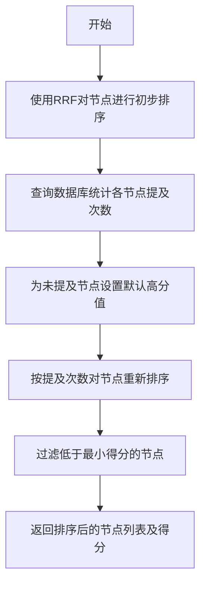
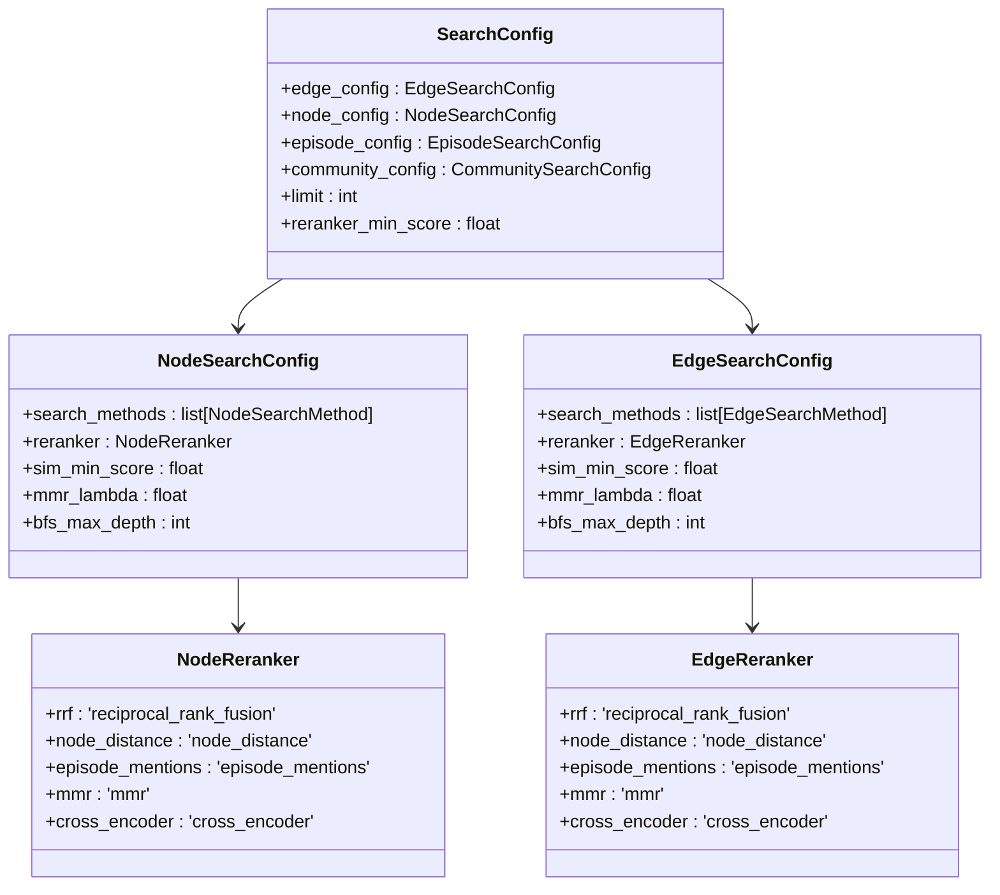
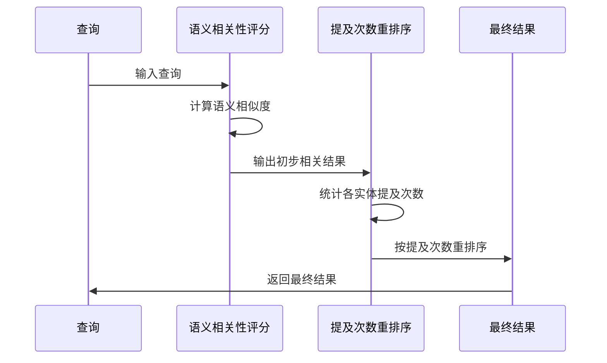

# 基于提及次数的重排序

<cite>
**本文档中引用的文件**  
- [search_config.py](file://graphiti_core/search/search_config.py)
- [search.py](file://graphiti_core/search/search.py)
- [search_utils.py](file://graphiti_core/search/search_utils.py)
- [search_config_recipes.py](file://graphiti_core/search/search_config_recipes.py)
</cite>

## 目录
1. [简介](#简介)
2. [核心机制分析](#核心机制分析)
3. [配置方式](#配置方式)
4. [应用场景与优势](#应用场景与优势)
5. [与其他评分机制的关系](#与其他评分机制的关系)
6. [结论](#结论)

## 简介
基于提及次数（episode_mentions）的重排序策略是一种通过统计节点在原始上下文片段中出现频率来提升结果排名的算法。该策略能够识别高频提及的实体，并使其在最终结果中获得更高权重，适用于强调显著性或流行度的场景。本策略作为NodeReranker和EdgeReranker选项之一，可在SearchConfig中进行配置。

**Section sources**
- [search_config.py](file://graphiti_core/search/search_config.py#L53-L67)

## 核心机制分析
基于提及次数的重排序策略通过统计实体节点在上下文片段（EpisodicNode）中的提及频率来确定其重要性。系统首先使用RRF（Reciprocal Rank Fusion）算法对搜索结果进行初步排序，然后通过查询数据库统计每个节点被提及的次数。提及次数越多的节点，其得分越高，在最终排序中位置越靠前。

该策略在代码中通过`episode_mentions_reranker`函数实现，该函数接收驱动程序、节点UUID列表和最小得分阈值作为参数，返回按提及次数排序的节点UUID列表及其对应得分。

**Diagram sources**
- [search_utils.py](file://graphiti_core/search/search_utils.py#L1805-L1835)

**Section sources**
- [search_utils.py](file://graphiti_core/search/search_utils.py#L1805-L1835)

## 配置方式
基于提及次数的重排序策略可通过SearchConfig进行配置，支持作为NodeReranker和EdgeReranker的选项。在search_config.py文件中，NodeReranker和EdgeReranker枚举类型均包含episode_mentions选项。

此外，系统提供了预定义的配置配方，如NODE_HYBRID_SEARCH_EPISODE_MENTIONS和EDGE_HYBRID_SEARCH_EPISODE_MENTIONS，这些配方已在search_config_recipes.py中定义，可直接用于搜索配置。

**Diagram sources**
- [search_config.py](file://graphiti_core/search/search_config.py#L53-L67)
- [search_config_recipes.py](file://graphiti_core/search/search_config_recipes.py#L134-L140)

**Section sources**
- [search_config.py](file://graphiti_core/search/search_config.py#L53-L67)
- [search_config_recipes.py](file://graphiti_core/search/search_config_recipes.py#L134-L140)

## 应用场景与优势
基于提及次数的重排序策略在处理长文本摘要或事件分析时具有显著优势。当需要识别文本中最重要或最常被讨论的实体时，该策略能够有效提升高频提及实体的排名，使其在结果中更加突出。

例如，在分析会议记录或访谈 transcript 时，该策略可以帮助快速识别讨论焦点人物或关键主题。在新闻聚合场景中，可以用来识别当前热点事件中的主要参与者。

该策略特别适用于以下场景：
- 识别文本中的关键人物或主题
- 分析讨论焦点和趋势
- 提取高频提及的实体进行重点展示
- 事件分析中确定主要参与者

**Section sources**
- [search.py](file://graphiti_core/search/search.py#L300-L306)
- [search_utils.py](file://graphiti_core/search/search_utils.py#L1805-L1835)

## 与其他评分机制的关系
基于提及次数的重排序策略与语义相关性评分具有互补关系。语义相关性评分主要关注查询与结果内容的语义相似度，而提及次数重排序则关注实体在上下文中的出现频率和重要性。

在实际应用中，可以先使用语义相关性进行初步筛选，再使用提及次数进行重排序，从而兼顾相关性和显著性。这种组合方式能够提供更全面和准确的搜索结果，既保证了结果与查询的相关性，又突出了上下文中的重要实体。

**Diagram sources**
- [search.py](file://graphiti_core/search/search.py#L255-L260)
- [search_utils.py](file://graphiti_core/search/search_utils.py#L1805-L1835)

**Section sources**
- [search.py](file://graphiti_core/search/search.py#L255-L260)

## 结论
基于提及次数的重排序策略是一种有效的结果排序方法，通过统计实体在上下文中的出现频率来提升重要实体的排名。该策略作为NodeReranker和EdgeReranker的选项，可在SearchConfig中灵活配置。与语义相关性评分相比，该策略更关注实体的显著性和流行度，在处理长文本摘要或事件分析时具有独特优势。通过与语义相关性评分结合使用，可以实现更全面和准确的搜索结果排序。