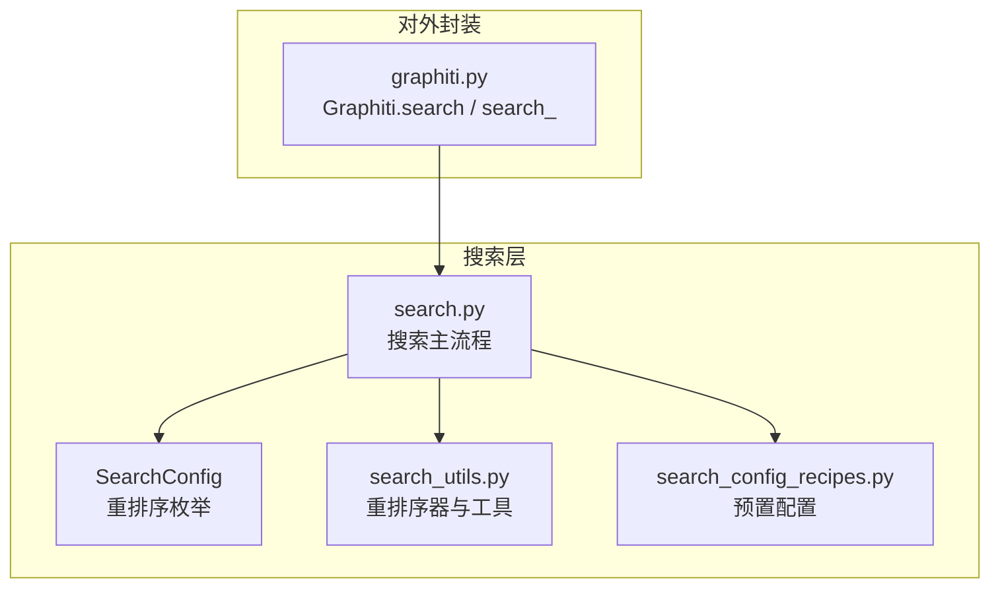
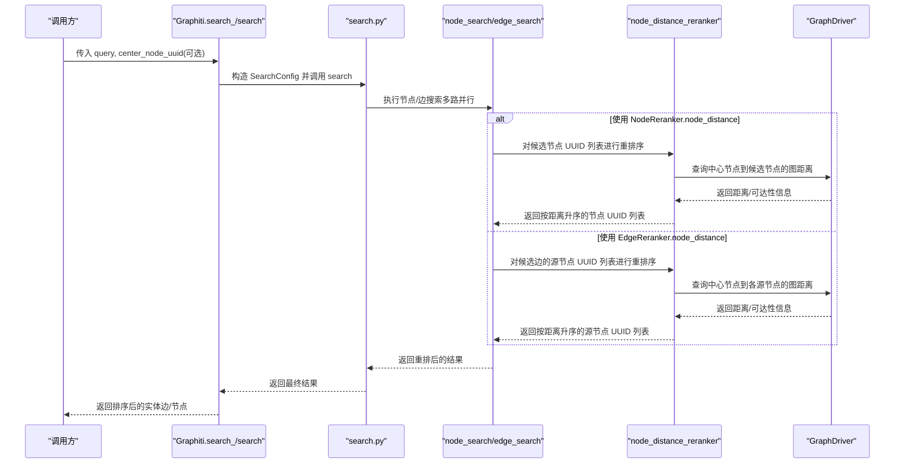
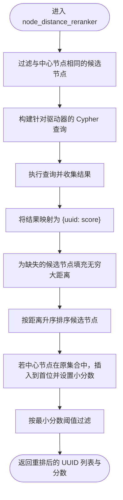
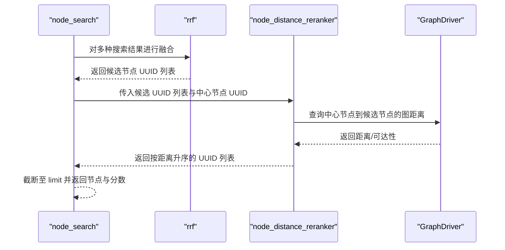
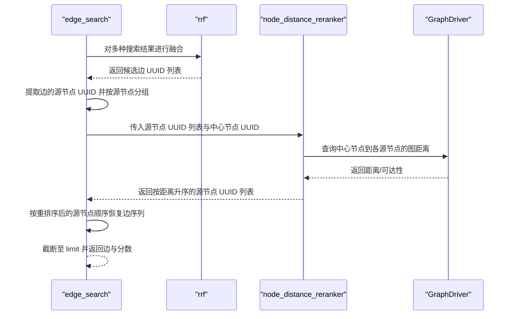
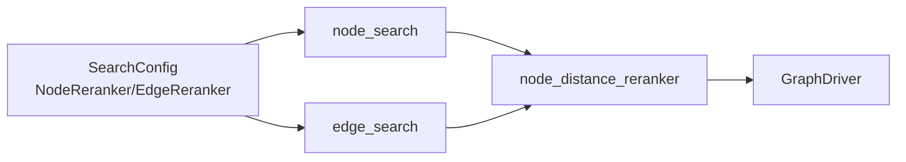

# 基于节点距离的重排序

<cite>
**本文引用的文件**
- [graphiti_core/search/search_utils.py](file://graphiti_core/search/search_utils.py)
- [graphiti_core/search/search.py](file://graphiti_core/search/search.py)
- [graphiti_core/search/search_config.py](file://graphiti_core/search/search_config.py)
- [graphiti_core/search/search_config_recipes.py](file://graphiti_core/search/search_config_recipes.py)
- [graphiti_core/graphiti.py](file://graphiti_core/graphiti.py)
- [examples/quickstart/quickstart_neo4j.py](file://examples/quickstart/quickstart_neo4j.py)
</cite>

## 目录
1. [简介](#简介)
2. [项目结构](#项目结构)
3. [核心组件](#核心组件)
4. [架构总览](#架构总览)
5. [详细组件分析](#详细组件分析)
6. [依赖关系分析](#依赖关系分析)
7. [性能考量](#性能考量)
8. [故障排查指南](#故障排查指南)
9. [结论](#结论)
10. [附录](#附录)

## 简介
本篇文档围绕“基于节点距离的重排序”策略展开，系统阐述其如何利用图结构信息（节点与中心节点之间的最短路径）对检索结果进行二次排序，优先返回与核心实体关联更紧密的结果。我们将从以下维度深入解析：
- node_distance_reranker 函数的工作原理与数据流
- 在 SearchConfig 中通过 NodeReranker.node_distance 的配置与使用
- 在 Graphiti.search 与 Graphiti.search_ 中的实际调用方式
- 在社交网络分析、知识推理等场景中的适用性
- 对图数据库查询性能的影响与优化建议

## 项目结构
与“基于节点距离的重排序”直接相关的模块主要分布在 graphiti_core/search 与 graphiti_core/graphiti 两个目录中：
- graphiti_core/search：包含搜索配置、搜索执行流程、重排序器实现与工具函数
- graphiti_core/graphiti：对外 API 封装，提供 search 与 search_ 方法，内部根据是否传入中心节点自动选择重排序策略

图表来源
- [graphiti_core/search/search.py](file://graphiti_core/search/search.py#L68-L182)
- [graphiti_core/search/search_utils.py](file://graphiti_core/search/search_utils.py#L1750-L1801)
- [graphiti_core/search/search_config.py](file://graphiti_core/search/search_config.py#L32-L118)
- [graphiti_core/search/search_config_recipes.py](file://graphiti_core/search/search_config_recipes.py#L1-L224)
- [graphiti_core/graphiti.py](file://graphiti_core/graphiti.py#L1050-L1153)

章节来源
- [graphiti_core/search/search.py](file://graphiti_core/search/search.py#L68-L182)
- [graphiti_core/search/search_utils.py](file://graphiti_core/search/search_utils.py#L1750-L1801)
- [graphiti_core/search/search_config.py](file://graphiti_core/search/search_config.py#L32-L118)
- [graphiti_core/search/search_config_recipes.py](file://graphiti_core/search/search_config_recipes.py#L1-L224)
- [graphiti_core/graphiti.py](file://graphiti_core/graphiti.py#L1050-L1153)

## 核心组件
- 节点距离重排序器：node_distance_reranker
  - 功能：计算候选节点到中心节点的“图距离”，并据此对节点或边进行重排
  - 输入：驱动器、节点 UUID 列表、中心节点 UUID、最小分数阈值
  - 输出：按距离升序排列的 UUID 列表及对应的分数列表
- 搜索配置与重排序枚举：NodeReranker.node_distance
  - 通过 SearchConfig.node_config.reranker 指定使用节点距离重排序
- Graphiti 对外 API：
  - search：若传入 center_node_uuid，则自动切换为 EDGE_HYBRID_SEARCH_NODE_DISTANCE 配置
  - search_：支持传入任意 SearchConfig，可显式指定 NodeReranker.node_distance 或 EdgeReranker.node_distance

章节来源
- [graphiti_core/search/search_utils.py](file://graphiti_core/search/search_utils.py#L1750-L1801)
- [graphiti_core/search/search_config.py](file://graphiti_core/search/search_config.py#L61-L67)
- [graphiti_core/graphiti.py](file://graphiti_core/graphiti.py#L1050-L1153)

## 架构总览
下图展示了“基于节点距离的重排序”的端到端流程，包括节点与边两种场景下的重排序路径。

图表来源
- [graphiti_core/graphiti.py](file://graphiti_core/graphiti.py#L1050-L1153)
- [graphiti_core/search/search.py](file://graphiti_core/search/search.py#L68-L182)
- [graphiti_core/search/search.py](file://graphiti_core/search/search.py#L309-L416)
- [graphiti_core/search/search.py](file://graphiti_core/search/search.py#L186-L305)
- [graphiti_core/search/search_utils.py](file://graphiti_core/search/search_utils.py#L1750-L1801)

## 详细组件分析

### 组件A：node_distance_reranker 函数
- 功能概述
  - 过滤掉与中心节点相同的候选节点
  - 针对不同图数据库提供差异化的 Cypher 查询，以匹配中心节点与候选节点之间的关系
  - 计算候选节点到中心节点的“图距离”（此处以是否存在连接作为距离度量，未显式计算最短路径长度），并据此排序
  - 对不可达节点赋予无穷大距离，最终按距离升序输出
  - 支持最小分数过滤，仅保留满足阈值的节点
- 关键实现要点
  - 针对不同驱动器（如 Neo4j/Kuzu/FalkorDB）采用不同的关系模式与查询语法
  - 对于 Kuzu，需要通过中间关系节点进行匹配，以符合其存储结构
  - 对于 FalkorDB，返回格式略有差异，需做字段映射
  - 对于不可达节点，统一标记为无穷大距离，保证排序时排在末尾
  - 若中心节点原本在候选集合中，会将其分数设为一个较小正值，确保其被优先返回
- 复杂度与性能
  - 单次查询复杂度取决于候选节点数量与图密度；对每个候选节点执行一次 MATCH 查询
  - 可通过并发与索引优化提升吞吐

图表来源
- [graphiti_core/search/search_utils.py](file://graphiti_core/search/search_utils.py#L1750-L1801)

章节来源
- [graphiti_core/search/search_utils.py](file://graphiti_core/search/search_utils.py#L1750-L1801)

### 组件B：在 NodeSearch 中的应用
- 触发条件
  - 当 NodeSearchConfig.reranker = NodeReranker.node_distance 时启用
  - 必须提供 center_node_uuid，否则抛出错误
- 执行流程
  - 先使用 RRF 对多种搜索方法得到的节点集合进行初步融合
  - 将 RRF 排名作为输入，调用 node_distance_reranker 对节点 UUID 列表进行重排序
  - 最终截断至 limit 并返回节点对象与重排分数

图表来源
- [graphiti_core/search/search.py](file://graphiti_core/search/search.py#L309-L416)
- [graphiti_core/search/search_utils.py](file://graphiti_core/search/search_utils.py#L1750-L1801)

章节来源
- [graphiti_core/search/search.py](file://graphiti_core/search/search.py#L309-L416)

### 组件C：在 EdgeSearch 中的应用
- 触发条件
  - 当 EdgeSearchConfig.reranker = EdgeReranker.node_distance 时启用
  - 必须提供 center_node_uuid，否则抛出错误
- 执行流程
  - 先使用 RRF 对多种搜索方法得到的边集合进行融合
  - 从 RRF 结果中提取每条边的源节点 UUID，并按源节点分组
  - 对源节点 UUID 列表调用 node_distance_reranker 进行重排序
  - 按重排序后的源节点顺序，恢复对应边的顺序，形成最终边列表

图表来源
- [graphiti_core/search/search.py](file://graphiti_core/search/search.py#L186-L305)
- [graphiti_core/search/search_utils.py](file://graphiti_core/search/search_utils.py#L1750-L1801)

章节来源
- [graphiti_core/search/search.py](file://graphiti_core/search/search.py#L186-L305)

### 组件D：在 SearchConfig 中的配置与使用
- NodeReranker.node_distance
  - 定义于 NodeReranker 枚举，用于节点搜索的重排序
- EdgeReranker.node_distance
  - 定义于 EdgeReranker 枚举，用于边搜索的重排序
- 预置配方
  - search_config_recipes 提供了 NODE_HYBRID_SEARCH_NODE_DISTANCE 与 EDGE_HYBRID_SEARCH_NODE_DISTANCE 等配方，便于快速启用
- Graphiti.search 自动选择
  - 若传入 center_node_uuid，则自动使用 EDGE_HYBRID_SEARCH_NODE_DISTANCE（边搜索）；若未传入，则使用 EDGE_HYBRID_SEARCH_RRF（默认）

章节来源
- [graphiti_core/search/search_config.py](file://graphiti_core/search/search_config.py#L61-L67)
- [graphiti_core/search/search_config_recipes.py](file://graphiti_core/search/search_config_recipes.py#L171-L176)
- [graphiti_core/search/search_config_recipes.py](file://graphiti_core/search/search_config_recipes.py#L126-L131)
- [graphiti_core/graphiti.py](file://graphiti_core/graphiti.py#L1090-L1110)

### 组件E：实际调用示例
- 使用 Graphiti.search
  - 当传入 center_node_uuid 时，内部自动切换为 EDGE_HYBRID_SEARCH_NODE_DISTANCE，从而对边结果进行基于节点距离的重排序
  - 示例参考 quickstart_neo4j.py：先执行基础搜索获取一条边，再以其源节点 UUID 作为中心节点进行 rerank
- 使用 Graphiti.search_
  - 可传入自定义 SearchConfig，显式设置 node_config.reranker 或 edge_config.reranker 为 node_distance
  - 可结合 group_ids、search_filter 等参数控制搜索范围与过滤条件

章节来源
- [graphiti_core/graphiti.py](file://graphiti_core/graphiti.py#L1050-L1153)
- [examples/quickstart/quickstart_neo4j.py](file://examples/quickstart/quickstart_neo4j.py#L160-L183)

## 依赖关系分析
- 耦合与内聚
  - node_search 与 edge_search 对 node_distance_reranker 的依赖清晰，职责单一
  - SearchConfig 与枚举类型集中管理重排序策略，降低耦合
- 外部依赖
  - GraphDriver 提供跨数据库的查询接口，node_distance_reranker 需要根据 provider 适配 Cypher 语法
- 循环依赖
  - 无循环依赖迹象，模块边界清晰

图表来源
- [graphiti_core/search/search_config.py](file://graphiti_core/search/search_config.py#L32-L118)
- [graphiti_core/search/search.py](file://graphiti_core/search/search.py#L309-L416)
- [graphiti_core/search/search.py](file://graphiti_core/search/search.py#L186-L305)
- [graphiti_core/search/search_utils.py](file://graphiti_core/search/search_utils.py#L1750-L1801)

章节来源
- [graphiti_core/search/search_config.py](file://graphiti_core/search/search_config.py#L32-L118)
- [graphiti_core/search/search.py](file://graphiti_core/search/search.py#L309-L416)
- [graphiti_core/search/search.py](file://graphiti_core/search/search.py#L186-L305)
- [graphiti_core/search/search_utils.py](file://graphiti_core/search/search_utils.py#L1750-L1801)

## 性能考量
- 图查询成本
  - node_distance_reranker 对每个候选节点执行一次 MATCH 查询，复杂度约为 O(k)，k 为候选节点数
  - 对于大规模候选集，建议：
    - 合理限制候选规模（例如在搜索阶段使用 limit 控制）
    - 为节点 uuid 与关系建立索引，减少匹配开销
- 并发与批处理
  - 搜索阶段已使用并发 gather，重排序阶段可考虑批量查询或缓存中间结果（如候选节点的可达性）
- 数据库差异
  - 不同驱动器（Neo4j/Kuzu/FalkorDB）的查询语法与返回格式存在差异，应确保查询语句与字段映射正确
- 分数阈值
  - 通过 reranker_min_score 过滤低质量结果，减少下游处理负担

[本节为通用指导，不直接分析具体文件]

## 故障排查指南
- 错误：未提供 center_node_uuid
  - 现象：NodeSearch 或 EdgeSearch 抛出“未提供中心节点”的错误
  - 处理：在调用时传入有效的 center_node_uuid
- 错误：图数据库返回格式异常
  - 现象：FalkorDB 返回格式与预期不符导致字段缺失
  - 处理：确认查询返回字段映射逻辑，确保字段名称一致
- 结果不符合预期
  - 现象：重排序后结果与直觉不符
  - 处理：检查中心节点是否存在于候选集中；确认图中是否存在从中心节点到候选节点的路径；适当调整 reranker_min_score

章节来源
- [graphiti_core/search/search.py](file://graphiti_core/search/search.py#L309-L416)
- [graphiti_core/search/search.py](file://graphiti_core/search/search.py#L186-L305)

## 结论
基于节点距离的重排序通过引入图结构信息，有效提升了检索结果与核心实体的关联度。在 Graphiti 中，该策略以 NodeReranker.node_distance 的形式无缝集成到节点与边的搜索流程中，并由 Graphiti.search/search_ 提供便捷的调用入口。配合合理的配置与性能优化，可在社交网络分析、知识推理等场景中显著改善用户体验与结果质量。

[本节为总结性内容，不直接分析具体文件]

## 附录

### A. 在社交网络分析中的适用性
- 场景：围绕某用户（中心节点）查找与其联系更紧密的其他用户或话题
- 优势：优先返回与中心用户直接或间接关联更近的节点，提高推荐与发现效果
- 注意：若图稀疏或存在多个连通分量，可能需要结合 BFS 或社区结构进行补充

[本节为概念性说明，不直接分析具体文件]

### B. 在知识推理中的适用性
- 场景：围绕某个实体（中心节点）查找与其主题更接近的事实或关系
- 优势：优先返回与中心实体在知识图谱中路径更短的边或节点，有助于推理链的构建
- 注意：推理质量还受嵌入与语义相似度影响，可与 MMR、交叉编码器等策略组合使用

[本节为概念性说明，不直接分析具体文件]

### C. 实际调用示例路径
- Graphiti.search 使用中心节点进行边级重排序
  - 参考路径：[graphiti_core/graphiti.py](file://graphiti_core/graphiti.py#L1090-L1110)
  - 示例参考：[examples/quickstart/quickstart_neo4j.py](file://examples/quickstart/quickstart_neo4j.py#L160-L183)
- Graphiti.search_ 使用自定义 SearchConfig 启用节点/边级重排序
  - 参考路径：[graphiti_core/graphiti.py](file://graphiti_core/graphiti.py#L1127-L1153)
  - 参考配方：[graphiti_core/search/search_config_recipes.py](file://graphiti_core/search/search_config_recipes.py#L171-L176), [graphiti_core/search/search_config_recipes.py](file://graphiti_core/search/search_config_recipes.py#L126-L131)

章节来源
- [graphiti_core/graphiti.py](file://graphiti_core/graphiti.py#L1090-L1110)
- [graphiti_core/graphiti.py](file://graphiti_core/graphiti.py#L1127-L1153)
- [examples/quickstart/quickstart_neo4j.py](file://examples/quickstart/quickstart_neo4j.py#L160-L183)
- [graphiti_core/search/search_config_recipes.py](file://graphiti_core/search/search_config_recipes.py#L171-L176)
- [graphiti_core/search/search_config_recipes.py](file://graphiti_core/search/search_config_recipes.py#L126-L131)