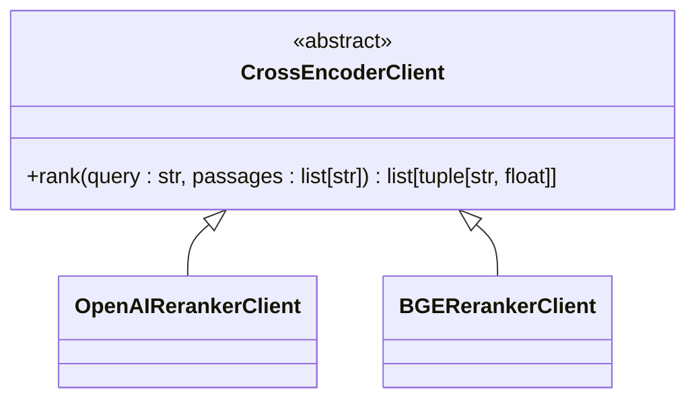
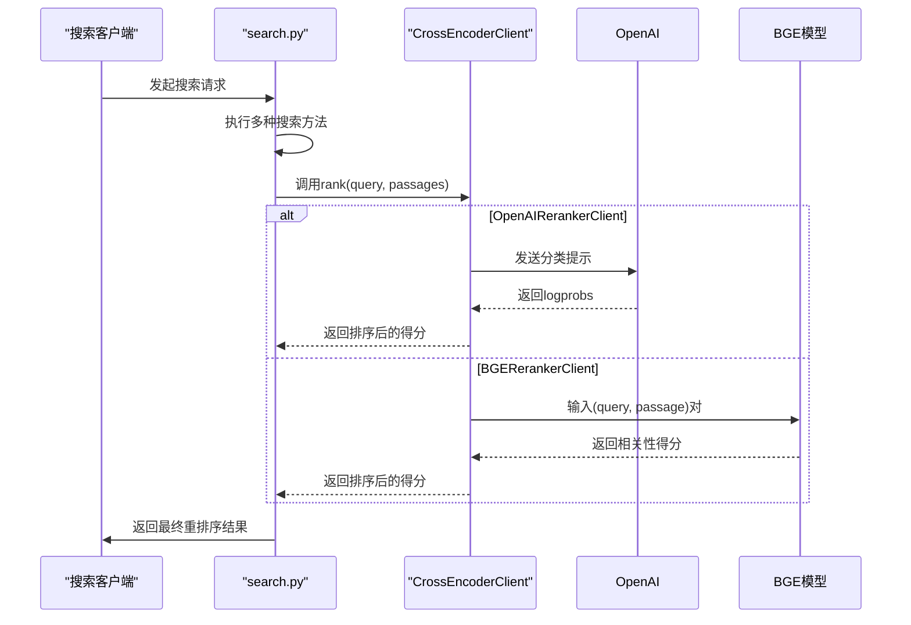
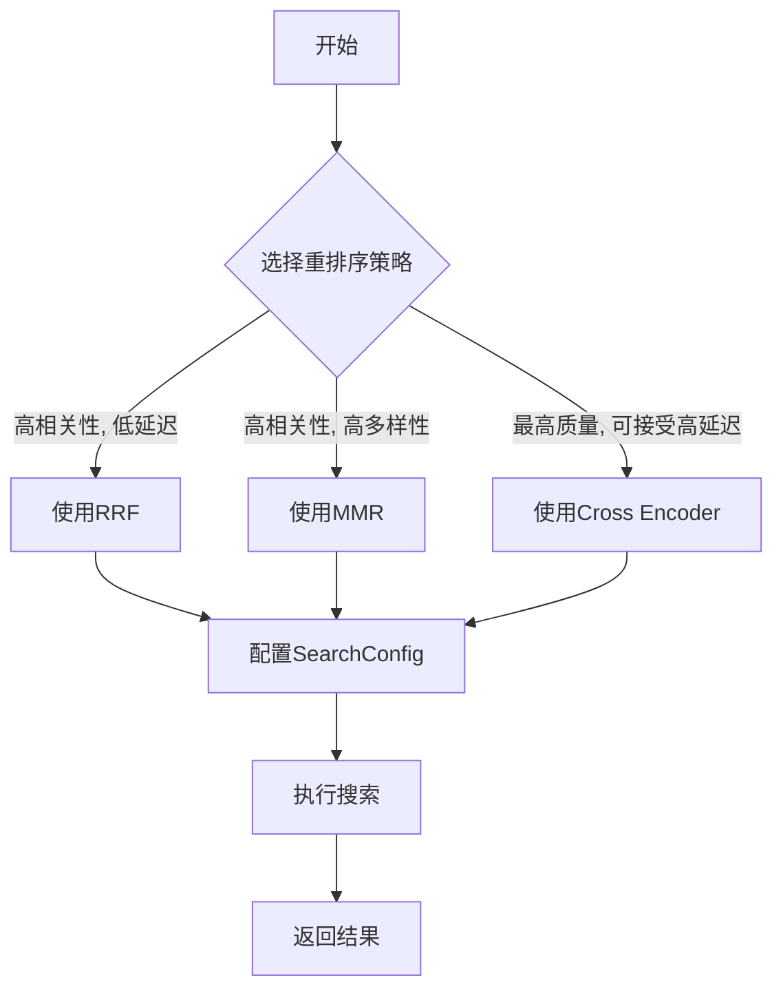

# 结果重排序

<cite>
**本文档中引用的文件**  
- [search_config.py](file://graphiti_core/search/search_config.py)
- [search.py](file://graphiti_core/search/search.py)
- [search_utils.py](file://graphiti_core/search/search_utils.py)
- [client.py](file://graphiti_core/cross_encoder/client.py)
- [openai_reranker_client.py](file://graphiti_core/cross_encoder/openai_reranker_client.py)
- [bge_reranker_client.py](file://graphiti_core/cross_encoder/bge_reranker_client.py)
- [search_config_recipes.py](file://graphiti_core/search/search_config_recipes.py)
</cite>

## 目录
1. [引言](#引言)
2. [核心重排序策略](#核心重排序策略)
3. [重排序器枚举类型与配置](#重排序器枚举类型与配置)
4. [交叉编码器实现](#交叉编码器实现)
5. [配置示例](#配置示例)
6. [策略选择指南](#策略选择指南)
7. [结论](#结论)

## 引言
结果重排序是Graphiti系统中提升搜索质量的关键环节。该系统支持多种重排序策略，允许用户根据具体需求平衡相关性、多样性与性能开销。通过灵活的配置，用户可以针对边（Edge）、节点（Node）、片段（Episode）和社区（Community）等不同图元素，选择最适合的重排序算法。本文档详细阐述了rrf、mmr和cross_encoder等核心重排序策略的实现原理，并提供了配置与使用指南。

## 核心重排序策略

### 倒数排名融合 (RRF)
倒数排名融合（Reciprocal Rank Fusion, RRF）是一种无参数的元排序算法，用于合并来自多种不同搜索方法的结果。其核心思想是：一个项目在多个独立列表中排名越靠前，其综合相关性得分就越高。

在Graphiti中，当配置了多种搜索方法（如BM25全文搜索和余弦相似度向量搜索）时，RRF会为每个结果计算一个融合得分。得分公式为 `score = 1 / (k + rank)`，其中`rank`是该项目在某个搜索结果列表中的位置（从1开始），`k`是一个常数（通常为60）。所有搜索方法对同一项目的得分会被累加，最终根据总分对结果进行重新排序。RRF的优势在于实现简单、计算高效，且无需训练数据，能有效提升结果的召回率。

### 最大边际相关性 (MMR)
最大边际相关性（Maximal Marginal Relevance, MMR）旨在解决搜索结果的冗余问题，通过在相关性和多样性之间取得平衡来提升结果质量。

MMR的算法流程如下：首先选择与查询最相关的结果作为第一个输出。随后，在每一步迭代中，算法会从剩余结果中选择一个项目，该项目需同时满足两个条件：(1) 与原始查询高度相关；(2) 与已选结果的相似度尽可能低。其选择标准由一个加权公式决定：`MMR = λ * sim1 - (1-λ) * max(sim2)`，其中`sim1`是项目与查询的相关性得分，`max(sim2)`是该项目与所有已选结果的最大相似度得分，`λ`是一个介于0和1之间的超参数（在Graphiti中通过`mmr_lambda`配置），用于控制相关性与多样性的权重。

当`λ`接近1时，MMR更侧重于相关性，行为接近于简单的相关性排序；当`λ`接近0时，则更侧重于多样性。MMR特别适用于需要提供多样化结果的场景，但其计算复杂度高于RRF，因为它需要计算结果之间的成对相似度。

### 交叉编码器精排 (Cross Encoder)
交叉编码器（Cross Encoder）代表了最精细但也最昂贵的重排序策略。它利用专门的深度学习模型，将查询和候选结果（如边的事实描述、节点名称）作为一个整体进行联合编码，从而更深入地理解它们之间的语义关系。

在Graphiti中，`cross_encoder`重排序器会调用一个实现了`CrossEncoderClient`接口的客户端（如`OpenAIRerankerClient`或`BGERerankerClient`）。该客户端接收查询和一个候选结果列表，然后对每一对（query, passage）进行打分。例如，`OpenAIRerankerClient`通过向OpenAI模型发送一个分类提示（判断段落是否与查询相关）并利用返回的对数概率（logprobs）来生成相关性得分。而`BGERerankerClient`则直接使用`BAAI/bge-reranker-v2-m3`等专门的重排序模型进行打分。

由于交叉编码器需要对每一对组合进行独立推理，其计算开销是线性的（O(n)），远高于RRF和MMR。因此，它通常作为最终的精排步骤，在经过初步筛选（如通过RRF或MMR）后的少量高相关性候选集上运行，以最大化最终结果的质量。

## 重排序器枚举类型与配置

### 重排序器枚举类型
Graphiti通过一系列枚举类型（Enum）来定义可用的重排序策略，这些枚举类型确保了配置的类型安全和清晰性。

- **EdgeReranker**: 为边（EntityEdge）结果定义重排序策略，包括`rrf`、`mmr`、`cross_encoder`、`node_distance`（基于与中心节点的距离）和`episode_mentions`（基于提及的片段数量）。
- **NodeReranker**: 为节点（EntityNode）结果定义重排序策略，选项与`EdgeReranker`相同。
- **EpisodeReranker**: 为片段（EpisodicNode）结果定义重排序策略，目前支持`rrf`和`cross_encoder`。
- **CommunityReranker**: 为社区（CommunityNode）结果定义重排序策略，支持`rrf`、`mmr`和`cross_encoder`。

### SearchConfig 配置
重排序策略通过`SearchConfig`类进行配置。`SearchConfig`是一个包含多个子配置的容器，允许用户为不同类型的图元素独立设置搜索和重排序行为。

- **EdgeSearchConfig**: 配置边的搜索，包含`search_methods`（搜索方法列表）、`reranker`（指定`EdgeReranker`枚举值）以及`mmr_lambda`等参数。
- **NodeSearchConfig**: 配置节点的搜索，结构与`EdgeSearchConfig`类似。
- **EpisodeSearchConfig** 和 **CommunitySearchConfig**: 分别配置片段和社区的搜索。

`SearchConfig`的`limit`参数控制最终返回结果的数量，而`reranker_min_score`则为重排序后的得分设置一个阈值，低于此阈值的结果将被过滤掉。

**Section sources**
- [search_config.py](file://graphiti_core/search/search_config.py#L53-L78)
- [search_config.py](file://graphiti_core/search/search_config.py#L80-L119)

## 交叉编码器实现

### 抽象接口 (CrossEncoderClient)
`CrossEncoderClient`是一个抽象基类（ABC），定义了所有交叉编码器实现必须遵循的接口。其核心方法是`rank(query: str, passages: list[str]) -> list[tuple[str, float]]`，该方法接收一个查询和一组候选段落，返回一个按相关性得分降序排列的（段落，得分）元组列表。



**Diagram sources**
- [client.py](file://graphiti_core/cross_encoder/client.py#L20-L41)

### 具体实现
Graphiti提供了多种`CrossEncoderClient`的具体实现：

- **OpenAIRerankerClient**: 该实现利用OpenAI的API，通过一个精心设计的提示词（prompt）将重排序任务转化为一个二分类问题（“True”表示相关，“False”表示不相关）。它利用模型返回的对数概率（logprobs）来计算一个归一化的相关性得分。这种方法灵活，可以使用任何支持文本生成的LLM，但成本和延迟相对较高。
- **BGERerankerClient**: 该实现使用本地或远程的`sentence-transformers`库中的专用重排序模型（如`BAAI/bge-reranker-v2-m3`）。它将查询和每个候选段落拼接成一对，输入模型进行打分。这种方法通常比基于LLM的提示工程更高效、更准确，但需要安装额外的依赖。



**Diagram sources**
- [openai_reranker_client.py](file://graphiti_core/cross_encoder/openai_reranker_client.py#L34-L124)
- [bge_reranker_client.py](file://graphiti_core/cross_encoder/bge_reranker_client.py#L34-L55)

## 配置示例
Graphiti提供了预定义的配置配方（recipes），用户可以直接使用或作为自定义配置的参考。



**Diagram sources**
- [search_config_recipes.py](file://graphiti_core/search/search_config_recipes.py#L34-L224)

### 使用预定义配方
```python
from graphiti_core.search.search_config_recipes import COMBINED_HYBRID_SEARCH_CROSS_ENCODER

# 使用预定义的跨编码器配置
config = COMBINED_HYBRID_SEARCH_CROSS_ENCODER
results = await search(clients, query, group_ids, config, search_filter)
```

### 自定义配置
```python
from graphiti_core.search.search_config import (
    SearchConfig, 
    EdgeSearchConfig, 
    EdgeSearchMethod, 
    EdgeReranker
)

# 为边搜索创建自定义配置：混合BM25和向量搜索，并使用MMR重排序
custom_config = SearchConfig(
    edge_config=EdgeSearchConfig(
        search_methods=[
            EdgeSearchMethod.bm25, 
            EdgeSearchMethod.cosine_similarity
        ],
        reranker=EdgeReranker.mmr,
        mmr_lambda=0.7  # 倾向于相关性
    ),
    limit=5
)
```

**Section sources**
- [search_config_recipes.py](file://graphiti_core/search/search_config_recipes.py#L34-L224)
- [search_config.py](file://graphiti_core/search/search_config.py#L112-L119)

## 策略选择指南
选择合适的重排序策略需要在结果质量、响应延迟和计算成本之间进行权衡。

| 策略 | 适用场景 | 性能开销 | 对结果质量的影响 |
| :--- | :--- | :--- | :--- |
| **RRF** | 作为默认策略，适用于大多数场景，特别是需要快速响应且对结果多样性要求不高的情况。 | 低 | 显著提升召回率，能有效融合不同搜索方法的优势。 |
| **MMR** | 当搜索结果容易出现冗余时（例如，多个结果描述同一事件），需要提供多样化视角的场景。 | 中 | 在保持高相关性的同时，显著提高结果的多样性，避免信息重复。 |
| **Cross Encoder** | 对结果质量要求极高，且可以接受较长等待时间的场景，如关键决策支持系统。 | 高 | 提供最精确的相关性判断，能理解复杂的语义关系，是精排的黄金标准。 |

**一般建议**：
1.  **初步筛选**：首先使用RRF或MMR对大量候选结果进行快速筛选和初步排序。
2.  **最终精排**：在获得一个较小的高相关性候选集后，再使用`cross_encoder`进行最终的精细打分。
3.  **参数调优**：对于MMR，调整`mmr_lambda`参数以适应具体需求；对于所有策略，合理设置`limit`和`reranker_min_score`以平衡性能和质量。

## 结论
Graphiti的重排序系统提供了一个强大而灵活的框架，支持从高效的RRF到精确的交叉编码器等多种策略。通过理解每种策略的原理和权衡，并利用`SearchConfig`进行精细化配置，用户可以为不同的应用场景定制最优的搜索体验。未来的工作可以探索更多先进的重排序算法，并进一步优化交叉编码器的性能，以降低其延迟和成本。