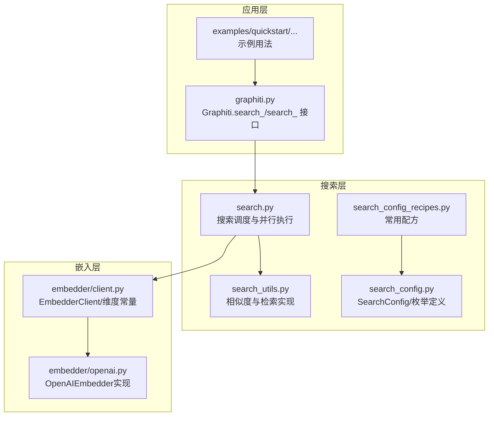
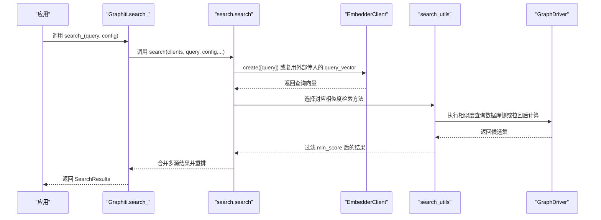
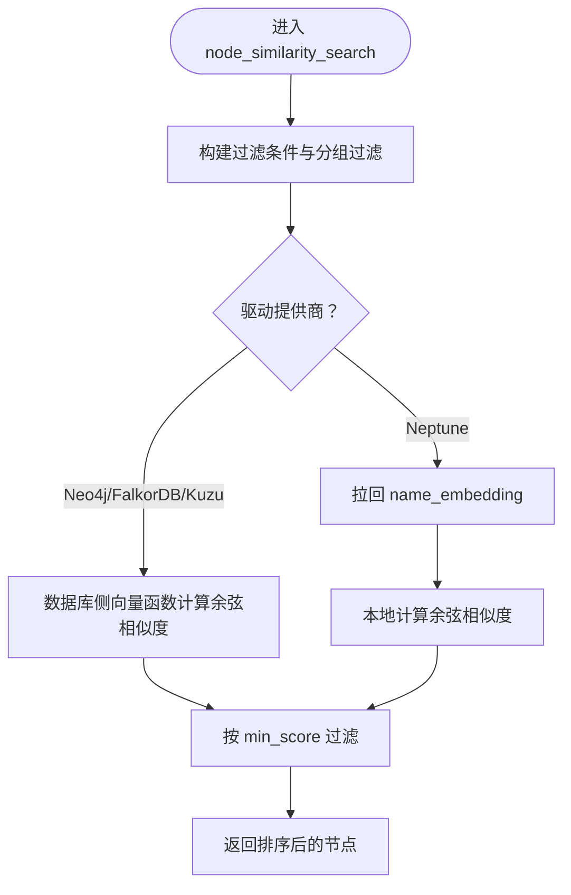
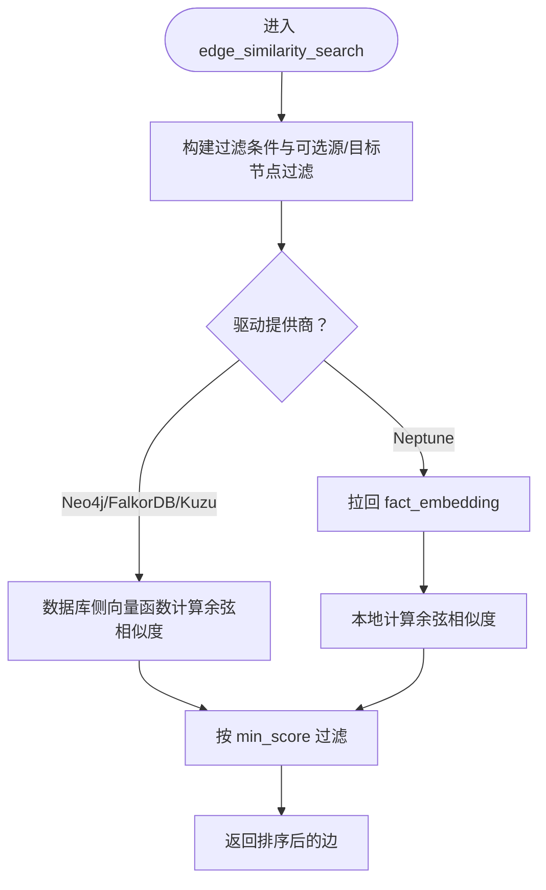
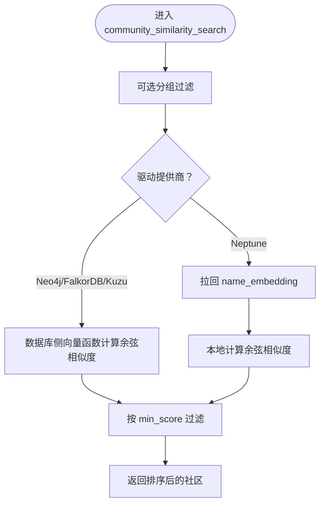
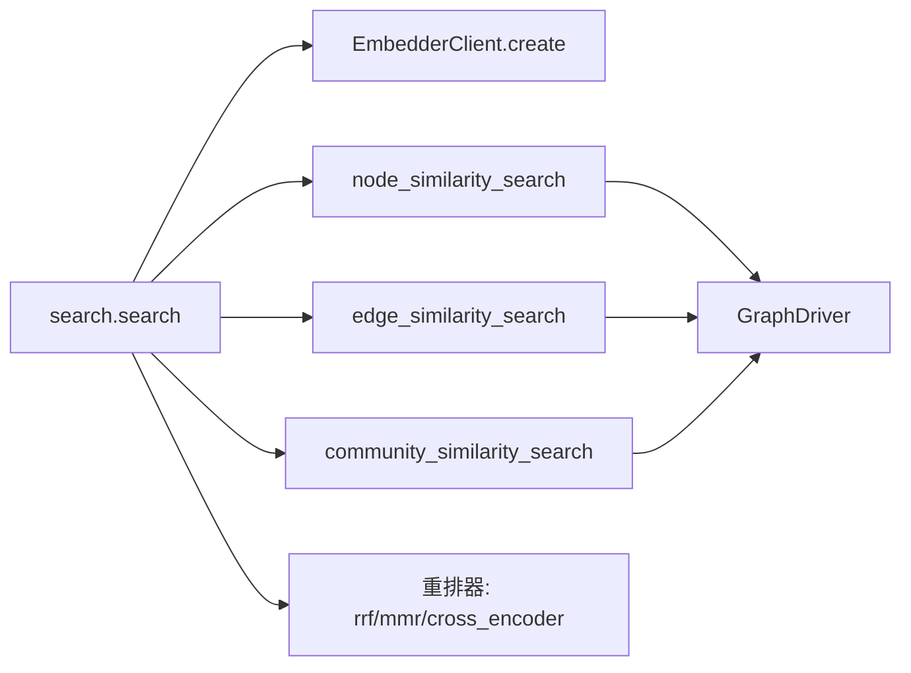
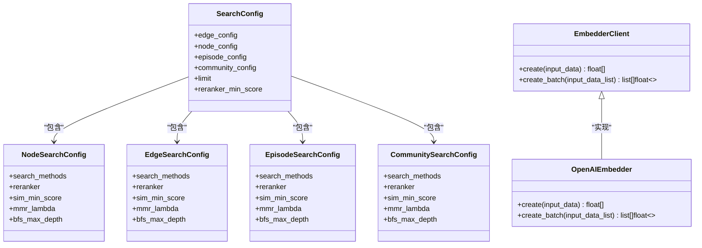

# 语义搜索

<cite>
**本文引用的文件**
- [graphiti_core/search/search.py](file://graphiti_core/search/search.py)
- [graphiti_core/search/search_config.py](file://graphiti_core/search/search_config.py)
- [graphiti_core/search/search_config_recipes.py](file://graphiti_core/search/search_config_recipes.py)
- [graphiti_core/search/search_utils.py](file://graphiti_core/search/search_utils.py)
- [graphiti_core/embedder/client.py](file://graphiti_core/embedder/client.py)
- [graphiti_core/embedder/openai.py](file://graphiti_core/embedder/openai.py)
- [graphiti_core/graphiti.py](file://graphiti_core/graphiti.py)
- [examples/quickstart/quickstart_neo4j.py](file://examples/quickstart/quickstart_neo4j.py)
</cite>

## 目录
1. [简介](#简介)
2. [项目结构](#项目结构)
3. [核心组件](#核心组件)
4. [架构总览](#架构总览)
5. [详细组件分析](#详细组件分析)
6. [依赖关系分析](#依赖关系分析)
7. [性能考量](#性能考量)
8. [故障排查指南](#故障排查指南)
9. [结论](#结论)
10. [附录](#附录)

## 简介
本文件系统性阐述基于向量相似度的语义搜索机制，聚焦以下关键点：
- 如何通过嵌入器（embedder）生成查询向量
- 在节点、边、社区三类实体上执行余弦相似度检索的流程与差异
- SearchConfig 中 cosine_similarity 搜索方法的配置方式
- sim_min_score 参数对结果过滤的影响
- 配置仅使用语义搜索的 SearchConfig 示例路径
- 语义匹配在处理同义词、近义表达方面的优势
- 对向量质量与计算开销的性能特征说明

## 项目结构
围绕语义搜索的关键目录与文件如下：
- 搜索入口与调度：graphiti_core/search/search.py
- 搜索配置模型：graphiti_core/search/search_config.py
- 常用配置配方：graphiti_core/search/search_config_recipes.py
- 搜索工具与相似度实现：graphiti_core/search/search_utils.py
- 向量生成客户端与实现：graphiti_core/embedder/client.py、graphiti_core/embedder/openai.py
- Graphiti 主入口与高级搜索接口：graphiti_core/graphiti.py
- 使用示例：examples/quickstart/quickstart_neo4j.py

图表来源
- [graphiti_core/search/search.py](file://graphiti_core/search/search.py#L68-L184)
- [graphiti_core/search/search_config.py](file://graphiti_core/search/search_config.py#L32-L120)
- [graphiti_core/search/search_config_recipes.py](file://graphiti_core/search/search_config_recipes.py#L33-L110)
- [graphiti_core/search/search_utils.py](file://graphiti_core/search/search_utils.py#L70-L82)
- [graphiti_core/embedder/client.py](file://graphiti_core/embedder/client.py#L23-L39)
- [graphiti_core/embedder/openai.py](file://graphiti_core/embedder/openai.py#L27-L67)
- [graphiti_core/graphiti.py](file://graphiti_core/graphiti.py#L1051-L1153)
- [examples/quickstart/quickstart_neo4j.py](file://examples/quickstart/quickstart_neo4j.py#L195-L209)

章节来源
- [graphiti_core/search/search.py](file://graphiti_core/search/search.py#L68-L184)
- [graphiti_core/search/search_config.py](file://graphiti_core/search/search_config.py#L32-L120)
- [graphiti_core/search/search_config_recipes.py](file://graphiti_core/search/search_config_recipes.py#L33-L110)
- [graphiti_core/search/search_utils.py](file://graphiti_core/search/search_utils.py#L70-L82)
- [graphiti_core/embedder/client.py](file://graphiti_core/embedder/client.py#L23-L39)
- [graphiti_core/embedder/openai.py](file://graphiti_core/embedder/openai.py#L27-L67)
- [graphiti_core/graphiti.py](file://graphiti_core/graphiti.py#L1051-L1153)
- [examples/quickstart/quickstart_neo4j.py](file://examples/quickstart/quickstart_neo4j.py#L195-L209)

## 核心组件
- 查询向量生成
  - 通过嵌入器将自然语言查询转换为固定维度的向量，作为后续余弦相似度检索的查询向量。
  - 维度由环境变量控制，默认值来自嵌入客户端配置。
- 余弦相似度计算
  - 在 search_utils.py 中提供独立的余弦相似度函数；在各实体相似度检索实现中，既可直接在数据库侧计算，也可先拉回向量再本地计算。
- 语义检索方法
  - 节点相似度：node_similarity_search
  - 边相似度：edge_similarity_search
  - 社区相似度：community_similarity_search
- 搜索配置
  - SearchConfig 支持为不同实体类型配置搜索方法（含 cosine_similarity）、重排策略、最小相似度阈值等。

章节来源
- [graphiti_core/embedder/client.py](file://graphiti_core/embedder/client.py#L23-L39)
- [graphiti_core/embedder/openai.py](file://graphiti_core/embedder/openai.py#L27-L67)
- [graphiti_core/search/search_utils.py](file://graphiti_core/search/search_utils.py#L70-L82)
- [graphiti_core/search/search_config.py](file://graphiti_core/search/search_config.py#L32-L120)

## 架构总览
下图展示从应用调用到数据库检索的整体流程，以及语义搜索在其中的位置。

图表来源
- [graphiti_core/graphiti.py](file://graphiti_core/graphiti.py#L1127-L1153)
- [graphiti_core/search/search.py](file://graphiti_core/search/search.py#L68-L184)
- [graphiti_core/search/search_utils.py](file://graphiti_core/search/search_utils.py#L285-L431)
- [graphiti_core/embedder/openai.py](file://graphiti_core/embedder/openai.py#L55-L67)

## 详细组件分析

### 查询向量生成与传播
- 当 SearchConfig 中任一实体类型的搜索方法包含 cosine_similarity，或重排器为 MMR 时，search 将调用嵌入器生成查询向量；否则会使用零向量占位。
- 生成的查询向量随后传递给节点、边、社区的相似度检索函数，用于余弦相似度计算。

章节来源
- [graphiti_core/search/search.py](file://graphiti_core/search/search.py#L88-L110)

### 余弦相似度计算
- 独立函数：calculate_cosine_similarity 提供数值稳定的余弦相似度计算，避免零向量导致的除零问题。
- 数据库侧计算：在 search_utils 中根据驱动提供商拼装相应查询，利用数据库内置向量函数计算余弦相似度并按阈值过滤。
- 拉回后计算：在某些驱动（如 Neptune）场景下，先拉回向量，再以本地 NumPy 计算相似度并二次过滤。

章节来源
- [graphiti_core/search/search_utils.py](file://graphiti_core/search/search_utils.py#L70-L82)
- [graphiti_core/search/search_utils.py](file://graphiti_core/search/search_utils.py#L285-L431)
- [graphiti_core/search/search_utils.py](file://graphiti_core/search/search_utils.py#L649-L765)
- [graphiti_core/search/search_utils.py](file://graphiti_core/search/search_utils.py#L1022-L1129)

### 节点相似度检索（node_similarity_search）
- 输入：查询向量、过滤条件、分组标识、限制数量、最小相似度阈值
- 流程：
  - 构造过滤条件与分组过滤
  - 依据驱动提供商选择数据库侧向量函数或拉回后计算
  - 应用 min_score 过滤
  - 返回排序后的节点列表

图表来源
- [graphiti_core/search/search_utils.py](file://graphiti_core/search/search_utils.py#L649-L765)

章节来源
- [graphiti_core/search/search_utils.py](file://graphiti_core/search/search_utils.py#L649-L765)

### 边相似度检索（edge_similarity_search）
- 输入：查询向量、源/目标节点过滤、过滤条件、分组标识、限制数量、最小相似度阈值
- 流程：
  - 构建过滤条件（支持源/目标节点限定）
  - 数据库侧或拉回后计算余弦相似度
  - 应用 min_score 过滤
  - 返回排序后的边列表

图表来源
- [graphiti_core/search/search_utils.py](file://graphiti_core/search/search_utils.py#L285-L431)

章节来源
- [graphiti_core/search/search_utils.py](file://graphiti_core/search/search_utils.py#L285-L431)

### 社区相似度检索（community_similarity_search）
- 输入：查询向量、分组标识、限制数量、最小相似度阈值
- 流程：
  - 可选分组过滤
  - 数据库侧或拉回后计算余弦相似度
  - 应用 min_score 过滤
  - 返回排序后的社区列表

图表来源
- [graphiti_core/search/search_utils.py](file://graphiti_core/search/search_utils.py#L1022-L1129)

章节来源
- [graphiti_core/search/search_utils.py](file://graphiti_core/search/search_utils.py#L1022-L1129)

### SearchConfig 中 cosine_similarity 的配置
- 实体类型枚举均包含 cosine_similarity 方法，可在 SearchConfig 的各实体配置中启用。
- 关键字段：
  - search_methods：启用的搜索方法列表（可包含 cosine_similarity）
  - reranker：重排策略（如 rrf、mmr、cross_encoder 等）
  - sim_min_score：相似度阈值，用于过滤低分候选
  - mmr_lambda：MMR 重排的多样性参数
  - bfs_max_depth：广度优先搜索深度（若启用 BFS）

章节来源
- [graphiti_core/search/search_config.py](file://graphiti_core/search/search_config.py#L32-L120)

### sim_min_score 参数的作用
- 在节点、边、社区相似度检索中，均通过 min_score 参数进行阈值过滤，确保只保留高于阈值的候选。
- 该参数直接影响召回质量与性能：阈值越高，召回越少，计算量下降；但可能漏掉语义相近但分数略低的正确结果。

章节来源
- [graphiti_core/search/search_utils.py](file://graphiti_core/search/search_utils.py#L285-L431)
- [graphiti_core/search/search_utils.py](file://graphiti_core/search/search_utils.py#L649-L765)
- [graphiti_core/search/search_utils.py](file://graphiti_core/search/search_utils.py#L1022-L1129)

### 仅使用语义搜索的 SearchConfig 配置示例
- 通过 recipes 快速获得混合搜索配置，若仅需语义搜索，可移除 bm25、bfs 等方法，仅保留 cosine_similarity。
- 示例参考路径：
  - 节点仅语义搜索：参考 NODE_HYBRID_SEARCH_RRF 的复制与修改，仅保留 cosine_similarity 并设置 reranker 为 rrf 或 mmr。
  - 边仅语义搜索：参考 EDGE_HYBRID_SEARCH_RRF 的复制与修改，仅保留 cosine_similarity。
  - 社区仅语义搜索：参考 COMMUNITY_HYBRID_SEARCH_RRF 的复制与修改，仅保留 cosine_similarity。

章节来源
- [graphiti_core/search/search_config_recipes.py](file://graphiti_core/search/search_config_recipes.py#L110-L224)
- [examples/quickstart/quickstart_neo4j.py](file://examples/quickstart/quickstart_neo4j.py#L195-L209)

## 依赖关系分析
- 搜索调度依赖嵌入器生成查询向量；当未启用 cosine_similarity 且非 MMR 重排时，使用零向量占位。
- 各相似度检索函数依赖驱动层提供的查询构造与执行能力，同时兼容多种数据库提供商。
- 重排器（如 rrf、mmr、cross_encoder）与 BFS 检索可与语义搜索组合使用，形成混合检索策略。

图表来源
- [graphiti_core/search/search.py](file://graphiti_core/search/search.py#L68-L184)
- [graphiti_core/search/search_utils.py](file://graphiti_core/search/search_utils.py#L285-L431)
- [graphiti_core/search/search_utils.py](file://graphiti_core/search/search_utils.py#L649-L765)
- [graphiti_core/search/search_utils.py](file://graphiti_core/search/search_utils.py#L1022-L1129)

章节来源
- [graphiti_core/search/search.py](file://graphiti_core/search/search.py#L68-L184)
- [graphiti_core/search/search_utils.py](file://graphiti_core/search/search_utils.py#L285-L431)
- [graphiti_core/search/search_utils.py](file://graphiti_core/search/search_utils.py#L649-L765)
- [graphiti_core/search/search_utils.py](file://graphiti_core/search/search_utils.py#L1022-L1129)

## 性能考量
- 向量质量依赖
  - 语义搜索效果高度依赖嵌入质量。高质量的嵌入能提升对同义词、近义表达的识别能力，降低误召回。
- 计算开销
  - 数据库侧向量函数计算通常更高效；在 Neptune 等场景下，先拉回向量再本地计算会增加网络与内存开销。
  - sim_min_score 越高，过滤越严格，减少后续重排与返回的数据量，从而降低整体延迟。
- 并发与限流
  - 搜索过程中会并发执行多个检索任务，合理设置并发上限与查询限制有助于稳定吞吐。
- 重排策略
  - rrf 适合快速融合多源检索结果；mmr 强调多样性；cross_encoder 能进一步精排但成本更高。

[本节为通用指导，不直接分析具体文件]

## 故障排查指南
- 查询向量为空
  - 若未启用 cosine_similarity 且非 MMR 重排，search 将使用零向量占位，可能导致相似度计算退化。请检查 SearchConfig 的 search_methods 与 reranker 设置。
- 相似度结果为空
  - 检查 sim_min_score 是否过高；适当降低阈值以扩大召回。
  - 确认嵌入维度与数据库存储一致；不匹配会导致相似度计算异常。
- 不同驱动差异
  - 在 Neptune 场景下，先拉回向量再计算相似度，注意网络与内存压力；必要时调整 limit 与 min_score。
- 重排器错误
  - 使用 node_distance 重排时需提供中心节点 UUID；否则会抛出异常。

章节来源
- [graphiti_core/search/search.py](file://graphiti_core/search/search.py#L88-L110)
- [graphiti_core/search/search.py](file://graphiti_core/search/search.py#L277-L284)
- [graphiti_core/search/search_utils.py](file://graphiti_core/search/search_utils.py#L285-L431)
- [graphiti_core/search/search_utils.py](file://graphiti_core/search/search_utils.py#L649-L765)
- [graphiti_core/search/search_utils.py](file://graphiti_core/search/search_utils.py#L1022-L1129)

## 结论
- 语义搜索通过查询向量与余弦相似度在节点、边、社区三类实体上实现统一的语义检索框架。
- SearchConfig 提供灵活的配置能力，结合 sim_min_score 与重排策略，可在准确性与性能之间取得平衡。
- 仅使用语义搜索的配置可通过 recipes 复制并裁剪得到，适合强调语义匹配、弱化关键词匹配的场景。
- 实际部署中应重视嵌入质量、阈值设置与驱动差异，以获得稳定且高效的检索体验。

[本节为总结性内容，不直接分析具体文件]

## 附录

### 代码级类图（与实现映射）

图表来源
- [graphiti_core/search/search_config.py](file://graphiti_core/search/search_config.py#L80-L120)
- [graphiti_core/embedder/client.py](file://graphiti_core/embedder/client.py#L23-L39)
- [graphiti_core/embedder/openai.py](file://graphiti_core/embedder/openai.py#L27-L67)