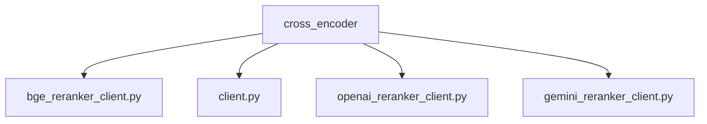
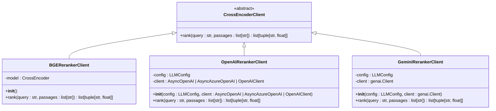
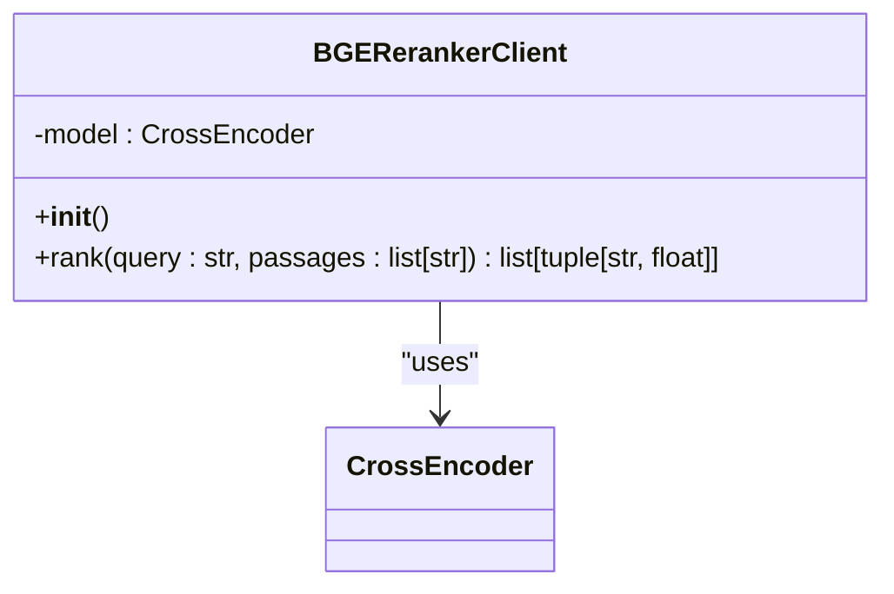
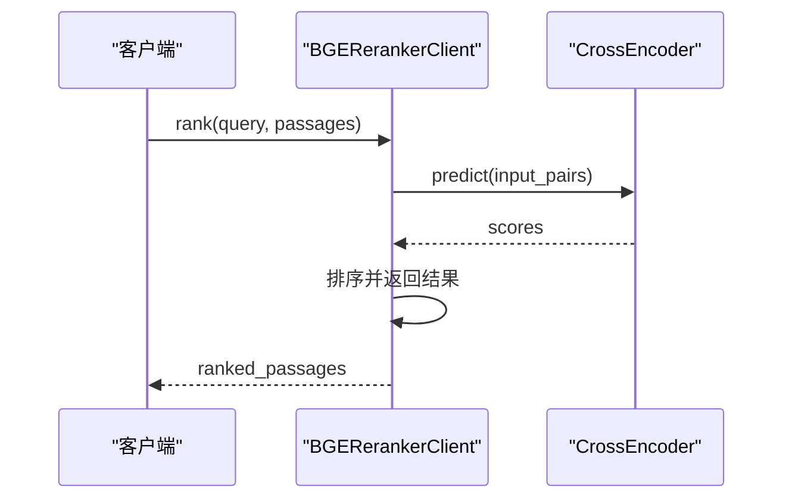
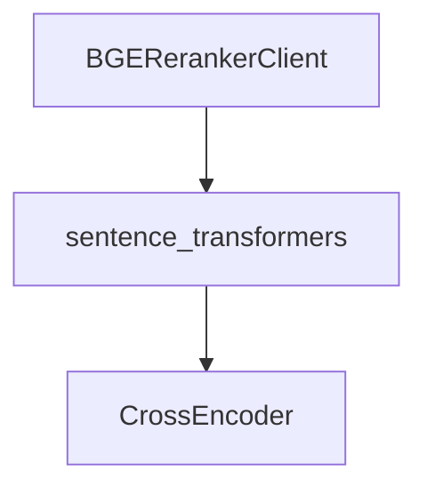

# BGE 重排序客户端

<cite>
**本文档中引用的文件**  
- [bge_reranker_client.py](file://graphiti_core/cross_encoder/bge_reranker_client.py)
- [client.py](file://graphiti_core/cross_encoder/client.py)
- [pyproject.toml](file://pyproject.toml)
- [test_bge_reranker_client_int.py](file://tests/cross_encoder/test_bge_reranker_client_int.py)
- [README.md](file://README.md)
</cite>

## 目录
1. [简介](#简介)
2. [项目结构](#项目结构)
3. [核心组件](#核心组件)
4. [架构概述](#架构概述)
5. [详细组件分析](#详细组件分析)
6. [依赖分析](#依赖分析)
7. [性能考量](#性能考量)
8. [故障排除指南](#故障排除指南)
9. [结论](#结论)

## 简介
BGE 重排序客户端是 Graphiti 框架中的一个关键组件，专为本地或自托管的重排序任务设计。它利用 BGE-reranker 系列模型（如 bge-reranker-base）对检索到的文档片段进行重新排序，以提高搜索结果的相关性。该客户端支持模型缓存、设备选择（CPU/GPU）和批处理配置，特别适用于数据隐私和低延迟场景。通过与云服务提供商的客户端对比，BGE 重排序客户端在保护用户数据隐私的同时，提供了高效的本地化解决方案。

## 项目结构
Graphiti 项目的目录结构清晰地组织了各个功能模块，其中 `graphiti_core` 目录包含了核心功能的实现，包括交叉编码器、驱动程序、嵌入器等。`cross_encoder` 子目录专门负责重排序功能，其中 `bge_reranker_client.py` 文件实现了 BGE 重排序客户端的具体逻辑。

**图示来源**
- [bge_reranker_client.py](file://graphiti_core/cross_encoder/bge_reranker_client.py)
- [client.py](file://graphiti_core/cross_encoder/client.py)

**章节来源**
- [bge_reranker_client.py](file://graphiti_core/cross_encoder/bge_reranker_client.py)
- [README.md](file://README.md)

## 核心组件
BGE 重排序客户端的核心在于 `BGERerankerClient` 类，该类继承自 `CrossEncoderClient` 抽象基类。`BGERerankerClient` 实现了 `rank` 方法，用于根据查询对文档片段进行评分和排序。此方法首先检查输入的文档片段列表是否为空，然后构建查询与每个文档片段的配对，最后使用预训练的 BGE 模型进行预测，得到每个配对的得分，并按得分降序排列。

**章节来源**
- [bge_reranker_client.py](file://graphiti_core/cross_encoder/bge_reranker_client.py#L34-L55)
- [client.py](file://graphiti_core/cross_encoder/client.py#L20-L41)

## 架构概述
BGE 重排序客户端的架构设计遵循了模块化和可扩展的原则。`CrossEncoderClient` 作为抽象基类定义了重排序客户端的基本接口，而具体的实现则由不同的子类完成，如 `BGERerankerClient`、`OpenAIRerankerClient` 和 `GeminiRerankerClient`。这种设计允许用户根据需要选择不同的重排序模型，同时保持接口的一致性。

**图示来源**
- [bge_reranker_client.py](file://graphiti_core/cross_encoder/bge_reranker_client.py#L34-L55)
- [client.py](file://graphiti_core/cross_encoder/client.py#L20-L41)
- [openai_reranker_client.py](file://graphiti_core/cross_encoder/openai_reranker_client.py#L34-L124)
- [gemini_reranker_client.py](file://graphiti_core/cross_encoder/gemini_reranker_client.py#L43-L162)

## 详细组件分析
### BGE 重排序客户端分析
`BGERerankerClient` 类的 `__init__` 方法初始化了一个 `CrossEncoder` 模型实例，该模型使用的是 `BAAI/bge-reranker-v2-m3` 预训练模型。`rank` 方法接收一个查询字符串和一个文档片段列表，返回一个包含文档片段及其得分的元组列表，按得分降序排列。

#### 对象导向组件

**图示来源**
- [bge_reranker_client.py](file://graphiti_core/cross_encoder/bge_reranker_client.py#L34-L55)
- [client.py](file://graphiti_core/cross_encoder/client.py#L20-L41)

#### API/服务组件

**图示来源**
- [bge_reranker_client.py](file://graphiti_core/cross_encoder/bge_reranker_client.py#L38-L55)

**章节来源**
- [bge_reranker_client.py](file://graphiti_core/cross_encoder/bge_reranker_client.py#L34-L55)
- [test_bge_reranker_client_int.py](file://tests/cross_encoder/test_bge_reranker_client_int.py#L1-L79)

## 依赖分析
BGE 重排序客户端依赖于 `sentence-transformers` 库来加载和运行 BGE 模型。此外，`pyproject.toml` 文件中定义了项目的可选依赖项，包括 `sentence-transformers`，确保用户可以通过 `pip install graphiti-core[sentence-transformers]` 安装必要的依赖。

**图示来源**
- [pyproject.toml](file://pyproject.toml#L36)
- [bge_reranker_client.py](file://graphiti_core/cross_encoder/bge_reranker_client.py#L20-L29)

**章节来源**
- [pyproject.toml](file://pyproject.toml#L36)
- [bge_reranker_client.py](file://graphiti_core/cross_encoder/bge_reranker_client.py#L20-L29)

## 性能考量
BGE 重排序客户端在设计时考虑了性能优化，特别是在处理大量文档片段时。通过使用异步编程模型，`rank` 方法能够在不阻塞主线程的情况下执行模型预测，从而提高整体性能。此外，模型缓存机制可以减少重复加载模型的时间开销，进一步提升响应速度。

## 故障排除指南
在使用 BGE 重排序客户端时，常见的问题包括模型加载失败、依赖项缺失等。确保已正确安装 `sentence-transformers` 库，并且网络连接正常，以便从 Hugging Face 下载预训练模型。如果遇到性能问题，可以尝试调整批处理大小或使用 GPU 加速。

**章节来源**
- [bge_reranker_client.py](file://graphiti_core/cross_encoder/bge_reranker_client.py#L20-L29)
- [README.md](file://README.md#L133-L169)

## 结论
BGE 重排序客户端为 Graphiti 框架提供了一个强大且灵活的本地重排序解决方案。通过支持多种重排序模型和优化性能，它在数据隐私和低延迟场景下表现出色。用户可以根据具体需求选择合适的模型和配置，实现高效的信息检索和排序。