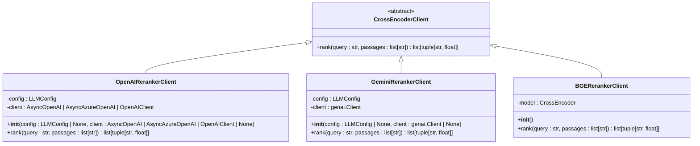
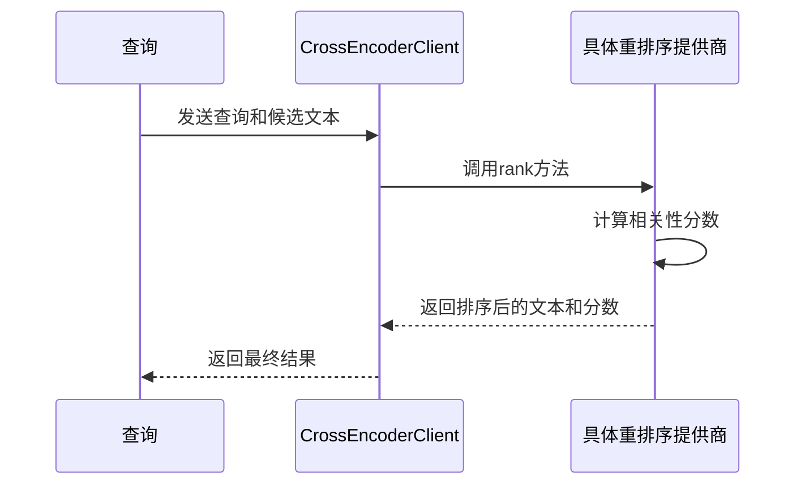
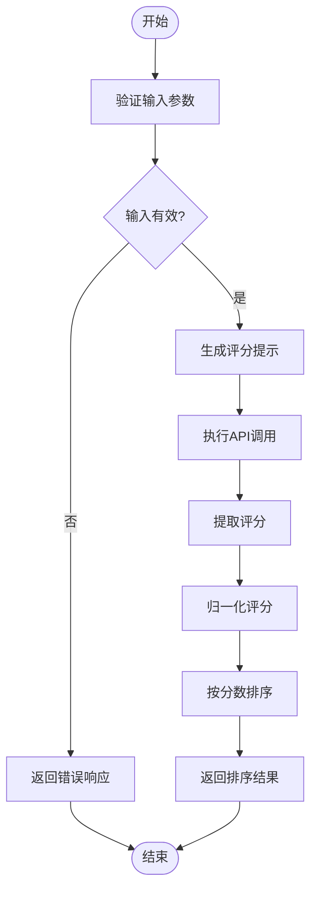
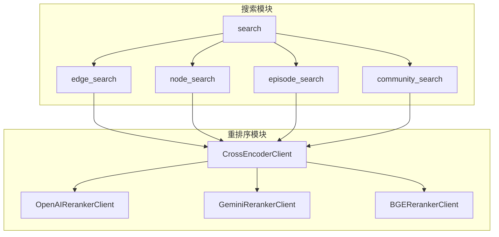

# Cross-Encoder 重排序

<cite>
**本文档引用的文件**   
- [client.py](file://graphiti_core/cross_encoder/client.py)
- [openai_reranker_client.py](file://graphiti_core/cross_encoder/openai_reranker_client.py)
- [gemini_reranker_client.py](file://graphiti_core/cross_encoder/gemini_reranker_client.py)
- [bge_reranker_client.py](file://graphiti_core/cross_encoder/bge_reranker_client.py)
- [search.py](file://graphiti_core/search/search.py)
- [search_config.py](file://graphiti_core/search/search_config.py)
- [search_config_recipes.py](file://graphiti_core/search/search_config_recipes.py)
- [graphiti.py](file://graphiti_core/graphiti.py)
- [graphiti_types.py](file://graphiti_core/graphiti_types.py)
</cite>

## 目录
1. [简介](#简介)
2. [架构设计](#架构设计)
3. [核心组件分析](#核心组件分析)
4. [多提供商集成](#多提供商集成)
5. [重排序机制实现](#重排序机制实现)
6. [在搜索中的集成](#在搜索中的集成)
7. [性能权衡与调优](#性能权衡与调优)
8. [结论](#结论)

## 简介

Cross-Encoder 重排序机制是 Graphiti 系统中的关键组件，用于提升检索结果的准确性和相关性。该机制通过精细化的相关性打分，对候选文本进行重新排序，从而优化最终的检索结果。Cross-Encoder 抽象基类定义了统一的接口，支持多种具体实现，包括 OpenAI、Gemini 和 BGE 等提供商。该机制不仅在节点、边、社区和片段搜索中发挥重要作用，还通过 fact/name/content 到 UUID 的映射逻辑，实现了高效的搜索集成。尽管计算开销较高，但其在精度上的优势使其成为提升检索质量的重要手段。

## 架构设计

Cross-Encoder 重排序机制的架构设计基于抽象基类和具体实现的分离，确保了系统的灵活性和可扩展性。`CrossEncoderClient` 抽象基类定义了 `rank` 方法的接口，所有具体实现都必须遵循这一接口。这种设计允许系统在不修改核心逻辑的情况下，轻松集成新的重排序提供商。具体实现包括 `OpenAIRerankerClient`、`GeminiRerankerClient` 和 `BGERerankerClient`，它们分别利用 OpenAI、Gemini 和 BGE 模型进行相关性打分。整个机制通过 `GraphitiClients` 类进行管理，确保了客户端的统一配置和调用。

**图表来源**
- [client.py](file://graphiti_core/cross_encoder/client.py#L20-L40)
- [openai_reranker_client.py](file://graphiti_core/cross_encoder/openai_reranker_client.py#L34-L124)
- [gemini_reranker_client.py](file://graphiti_core/cross_encoder/gemini_reranker_client.py#L43-L162)
- [bge_reranker_client.py](file://graphiti_core/cross_encoder/bge_reranker_client.py#L34-L55)

**本节来源**
- [client.py](file://graphiti_core/cross_encoder/client.py#L1-L41)
- [graphiti_types.py](file://graphiti_core/graphiti_types.py#L26-L34)

## 核心组件分析

### CrossEncoderClient 抽象基类

`CrossEncoderClient` 是一个抽象基类，定义了重排序机制的统一接口。它通过 `rank` 方法接收查询和候选文本列表，返回按相关性排序的文本和分数对。该类的设计确保了所有具体实现的一致性，使得系统可以灵活切换不同的重排序提供商。

**本节来源**
- [client.py](file://graphiti_core/cross_encoder/client.py#L20-L40)

### 具体实现差异

#### OpenAI 实现

`OpenAIRerankerClient` 利用 OpenAI API 进行相关性打分。它通过并发执行布尔分类器提示，使用对数概率对候选文本进行评分。该实现支持 `AsyncOpenAI` 和 `AsyncAzureOpenAI` 客户端，提供了灵活的配置选项。

#### Gemini 实现

`GeminiRerankerClient` 使用 Gemini API 进行直接相关性评分。每个候选文本在 0-100 的范围内进行评分，然后归一化到 [0,1] 范围。由于 Gemini API 不支持对数概率，该实现通过直接评分来实现重排序。

#### BGE 实现

`BGERerankerClient` 基于 `sentence-transformers` 库中的 `CrossEncoder` 模型。它通过加载预训练的 `BAAI/bge-reranker-v2-m3` 模型，对查询和候选文本进行联合编码，计算相关性分数。该实现通过异步执行同步的 `predict` 方法，确保了高性能。

**图表来源**
- [openai_reranker_client.py](file://graphiti_core/cross_encoder/openai_reranker_client.py#L61-L118)
- [gemini_reranker_client.py](file://graphiti_core/cross_encoder/gemini_reranker_client.py#L73-L147)
- [bge_reranker_client.py](file://graphiti_core/cross_encoder/bge_reranker_client.py#L38-L54)

**本节来源**
- [openai_reranker_client.py](file://graphiti_core/cross_encoder/openai_reranker_client.py#L34-L124)
- [gemini_reranker_client.py](file://graphiti_core/cross_encoder/gemini_reranker_client.py#L43-L162)
- [bge_reranker_client.py](file://graphiti_core/cross_encoder/bge_reranker_client.py#L34-L55)

## 多提供商集成

Cross-Encoder 重排序机制通过抽象基类和具体实现的分离，实现了多提供商的无缝集成。`CrossEncoderClient` 定义了统一的接口，所有具体实现都必须遵循这一接口。这种设计使得系统可以轻松集成新的重排序提供商，而无需修改核心逻辑。`OpenAIRerankerClient`、`GeminiRerankerClient` 和 `BGERerankerClient` 分别利用 OpenAI、Gemini 和 BGE 模型进行相关性打分，提供了多样化的选择。通过 `GraphitiClients` 类，系统可以统一管理这些客户端，确保了配置和调用的一致性。

**本节来源**
- [client.py](file://graphiti_core/cross_encoder/client.py#L20-L40)
- [graphiti_types.py](file://graphiti_core/graphiti_types.py#L30-L34)

## 重排序机制实现

### rank 方法详解

`rank` 方法是 Cross-Encoder 重排序机制的核心，负责对查询与候选文本进行精细化的相关性打分。该方法接收查询字符串和候选文本列表，返回按相关性排序的文本和分数对。不同实现的具体打分方式有所不同，但都遵循统一的接口。

#### OpenAI 打分机制

`OpenAIRerankerClient` 使用 OpenAI API 进行布尔分类器提示，通过并发执行每个候选文本的提示，使用对数概率进行评分。归一化后的对数概率作为相关性分数，最终按分数降序排列。

#### Gemini 打分机制

`GeminiRerankerClient` 使用 Gemini API 进行直接相关性评分。每个候选文本在 0-100 的范围内进行评分，然后归一化到 [0,1] 范围。该实现通过正则表达式提取评分，确保了评分的准确性和一致性。

#### BGE 打分机制

`BGERerankerClient` 基于 `sentence-transformers` 库中的 `CrossEncoder` 模型。它通过加载预训练的 `BAAI/bge-reranker-v2-m3` 模型，对查询和候选文本进行联合编码，计算相关性分数。该实现通过异步执行同步的 `predict` 方法，确保了高性能。

**图表来源**
- [openai_reranker_client.py](file://graphiti_core/cross_encoder/openai_reranker_client.py#L61-L118)
- [gemini_reranker_client.py](file://graphiti_core/cross_encoder/gemini_reranker_client.py#L73-L147)
- [bge_reranker_client.py](file://graphiti_core/cross_encoder/bge_reranker_client.py#L38-L54)

**本节来源**
- [openai_reranker_client.py](file://graphiti_core/cross_encoder/openai_reranker_client.py#L61-L118)
- [gemini_reranker_client.py](file://graphiti_core/cross_encoder/gemini_reranker_client.py#L73-L147)
- [bge_reranker_client.py](file://graphiti_core/cross_encoder/bge_reranker_client.py#L38-L54)

## 在搜索中的集成

### 节点、边、社区和片段搜索

Cross-Encoder 重排序机制在节点、边、社区和片段搜索中发挥重要作用。通过 `search` 函数，系统可以对不同类型的搜索结果进行重排序。`SearchConfig` 类定义了搜索配置，包括搜索方法和重排序器。`EdgeReranker`、`NodeReranker`、`EpisodeReranker` 和 `CommunityReranker` 枚举定义了不同类型的重排序器，支持 `rrf`、`mmr` 和 `cross_encoder` 等方法。

### fact/name/content 到 UUID 的映射逻辑

在搜索过程中，系统通过 `fact_to_uuid_map`、`name_to_uuid_map` 和 `content_to_uuid_map` 等映射逻辑，将候选文本与 UUID 进行关联。这些映射确保了重排序结果的准确性和一致性。例如，在节点搜索中，`name_to_uuid_map` 将节点名称映射到 UUID，确保了重排序后的结果可以正确关联到原始节点。

**图表来源**
- [search.py](file://graphiti_core/search/search.py#L68-L520)
- [search_config.py](file://graphiti_core/search/search_config.py#L32-L78)
- [search_config_recipes.py](file://graphiti_core/search/search_config_recipes.py#L34-L224)

**本节来源**
- [search.py](file://graphiti_core/search/search.py#L68-L520)
- [search_config.py](file://graphiti_core/search/search_config.py#L32-L78)
- [search_config_recipes.py](file://graphiti_core/search/search_config_recipes.py#L34-L224)

## 性能权衡与调优

### 计算开销与精度的权衡

Cross-Encoder 重排序机制在提升检索准确率方面具有显著优势，但其计算开销较高。`OpenAIRerankerClient` 和 `GeminiRerankerClient` 依赖外部 API 调用，可能受到速率限制和网络延迟的影响。`BGERerankerClient` 虽然在本地执行，但模型推理过程仍然消耗大量计算资源。因此，在实际应用中需要权衡计算开销与精度。

### 启用条件和性能调优建议

#### 启用条件

- **高精度需求**: 当检索结果的准确性至关重要时，应启用 Cross-Encoder 重排序。
- **资源充足**: 确保有足够的计算资源和网络带宽支持重排序过程。
- **低延迟容忍**: 如果系统对响应时间要求不高，可以启用重排序以提升精度。

#### 性能调优建议

- **并发控制**: 使用 `semaphore_gather` 控制并发请求数量，避免资源耗尽。
- **缓存机制**: 对频繁查询的结果进行缓存，减少重复计算。
- **模型选择**: 根据具体需求选择合适的重排序模型，平衡精度和性能。
- **参数调优**: 调整 `mmr_lambda` 和 `reranker_min_score` 等参数，优化重排序效果。

**本节来源**
- [helpers.py](file://graphiti_core/helpers.py#L105-L116)
- [search.py](file://graphiti_core/search/search.py#L118-L131)
- [search_config.py](file://graphiti_core/search/search_config.py#L80-L119)

## 结论

Cross-Encoder 重排序机制通过精细化的相关性打分，显著提升了检索结果的准确性和相关性。其基于抽象基类和具体实现的分离设计，确保了系统的灵活性和可扩展性。多提供商集成使得系统可以灵活选择不同的重排序模型，满足不同场景的需求。尽管计算开销较高，但通过合理的性能调优，可以在精度和性能之间找到最佳平衡。该机制在节点、边、社区和片段搜索中的集成，进一步增强了系统的检索能力，为用户提供更高质量的搜索结果。