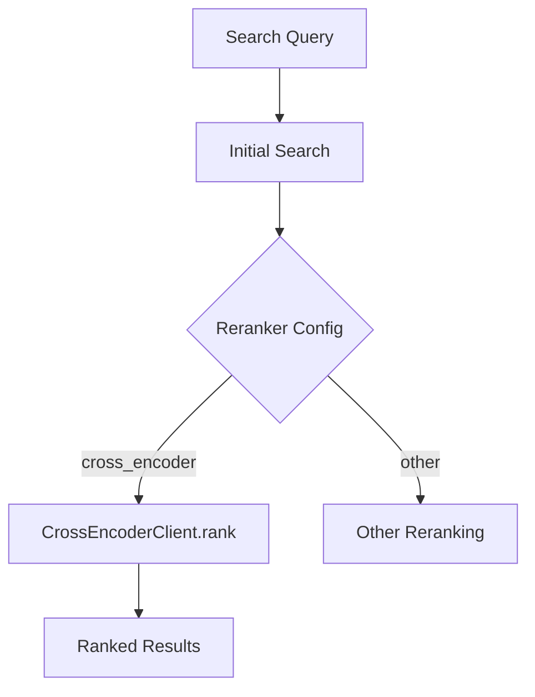
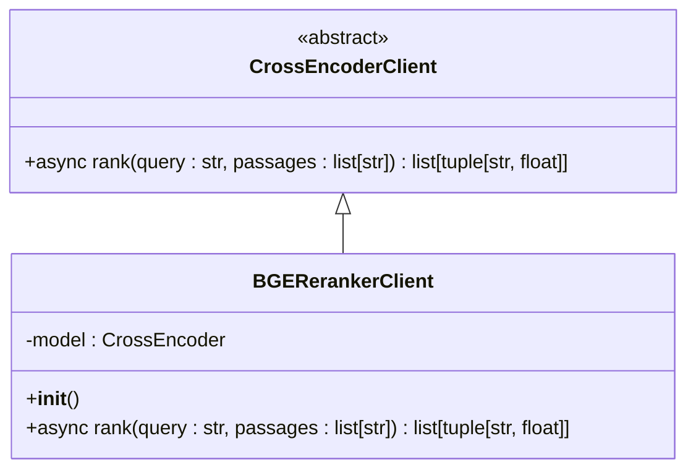

# CrossEncoderClient 抽象基类

<cite>
**本文档中引用的文件**  
- [client.py](file://graphiti_core/cross_encoder/client.py)
- [bge_reranker_client.py](file://graphiti_core/cross_encoder/bge_reranker_client.py)
- [openai_reranker_client.py](file://graphiti_core/cross_encoder/openai_reranker_client.py)
- [gemini_reranker_client.py](file://graphiti_core/cross_encoder/gemini_reranker_client.py)
- [search.py](file://graphiti_core/search/search.py)
- [graphiti_types.py](file://graphiti_core/graphiti_types.py)
</cite>

## 目录
1. [简介](#简介)
2. [核心方法详解](#核心方法详解)
3. [架构与集成](#架构与集成)
4. [错误处理与重试机制](#错误处理与重试机制)
5. [日志记录策略](#日志记录策略)
6. [继承与实现指南](#继承与实现指南)
7. [实现示例](#实现示例)

## 简介

CrossEncoderClient 是一个抽象基类，定义了用于对段落进行排序的交叉编码器模型的统一接口。该类的设计目的是为不同提供商的重排序客户端提供一个标准化的契约，使得各种重排序实现可以无缝地集成到 Graphiti 核心系统中。通过继承此基类，开发者可以创建针对特定模型（如 BGE、OpenAI 或 Gemini）的重排序客户端，同时确保所有实现都遵循相同的接口规范。

该基类位于 `graphiti_core/cross_encoder/client.py` 文件中，是整个重排序功能的核心。它通过依赖注入机制与 Graphiti 系统的其他组件（如搜索模块）集成，为节点、边、社区和片段等不同类型的实体提供一致的重排序能力。

**Section sources**
- [client.py](file://graphiti_core/cross_encoder/client.py#L1-L41)

## 核心方法详解

CrossEncoderClient 的核心是 `rank` 方法，该方法负责根据查询的相关性对给定的文本段落列表进行排序。

### 方法签名

```python
async def rank(self, query: str, passages: list[str]) -> list[tuple[str, float]]
```

### 参数说明

- **query** (`str`): 用于评估段落相关性的查询字符串。
- **passages** (`list[str]`): 需要排序的文本段落列表。

### 返回值格式

该方法返回一个元组列表，每个元组包含：
- **段落文本** (`str`): 原始的段落内容。
- **相关性分数** (`float`): 表示段落与查询相关性的浮点数分数。

返回的列表按相关性分数降序排列，分数最高的段落排在最前面。

### 功能描述

`rank` 方法是一个抽象方法，所有继承 CrossEncoderClient 的子类都必须实现此方法。其主要职责是计算每个段落与查询的相似度或相关性，并据此对段落进行排序。不同的实现可能会使用不同的技术，例如：
- 使用预训练的交叉编码器模型（如 BGE）进行直接相似度计算。
- 调用大型语言模型 API（如 OpenAI 或 Gemini）进行更复杂的语义分析和评分。

**Section sources**
- [client.py](file://graphiti_core/cross_encoder/client.py#L27-L40)

## 架构与集成

CrossEncoderClient 在 Graphiti 系统中扮演着关键角色，它通过依赖注入与核心组件紧密集成。

### 依赖注入

CrossEncoderClient 实例通过 `GraphitiClients` 类注入到系统中。`GraphitiClients` 是一个包含所有核心客户端（如驱动、LLM 客户端、嵌入客户端和交叉编码器客户端）的容器。在 `graphiti_core/graphiti_types.py` 中定义的 `GraphitiClients` 类明确地将 `cross_encoder` 作为其一个字段，这确保了重排序功能是系统架构的一等公民。

### 与搜索模块的集成

重排序功能主要在搜索流程中被调用。在 `graphiti_core/search/search.py` 文件中，多个搜索函数（如 `edge_search`、`node_search`、`episode_search` 和 `community_search`）都接收 `CrossEncoderClient` 实例作为参数。当搜索配置中指定了 `cross_encoder` 重排序器时，这些函数会调用 `rank` 方法来对初步搜索结果进行精细化排序。

例如，在 `edge_search` 函数中，当配置为 `EdgeReranker.cross_encoder` 时，系统会提取边的“事实”（fact）字段，将其作为段落传递给 `rank` 方法，然后根据返回的分数重新排序边。



**Diagram sources**
- [graphiti_types.py](file://graphiti_core/graphiti_types.py#L26-L34)
- [search.py](file://graphiti_core/search/search.py#L119-L166)

**Section sources**
- [graphiti_types.py](file://graphiti_core/graphiti_types.py#L19-L34)
- [search.py](file://graphiti_core/search/search.py#L21-L28)

## 错误处理与重试机制

CrossEncoderClient 的具体实现负责处理与重排序相关的各种错误，并提供适当的重试机制。

### 错误类型

- **RateLimitError**: 当 API 调用超出速率限制时抛出。`OpenAIRerankerClient` 和 `GeminiRerankerClient` 都会将底层 API 的速率限制异常（如 `openai.RateLimitError`）转换为统一的 `RateLimitError`。
- **ImportError**: 当必要的依赖项（如 `sentence-transformers` 或 `google-genai`）未安装时抛出。这在 `BGERerankerClient` 和 `GeminiRerankerClient` 的导入检查中实现。
- **通用异常**: 对于其他未预期的错误，实现会记录错误日志并重新抛出异常。

### 重试策略

虽然 CrossEncoderClient 基类本身不直接实现重试逻辑，但其子类的设计考虑了重试的可能性。例如，`OpenAIRerankerClient` 和 `GeminiRerankerClient` 在捕获 `RateLimitError` 时，调用者可以根据此信息实现指数退避等重试策略。此外，`semaphore_gather` 函数的使用确保了并发请求的节流，这本身就是一种防止过度请求的机制。

**Section sources**
- [openai_reranker_client.py](file://graphiti_core/cross_encoder/openai_reranker_client.py#L119-L123)
- [gemini_reranker_client.py](file://graphiti_core/cross_encoder/gemini_reranker_client.py#L149-L161)
- [bge_reranker_client.py](file://graphiti_core/cross_encoder/bge_reranker_client.py#L23-L29)

## 日志记录策略

日志记录是 CrossEncoderClient 实现的重要组成部分，用于监控和调试重排序过程。

### 日志级别

- **ERROR**: 用于记录导致操作失败的严重错误，例如 API 调用失败或无法解析响应。
- **WARNING**: 用于记录非致命问题，例如无法从 LLM 响应中提取数字分数或收到空响应。
- **DEBUG**: 用于记录更详细的流程信息，如搜索查询的执行时间。

### 日志内容

日志消息通常包含足够的上下文信息，例如错误的详细描述和相关的查询或段落。例如，`GeminiRerankerClient` 在无法提取分数时会记录警告，并包含原始的响应文本，这有助于诊断模型输出格式的问题。

**Section sources**
- [openai_reranker_client.py](file://graphiti_core/cross_encoder/openai_reranker_client.py#L122)
- [gemini_reranker_client.py](file://graphiti_core/cross_encoder/gemini_reranker_client.py#L134-L137)

## 继承与实现指南

要创建一个新的重排序客户端，需要继承 `CrossEncoderClient` 并实现 `rank` 方法。

### 步骤指南

1. **创建新类**: 在 `graphiti_core/cross_encoder/` 目录下创建一个新的 Python 文件，例如 `my_reranker_client.py`。
2. **继承基类**: 创建一个新类，继承自 `CrossEncoderClient`。
3. **实现 `__init__` 方法**: 初始化所需的客户端或模型。通常需要接受 `LLMConfig` 和/或客户端实例作为参数。
4. **实现 `rank` 方法**: 实现具体的重排序逻辑。确保处理空输入、异常情况，并正确排序结果。
5. **添加导入**: 在 `graphiti_core/cross_encoder/__init__.py` 中添加对新客户端的导入和 `__all__` 声明。

### 实现要求

- **异步**: `rank` 方法必须是异步的（使用 `async def`）。
- **返回格式**: 必须返回 `(str, float)` 元组的列表，并按分数降序排列。
- **错误处理**: 应捕获底层异常并转换为合适的 `graphiti_core` 错误类型，或记录日志后重新抛出。
- **依赖管理**: 如果需要外部库，应在 `__init__` 中进行导入检查，并提供清晰的错误消息。

**Section sources**
- [client.py](file://graphiti_core/cross_encoder/client.py#L20-L40)
- [__init__.py](file://graphiti_core/cross_encoder/__init__.py#L17-L20)

## 实现示例

以下是 `BGERerankerClient` 的简化实现，展示了如何继承 `CrossEncoderClient`。



**Diagram sources**
- [client.py](file://graphiti_core/cross_encoder/client.py#L20-L40)
- [bge_reranker_client.py](file://graphiti_core/cross_encoder/bge_reranker_client.py#L34-L55)

**Section sources**
- [bge_reranker_client.py](file://graphiti_core/cross_encoder/bge_reranker_client.py#L34-L55)