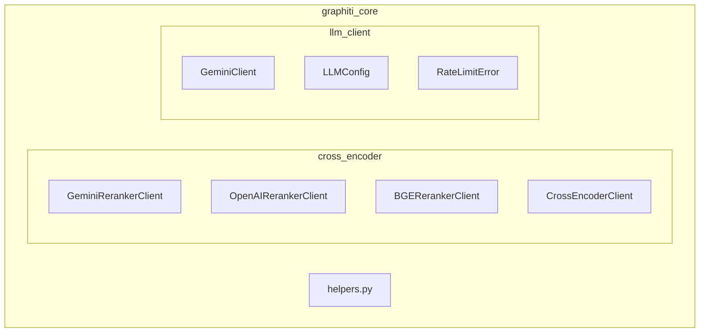
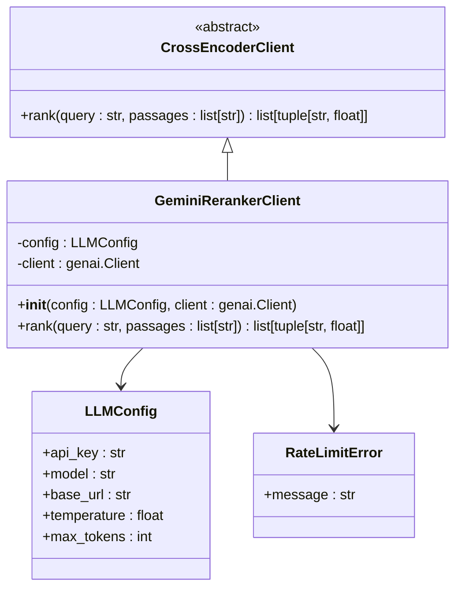
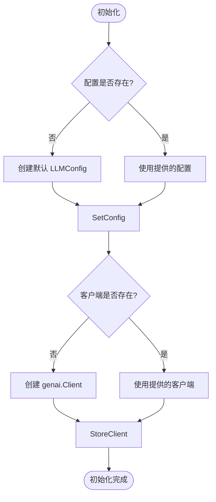
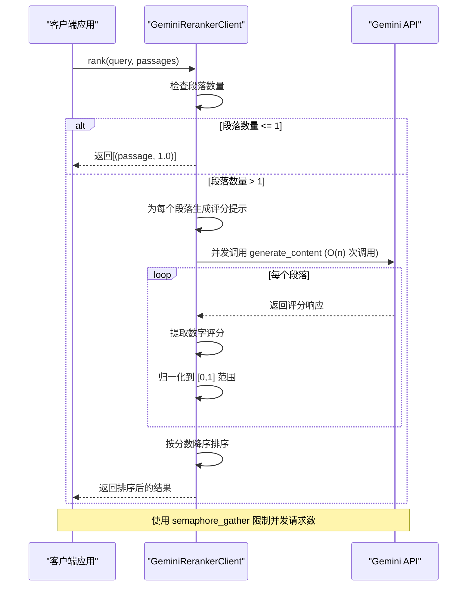
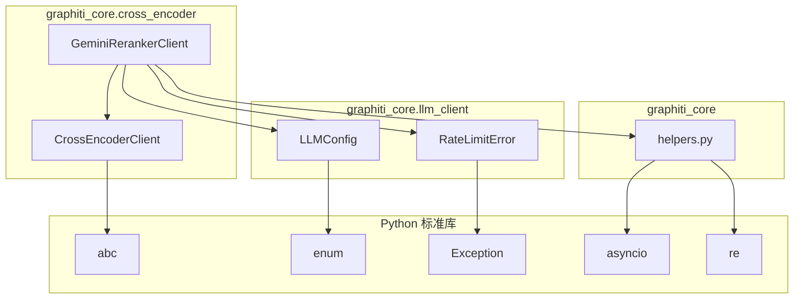

# Gemini 重排序客户端

<cite>
**本文档中引用的文件**  
- [gemini_reranker_client.py](file://graphiti_core/cross_encoder/gemini_reranker_client.py)
- [client.py](file://graphiti_core/cross_encoder/client.py)
- [gemini_client.py](file://graphiti_core/llm_client/gemini_client.py)
- [config.py](file://graphiti_core/llm_client/config.py)
- [errors.py](file://graphiti_core/llm_client/errors.py)
- [openai_reranker_client.py](file://graphiti_core/cross_encoder/openai_reranker_client.py)
- [helpers.py](file://graphiti_core/helpers.py)
</cite>

## 目录
1. [简介](#简介)
2. [项目结构](#项目结构)
3. [核心组件](#核心组件)
4. [架构概述](#架构概述)
5. [详细组件分析](#详细组件分析)
6. [依赖分析](#依赖分析)
7. [性能考量](#性能考量)
8. [故障排除指南](#故障排除指南)
9. [结论](#结论)

## 简介
Gemini 重排序客户端是 Graphiti 框架中的一个关键组件，用于通过 Google Generative AI SDK 调用 Vertex AI 或 Gemini API 来对检索结果进行重新排序。该客户端实现了基于查询相关性的评分机制，通过直接对每个段落进行 0-100 分的评分来确定其与查询的相关性。该文档详细说明了如何配置项目 ID、位置和模型名称以连接 Gemini 服务，深入解析了 rank 方法的内部工作流程，并对比了其与 OpenAI 客户端在性能、准确性和成本上的差异。

## 项目结构
Gemini 重排序客户端位于 `graphiti_core/cross_encoder` 目录下，是 Graphiti 框架中用于处理交叉编码器任务的核心模块之一。该模块包含多个客户端实现，包括 Gemini、OpenAI 和 BGE 重排序器。

**Diagram sources**
- [gemini_reranker_client.py](file://graphiti_core/cross_encoder/gemini_reranker_client.py)
- [openai_reranker_client.py](file://graphiti_core/cross_encoder/openai_reranker_client.py)
- [client.py](file://graphiti_core/cross_encoder/client.py)

## 核心组件
Gemini 重排序客户端的核心功能由 `GeminiRerankerClient` 类实现，该类继承自 `CrossEncoderClient` 抽象基类。它通过 Google 的 `genai` SDK 与 Gemini API 进行交互，使用 `LLMConfig` 配置客户端参数，并通过 `RateLimitError` 处理配额超限等错误情况。

**Section sources**
- [gemini_reranker_client.py](file://graphiti_core/cross_encoder/gemini_reranker_client.py#L43-L162)
- [client.py](file://graphiti_core/cross_encoder/client.py#L20-L41)
- [config.py](file://graphiti_core/llm_client/config.py#L28-L69)
- [errors.py](file://graphiti_core/llm_client/errors.py#L18-L24)

## 架构概述
Gemini 重排序客户端的架构设计遵循了模块化和可扩展的原则。它通过 `CrossEncoderClient` 接口定义了重排序器的通用行为，允许不同的实现（如 Gemini、OpenAI）可以互换使用。客户端通过 `LLMConfig` 对象管理配置，并利用 `semaphore_gather` 函数实现并发请求的限流。

**Diagram sources**
- [gemini_reranker_client.py](file://graphiti_core/cross_encoder/gemini_reranker_client.py#L43-L162)
- [client.py](file://graphiti_core/cross_encoder/client.py#L20-L41)
- [config.py](file://graphiti_core/llm_client/config.py#L28-L69)
- [errors.py](file://graphiti_core/llm_client/errors.py#L18-L24)

## 详细组件分析
### GeminiRerankerClient 分析
`GeminiRerankerClient` 类是 Gemini 重排序功能的核心实现。它通过 `rank` 方法对一组段落进行相关性评分和排序。

#### 初始化分析
`GeminiRerankerClient` 的初始化过程接受一个 `LLMConfig` 对象作为参数，该对象包含了 API 密钥、模型名称等配置信息。如果未提供配置，则使用默认值。客户端会根据配置创建或使用现有的 `genai.Client` 实例。

**Diagram sources**
- [gemini_reranker_client.py](file://graphiti_core/cross_encoder/gemini_reranker_client.py#L48-L72)

#### Rank 方法分析
`rank` 方法是 Gemini 重排序客户端的核心功能，负责对段落进行评分和排序。

**Diagram sources**
- [gemini_reranker_client.py](file://graphiti_core/cross_encoder/gemini_reranker_client.py#L73-L147)

**Section sources**
- [gemini_reranker_client.py](file://graphiti_core/cross_encoder/gemini_reranker_client.py#L73-L147)
- [helpers.py](file://graphiti_core/helpers.py#L106-L116)

## 依赖分析
Gemini 重排序客户端依赖于多个核心模块，形成了一个完整的依赖链。

**Diagram sources**
- [gemini_reranker_client.py](file://graphiti_core/cross_encoder/gemini_reranker_client.py)
- [client.py](file://graphiti_core/cross_encoder/client.py)
- [config.py](file://graphiti_core/llm_client/config.py)
- [errors.py](file://graphiti_core/llm_client/errors.py)
- [helpers.py](file://graphiti_core/helpers.py)

**Section sources**
- [gemini_reranker_client.py](file://graphiti_core/cross_encoder/gemini_reranker_client.py)
- [client.py](file://graphiti_core/cross_encoder/client.py)
- [config.py](file://graphiti_core/llm_client/config.py)
- [errors.py](file://graphiti_core/llm_client/errors.py)
- [helpers.py](file://graphiti_core/helpers.py)

## 性能考量
Gemini 重排序客户端的性能特点主要体现在其并发处理能力和错误处理机制上。由于每个段落都需要单独调用 API 进行评分，因此需要进行 O(n) 次 API 调用，这可能导致较高的延迟和成本。为了控制并发请求数量，客户端使用了 `semaphore_gather` 函数，通过 `SEMAPHORE_LIMIT` 环境变量（默认值为 20）来限制同时进行的请求数量。

与 OpenAI 重排序客户端相比，Gemini 客户端的实现方式有所不同。OpenAI 客户端使用 logprobs 功能来获取相关性分数，而 Gemini API 目前不支持 logprobs，因此采用直接评分的方式。这种差异导致了两者在准确性和性能上的不同：Gemini 的直接评分可能更直观，但需要更多的 API 调用；而 OpenAI 的 logprobs 方法可能更高效，但依赖于模型对布尔分类的理解。

在成本方面，Gemini 的 O(n) API 调用模式通常比 OpenAI 的批量处理模式成本更高，尤其是在处理大量段落时。然而，Gemini 模型（如 gemini-2.5-flash-lite）通常比同等性能的 OpenAI 模型更具成本效益。

## 故障排除指南
Gemini 重排序客户端实现了完善的错误处理机制，能够识别和处理多种错误情况。

**Section sources**
- [gemini_reranker_client.py](file://graphiti_core/cross_encoder/gemini_reranker_client.py#L149-L161)
- [errors.py](file://graphiti_core/llm_client/errors.py#L18-L24)

### 常见错误及解决方案
1. **配额超限错误 (RateLimitError)**
   - **症状**: 抛出 `RateLimitError` 异常
   - **原因**: API 调用频率超过配额限制
   - **解决方案**: 
     - 实现指数退避重试机制
     - 降低并发请求数量（调整 `SEMAPHORE_LIMIT`）
     - 升级 Google Cloud 项目配额

2. **无效的 API 密钥**
   - **症状**: 认证失败错误
   - **原因**: `GOOGLE_API_KEY` 环境变量未设置或密钥无效
   - **解决方案**: 
     - 确保在环境变量中正确设置 `GOOGLE_API_KEY`
     - 在 Google Cloud Console 中验证 API 密钥的有效性

3. **评分提取失败**
   - **症状**: 段落评分为 0.0
   - **原因**: Gemini API 返回的响应无法解析为数字
   - **解决方案**: 
     - 检查提示词（prompt）是否被正确理解
     - 验证 API 响应格式
     - 查看日志中的警告信息

4. **模块导入错误**
   - **症状**: `ImportError: google-genai is required for GeminiRerankerClient`
   - **原因**: 缺少 `google-genai` 依赖包
   - **解决方案**: 
     - 安装缺失的依赖：`pip install graphiti-core[google-genai]`

## 结论
Gemini 重排序客户端为 Graphiti 框架提供了一种有效的查询相关性评分机制。通过直接调用 Gemini API 对每个段落进行评分，它实现了对检索结果的精确重排序。尽管其 O(n) API 调用模式在性能和成本上存在挑战，但通过并发控制和错误处理机制，客户端能够稳定地处理重排序任务。与 OpenAI 客户端相比，Gemini 客户端在实现方式上有所不同，开发者应根据具体需求和成本考虑选择合适的重排序方案。