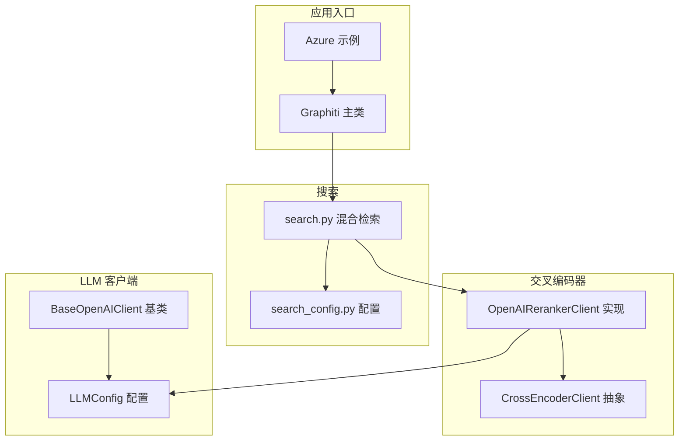
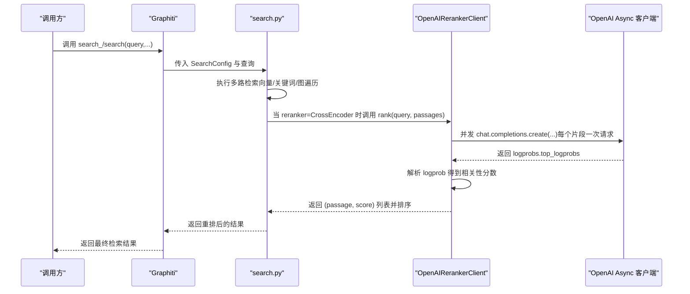
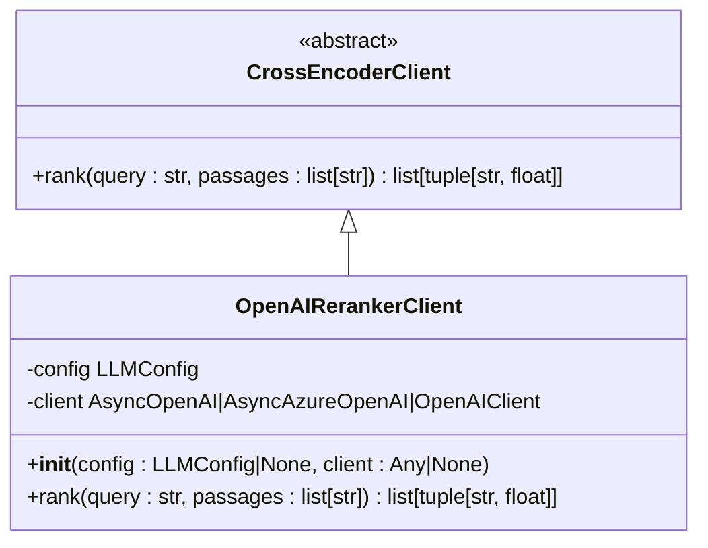
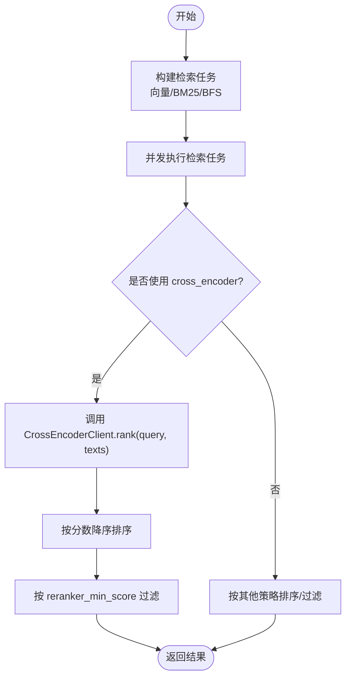
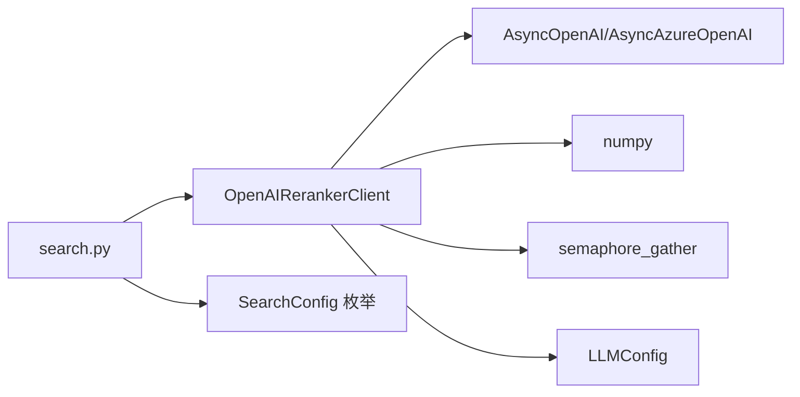

# OpenAI 重排序客户端

<cite>
**本文引用的文件**
- [openai_reranker_client.py](file://graphiti_core/cross_encoder/openai_reranker_client.py)
- [client.py](file://graphiti_core/cross_encoder/client.py)
- [search.py](file://graphiti_core/search/search.py)
- [search_config.py](file://graphiti_core/search/search_config.py)
- [graphiti.py](file://graphiti_core/graphiti.py)
- [config.py](file://graphiti_core/llm_client/config.py)
- [openai_base_client.py](file://graphiti_core/llm_client/openai_base_client.py)
- [azure_openai_neo4j.py](file://examples/azure-openai/azure_openai_neo4j.py)
- [README.md](file://README.md)
</cite>

## 目录
1. [简介](#简介)
2. [项目结构](#项目结构)
3. [核心组件](#核心组件)
4. [架构总览](#架构总览)
5. [详细组件分析](#详细组件分析)
6. [依赖关系分析](#依赖关系分析)
7. [性能考量](#性能考量)
8. [故障排查指南](#故障排查指南)
9. [结论](#结论)
10. [附录：调用示例与最佳实践](#附录调用示例与最佳实践)

## 简介
本文件面向希望在 Graphiti 中使用 OpenAI 重排序（Cross-Encoder）能力的开发者，系统化说明 OpenAI 重排序客户端的初始化、配置与调用方式，以及它在混合检索流程中的作用与与其他组件的交互。重点覆盖：
- 初始化与配置：API 密钥、基础 URL、模型名称的来源（环境变量或参数传入）
- rank 方法的工作机制：将输入转换为 OpenAI API 请求格式、并发请求、日志概率解析与相关性评分
- 在混合检索流程中的应用场景：与向量检索、BM25、图遍历等方法结合，作为最终重排阶段
- 性能与成本优化：批处理大小、并发度、速率限制与成本控制策略
- 实际调用示例与最佳实践

## 项目结构
OpenAI 重排序客户端位于 cross_encoder 子模块中，配合搜索模块完成混合检索与重排。关键文件与职责如下：
- graphiti_core/cross_encoder/openai_reranker_client.py：OpenAI 重排序客户端实现，负责 rank 接口
- graphiti_core/cross_encoder/client.py：跨编码器抽象接口定义
- graphiti_core/search/search.py：混合检索主流程，包含节点/边/社区/剧集的检索与重排
- graphiti_core/search/search_config.py：检索配置枚举与结构体
- graphiti_core/graphiti.py：Graphiti 主入口，负责初始化与对外 API（search/search_）
- graphiti_core/llm_client/config.py：LLM 配置（含 API 密钥、模型、基础 URL 等）
- examples/azure-openai/azure_openai_neo4j.py：Azure OpenAI 的完整使用示例，展示如何通过 AsyncOpenAI 客户端注入到 Graphiti

图表来源
- [openai_reranker_client.py](file://graphiti_core/cross_encoder/openai_reranker_client.py#L1-L124)
- [client.py](file://graphiti_core/cross_encoder/client.py#L1-L41)
- [search.py](file://graphiti_core/search/search.py#L1-L520)
- [search_config.py](file://graphiti_core/search/search_config.py#L1-L161)
- [graphiti.py](file://graphiti_core/graphiti.py#L128-L236)
- [config.py](file://graphiti_core/llm_client/config.py#L1-L69)
- [openai_base_client.py](file://graphiti_core/llm_client/openai_base_client.py#L1-L262)
- [azure_openai_neo4j.py](file://examples/azure-openai/azure_openai_neo4j.py#L1-L226)

章节来源
- [openai_reranker_client.py](file://graphiti_core/cross_encoder/openai_reranker_client.py#L1-L124)
- [client.py](file://graphiti_core/cross_encoder/client.py#L1-L41)
- [search.py](file://graphiti_core/search/search.py#L1-L520)
- [search_config.py](file://graphiti_core/search/search_config.py#L1-L161)
- [graphiti.py](file://graphiti_core/graphiti.py#L128-L236)
- [config.py](file://graphiti_core/llm_client/config.py#L1-L69)
- [openai_base_client.py](file://graphiti_core/llm_client/openai_base_client.py#L1-L262)
- [azure_openai_neo4j.py](file://examples/azure-openai/azure_openai_neo4j.py#L1-L226)

## 核心组件
- CrossEncoderClient 抽象接口：定义统一的 rank(query, passages) 异步接口，返回按相关性降序排列的 (文本, 分数) 列表
- OpenAIRerankerClient 实现：基于 OpenAI API 的布尔分类提示，使用 logprobs/top_logprobs 解析“是/否”相关性的对数概率，归一化后得到相关性分数
- Graphiti.search/search_：混合检索主流程，支持多种检索方法与重排策略；当选择 cross_encoder 时，会调用 CrossEncoderClient.rank 进行最终重排
- LLMConfig：集中管理 API 密钥、模型名、基础 URL、温度、最大 token 等参数

章节来源
- [client.py](file://graphiti_core/cross_encoder/client.py#L1-L41)
- [openai_reranker_client.py](file://graphiti_core/cross_encoder/openai_reranker_client.py#L1-L124)
- [search.py](file://graphiti_core/search/search.py#L1-L520)
- [search_config.py](file://graphiti_core/search/search_config.py#L1-L161)
- [graphiti.py](file://graphiti_core/graphiti.py#L1050-L1154)
- [config.py](file://graphiti_core/llm_client/config.py#L1-L69)

## 架构总览
OpenAI 重排序客户端在混合检索流程中的位置如下：

图表来源
- [graphiti.py](file://graphiti_core/graphiti.py#L1050-L1154)
- [search.py](file://graphiti_core/search/search.py#L186-L520)
- [openai_reranker_client.py](file://graphiti_core/cross_encoder/openai_reranker_client.py#L61-L124)

## 详细组件分析

### OpenAIRerankerClient 组件
- 初始化
  - 支持两种构造方式：传入 LLMConfig 或直接传入 AsyncOpenAI/AsyncAzureOpenAI/OpenAIClient 实例
  - 若未传入 client，则根据 LLMConfig.api_key 与 LLMConfig.base_url 创建 AsyncOpenAI 客户端
  - 默认小模型用于轻量任务（在该实现中用于 rank 的 temperature/max_tokens/logprobs 等设置）
- rank 方法
  - 将每个片段封装为系统+用户消息提示，要求模型输出“True/False”
  - 使用 logprobs/top_logprobs 获取 token 对应的对数概率，归一化后作为相关性分数
  - 对“True”与“False”的概率进行对称处理，确保分数在合理范围
  - 并发请求：通过 semaphore_gather 并发调用 chat.completions.create，提升吞吐
  - 错误处理：捕获速率限制错误并抛出 RateLimitError；其他异常记录日志后重新抛出
- 关键参数
  - temperature=0：确定性输出
  - max_tokens=1：最小 token 输出，降低开销
  - logit_bias：对“True/False” token 偏置，提高输出稳定性
  - logprobs/top_logprobs：启用日志概率，便于解析相关性

图表来源
- [client.py](file://graphiti_core/cross_encoder/client.py#L1-L41)
- [openai_reranker_client.py](file://graphiti_core/cross_encoder/openai_reranker_client.py#L34-L124)

章节来源
- [openai_reranker_client.py](file://graphiti_core/cross_encoder/openai_reranker_client.py#L34-L124)
- [config.py](file://graphiti_core/llm_client/config.py#L28-L69)

### 搜索与重排流程
- Graphiti.search/search_：对外暴露的高级检索接口，内部构建 SearchConfig 并调用 search
- search：并行执行多类检索（向量相似度、BM25、图 BFS），再根据配置选择重排策略
  - cross_encoder：对候选集合执行 rank，得到最终排序
  - 其他重排策略：RRF、MMR、节点距离、剧集提及次数等
- cross_encoder 在各层（边/节点/社区/剧集）的使用方式一致：先做初步排序，再调用 CrossEncoderClient.rank

图表来源
- [search.py](file://graphiti_core/search/search.py#L186-L520)
- [search_config.py](file://graphiti_core/search/search_config.py#L1-L161)

章节来源
- [search.py](file://graphiti_core/search/search.py#L186-L520)
- [search_config.py](file://graphiti_core/search/search_config.py#L1-L161)
- [graphiti.py](file://graphiti_core/graphiti.py#L1050-L1154)

### 配置与初始化要点
- API 密钥、基础 URL、模型名称
  - LLMConfig 提供 api_key、base_url、model、small_model 等字段
  - OpenAIRerankerClient 默认使用 small_model（gpt-4.1-nano）作为轻量模型
  - 若未传入 client，将使用 LLMConfig.api_key 与 LLMConfig.base_url 创建 AsyncOpenAI 客户端
- Azure OpenAI 兼容
  - 可通过 AsyncOpenAI 客户端传入 Azure 的 v1 API 基础 URL 与 API Key
  - 示例见 examples/azure-openai/azure_openai_neo4j.py
- 环境变量
  - README 指出默认使用 OpenAI，需设置 OPENAI_API_KEY
  - Azure 示例展示了 AZURE_OPENAI_ENDPOINT、AZURE_OPENAI_API_KEY 等

章节来源
- [config.py](file://graphiti_core/llm_client/config.py#L28-L69)
- [openai_reranker_client.py](file://graphiti_core/cross_encoder/openai_reranker_client.py#L34-L60)
- [openai_base_client.py](file://graphiti_core/llm_client/openai_base_client.py#L1-L262)
- [azure_openai_neo4j.py](file://examples/azure-openai/azure_openai_neo4j.py#L1-L226)
- [README.md](file://README.md#L238-L247)

## 依赖关系分析
- OpenAIRerankerClient 依赖
  - LLMConfig：获取 API 密钥与基础 URL
  - openai.AsyncOpenAI/AsyncAzureOpenAI：调用 chat.completions.create
  - semaphore_gather：并发控制
  - numpy：对数概率归一化
- 搜索模块依赖
  - CrossEncoderClient：统一的重排接口
  - 向量化/嵌入：在需要时生成查询向量
  - 多种重排策略：RRF、MMR、节点距离、剧集提及等

图表来源
- [openai_reranker_client.py](file://graphiti_core/cross_encoder/openai_reranker_client.py#L1-L124)
- [search.py](file://graphiti_core/search/search.py#L1-L520)
- [search_config.py](file://graphiti_core/search/search_config.py#L1-L161)
- [config.py](file://graphiti_core/llm_client/config.py#L1-L69)

章节来源
- [openai_reranker_client.py](file://graphiti_core/cross_encoder/openai_reranker_client.py#L1-L124)
- [search.py](file://graphiti_core/search/search.py#L1-L520)
- [search_config.py](file://graphiti_core/search/search_config.py#L1-L161)
- [config.py](file://graphiti_core/llm_client/config.py#L1-L69)

## 性能考量
- 并发与批处理
  - rank 内部使用 semaphore_gather 并发请求，批次越大吞吐越高，但需注意速率限制与网络带宽
  - 搜索阶段对不同检索结果集合也采用并发 gather，整体延迟取决于最慢的检索路径
- 日志概率解析
  - 启用 logprobs/top_logprobs 会增加每次请求的 token 消耗，但能获得更稳定的二分类相关性
  - max_tokens=1 有助于减少额外 token 开销
- 速率限制与退避
  - 代码显式捕获速率限制错误并抛出 RateLimitError，建议在上层进行重试或限速控制
- 成本优化建议
  - 优先使用较小模型（small_model/gpt-4.1-nano）执行 cross-encoder 重排
  - 控制批次大小，避免一次性提交过多片段
  - 在非关键路径或低频场景下，可考虑关闭 cross_encoder，改用 RRF/MMR 等纯向量/关键词重排
  - 使用 Azure OpenAI 或本地 OpenAI 兼容服务时，结合部署规格与配额进行成本控制

章节来源
- [openai_reranker_client.py](file://graphiti_core/cross_encoder/openai_reranker_client.py#L61-L124)
- [search.py](file://graphiti_core/search/search.py#L1-L520)
- [README.md](file://README.md#L226-L237)

## 故障排查指南
- 常见错误
  - 认证失败：检查 OPENAI_API_KEY 或 Azure API Key 是否正确设置
  - 速率限制：收到 RateLimitError，需降低并发或增加等待时间
  - 连接错误：网络不稳定或代理问题，建议重试或检查基础 URL
- 日志与追踪
  - OpenAIRerankerClient 记录错误日志，便于定位问题
  - Graphiti 主类提供分布式追踪（Tracer），可在复杂链路中定位瓶颈
- 排查步骤
  - 确认 LLMConfig.api_key/base_url/model 配置正确
  - 检查 semaphore_gather 的并发度是否过高导致 429
  - 在 Azure 场景下确认 base_url 与部署名称匹配

章节来源
- [openai_reranker_client.py](file://graphiti_core/cross_encoder/openai_reranker_client.py#L118-L124)
- [openai_base_client.py](file://graphiti_core/llm_client/openai_base_client.py#L160-L183)
- [graphiti.py](file://graphiti_core/graphiti.py#L128-L236)

## 结论
OpenAI 重排序客户端为 Graphiti 的混合检索提供了高精度的最终重排能力。通过布尔分类提示与日志概率解析，能够在保持较低开销的前提下稳定地对候选片段进行相关性打分。结合向量检索、BM25 与图遍历，cross_encoder 能有效提升检索质量。在生产环境中，建议结合并发控制、速率限制与成本优化策略，以获得最佳的延迟与成本平衡。

## 附录：调用示例与最佳实践
- 初始化与使用
  - 默认初始化：Graphiti 会在未传入 cross_encoder 时自动创建 OpenAIRerankerClient
  - 自定义 client：可通过传入 AsyncOpenAI/AsyncAzureOpenAI/OpenAIClient 实例，或传入 LLMConfig 指定 API Key 与基础 URL
  - Azure OpenAI：参考 examples/azure-openai/azure_openai_neo4j.py，使用 AsyncOpenAI 客户端并设置 Azure v1 API 基础 URL
- 混合检索中的应用
  - 在 SearchConfig 中选择 reranker 为 cross_encoder，即可在边/节点/社区/剧集层面启用重排
  - 通过 reranker_min_score 过滤低相关片段，减少下游处理负担
- 最佳实践
  - 控制批次大小，避免单次 rank 输入过大
  - 在高频场景下，适当降低并发度以规避 429
  - 使用较小模型执行 cross-encoder，降低 token 消耗
  - 在 Azure 或本地 OpenAI 兼容服务中，结合部署规格与配额进行成本控制

章节来源
- [graphiti.py](file://graphiti_core/graphiti.py#L128-L236)
- [search_config.py](file://graphiti_core/search/search_config.py#L1-L161)
- [search.py](file://graphiti_core/search/search.py#L186-L520)
- [azure_openai_neo4j.py](file://examples/azure-openai/azure_openai_neo4j.py#L1-L226)
- [README.md](file://README.md#L238-L247)