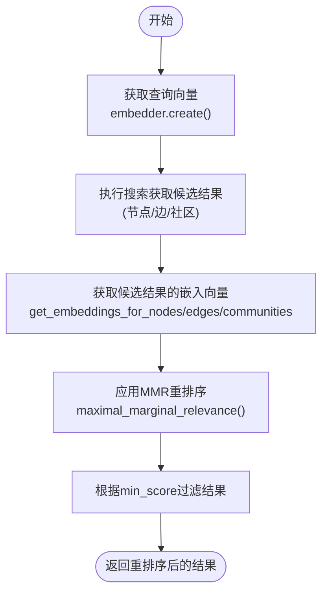

# MMR（最大边际相关性）重排序

<cite>
**本文档引用的文件**   
- [search_utils.py](file://graphiti_core/search/search_utils.py)
- [search.py](file://graphiti_core/search/search.py)
- [search_config.py](file://graphiti_core/search/search_config.py)
- [search_config_recipes.py](file://graphiti_core/search/search_config_recipes.py)
- [helpers.py](file://graphiti_core/helpers.py)
</cite>

## 目录
1. [简介](#简介)
2. [MMR算法原理](#mmr算法原理)
3. [核心实现分析](#核心实现分析)
4. [嵌入向量获取流程](#嵌入向量获取流程)
5. [配置与使用示例](#配置与使用示例)
6. [性能优化建议](#性能优化建议)

## 简介
MMR（最大边际相关性，Maximal Marginal Relevance）是一种在信息检索和重排序中广泛应用的算法，旨在平衡检索结果的相关性与多样性。在Graphiti系统中，MMR被用作一种重排序器（reranker），在语义相似性搜索后对候选结果进行重新排序，以防止结果重复并提高结果的多样性。该机制通过引入冗余性惩罚项，在保持与查询高度相关的同时，确保返回的结果之间具有足够的差异性。

## MMR算法原理
MMR算法的核心思想是在排序过程中同时考虑两个因素：**与查询的相关性**和**与已选结果的冗余性**。其目标是选择那些既与查询高度相关，又与已选结果差异较大的文档或项目。

MMR的评分公式如下：
`MMR = λ * Sim(Query, Candidate) - (1-λ) * max(Sim(Candidate, Selected))`

其中：
- `Sim(Query, Candidate)` 是候选结果与查询的相似度（通常为余弦相似度）
- `max(Sim(Candidate, Selected))` 是候选结果与已选结果集合中最高相似度的值，代表冗余性
- `λ` 是一个介于0和1之间的权重参数，用于在相关性和多样性之间进行权衡

当λ接近1时，算法更注重相关性，排序结果更接近原始的相似度排序；当λ接近0时，算法更注重多样性，会优先选择与已选结果差异大的候选者。

## 核心实现分析
MMR在Graphiti中的实现主要通过`maximal_marginal_relevance`函数完成，该函数负责计算每个候选结果的MMR分数并进行排序。

### MMR函数实现逻辑
`maximal_marginal_relevance`函数的实现逻辑如下：

1.  **输入处理**：函数接收查询向量（`query_vector`）、候选结果及其嵌入向量的字典（`candidates`）、λ参数（`mmr_lambda`）和最小分数阈值（`min_score`）。
2.  **数据准备**：将查询向量和所有候选向量转换为NumPy数组，并对候选向量进行L2归一化，以确保余弦相似度计算的准确性。
3.  **相似度矩阵计算**：构建一个对称的相似度矩阵，计算所有候选结果两两之间的余弦相似度。这一步是计算冗余性惩罚项的基础。
4.  **MMR分数计算**：对每个候选结果，计算其MMR分数。该分数由两部分组成：
    -   **相关性项**：候选结果与查询向量的点积（即余弦相似度，因为向量已归一化）。
    -   **冗余性惩罚项**：候选结果与所有已选结果（在完整实现中，通常是已排在前面的结果）的最大相似度。
5.  **排序与过滤**：根据计算出的MMR分数对所有候选结果进行降序排序，并过滤掉分数低于`min_score`的结果。

**Section sources**
- [search_utils.py](file://graphiti_core/search/search_utils.py#L1837-L1876)

### λ参数的影响
λ参数是控制MMR行为的关键。在Graphiti中，`DEFAULT_MMR_LAMBDA`被设置为0.5，这是一个平衡相关性和多样性的默认值。通过在`SearchConfig`中配置`mmr_lambda`，用户可以根据具体场景调整此参数。例如，在需要高度相关结果的场景下，可以将λ设置为0.8或更高；在需要探索性搜索、希望看到多样化结果的场景下，可以将λ设置为0.3或更低。

**Section sources**
- [search_config.py](file://graphiti_core/search/search_config.py#L25)
- [search_config.py](file://graphiti_core/search/search_config.py#L84)

## 嵌入向量获取流程
在应用MMR之前，系统需要获取查询和候选结果的嵌入向量。这些向量是计算相似度的基础。

### 节点和边的嵌入获取
系统通过`get_embeddings_for_nodes`和`get_embeddings_for_edges`等异步函数从图数据库中批量获取嵌入向量。

-   **节点嵌入获取**：`get_embeddings_for_nodes`函数接收一个节点列表，通过Cypher查询从数据库中获取这些节点的`name_embedding`字段。对于Neptune数据库，嵌入向量以逗号分隔的字符串存储，需要使用`split`函数解析；对于其他数据库，嵌入向量直接以数组形式存储。
-   **边嵌入获取**：`get_embeddings_for_edges`函数的逻辑类似，它获取边的`fact_embedding`字段。该函数还处理了不同图数据库（如Kùzu）的特定查询语法。

这些嵌入向量在获取后会被传递给`maximal_marginal_relevance`函数，用于计算相似度。



**Diagram sources**
- [search_utils.py](file://graphiti_core/search/search_utils.py#L1879-L1996)
- [search.py](file://graphiti_core/search/search.py#L263-L268)

**Section sources**
- [search_utils.py](file://graphiti_core/search/search_utils.py#L1879-L1996)

## 配置与使用示例
MMR重排序器在`SearchConfig`中进行配置，可以应用于节点、边或社区的搜索。

### 配置结构
在`NodeSearchConfig`、`EdgeSearchConfig`和`CommunitySearchConfig`中，`reranker`字段被设置为`NodeReranker.mmr`、`EdgeReranker.mmr`或`CommunityReranker.mmr`，以启用MMR。同时，`mmr_lambda`字段用于指定λ参数。

### 预设配置示例
Graphiti提供了一些预设的搜索配置，其中包含了MMR的使用：

```python
# 对节点进行混合搜索并使用MMR重排序
NODE_HYBRID_SEARCH_MMR = SearchConfig(
    node_config=NodeSearchConfig(
        search_methods=[NodeSearchMethod.bm25, NodeSearchMethod.cosine_similarity],
        reranker=NodeReranker.mmr,
        mmr_lambda=1, # 使用默认的λ值
    )
)

# 对社区进行混合搜索并使用MMR重排序
COMMUNITY_HYBRID_SEARCH_MMR = SearchConfig(
    community_config=CommunitySearchConfig(
        search_methods=[CommunitySearchMethod.bm25, CommunitySearchMethod.cosine_similarity],
        reranker=CommunityReranker.mmr,
    )
)
```

**Section sources**
- [search_config.py](file://graphiti_core/search/search_config.py#L61-L77)
- [search_config_recipes.py](file://graphiti_core/search/search_config_recipes.py#L164-L169)

## 性能优化建议
1.  **合理设置λ值**：避免将λ设置得过低（如接近0），这可能导致高度相关的结果被多样性要求所牺牲。应根据具体应用场景进行调整和测试。
2.  **控制候选集大小**：MMR算法的时间复杂度为O(n²)，其中n是候选结果的数量。因此，应在应用MMR之前，通过初步的相似度搜索或全文搜索将候选集限制在一个合理的范围内（如2*limit），以避免性能瓶颈。
3.  **利用批量操作**：系统通过`get_embeddings_for_nodes`等函数批量获取嵌入向量，这比逐个查询效率更高。确保在实现中充分利用这种批量操作模式。
4.  **监控重排序耗时**：代码中包含了日志记录，可以监控MMR重排序的执行时间。如果发现耗时过长，应检查候选集大小或考虑其他重排序策略。

**Section sources**
- [search_utils.py](file://graphiti_core/search/search_utils.py#L1872)
- [search.py](file://graphiti_core/search/search.py#L205-L207)