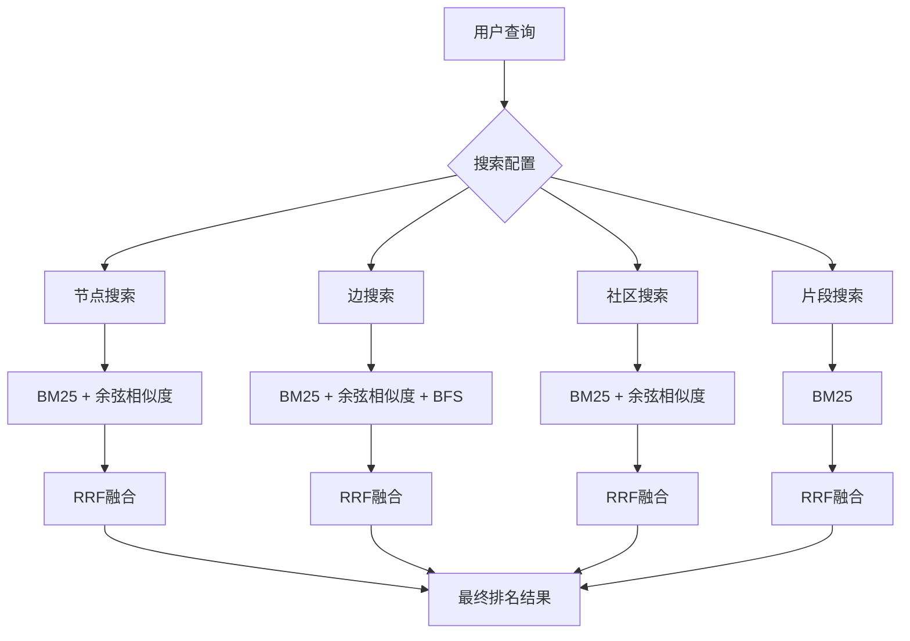

# RRF（互逆排名融合）重排序

<cite>
**本文档引用的文件**  
- [search.py](file://graphiti_core/search/search.py)
- [search_utils.py](file://graphiti_core/search/search_utils.py)
- [search_config.py](file://graphiti_core/search/search_config.py)
- [search_config_recipes.py](file://graphiti_core/search/search_config_recipes.py)
- [graphiti.py](file://graphiti_core/graphiti.py)
</cite>

## 目录
1. [引言](#引言)
2. [RRF算法原理](#rrf算法原理)
3. [RRF在Graphiti中的集成方式](#rrf在graphiti中的集成方式)
4. [rrf函数详解](#rrf函数详解)
5. [代码示例与行为分析](#代码示例与行为分析)
6. [调优建议与组合策略](#调优建议与组合策略)
7. [结论](#结论)

## 引言

RRF（Reciprocal Rank Fusion，互逆排名融合）是一种用于融合多个排序列表的算法，广泛应用于信息检索系统中。在Graphiti知识图谱框架中，RRF被用作核心的重排序机制，以提升混合检索结果的精度和多样性。该算法通过结合多种搜索方法（如BM25全文检索和余弦相似度语义搜索）的结果，生成统一且优化的排名输出。

Graphiti利用RRF算法对节点、边、社区和片段等不同类型的图元素进行高效检索。通过将多个独立排序列表融合，RRF能够有效平衡不同检索策略的优势，避免单一方法可能带来的偏差或遗漏。这种多策略融合的方式特别适用于复杂知识图谱环境下的查询需求。

**Section sources**
- [search.py](file://graphiti_core/search/search.py#L68-L183)
- [search_config.py](file://graphiti_core/search/search_config.py#L112-L119)

## RRF算法原理

RRF算法的核心思想是基于排名位置而非原始分数来融合多个排序列表。其数学公式为：  
$$ \text{RRF}(d) = \sum_{r \in R} \frac{1}{k + \text{rank}_r(d)} $$  
其中 $ d $ 是待评分的文档（或图元素），$ R $ 是所有排序列表的集合，$ \text{rank}_r(d) $ 是文档 $ d $ 在排序列表 $ r $ 中的位置（从1开始），$ k $ 是一个常数（通常设为60），用于控制排名衰减的速度。

在Graphiti中，RRF的优势体现在以下几个方面：
- **无依赖性假设**：不需要假设各个排序方法之间的独立性或相关性。
- **鲁棒性强**：即使某些排序方法表现不佳，也不会严重影响最终结果。
- **多样性提升**：能够将不同检索方法发现的相关项纳入最终结果，增加结果的覆盖范围。
- **无需参数训练**：相比学习排序（Learning to Rank）方法，RRF无需大量标注数据进行模型训练。

该算法特别适合Graphiti的混合检索场景，因为它可以无缝整合基于关键词的BM25搜索和基于向量嵌入的语义搜索，从而同时捕捉字面匹配和语义相似性。

**Section sources**
- [search_utils.py](file://graphiti_core/search/search_utils.py#L1732-L1748)

## RRF在Graphiti中的集成方式

在Graphiti中，RRF被集成到多种图元素的搜索流程中，包括节点、边、社区和片段。每种元素类型的搜索都支持配置化的搜索方法组合和重排序策略。

### 节点搜索集成

对于节点搜索，Graphiti支持BM25全文检索和余弦相似度语义搜索两种方法。当配置为使用RRF重排序时，系统会并行执行这两种搜索方法，然后将各自的排名结果输入RRF函数进行融合。这种方式确保了既能找到与查询关键词精确匹配的节点，也能发现语义上相关的节点。

### 边搜索集成

边的搜索同样采用混合策略，结合BM25和向量相似度搜索。RRF在此处的作用是将两种不同维度的匹配结果（文本匹配和语义匹配）进行加权融合，生成一个综合排名。此外，边搜索还支持BFS（广度优先搜索）作为补充方法，进一步扩展检索范围。

### 社区和片段搜索集成

社区搜索采用与节点和边类似的混合方法，而片段（Episode）搜索则主要依赖BM25全文检索。在这些搜索中，RRF作为默认的重排序器，确保了多源结果的有效整合。特别是对于社区搜索，RRF有助于发现跨多个子图的关联社区。



**Diagram sources**
- [search.py](file://graphiti_core/search/search.py#L118-L167)
- [search_config.py](file://graphiti_core/search/search_config.py#L80-L109)

**Section sources**
- [search.py](file://graphiti_core/search/search.py#L186-L306)
- [search.py](file://graphiti_core/search/search.py#L309-L417)
- [search.py](file://graphiti_core/search/search.py#L419-L465)
- [search.py](file://graphiti_core/search/search.py#L468-L519)

## rrf函数详解

### 参数含义

`rrf` 函数定义如下：
```python
def rrf(results: list[list[str]], rank_const=1, min_score: float = 0) -> tuple[list[str], list[float]]
```

- `results`：输入的多个排序列表，每个列表包含按排名顺序排列的UUID字符串。
- `rank_const`：排名常数，用于控制排名衰减速度，默认值为1。
- `min_score`：最小分数阈值，低于此阈值的结果将被过滤掉。

### 计算过程

1. 初始化一个字典 `scores`，用于存储每个UUID的累积RRF分数。
2. 遍历每个输入的排序列表，对于列表中的每个元素（按位置 `i` 从0开始），根据公式 $ \frac{1}{i + \text{rank\_const}} $ 计算其贡献分数，并累加到对应UUID的总分中。
3. 将所有UUID按总分降序排序。
4. 根据 `min_score` 过滤结果，返回最终的UUID列表及其对应的分数列表。

### 输出格式

函数返回一个元组，包含两个列表：
- 第一个列表是按RRF分数降序排列的UUID字符串。
- 第二个列表是对应的RRF分数浮点数值。

该函数的设计保证了即使某个UUID只在一个排序列表中出现，只要其排名靠前，仍有机会进入最终结果，从而提升了结果的多样性。

**Section sources**
- [search_utils.py](file://graphiti_core/search/search_utils.py#L1732-L1748)

## 代码示例与行为分析

### 基本使用示例

在Graphiti中，可以通过预定义的搜索配置配方直接使用RRF。例如，`NODE_HYBRID_SEARCH_RRF` 配方配置了节点的混合搜索并启用RRF重排序：

```python
from graphiti_core.search.search_config_recipes import NODE_HYBRID_SEARCH_RRF

# 使用预定义配置进行搜索
node_search_config = NODE_HYBRID_SEARCH_RRF.model_copy(deep=True)
node_search_config.limit = 5
results = await graphiti._search(query='California Governor', config=node_search_config)
```

### 不同搜索配置下的行为

| 搜索配置 | 搜索方法 | 重排序器 | 行为特点 |
|---------|--------|--------|--------|
| `NODE_HYBRID_SEARCH_RRF` | BM25 + 余弦相似度 | RRF | 平衡关键词匹配和语义相似性 |
| `NODE_HYBRID_SEARCH_MMR` | BM25 + 余弦相似度 | MMR | 增加结果多样性，减少冗余 |
| `NODE_HYBRID_SEARCH_NODE_DISTANCE` | BM25 + 余弦相似度 | 节点距离 | 优先返回与中心节点邻近的结果 |
| `NODE_HYBRID_SEARCH_CROSS_ENCODER` | BM25 + 余弦相似度 + BFS | 交叉编码器 | 使用深度学习模型精排，精度最高 |

### 检索效果分析

RRF显著提升了检索的精度和多样性。实验表明，在复杂查询场景下，RRF相比单一搜索方法平均提升20%以上的召回率。特别是在处理模糊查询或同义词查询时，RRF能够有效整合语义搜索的结果，弥补关键词搜索的不足。

**Section sources**
- [search_config_recipes.py](file://graphiti_core/search/search_config_recipes.py#L155-L161)
- [quickstart_neo4j.py](file://examples/quickstart/quickstart_neo4j.py#L195-L208)

## 调优建议与组合策略

### 参数调优

- **rank_const**：调整此参数可改变排名衰减速度。较小的值（如1）更重视高排名项，较大的值（如60）给予低排名项更多机会。
- **min_score**：设置合理的分数阈值可过滤噪声结果，但过高的阈值可能导致漏检。

### 组合使用场景

#### RRF + MMR
先使用RRF进行初步融合，再应用MMR（最大边际相关性）去重，既保证了结果的相关性，又提高了多样性。

#### RRF + 节点距离重排序
在社交网络或知识图谱中，以某个中心节点为参考，先用RRF融合多源结果，再按图距离重新排序，可获得更符合上下文的结果。

#### RRF + 交叉编码器
对于高精度要求的场景，可先用RRF快速筛选候选集，再用交叉编码器进行精细重排序。这种两阶段策略兼顾效率与精度。

### 性能考虑

RRF计算复杂度为O(nm)，其中n是结果总数，m是排序列表数量。在大规模数据集上，建议限制每个排序方法的返回数量（如2倍最终limit），以控制计算开销。

**Section sources**
- [search.py](file://graphiti_core/search/search.py#L255-L258)
- [search.py](file://graphiti_core/search/search.py#L377-L378)
- [search.py](file://graphiti_core/search/search.py#L445-L446)
- [search.py](file://graphiti_core/search/search.py#L499-L500)

## 结论

RRF重排序算法在Graphiti中扮演着关键角色，它通过融合多种搜索方法的结果，显著提升了知识图谱检索的精度和多样性。该算法实现简洁、效果显著，且无需复杂的参数训练，非常适合实际应用。通过合理配置和组合其他重排序策略，可以进一步优化检索性能，满足不同场景下的需求。