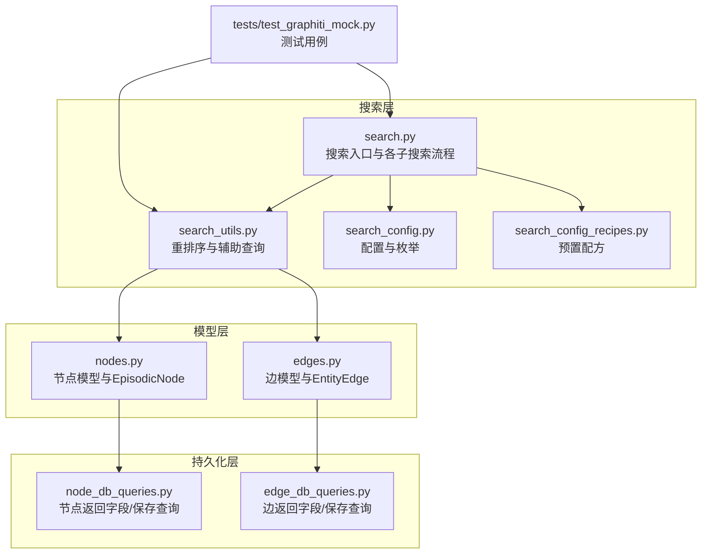
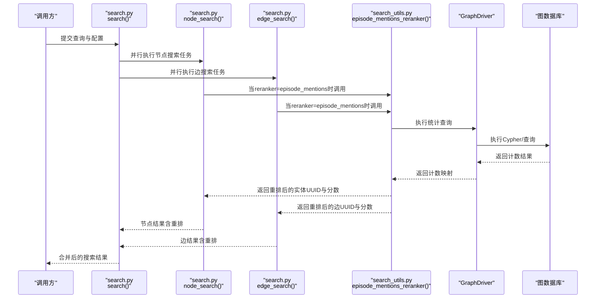
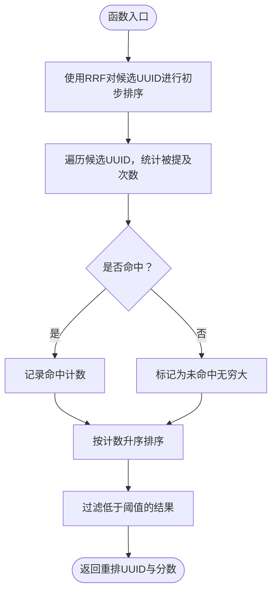
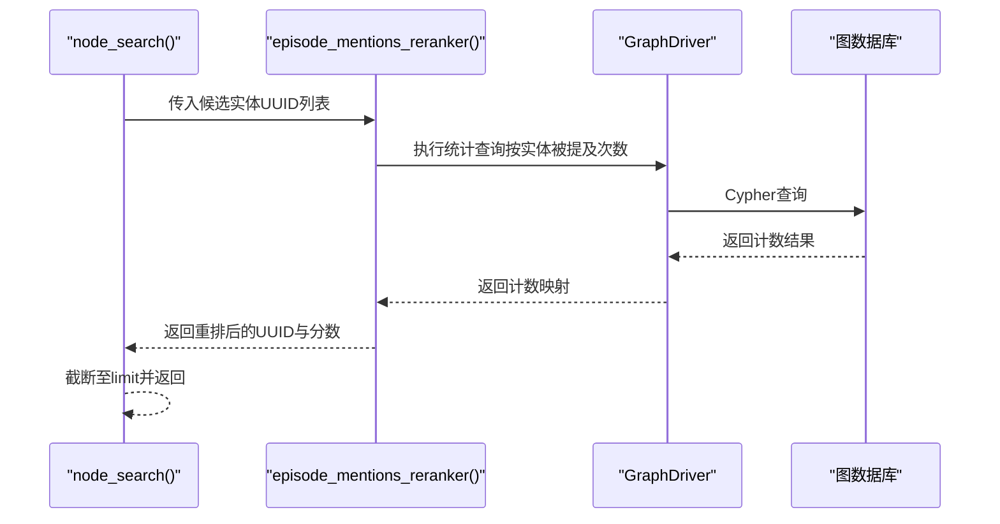
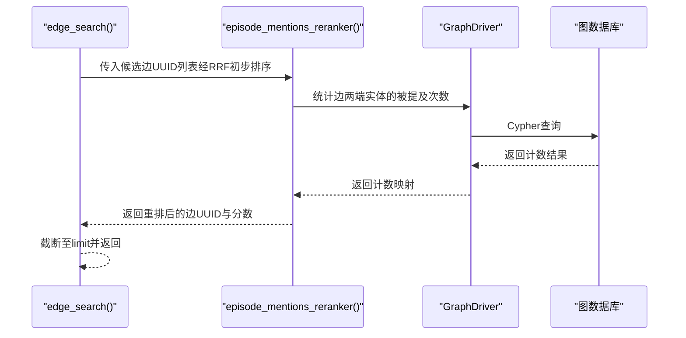
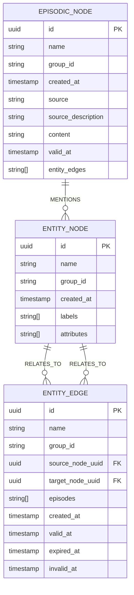
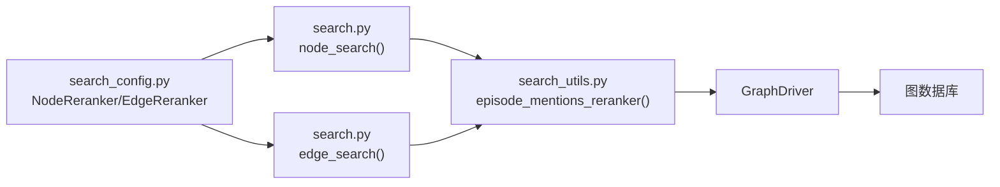

# 片段提及次数重排序

<cite>
**本文引用的文件**
- [graphiti_core/search/search.py](file://graphiti_core/search/search.py)
- [graphiti_core/search/search_utils.py](file://graphiti_core/search/search_utils.py)
- [graphiti_core/search/search_config.py](file://graphiti_core/search/search_config.py)
- [graphiti_core/search/search_config_recipes.py](file://graphiti_core/search/search_config_recipes.py)
- [graphiti_core/nodes.py](file://graphiti_core/nodes.py)
- [graphiti_core/edges.py](file://graphiti_core/edges.py)
- [graphiti_core/models/nodes/node_db_queries.py](file://graphiti_core/models/nodes/node_db_queries.py)
- [graphiti_core/models/edges/edge_db_queries.py](file://graphiti_core/models/edges/edge_db_queries.py)
- [tests/test_graphiti_mock.py](file://tests/test_graphiti_mock.py)
</cite>

## 目录
1. [引言](#引言)
2. [项目结构](#项目结构)
3. [核心组件](#核心组件)
4. [架构总览](#架构总览)
5. [详细组件分析](#详细组件分析)
6. [依赖分析](#依赖分析)
7. [性能考量](#性能考量)
8. [故障排查指南](#故障排查指南)
9. [结论](#结论)
10. [附录](#附录)

## 引言
本文件系统化文档化“基于片段提及次数（Episode Mentions）的重排序策略”。该策略通过统计实体节点或关系边在历史片段（EpisodicNode）中被提及的频次，衡量其在长期记忆中的重要性，并据此提升高频实体的排名。该方法在长期记忆管理、关键实体识别等场景具有显著价值：它能帮助系统优先呈现“被频繁提及”的实体，从而增强检索结果的可解释性和实用性。

本文件重点围绕以下目标展开：
- 解释 episode_mentions_reranker 的实现逻辑与数据来源
- 分析 node_search 与 edge_search 中的调用流程及其对结果显著性的影响
- 结合图数据库查询，说明如何高效统计提及次数
- 讨论与语义相关性策略（如余弦相似度、交叉编码器）的互补关系

## 项目结构
与“片段提及次数重排序”直接相关的代码主要分布在以下模块：
- 搜索入口与各子搜索流程：graphiti_core/search/search.py
- 重排序与辅助查询：graphiti_core/search/search_utils.py
- 搜索配置与枚举：graphiti_core/search/search_config.py、search_config_recipes.py
- 图模型与节点/边定义：graphiti_core/nodes.py、edges.py
- 数据库返回字段与保存查询：models/nodes/node_db_queries.py、models/edges/edge_db_queries.py
- 测试用例：tests/test_graphiti_mock.py

图表来源
- [graphiti_core/search/search.py](file://graphiti_core/search/search.py#L1-L520)
- [graphiti_core/search/search_utils.py](file://graphiti_core/search/search_utils.py#L1-L1996)
- [graphiti_core/search/search_config.py](file://graphiti_core/search/search_config.py#L1-L161)
- [graphiti_core/search/search_config_recipes.py](file://graphiti_core/search/search_config_recipes.py#L1-L224)
- [graphiti_core/nodes.py](file://graphiti_core/nodes.py#L1-L807)
- [graphiti_core/edges.py](file://graphiti_core/edges.py#L1-L632)
- [graphiti_core/models/nodes/node_db_queries.py](file://graphiti_core/models/nodes/node_db_queries.py#L1-L332)
- [graphiti_core/models/edges/edge_db_queries.py](file://graphiti_core/models/edges/edge_db_queries.py#L1-L281)
- [tests/test_graphiti_mock.py](file://tests/test_graphiti_mock.py#L1930-L2069)

章节来源
- [graphiti_core/search/search.py](file://graphiti_core/search/search.py#L1-L520)
- [graphiti_core/search/search_utils.py](file://graphiti_core/search/search_utils.py#L1-L1996)
- [graphiti_core/search/search_config.py](file://graphiti_core/search/search_config.py#L1-L161)
- [graphiti_core/search/search_config_recipes.py](file://graphiti_core/search/search_config_recipes.py#L1-L224)

## 核心组件
- episode_mentions_reranker：按“片段提及次数”对候选实体进行重排的核心函数。其输入为候选实体UUID列表，输出为重排后的UUID序列及对应分数。
- node_search/edge_search：分别在节点与边维度执行混合检索后，根据配置选择重排策略。当 reranker=episode_mentions 时，调用 episode_mentions_reranker。
- EpisodicNode/EntityEdge：图模型中与“片段提及”直接相关的节点与边。EpisodicNode代表历史片段；EntityEdge包含 episodes 字段，记录引用它的片段ID列表。
- 配置枚举：NodeReranker/EdgeReranker 中包含 episode_mentions，用于启用该重排策略。

章节来源
- [graphiti_core/search/search.py](file://graphiti_core/search/search.py#L309-L417)
- [graphiti_core/search/search.py](file://graphiti_core/search/search.py#L186-L307)
- [graphiti_core/search/search_utils.py](file://graphiti_core/search/search_utils.py#L1805-L1836)
- [graphiti_core/search/search_config.py](file://graphiti_core/search/search_config.py#L53-L67)
- [graphiti_core/nodes.py](file://graphiti_core/nodes.py#L295-L433)
- [graphiti_core/edges.py](file://graphiti_core/edges.py#L221-L477)

## 架构总览
下图展示了“片段提及次数重排序”在整体搜索流程中的位置与交互。

图表来源
- [graphiti_core/search/search.py](file://graphiti_core/search/search.py#L186-L307)
- [graphiti_core/search/search.py](file://graphiti_core/search/search.py#L309-L417)
- [graphiti_core/search/search_utils.py](file://graphiti_core/search/search_utils.py#L1805-L1836)

## 详细组件分析

### 组件A：episode_mentions_reranker 实现与数据流
- 输入：候选实体UUID列表（来自初步检索结果的合并），以及最小阈值 min_score。
- 处理步骤：
  1) 使用 rrf 对候选集合进行初步排序（保持相对顺序一致性）。
  2) 针对每个候选实体UUID，向图数据库发起统计查询，计算“该实体在多少个片段中被提及”，即统计与 EpisodicNode 的 MENTIONS 关系数量。
  3) 将未命中的实体赋予一个特殊分值（文中注释为“无穷大”，实际实现中以“未命中”处理），以便在排序时将其排到末尾。
  4) 按统计计数升序排序（计数越小，表示被提及越少，得分越低；计数越大，表示被提及越多，得分越高）。
  5) 过滤掉低于 min_score 的结果，返回重排后的UUID序列与对应分数。
- 输出：重排后的实体UUID列表与分数列表。

图表来源
- [graphiti_core/search/search_utils.py](file://graphiti_core/search/search_utils.py#L1805-L1836)

章节来源
- [graphiti_core/search/search_utils.py](file://graphiti_core/search/search_utils.py#L1805-L1836)

### 组件B：node_search 中的调用流程与影响
- 当 NodeReranker=episode_mentions 时，node_search 不再使用传统的语义相似度或交叉编码器，而是直接调用 episode_mentions_reranker。
- 其他重排策略（如 rrf、mmr、cross_encoder、node_distance）仍可选，但一旦启用 episode_mentions，则会绕过这些策略，直接依据“提及次数”进行重排。
- 影响：在“高频实体优先”的场景下，该策略能显著提升“被多次提及”的实体的显著性，适合长期记忆管理与关键实体识别。

图表来源
- [graphiti_core/search/search.py](file://graphiti_core/search/search.py#L309-L417)
- [graphiti_core/search/search_utils.py](file://graphiti_core/search/search_utils.py#L1805-L1836)

章节来源
- [graphiti_core/search/search.py](file://graphiti_core/search/search.py#L309-L417)

### 组件C：edge_search 中的调用流程与影响
- 当 EdgeReranker=episode_mentions 时，edge_search 会先对候选边进行初步排序（通常使用 rrf），然后对每条边的两端实体进行“提及次数统计”，最终按统计计数升序排序。
- 注意：该策略在边维度上并不直接统计边本身的提及次数，而是通过边连接的实体的“被提及次数”作为排序依据。这与节点维度的策略一致，强调“实体的重要性”。

图表来源
- [graphiti_core/search/search.py](file://graphiti_core/search/search.py#L186-L307)
- [graphiti_core/search/search_utils.py](file://graphiti_core/search/search_utils.py#L1805-L1836)

章节来源
- [graphiti_core/search/search.py](file://graphiti_core/search/search.py#L186-L307)

### 组件D：数据模型与图查询要点
- EpisodicNode：代表历史片段，包含 content、valid_at 等字段；在查询中常通过 MENTIONS 关系连接到实体节点。
- EntityEdge：代表实体间的关系，包含 episodes 字段，记录引用它的片段ID列表。该字段在某些驱动下可能以逗号分隔字符串形式存储，需注意解析。
- 查询返回字段：节点与边的返回查询中包含必要的字段，确保重排所需的计数信息能够被正确获取。

图表来源
- [graphiti_core/nodes.py](file://graphiti_core/nodes.py#L295-L433)
- [graphiti_core/edges.py](file://graphiti_core/edges.py#L221-L477)
- [graphiti_core/models/nodes/node_db_queries.py](file://graphiti_core/models/nodes/node_db_queries.py#L104-L127)
- [graphiti_core/models/edges/edge_db_queries.py](file://graphiti_core/models/edges/edge_db_queries.py#L187-L223)

章节来源
- [graphiti_core/nodes.py](file://graphiti_core/nodes.py#L295-L433)
- [graphiti_core/edges.py](file://graphiti_core/edges.py#L221-L477)
- [graphiti_core/models/nodes/node_db_queries.py](file://graphiti_core/models/nodes/node_db_queries.py#L104-L127)
- [graphiti_core/models/edges/edge_db_queries.py](file://graphiti_core/models/edges/edge_db_queries.py#L187-L223)

### 组件E：与语义相关性策略的互补关系
- 语义相关性策略（如余弦相似度、MMR、交叉编码器）侧重于“内容语义匹配程度”，而“片段提及次数重排序”侧重于“长期记忆中的重要性”。
- 在混合场景中，建议：
  - 先用语义策略（如 bm25/cosine_similarity）进行初步检索，得到候选集；
  - 再用 episode_mentions_reranker 做二次重排，将“被频繁提及”的实体/边提升到更显著的位置；
  - 或者将两种策略结合（例如先 rrf 融合多路检索，再用 episode_mentions 重排），以兼顾覆盖面与显著性。
- 该组合方式在长期记忆管理、关键实体识别、知识图谱问答等场景尤为有效。

章节来源
- [graphiti_core/search/search.py](file://graphiti_core/search/search.py#L186-L307)
- [graphiti_core/search/search.py](file://graphiti_core/search/search.py#L309-L417)
- [graphiti_core/search/search_config_recipes.py](file://graphiti_core/search/search_config_recipes.py#L134-L186)

## 依赖分析
- episode_mentions_reranker 依赖 GraphDriver 执行 Cypher 查询，统计每个候选实体在 EpisodicNode 中的提及次数。
- node_search/edge_search 在配置为 episode_mentions 时，直接委托给 episode_mentions_reranker，不再使用其他重排策略。
- 配置层通过 NodeReranker/EdgeReranker 枚举启用该策略，recipes 提供了预置配方便于快速使用。

图表来源
- [graphiti_core/search/search_config.py](file://graphiti_core/search/search_config.py#L53-L67)
- [graphiti_core/search/search.py](file://graphiti_core/search/search.py#L186-L307)
- [graphiti_core/search/search.py](file://graphiti_core/search/search.py#L309-L417)
- [graphiti_core/search/search_utils.py](file://graphiti_core/search/search_utils.py#L1805-L1836)

章节来源
- [graphiti_core/search/search_config.py](file://graphiti_core/search/search_config.py#L53-L67)
- [graphiti_core/search/search.py](file://graphiti_core/search/search.py#L186-L307)
- [graphiti_core/search/search.py](file://graphiti_core/search/search.py#L309-L417)
- [graphiti_core/search/search_utils.py](file://graphiti_core/search/search_utils.py#L1805-L1836)

## 性能考量
- 统计复杂度：对每个候选实体执行一次 Cypher 计数查询，整体复杂度约为 O(k)，k 为候选实体数量。若候选集较大，建议限制 limit 并在上层阶段做预筛选。
- 数据库侧优化：
  - 确保 EpisodicNode 与 EntityNode 之间的 MENTIONS 关系建立索引或具备合适的查询路径。
  - 对 group_id、valid_at 等常用过滤条件建立索引，减少扫描范围。
- 并发与批处理：在 node_search/edge_search 中已采用并发执行多路检索，episode_mentions_reranker 可在单次查询中批量统计，避免逐条查询带来的延迟。
- 分数阈值：合理设置 reranker_min_score，有助于减少后续排序与截断的成本。

## 故障排查指南
- 现象：episode_mentions_reranker 返回空或异常
  - 排查点：
    - 确认候选实体UUID是否存在于图中；
    - 检查 EpisodicNode 与 EntityNode 是否通过 MENTIONS 关系正确连接；
    - 检查驱动返回的 episodes 字段格式（某些驱动可能为逗号分隔字符串，需注意解析）。
- 现象：重排结果不符合预期
  - 排查点：
    - 确认配置中 reranker 已设为 episode_mentions；
    - 检查是否与其他重排策略（如 rrf、mmr、cross_encoder）同时启用导致覆盖；
    - 查看测试用例中对“未命中实体”的处理逻辑，确认是否符合预期。
- 参考测试用例：
  - 测试用例验证了 episode_mentions_reranker 的基本行为：对有提及的实体返回计数，对未提及的实体返回“无穷大”分值，并按分值升序排列。

章节来源
- [tests/test_graphiti_mock.py](file://tests/test_graphiti_mock.py#L1930-L1986)
- [graphiti_core/search/search_utils.py](file://graphiti_core/search/search_utils.py#L1805-L1836)

## 结论
“片段提及次数重排序”通过统计实体在历史片段中的被提及频次，将“长期记忆中的重要实体”提升到更显著的位置，适用于长期记忆管理与关键实体识别等场景。在 node_search 与 edge_search 中，该策略可与语义相关性策略互补：前者强调“被提及次数”，后者强调“语义匹配度”。通过合理的配置与调用流程，可在保证覆盖面的同时提升显著性，从而改善检索结果的质量与可解释性。

## 附录
- 预置配方参考：
  - 节点/边混合搜索并启用 episode_mentions 的配方位于 recipes 文件中，便于快速集成到业务流程。

章节来源
- [graphiti_core/search/search_config_recipes.py](file://graphiti_core/search/search_config_recipes.py#L134-L186)