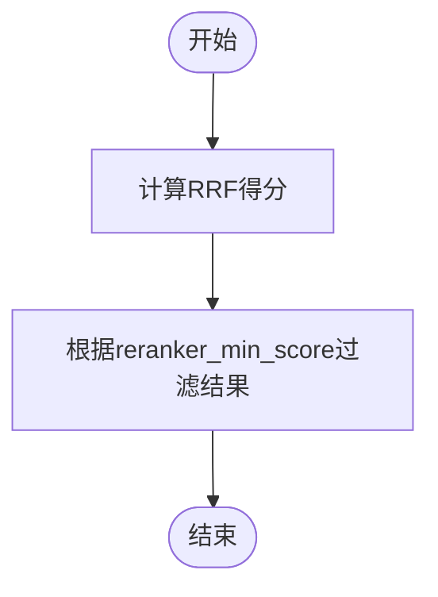
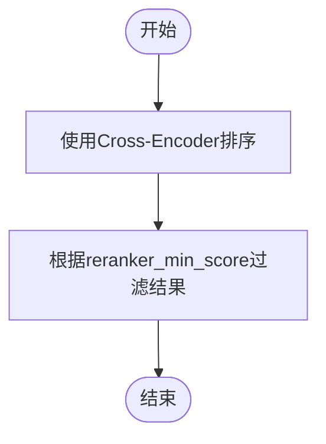
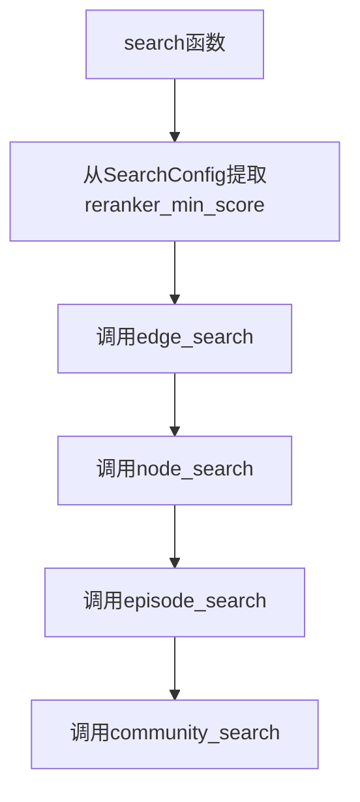
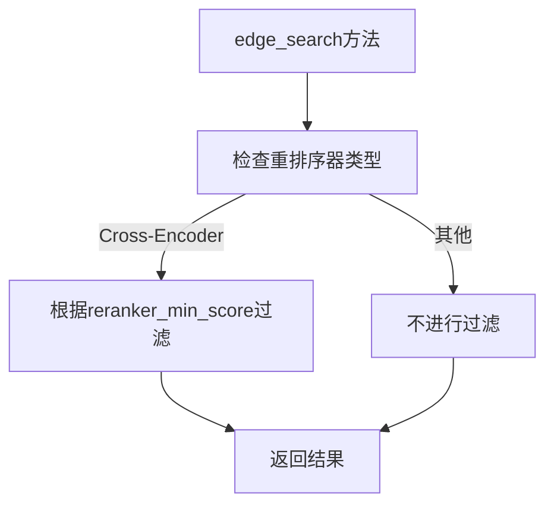

# 重排序最小分数过滤

<cite>
**本文档引用的文件**
- [search.py](file://graphiti_core/search/search.py)
- [search_config.py](file://graphiti_core/search/search_config.py)
- [search_utils.py](file://graphiti_core/search/search_utils.py)
- [client.py](file://graphiti_core/cross_encoder/client.py)
</cite>

## 目录
1. [介绍](#介绍)
2. [核心组件](#核心组件)
3. [重排序策略中的最小分数过滤机制](#重排序策略中的最小分数过滤机制)
4. [参数传递与应用逻辑](#参数传递与应用逻辑)
5. [精度与召回率的平衡](#精度与召回率的平衡)
6. [典型配置值与调优指南](#典型配置值与调优指南)
7. [异常处理与结果质量保障](#异常处理与结果质量保障)
8. [结论](#结论)

## 介绍
`reranker_min_score` 参数在 Graphiti 的重排序流程中起着关键的过滤作用，用于过滤掉低质量的候选结果。该参数应用于所有重排序策略（包括 RRF、MMR 和 Cross-Encoder）的输出结果，确保只有得分高于指定阈值的候选被保留。本文档详细说明了该参数在 `search` 函数和具体搜索方法（如 `edge_search`、`node_search` 等）中的传递与应用逻辑，讨论其对检索结果精度与召回率的影响，并提供配置建议和异常处理机制。

## 核心组件
`reranker_min_score` 参数是 `SearchConfig` 类的一个字段，定义在 `search_config.py` 文件中。它作为搜索配置的一部分，被传递给各种搜索方法，并在重排序阶段用于过滤低分候选。该参数的默认值为 0，意味着在没有显式设置的情况下，所有候选都将被保留。

**Section sources**
- [search_config.py](file://graphiti_core/search/search_config.py#L118)

## 重排序策略中的最小分数过滤机制
在 Graphiti 中，`reranker_min_score` 参数被应用于多种重排序策略，包括 RRF、MMR 和 Cross-Encoder。每种策略在计算候选得分后，都会使用该阈值来过滤掉低于指定分数的低质量候选。

### RRF 重排序
在 RRF（Reciprocal Rank Fusion）重排序中，`reranker_min_score` 参数用于过滤最终的排序结果。RRF 算法通过融合多个排序列表的排名来计算每个候选的综合得分，然后根据 `reranker_min_score` 阈值过滤掉得分低于该值的候选。

**Diagram sources**
- [search_utils.py](file://graphiti_core/search/search_utils.py#L1732-L1748)

### MMR 重排序
在 MMR（Maximal Marginal Relevance）重排序中，`reranker_min_score` 参数同样用于过滤最终的排序结果。MMR 算法在考虑相关性和多样性的基础上计算每个候选的得分，然后根据 `reranker_min_score` 阈值进行过滤。

**Diagram sources**
- [search_utils.py](file://graphiti_core/search/search_utils.py#L1732-L1748)

### Cross-Encoder 重排序
在 Cross-Encoder 重排序中，`reranker_min_score` 参数用于过滤由交叉编码器模型生成的排序结果。交叉编码器模型对查询和候选进行联合编码，生成相关性得分，然后根据 `reranker_min_score` 阈值过滤掉低分候选。

**Diagram sources**
- [search.py](file://graphiti_core/search/search.py#L272-L275)

## 参数传递与应用逻辑
`reranker_min_score` 参数在 `search` 函数中被初始化，并传递给具体的搜索方法（如 `edge_search`、`node_search` 等）。这些搜索方法在执行重排序时，会使用该参数来过滤低分候选。

### search 函数
`search` 函数是搜索流程的入口，它接收 `SearchConfig` 对象作为参数，从中提取 `reranker_min_score` 值，并将其传递给具体的搜索方法。

**Diagram sources**
- [search.py](file://graphiti_core/search/search.py#L68-L183)

### 具体搜索方法
具体的搜索方法（如 `edge_search`、`node_search` 等）在执行重排序时，会使用 `reranker_min_score` 参数来过滤低分候选。例如，在 `edge_search` 方法中，如果使用 Cross-Encoder 重排序，则会根据 `reranker_min_score` 阈值过滤掉得分低于该值的边。

**Diagram sources**
- [search.py](file://graphiti_core/search/search.py#L272-L275)

## 精度与召回率的平衡
`reranker_min_score` 参数的设置直接影响检索结果的精度和召回率。较高的阈值可以提高精度，但可能会降低召回率；较低的阈值可以提高召回率，但可能会降低精度。因此，需要根据具体应用场景来调整该参数，以达到最佳的平衡。

## 典型配置值与调优指南
在实际应用中，`reranker_min_score` 的典型配置值通常在 0.5 到 0.8 之间。对于需要高精度的应用场景，可以设置较高的阈值；对于需要高召回率的应用场景，可以设置较低的阈值。建议通过实验和评估来确定最佳的配置值。

## 异常处理与结果质量保障
在重排序过程中，如果 `reranker_min_score` 参数设置不当，可能会导致结果质量下降。例如，过高的阈值可能导致没有候选被保留，从而返回空结果。因此，需要在代码中加入适当的异常处理机制，以确保结果的质量。

**Section sources**
- [errors.py](file://graphiti_core/errors.py#L62-L67)

## 结论
`reranker_min_score` 参数在 Graphiti 的重排序流程中起着至关重要的作用，用于过滤掉低质量的候选结果。通过合理设置该参数，可以在精度和召回率之间取得良好的平衡，从而提高检索结果的质量。在实际应用中，需要根据具体需求进行调优，并结合异常处理机制来保障结果的可靠性。