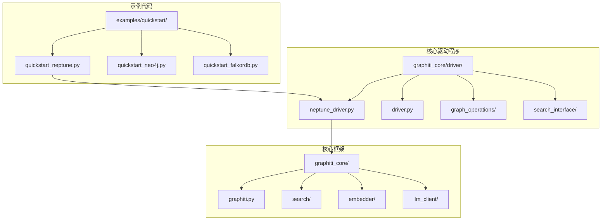
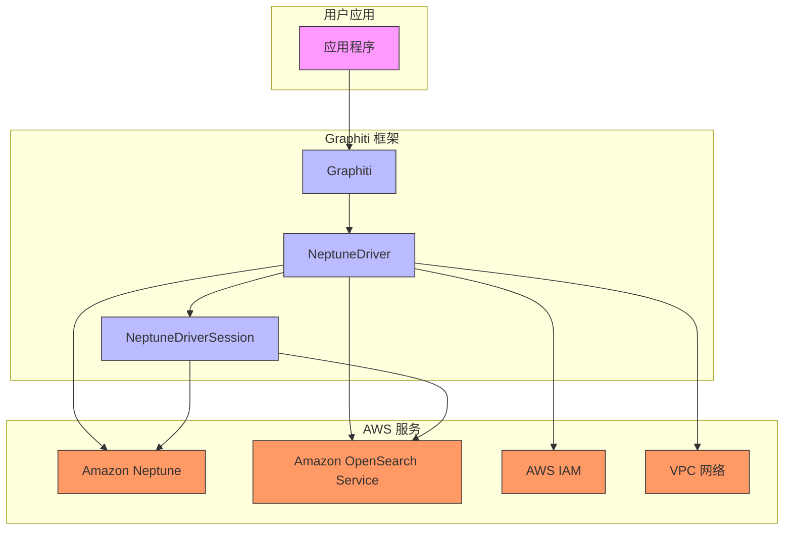
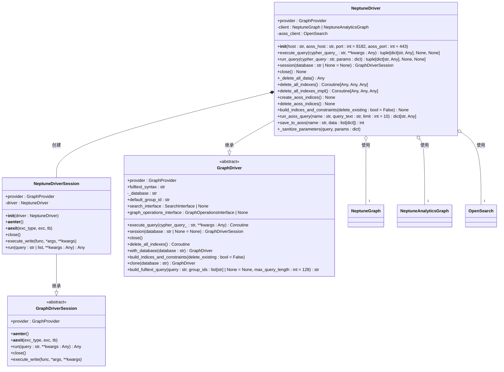
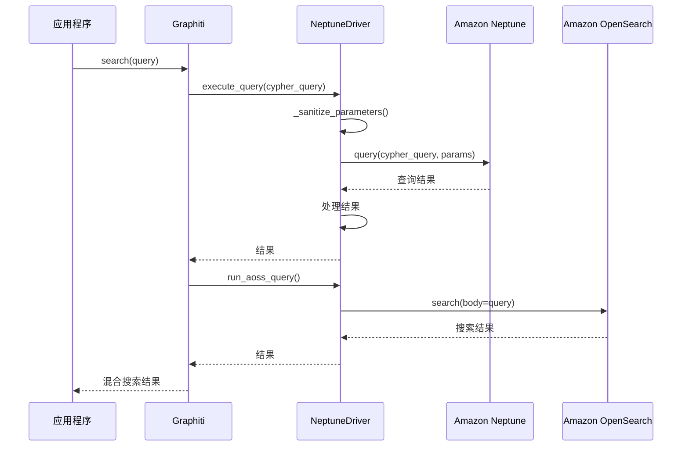
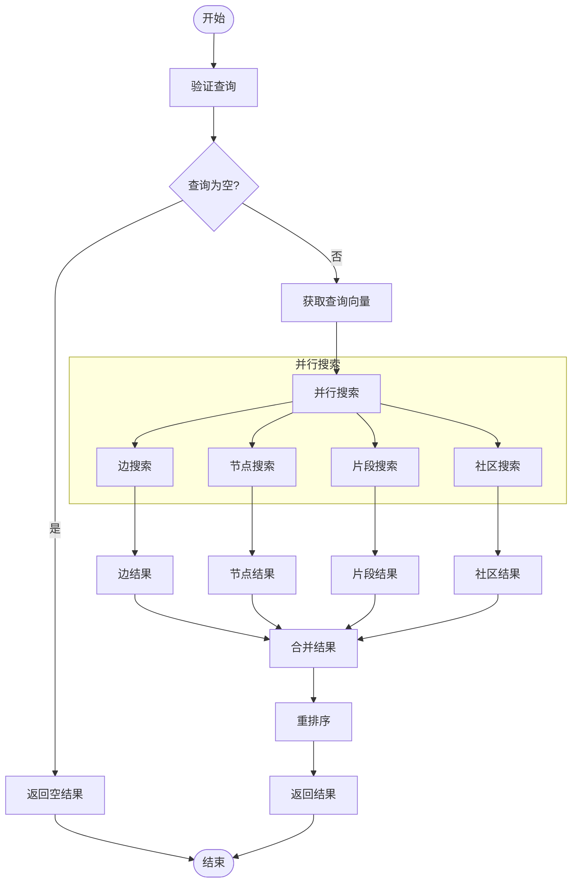
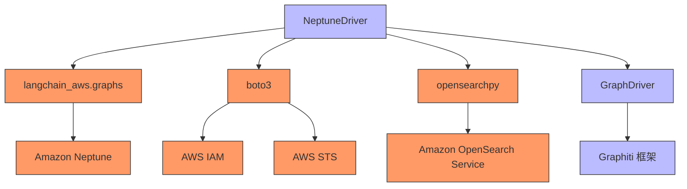

# Amazon Neptune 集成

<cite>
**本文档引用的文件**   
- [neptune_driver.py](file://graphiti_core/driver/neptune_driver.py)
- [quickstart_neptune.py](file://examples/quickstart/quickstart_neptune.py)
- [driver.py](file://graphiti_core/driver/driver.py)
- [graphiti.py](file://graphiti_core/graphiti.py)
- [search.py](file://graphiti_core/search/search.py)
- [errors.py](file://graphiti_core/errors.py)
</cite>

## 目录
1. [简介](#简介)
2. [项目结构](#项目结构)
3. [核心组件](#核心组件)
4. [架构概述](#架构概述)
5. [详细组件分析](#详细组件分析)
6. [依赖分析](#依赖分析)
7. [性能考虑](#性能考虑)
8. [故障排除指南](#故障排除指南)
9. [结论](#结论)

## 简介
Amazon Neptune 集成文档全面介绍了 NeptuneDriver 的架构设计与云原生特性支持。该驱动程序为 Graphiti 框架提供了与 Amazon Neptune 图数据库的无缝集成能力，支持通过 Gremlin 或 Cypher 接口进行图数据操作。NeptuneDriver 充分利用了 AWS 生态系统的优势，实现了高可用性、持久化存储和跨区域复制等企业级功能。通过集成 Amazon OpenSearch Service (AOSS)，该驱动程序提供了强大的全文搜索和混合搜索能力，结合语义相似性和 BM25 文本检索技术，实现了高效的图数据查询。文档详细说明了连接配置、VPC 网络设置、查询性能调优、成本控制策略及故障恢复机制，为大规模分布式图数据处理提供了完整的解决方案。

## 项目结构
项目结构清晰地组织了 Neptune 集成相关的代码和示例。核心的 Neptune 驱动程序实现位于 `graphiti_core/driver/` 目录下，而使用示例则位于 `examples/quickstart/` 目录中。这种分离的设计使得核心功能与使用示例解耦，便于维护和扩展。

**Diagram sources**
- [neptune_driver.py](file://graphiti_core/driver/neptune_driver.py#L1-L306)
- [quickstart_neptune.py](file://examples/quickstart/quickstart_neptune.py#L1-L253)

**Section sources**
- [neptune_driver.py](file://graphiti_core/driver/neptune_driver.py#L1-L306)
- [quickstart_neptune.py](file://examples/quickstart/quickstart_neptune.py#L1-L253)

## 核心组件
Neptune 集成的核心组件包括 `NeptuneDriver` 类和 `NeptuneDriverSession` 类，它们共同实现了与 Amazon Neptune 数据库的交互。`NeptuneDriver` 类负责管理数据库连接、执行查询、处理索引和约束，而 `NeptuneDriverSession` 类则提供了异步上下文管理器，确保资源的正确释放。驱动程序通过 `langchain_aws.graphs` 库与 Neptune 进行通信，并利用 `boto3` 和 `opensearchpy` 库与 Amazon OpenSearch Service (AOSS) 进行集成，实现了混合搜索功能。`NeptuneDriver` 类还实现了 `GraphDriver` 抽象基类，确保了与 Graphiti 框架其他部分的兼容性。

**Section sources**
- [neptune_driver.py](file://graphiti_core/driver/neptune_driver.py#L109-L306)
- [driver.py](file://graphiti_core/driver/driver.py#L73-L116)

## 架构概述
Amazon Neptune 集成的架构设计充分利用了 AWS 云平台的原生服务，构建了一个高性能、可扩展的图数据处理系统。该架构的核心是 `NeptuneDriver`，它作为 Graphiti 框架与 Amazon Neptune 数据库之间的桥梁。`NeptuneDriver` 通过 `langchain_aws.graphs` 库与 Neptune 进行通信，支持 Gremlin 和 Cypher 查询语言。为了实现高效的全文搜索，驱动程序集成了 Amazon OpenSearch Service (AOSS)，通过 `opensearchpy` 库进行数据索引和查询。`Graphiti` 类作为高层接口，封装了 `NeptuneDriver` 的复杂性，为用户提供了一个简洁的 API 来进行图数据操作。

**Diagram sources**
- [neptune_driver.py](file://graphiti_core/driver/neptune_driver.py#L109-L306)
- [graphiti.py](file://graphiti_core/graphiti.py#L128-L200)

## 详细组件分析
### NeptuneDriver 分析
`NeptuneDriver` 类是 Amazon Neptune 集成的核心，它实现了 `GraphDriver` 抽象基类，提供了与 Neptune 数据库交互的所有必要方法。该类的初始化方法根据提供的主机地址前缀（`neptune-db://` 或 `neptune-graph://`）来区分 Neptune 数据库集群和 Neptune Analytics 图，从而创建相应的客户端实例。驱动程序通过 `boto3` 会话获取 AWS 凭证，并使用 `Urllib3AWSV4SignerAuth` 进行签名，确保了与 AOSS 的安全通信。

#### 类图

**Diagram sources**
- [neptune_driver.py](file://graphiti_core/driver/neptune_driver.py#L109-L306)
- [driver.py](file://graphiti_core/driver/driver.py#L73-L116)

#### 查询执行序列图

**Diagram sources**
- [neptune_driver.py](file://graphiti_core/driver/neptune_driver.py#L191-L212)
- [search.py](file://graphiti_core/search/search.py#L68-L183)

### 混合搜索流程分析
Graphiti 框架的混合搜索功能结合了语义相似性和 BM25 文本检索技术，通过 `search` 函数实现。该流程首先对查询进行向量化，然后并行执行边、节点、片段和社区的搜索，最后将结果进行融合和重排序。

#### 混合搜索流程图

**Diagram sources**
- [search.py](file://graphiti_core/search/search.py#L68-L183)
- [neptune_driver.py](file://graphiti_core/driver/neptune_driver.py#L252-L274)

**Section sources**
- [neptune_driver.py](file://graphiti_core/driver/neptune_driver.py#L109-L306)
- [search.py](file://graphiti_core/search/search.py#L68-L183)

## 依赖分析
Neptune 集成依赖于多个关键的外部库和 AWS 服务。`langchain_aws.graphs` 库提供了与 Amazon Neptune 的基本连接和查询功能，`boto3` 库用于 AWS 凭证管理和服务调用，`opensearchpy` 库则用于与 Amazon OpenSearch Service 的集成。这些依赖关系确保了驱动程序能够充分利用 AWS 云平台的原生功能，实现高可用性、安全性和可扩展性。

**Diagram sources**
- [neptune_driver.py](file://graphiti_core/driver/neptune_driver.py#L23-L28)
- [driver.py](file://graphiti_core/driver/driver.py#L27-L28)

**Section sources**
- [neptune_driver.py](file://graphiti_core/driver/neptune_driver.py#L23-L28)
- [driver.py](file://graphiti_core/driver/driver.py#L27-L28)

## 性能考虑
在大规模分布式图数据处理中，性能优化至关重要。NeptuneDriver 通过多种机制来确保高性能。首先，它利用了 Amazon Neptune 的自动扩展能力，可以根据负载动态调整计算和存储资源。其次，通过集成 Amazon OpenSearch Service，实现了高效的全文搜索和混合搜索，避免了在图数据库中进行昂贵的全文扫描。此外，驱动程序在执行查询时对参数进行了适当的清理和转换，特别是对 `datetime` 对象的处理，确保了查询的正确性和效率。在索引管理方面，`build_indices_and_constraints` 方法可以创建和删除 AOSS 索引，优化查询性能。

## 故障排除指南
在使用 Amazon Neptune 集成时，可能会遇到一些常见的问题。`errors.py` 文件定义了多种异常类型，如 `EdgeNotFoundError`、`NodeNotFoundError` 和 `SearchRerankerError`，这些异常可以帮助开发者快速定位和解决问题。在连接配置方面，确保 `NEPTUNE_HOST` 和 `AOSS_HOST` 环境变量正确设置是关键。如果遇到查询执行错误，应检查查询语句的语法和参数类型，特别是 `datetime` 对象的格式。对于性能问题，可以检查 AOSS 索引的配置和查询的复杂度，必要时调整索引策略或优化查询语句。

**Section sources**
- [errors.py](file://graphiti_core/errors.py#L1-L84)
- [neptune_driver.py](file://graphiti_core/driver/neptune_driver.py#L202-L210)

## 结论
Amazon Neptune 集成通过 `NeptuneDriver` 提供了强大的图数据处理能力，充分利用了 AWS 云平台的原生服务，实现了高可用性、持久化存储和跨区域复制等企业级功能。该驱动程序的设计充分考虑了云原生特性，通过与 Amazon OpenSearch Service 的集成，实现了高效的混合搜索。文档详细介绍了连接配置、VPC 网络设置、查询性能调优、成本控制策略及故障恢复机制，为开发者提供了全面的指导。未来的工作可以进一步优化查询性能，探索更多 AWS 服务的集成，如 Amazon CloudWatch 用于监控和日志记录，以及 AWS Lambda 用于无服务器计算。