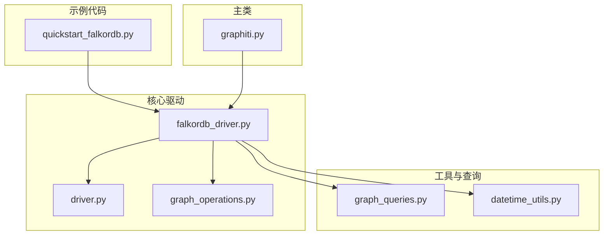
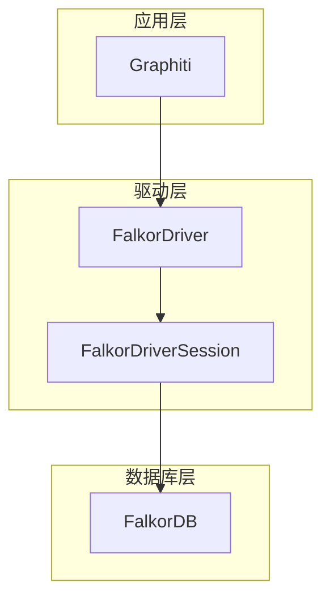
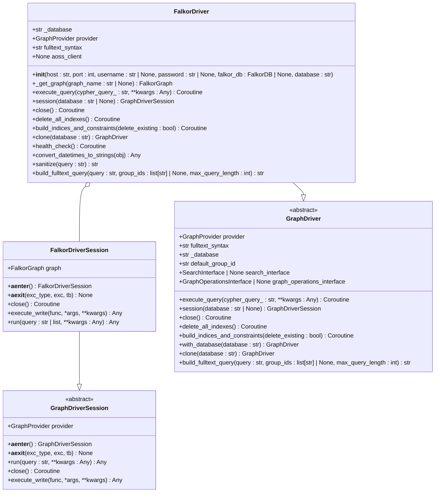
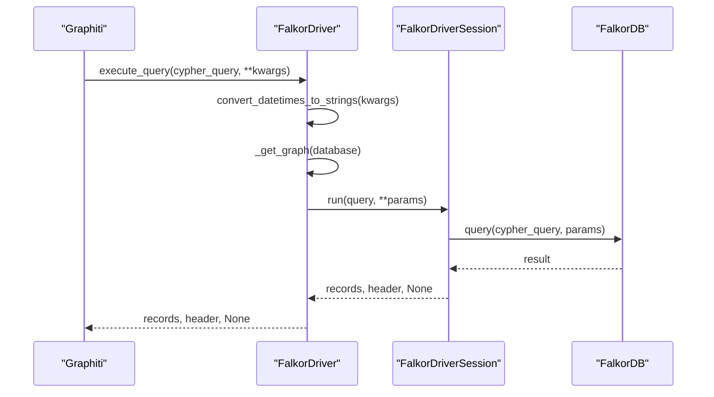
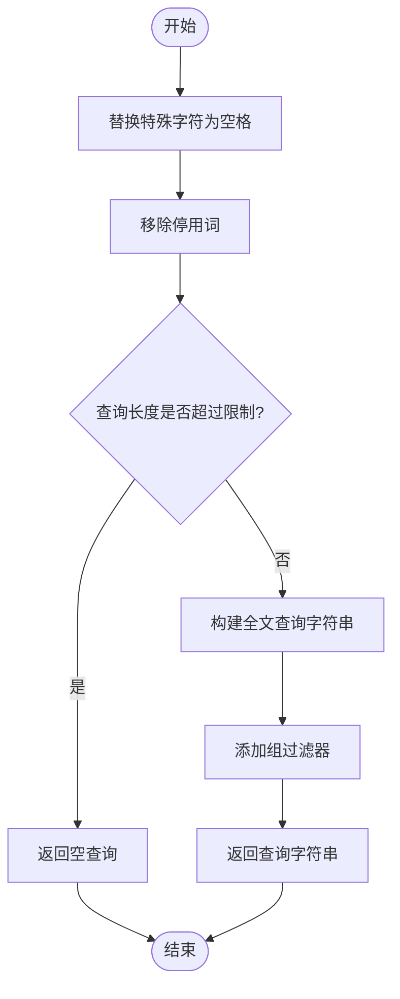
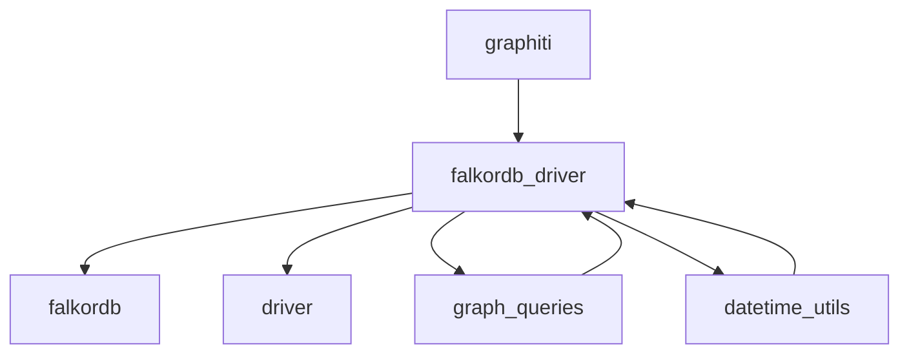

# FalkorDB 集成

<cite>
**本文档中引用的文件**   
- [falkordb_driver.py](file://graphiti_core/driver/falkordb_driver.py)
- [driver.py](file://graphiti_core/driver/driver.py)
- [graph_operations.py](file://graphiti_core/driver/graph_operations/graph_operations.py)
- [quickstart_falkordb.py](file://examples/quickstart/quickstart_falkordb.py)
- [graph_queries.py](file://graphiti_core/graph_queries.py)
- [datetime_utils.py](file://graphiti_core/utils/datetime_utils.py)
- [graphiti.py](file://graphiti_core/graphiti.py)
</cite>

## 目录
1. [简介](#简介)
2. [项目结构](#项目结构)
3. [核心组件](#核心组件)
4. [架构概述](#架构概述)
5. [详细组件分析](#详细组件分析)
6. [依赖分析](#依赖分析)
7. [性能考虑](#性能考虑)
8. [故障排除指南](#故障排除指南)
9. [结论](#结论)

## 简介
本文档深入解析了FalkorDB集成的实现机制，重点阐述了FalkorDBDriver如何通过Redis模块执行图操作。文档详细说明了如何利用FalkorDB的Cypher兼容接口进行节点和边的增删改查操作，并介绍了其内置的全文索引能力。同时，文档还涵盖了会话管理、查询执行流程以及与GraphOperationsInterface的交互细节。此外，提供了连接配置、内存优化和高并发场景下的调优策略，并分析了FalkorDB在轻量级部署和快速原型开发中的优势与局限性。

## 项目结构
项目结构清晰地组织了FalkorDB集成相关的代码文件。核心驱动程序位于`graphiti_core/driver/`目录下，其中`falkordb_driver.py`文件实现了FalkorDB的具体驱动逻辑。`driver.py`文件定义了通用的驱动接口和会话管理机制。`graph_operations.py`文件定义了图操作的接口，用于更新图的变更行为。示例代码位于`examples/quickstart/`目录下，其中`quickstart_falkordb.py`文件展示了如何快速开始使用FalkorDB。工具函数和查询生成器分别位于`utils/`和`graph_queries.py`文件中。

**图源**
- [falkordb_driver.py](file://graphiti_core/driver/falkordb_driver.py)
- [driver.py](file://graphiti_core/driver/driver.py)
- [graph_operations.py](file://graphiti_core/driver/graph_operations/graph_operations.py)
- [quickstart_falkordb.py](file://examples/quickstart/quickstart_falkordb.py)
- [graph_queries.py](file://graphiti_core/graph_queries.py)
- [datetime_utils.py](file://graphiti_core/utils/datetime_utils.py)
- [graphiti.py](file://graphiti_core/graphiti.py)

**节源**
- [falkordb_driver.py](file://graphiti_core/driver/falkordb_driver.py)
- [driver.py](file://graphiti_core/driver/driver.py)
- [graph_operations.py](file://graphiti_core/driver/graph_operations/graph_operations.py)
- [quickstart_falkordb.py](file://examples/quickstart/quickstart_falkordb.py)
- [graph_queries.py](file://graphiti_core/graph_queries.py)
- [datetime_utils.py](file://graphiti_core/utils/datetime_utils.py)
- [graphiti.py](file://graphiti_core/graphiti.py)

## 核心组件
FalkorDB集成的核心组件包括FalkorDriver、FalkorDriverSession和GraphOperationsInterface。FalkorDriver负责管理与FalkorDB的连接，执行查询和管理索引。FalkorDriverSession提供了异步上下文管理器，用于执行写操作和运行查询。GraphOperationsInterface定义了图操作的接口，允许自定义节点和边的保存、删除和加载嵌入向量的行为。

**节源**
- [falkordb_driver.py](file://graphiti_core/driver/falkordb_driver.py)
- [driver.py](file://graphiti_core/driver/driver.py)
- [graph_operations.py](file://graphiti_core/driver/graph_operations/graph_operations.py)

## 架构概述
FalkorDB集成的架构基于分层设计，上层是Graphiti主类，负责协调各种操作；中层是FalkorDriver，负责与FalkorDB进行通信；底层是FalkorDB本身，作为多租户图数据库提供数据存储和查询服务。FalkorDriver通过Cypher兼容接口与FalkorDB交互，利用其内置的全文索引能力进行高效搜索。整个架构支持异步操作，确保高并发场景下的性能。

**图源**
- [falkordb_driver.py](file://graphiti_core/driver/falkordb_driver.py)
- [graphiti.py](file://graphiti_core/graphiti.py)

## 详细组件分析
### FalkorDriver 分析
FalkorDriver是FalkorDB集成的核心，负责管理与FalkorDB的连接和执行查询。它通过`execute_query`方法执行Cypher查询，并将结果转换为Graphiti期望的格式。`build_indices_and_constraints`方法用于创建索引和约束，以优化查询性能。`clone`方法允许创建具有不同默认数据库的驱动程序副本，而重用相同的连接。

#### 类图

**图源**
- [falkordb_driver.py](file://graphiti_core/driver/falkordb_driver.py)
- [driver.py](file://graphiti_core/driver/driver.py)

### 查询执行流程
FalkorDB的查询执行流程从Graphiti主类开始，通过FalkorDriver的`execute_query`方法发送Cypher查询到FalkorDB。查询参数中的日期时间对象会被转换为ISO字符串格式，以确保兼容性。查询结果从FalkorDB的格式转换为Graphiti期望的字典列表格式，包括记录和头部信息。

#### 序列图

**图源**
- [falkordb_driver.py](file://graphiti_core/driver/falkordb_driver.py)
- [graphiti.py](file://graphiti_core/graphiti.py)

### 全文索引分析
FalkorDB利用RedisSearch类似的语法实现全文索引，通过`build_fulltext_query`方法构建查询字符串。该方法将查询文本中的特殊字符替换为空格，并移除停用词，以提高搜索的相关性。全文索引查询使用`@`前缀指定字段，支持AND和OR操作符。

#### 流程图

**图源**
- [falkordb_driver.py](file://graphiti_core/driver/falkordb_driver.py)

**节源**
- [falkordb_driver.py](file://graphiti_core/driver/falkordb_driver.py)

## 依赖分析
FalkorDB集成依赖于多个组件，包括FalkorDB客户端库、Graphiti核心模块和各种工具函数。FalkorDriver依赖于`falkordb`库进行数据库连接和查询执行。`graph_queries.py`文件依赖于`falkordb_driver.py`中的停用词列表来创建全文索引。`datetime_utils.py`文件提供了日期时间转换的通用函数，被`falkordb_driver.py`调用以确保日期时间对象的兼容性。

**图源**
- [falkordb_driver.py](file://graphiti_core/driver/falkordb_driver.py)
- [graph_queries.py](file://graphiti_core/graph_queries.py)
- [datetime_utils.py](file://graphiti_core/utils/datetime_utils.py)
- [graphiti.py](file://graphiti_core/graphiti.py)

**节源**
- [falkordb_driver.py](file://graphiti_core/driver/falkordb_driver.py)
- [graph_queries.py](file://graphiti_core/graph_queries.py)
- [datetime_utils.py](file://graphiti_core/utils/datetime_utils.py)
- [graphiti.py](file://graphiti_core/graphiti.py)

## 性能考虑
在高并发场景下，FalkorDB集成的性能优化策略包括使用连接池、批量操作和索引优化。FalkorDriver通过重用连接和异步操作来提高性能。`build_indices_and_constraints`方法在初始化时创建索引，以加速后续查询。对于大量数据的插入，建议使用批量操作来减少网络开销。

## 故障排除指南
在使用FalkorDB集成时，常见的问题包括连接失败、查询超时和索引冲突。连接失败通常是由于主机或端口配置错误，或FalkorDB服务未启动。查询超时可能需要优化查询语句或增加超时时间。索引冲突可以通过在创建索引前检查是否存在同名索引来避免。

**节源**
- [falkordb_driver.py](file://graphiti_core/driver/falkordb_driver.py)
- [test_falkordb_driver.py](file://tests/driver/test_falkordb_driver.py)

## 结论
FalkorDB集成提供了一种高效、灵活的方式来管理和查询图数据。通过Cypher兼容接口和内置的全文索引能力，FalkorDB能够支持复杂的图操作和高效的搜索。在轻量级部署和快速原型开发中，FalkorDB的优势尤为明显，但在大规模生产环境中，需要仔细考虑其性能和可扩展性。通过合理的配置和优化，FalkorDB可以成为构建知识图谱和图分析应用的强大工具。