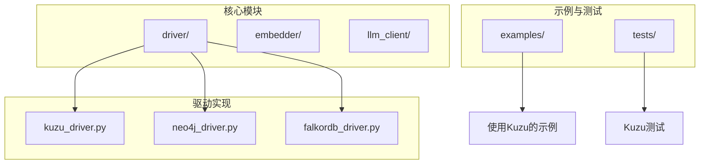
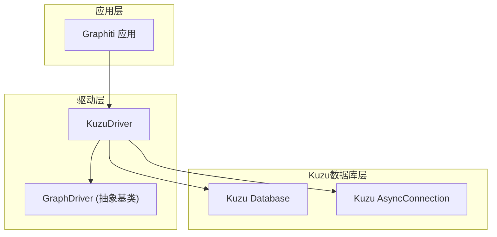
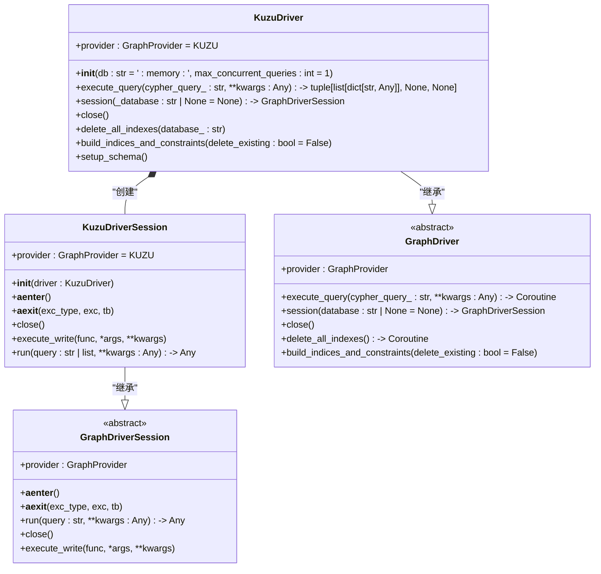
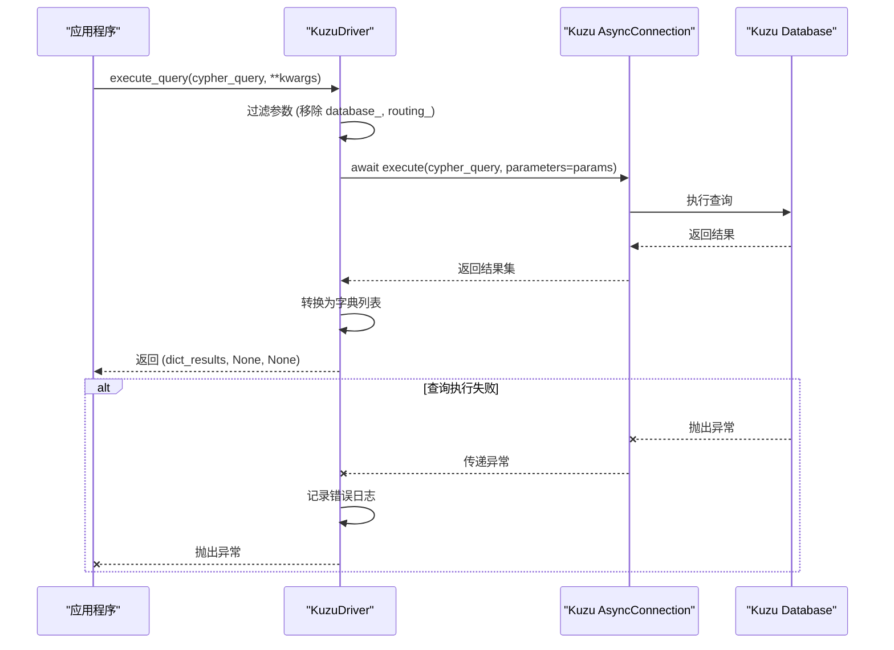
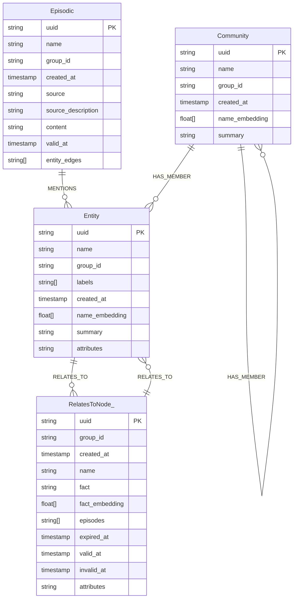
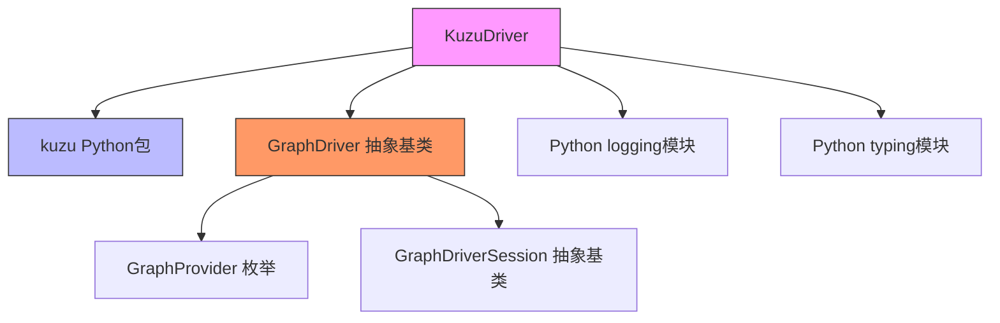

# Kuzu 集成

<cite>
**本文档中引用的文件**   
- [kuzu_driver.py](file://graphiti_core/driver/kuzu_driver.py)
- [driver.py](file://graphiti_core/driver/driver.py)
- [graphiti.py](file://graphiti_core/graphiti.py)
- [node_db_queries.py](file://graphiti_core/models/nodes/node_db_queries.py)
- [edge_db_queries.py](file://graphiti_core/models/edges/edge_db_queries.py)
- [otel_stdout_example.py](file://examples/opentelemetry/otel_stdout_example.py)
- [helpers_test.py](file://tests/helpers_test.py)
</cite>

## 目录
1. [简介](#简介)
2. [项目结构](#项目结构)
3. [核心组件](#核心组件)
4. [架构概述](#架构概述)
5. [详细组件分析](#详细组件分析)
6. [依赖分析](#依赖分析)
7. [性能考虑](#性能考虑)
8. [故障排除指南](#故障排除指南)
9. [结论](#结论)

## 简介
本文档系统性地介绍了KuzuDriver的设计与实现，重点说明Kuzu作为嵌入式图数据库的特点及其对本地高性能查询的支持。文档解释了如何通过Kuzu的Python API执行图操作，管理数据库实例生命周期，以及处理其特有的数据类型和函数扩展。同时描述了其在资源受限环境下的优势，包括低延迟、小内存占用和无需独立服务进程的特性，并提供了配置选项、事务控制、批处理优化及与内存数据同步的最佳实践。

## 项目结构
该项目采用模块化设计，将图数据库驱动、嵌入器、LLM客户端等核心功能分离到不同的模块中。Kuzu数据库集成主要位于`graphiti_core/driver/`目录下，通过`kuzu_driver.py`文件实现。整个项目结构清晰，便于维护和扩展。

**图示来源**
- [kuzu_driver.py](file://graphiti_core/driver/kuzu_driver.py#L1-L183)

**本节来源**
- [kuzu_driver.py](file://graphiti_core/driver/kuzu_driver.py#L1-L183)
- [project_structure](file://#L1-L200)

## 核心组件
KuzuDriver的核心组件包括数据库连接管理、模式设置、查询执行和会话管理。它通过继承GraphDriver抽象基类来实现统一的接口，同时利用Kuzu的Python API提供高性能的本地图数据库操作。

**本节来源**
- [kuzu_driver.py](file://graphiti_core/driver/kuzu_driver.py#L93-L183)
- [driver.py](file://graphiti_core/driver/driver.py#L73-L116)

## 架构概述
KuzuDriver的架构设计遵循了嵌入式数据库的最佳实践，将数据库实例直接嵌入到应用程序进程中，避免了网络通信开销。这种设计特别适合资源受限的环境，能够提供低延迟和高吞吐量的图操作。

**图示来源**
- [kuzu_driver.py](file://graphiti_core/driver/kuzu_driver.py#L93-L183)
- [driver.py](file://graphiti_core/driver/driver.py#L73-L116)

## 详细组件分析

### KuzuDriver 分析
KuzuDriver是Kuzu图数据库的Python封装，实现了GraphDriver接口。它负责管理Kuzu数据库实例的生命周期，包括初始化、查询执行和资源清理。

#### 类结构

**图示来源**
- [kuzu_driver.py](file://graphiti_core/driver/kuzu_driver.py#L93-L183)
- [driver.py](file://graphiti_core/driver/driver.py#L49-L116)

#### 查询执行流程

**图示来源**
- [kuzu_driver.py](file://graphiti_core/driver/kuzu_driver.py#L109-L131)

**本节来源**
- [kuzu_driver.py](file://graphiti_core/driver/kuzu_driver.py#L93-L183)
- [driver.py](file://graphiti_core/driver/driver.py#L49-L116)

### 模式设计分析
Kuzu需要显式定义模式，这与一些动态模式的图数据库不同。KuzuDriver通过SCHEMA_QUERIES常量定义了完整的数据库模式，包括节点表和关系表。

#### 数据模型

**图示来源**
- [kuzu_driver.py](file://graphiti_core/driver/kuzu_driver.py#L30-L90)

**本节来源**
- [kuzu_driver.py](file://graphiti_core/driver/kuzu_driver.py#L26-L90)
- [node_db_queries.py](file://graphiti_core/models/nodes/node_db_queries.py#L22-L180)
- [edge_db_queries.py](file://graphiti_core/models/edges/edge_db_queries.py#L63-L101)

## 依赖分析
KuzuDriver的依赖关系清晰，主要依赖于Kuzu的Python包和项目内部的GraphDriver抽象基类。这种设计实现了良好的解耦，使得不同图数据库驱动可以互换使用。

**图示来源**
- [kuzu_driver.py](file://graphiti_core/driver/kuzu_driver.py#L1-L183)
- [driver.py](file://graphiti_core/driver/driver.py#L1-L116)

**本节来源**
- [kuzu_driver.py](file://graphiti_core/driver/kuzu_driver.py#L1-L183)
- [driver.py](file://graphiti_core/driver/driver.py#L1-L116)

## 性能考虑
Kuzu作为嵌入式图数据库，在性能方面具有显著优势。由于数据库实例直接运行在应用程序进程中，避免了网络通信开销，从而实现了极低的查询延迟。此外，Kuzu的异步连接支持并发查询，可以通过max_concurrent_queries参数控制并发级别，以平衡性能和资源消耗。

KuzuDriver的设计考虑了性能优化，例如通过复用连接和避免不必要的资源清理来提高效率。在资源受限环境中，这种设计能够提供稳定的高性能表现，特别适合需要快速响应的实时应用。

## 故障排除指南
在使用KuzuDriver时，可能会遇到一些常见问题。以下是故障排除的最佳实践：

1. **数据库连接问题**：确保Kuzu Python包已正确安装，并且数据库路径可访问。
2. **查询性能问题**：检查是否设置了适当的并发查询数，避免过度并发导致资源争用。
3. **模式定义问题**：Kuzu需要显式定义模式，确保SCHEMA_QUERIES中的模式定义正确无误。
4. **数据类型兼容性**：注意Kuzu支持的数据类型，特别是数组和嵌套结构的处理方式。

**本节来源**
- [kuzu_driver.py](file://graphiti_core/driver/kuzu_driver.py#L117-L122)
- [otel_stdout_example.py](file://examples/opentelemetry/otel_stdout_example.py#L53-L57)
- [helpers_test.py](file://tests/helpers_test.py#L101-L105)

## 结论
KuzuDriver为Kuzu嵌入式图数据库提供了高效、可靠的Python接口。通过其精心设计的架构和实现，KuzuDriver充分发挥了Kuzu在本地高性能查询方面的优势，特别适合资源受限环境下的应用。其清晰的接口设计和良好的错误处理机制使得集成和使用变得简单可靠。未来可以通过进一步优化批处理操作和内存管理来提升性能，为更广泛的应用场景提供支持。