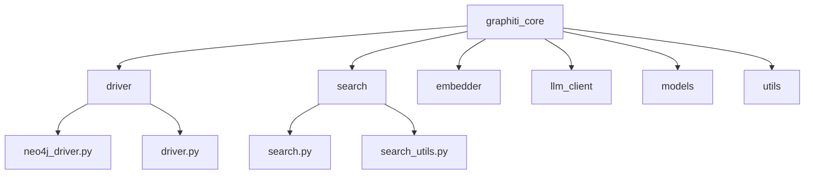
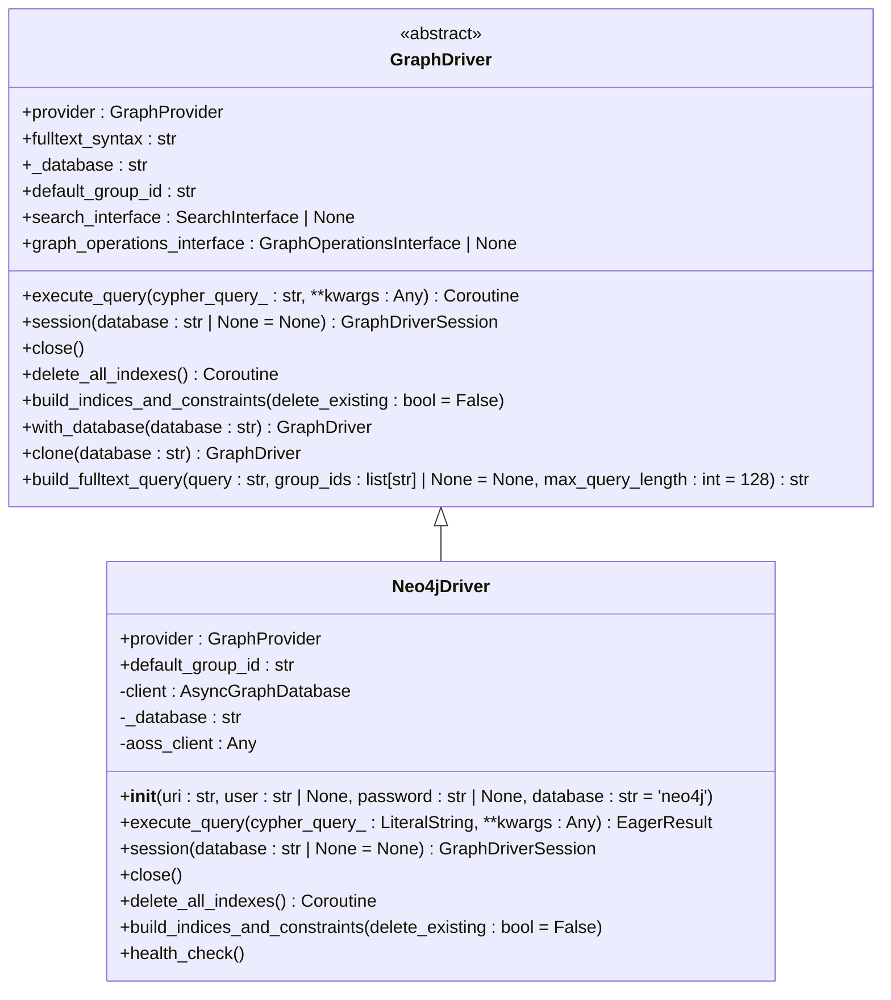
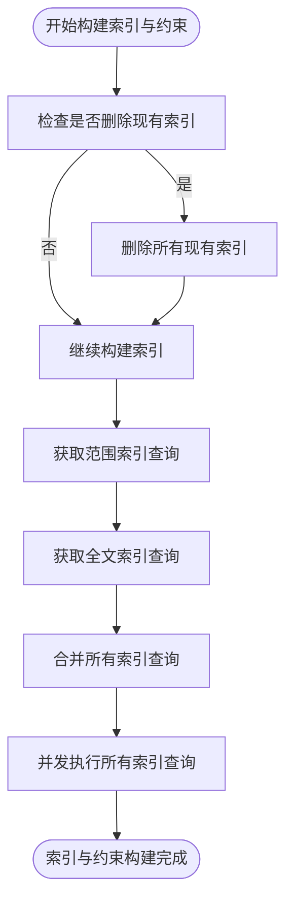
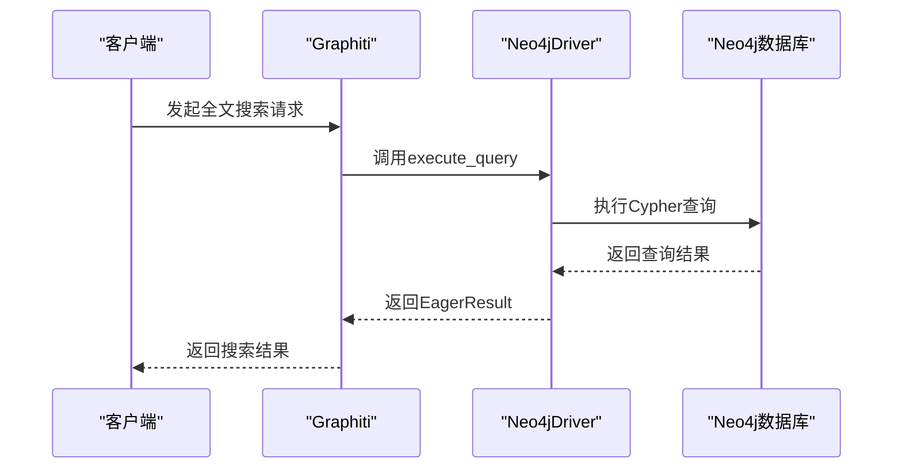
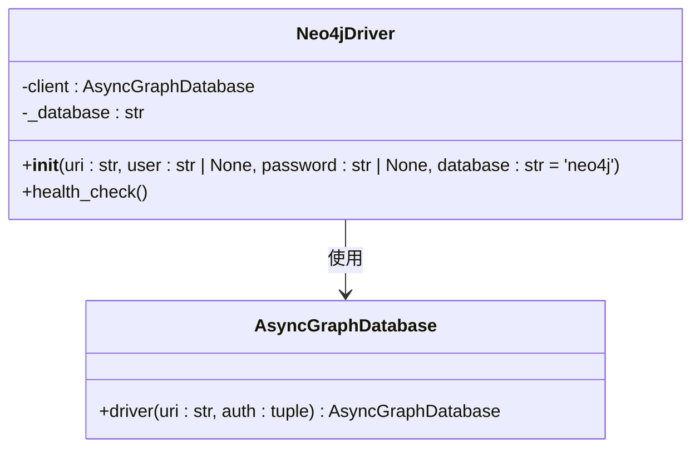
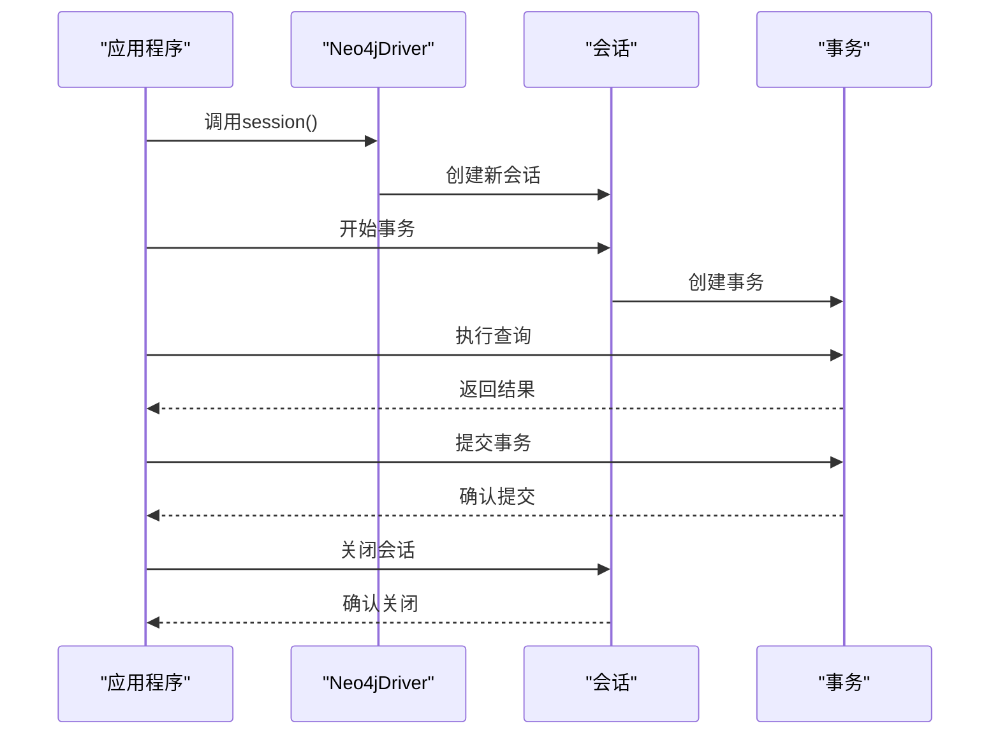
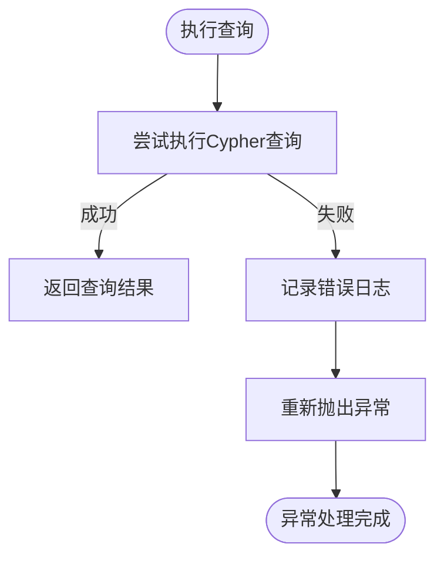
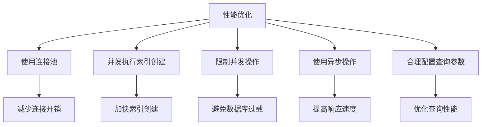
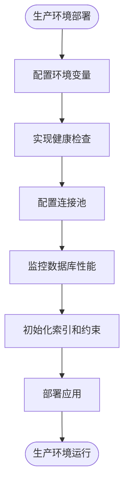
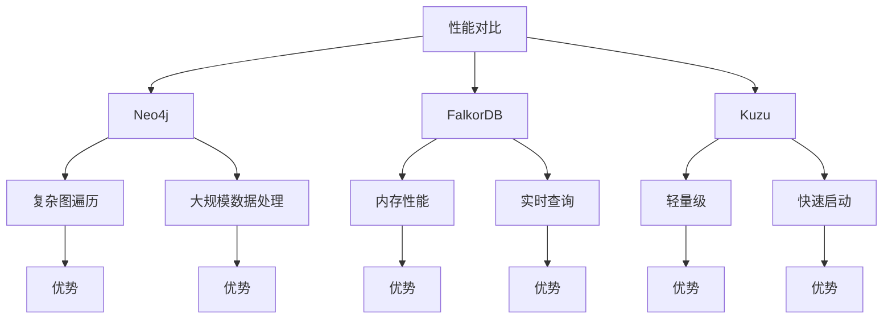

# Neo4j 集成

<cite>
**本文档中引用的文件**  
- [neo4j_driver.py](file://graphiti_core/driver/neo4j_driver.py)
- [driver.py](file://graphiti_core/driver/driver.py)
- [graphiti.py](file://graphiti_core/graphiti.py)
- [graph_queries.py](file://graphiti_core/graph_queries.py)
- [search.py](file://graphiti_core/search/search.py)
- [search_utils.py](file://graphiti_core/search/search_utils.py)
- [helpers.py](file://graphiti_core/helpers.py)
- [errors.py](file://graphiti_core/errors.py)
- [quickstart_neo4j.py](file://examples/quickstart/quickstart_neo4j.py)
</cite>

## 目录
1. [简介](#简介)
2. [项目结构](#项目结构)
3. [核心组件](#核心组件)
4. [Neo4j驱动实现](#neo4j驱动实现)
5. [索引与约束构建](#索引与约束构建)
6. [全文搜索查询构建](#全文搜索查询构建)
7. [连接配置与认证](#连接配置与认证)
8. [会话与事务管理](#会话与事务管理)
9. [错误处理策略](#错误处理策略)
10. [性能优化建议](#性能优化建议)
11. [生产环境最佳实践](#生产环境最佳实践)
12. [性能对比分析](#性能对比分析)

## 简介
本文档详细说明了Graphiti框架中Neo4j驱动的集成实现。文档涵盖了Neo4jDriver如何继承GraphDriver抽象类并实现其接口，通过Neo4j原生驱动执行Cypher查询，管理异步会话和事务。同时描述了索引与约束的构建逻辑，以及全文搜索查询的构建方式。文档还涵盖了连接配置参数、认证机制、连接池管理、错误处理策略和性能优化建议，并提供了在生产环境中部署Neo4j与Graphiti协同工作的最佳实践。

## 项目结构
Graphiti项目采用模块化设计，将不同功能分离到独立的目录中。核心驱动实现位于`graphiti_core/driver/`目录下，其中`neo4j_driver.py`文件包含了Neo4j驱动的具体实现。项目结构清晰地分离了驱动、嵌入器、LLM客户端、搜索功能等不同组件，便于维护和扩展。

**Diagram sources**
- [neo4j_driver.py](file://graphiti_core/driver/neo4j_driver.py)
- [driver.py](file://graphiti_core/driver/driver.py)
- [search.py](file://graphiti_core/search/search.py)
- [search_utils.py](file://graphiti_core/search/search_utils.py)

**Section sources**
- [neo4j_driver.py](file://graphiti_core/driver/neo4j_driver.py)
- [driver.py](file://graphiti_core/driver/driver.py)

## 核心组件
Graphiti框架的核心组件包括图驱动、嵌入器、LLM客户端和搜索功能。图驱动负责与底层图数据库的交互，嵌入器负责生成文本嵌入，LLM客户端负责与大型语言模型的交互，搜索功能则提供了复杂的查询和检索能力。这些组件通过清晰的接口进行通信，实现了高内聚低耦合的设计。

**Section sources**
- [graphiti.py](file://graphiti_core/graphiti.py)
- [driver.py](file://graphiti_core/driver/driver.py)
- [search.py](file://graphiti_core/search/search.py)

## Neo4j驱动实现
Neo4j驱动通过继承`GraphDriver`抽象类来实现与Neo4j数据库的交互。`Neo4jDriver`类实现了`GraphDriver`定义的所有抽象方法，包括查询执行、会话管理、连接关闭等。驱动使用`neo4j.AsyncGraphDatabase`作为底层客户端，支持异步操作，提高了性能和响应性。

**Diagram sources**
- [driver.py](file://graphiti_core/driver/driver.py#L73-L125)
- [neo4j_driver.py](file://graphiti_core/driver/neo4j_driver.py#L31-L118)

**Section sources**
- [neo4j_driver.py](file://graphiti_core/driver/neo4j_driver.py#L31-L118)
- [driver.py](file://graphiti_core/driver/driver.py#L73-L125)

## 索引与约束构建
索引与约束的构建是通过`build_indices_and_constraints`方法实现的。该方法首先根据数据库提供程序获取范围索引和全文索引的查询语句，然后使用`semaphore_gather`并发执行所有索引创建查询。这种方法确保了索引创建的高效性和可靠性。

**Diagram sources**
- [neo4j_driver.py](file://graphiti_core/driver/neo4j_driver.py#L91-L108)
- [graph_queries.py](file://graphiti_core/graph_queries.py#L28-L70)
- [graph_queries.py](file://graphiti_core/graph_queries.py#L72-L127)

**Section sources**
- [neo4j_driver.py](file://graphiti_core/driver/neo4j_driver.py#L91-L108)
- [graph_queries.py](file://graphiti_core/graph_queries.py#L28-L127)

## 全文搜索查询构建
全文搜索查询的构建依赖于`get_fulltext_indices`函数，该函数根据不同的图数据库提供程序返回相应的全文索引创建语句。对于Neo4j，使用`CREATE FULLTEXT INDEX`语法创建索引，支持在节点和关系上进行全文搜索。

**Diagram sources**
- [neo4j_driver.py](file://graphiti_core/driver/neo4j_driver.py#L63-L77)
- [search_utils.py](file://graphiti_core/search/search_utils.py#L84-L110)
- [graph_queries.py](file://graphiti_core/graph_queries.py#L118-L127)

**Section sources**
- [neo4j_driver.py](file://graphiti_core/driver/neo4j_driver.py#L63-L77)
- [search_utils.py](file://graphiti_core/search/search_utils.py#L84-L110)

## 连接配置与认证
Neo4j驱动的连接配置通过构造函数参数实现，包括URI、用户名、密码和数据库名称。认证机制使用Neo4j的原生认证，通过`AsyncGraphDatabase.driver`的auth参数传递用户名和密码。连接池管理由Neo4j Python驱动自动处理。

**Diagram sources**
- [neo4j_driver.py](file://graphiti_core/driver/neo4j_driver.py#L35-L48)
- [quickstart_neo4j.py](file://examples/quickstart/quickstart_neo4j.py#L47-L54)

**Section sources**
- [neo4j_driver.py](file://graphiti_core/driver/neo4j_driver.py#L35-L48)

## 会话与事务管理
Neo4j驱动通过`session`方法管理异步会话，该方法返回一个`GraphDriverSession`实例。事务管理由Neo4j的原生事务机制处理，支持自动提交和显式事务控制。驱动使用异步上下文管理器来确保会话的正确关闭。

**Diagram sources**
- [neo4j_driver.py](file://graphiti_core/driver/neo4j_driver.py#L79-L81)
- [driver.py](file://graphiti_core/driver/driver.py#L49-L67)

**Section sources**
- [neo4j_driver.py](file://graphiti_core/driver/neo4j_driver.py#L79-L81)

## 错误处理策略
错误处理策略主要体现在查询执行和连接管理中。在`execute_query`方法中，所有异常都被捕获并记录到日志中，然后重新抛出。健康检查方法`health_check`也包含了异常处理，确保在连接失败时能够正确报告错误。

**Diagram sources**
- [neo4j_driver.py](file://graphiti_core/driver/neo4j_driver.py#L71-L75)
- [neo4j_driver.py](file://graphiti_core/driver/neo4j_driver.py#L110-L117)
- [errors.py](file://graphiti_core/errors.py#L18-L84)

**Section sources**
- [neo4j_driver.py](file://graphiti_core/driver/neo4j_driver.py#L71-L75)
- [errors.py](file://graphiti_core/errors.py#L18-L84)

## 性能优化建议
性能优化建议包括使用连接池、并发执行索引创建、合理配置查询参数等。通过`semaphore_gather`限制并发操作的数量，避免对数据库造成过大压力。同时，使用异步操作提高整体性能。

**Diagram sources**
- [helpers.py](file://graphiti_core/helpers.py#L106-L116)
- [neo4j_driver.py](file://graphiti_core/driver/neo4j_driver.py#L101-L108)

**Section sources**
- [helpers.py](file://graphiti_core/helpers.py#L106-L116)

## 生产环境最佳实践
在生产环境中部署Neo4j与Graphiti协同工作时，建议使用环境变量管理连接参数，定期执行健康检查，合理配置连接池大小，并监控数据库性能。同时，应该在应用程序启动时初始化索引和约束。

**Diagram sources**
- [quickstart_neo4j.py](file://examples/quickstart/quickstart_neo4j.py#L45-L54)
- [neo4j_driver.py](file://graphiti_core/driver/neo4j_driver.py#L50-L59)

**Section sources**
- [quickstart_neo4j.py](file://examples/quickstart/quickstart_neo4j.py#L45-L54)

## 性能对比分析
与其他图数据库相比，Neo4j在复杂图遍历和大规模数据处理方面表现出色。其原生图存储引擎和强大的Cypher查询语言使其在处理深度遍历查询时具有优势。同时，Neo4j的企业版提供了高级集群功能，支持水平扩展。

**Diagram sources**
- [driver.py](file://graphiti_core/driver/driver.py#L42-L46)
- [graph_queries.py](file://graphiti_core/graph_queries.py#L28-L127)

**Section sources**
- [driver.py](file://graphiti_core/driver/driver.py#L42-L46)