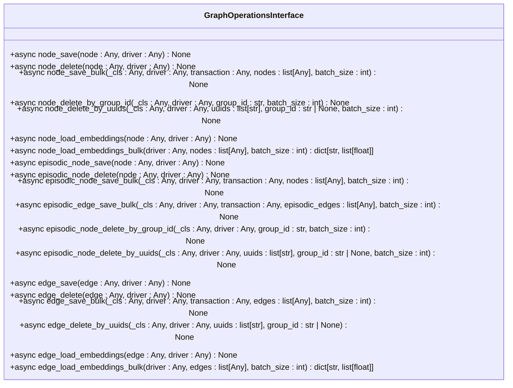
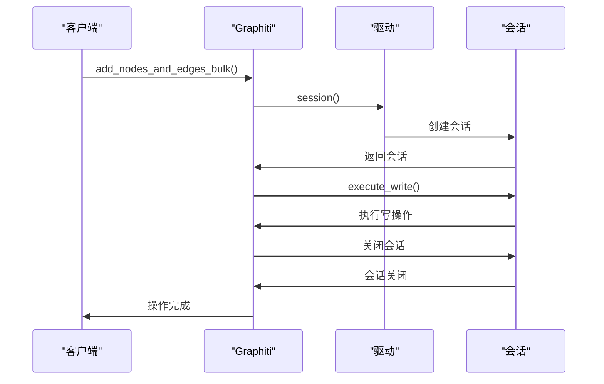
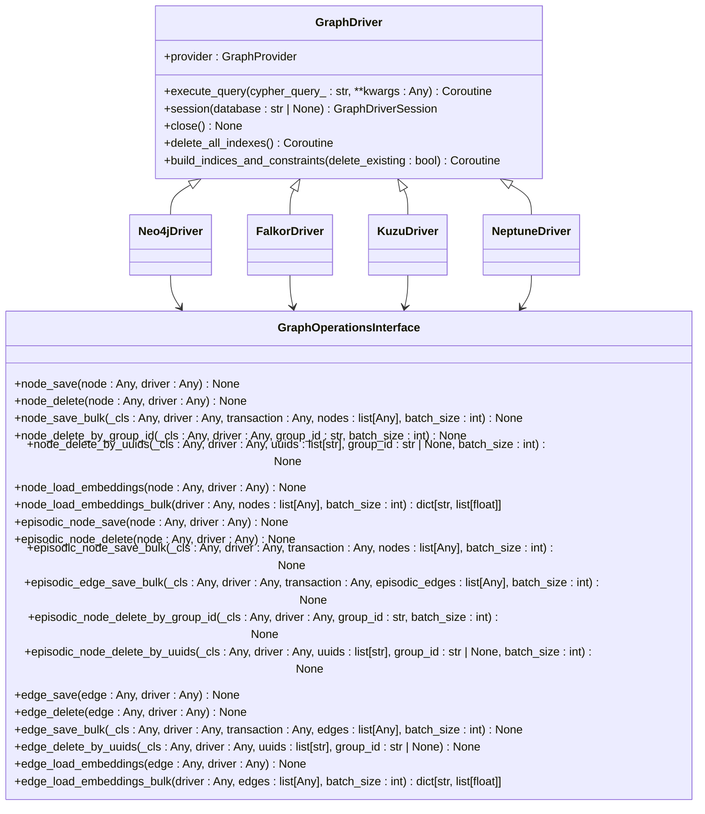

# 图操作接口

<cite>
**本文档引用的文件**   
- [graph_operations.py](file://graphiti_core/driver/graph_operations/graph_operations.py)
- [driver.py](file://graphiti_core/driver/driver.py)
- [node_db_queries.py](file://graphiti_core/models/nodes/node_db_queries.py)
- [edge_db_queries.py](file://graphiti_core/models/edges/edge_db_queries.py)
- [falkordb_driver.py](file://graphiti_core/driver/falkordb_driver.py)
- [neo4j_driver.py](file://graphiti_core/driver/neo4j_driver.py)
- [kuzu_driver.py](file://graphiti_core/driver/kuzu_driver.py)
- [neptune_driver.py](file://graphiti_core/driver/neptune_driver.py)
- [graphiti.py](file://graphiti_core/graphiti.py)
- [bulk_utils.py](file://graphiti_core/utils/bulk_utils.py)
</cite>

## 目录
1. [引言](#引言)
2. [图操作接口概述](#图操作接口概述)
3. [节点操作](#节点操作)
4. [边操作](#边操作)
5. [批量操作实现](#批量操作实现)
6. [跨数据库兼容性](#跨数据库兼容性)
7. [性能优化建议](#性能优化建议)
8. [错误恢复与事务完整性](#错误恢复与事务完整性)
9. [结论](#结论)

## 引言
图操作接口（GraphOperationsInterface）是Graphiti框架中的核心抽象层，为图数据库操作提供统一的API。该接口封装了底层数据库的特定语法差异，使开发者能够以一致的方式执行CRUD操作。本文档详细阐述了该接口的设计、实现和使用方法，包括节点和边的创建、更新、删除操作，以及批量处理、条件更新和级联删除等高级功能。

**Section sources**
- [graph_operations.py](file://graphiti_core/driver/graph_operations/graph_operations.py)

## 图操作接口概述
图操作接口定义了一组用于操作图数据库的抽象方法，包括节点和边的保存、删除、批量操作以及嵌入向量的加载。该接口通过继承`BaseModel`实现，确保了类型安全和结构一致性。接口方法均为异步，支持高并发场景下的高效操作。

**Diagram sources **
- [graph_operations.py](file://graphiti_core/driver/graph_operations/graph_operations.py#L22-L192)

**Section sources**
- [graph_operations.py](file://graphiti_core/driver/graph_operations/graph_operations.py#L22-L192)

## 节点操作
图操作接口提供了丰富的节点操作方法，包括单个节点的保存和删除，以及批量操作。`node_save`和`node_delete`方法用于单个节点的CRUD操作，而`node_save_bulk`和`node_delete_by_uuids`则支持批量处理，提高操作效率。

### 节点保存
`node_save`方法用于持久化单个节点，如果节点已存在则进行更新。`node_save_bulk`方法支持批量保存节点，通过分批处理避免内存溢出。

**Section sources**
- [graph_operations.py](file://graphiti_core/driver/graph_operations/graph_operations.py#L31-L47)

### 节点删除
`node_delete`方法用于删除单个节点，`node_delete_by_uuids`则支持根据UUID列表批量删除节点。`node_delete_by_group_id`方法允许根据组ID删除节点，实现逻辑分区管理。

**Section sources**
- [graph_operations.py](file://graphiti_core/driver/graph_operations/graph_operations.py#L35-L66)

## 边操作
边操作接口提供了与节点操作类似的功能，包括单个边的保存和删除，以及批量操作。`edge_save`和`edge_delete`方法用于单个边的CRUD操作，而`edge_save_bulk`和`edge_delete_by_uuids`则支持批量处理。

### 边保存
`edge_save`方法用于持久化单个边，如果边已存在则进行更新。`edge_save_bulk`方法支持批量保存边，通过分批处理提高效率。

**Section sources**
- [graph_operations.py](file://graphiti_core/driver/graph_operations/graph_operations.py#L145-L161)

### 边删除
`edge_delete`方法用于删除单个边，`edge_delete_by_uuids`则支持根据UUID列表批量删除边，实现高效的数据清理。

**Section sources**
- [graph_operations.py](file://graphiti_core/driver/graph_operations/graph_operations.py#L149-L170)

## 批量操作实现
批量操作是图操作接口的核心功能之一，通过`add_nodes_and_edges_bulk`函数实现。该函数在一个事务中批量保存节点和边，确保数据一致性。批量操作通过分批处理避免内存溢出，并支持嵌入向量的生成。

**Diagram sources **
- [bulk_utils.py](file://graphiti_core/utils/bulk_utils.py#L128-L252)

**Section sources**
- [bulk_utils.py](file://graphiti_core/utils/bulk_utils.py#L128-L252)

## 跨数据库兼容性
图操作接口通过驱动适配器模式实现跨数据库兼容性。每个数据库驱动（如Neo4j、FalkorDB、Kuzu、Neptune）实现`GraphDriver`抽象类，并提供具体的`GraphOperationsInterface`实现。接口通过`GraphProvider`枚举识别数据库类型，并调用相应的查询构建函数。

**Diagram sources **
- [driver.py](file://graphiti_core/driver/driver.py#L73-L117)
- [graph_operations.py](file://graphiti_core/driver/graph_operations/graph_operations.py#L22-L192)

**Section sources**
- [driver.py](file://graphiti_core/driver/driver.py#L73-L117)
- [graph_operations.py](file://graphiti_core/driver/graph_operations/graph_operations.py#L22-L192)

## 性能优化建议
为提高图操作接口的性能，建议采取以下措施：
- **调整批处理大小**：根据系统资源和数据量调整`batch_size`参数，避免内存溢出。
- **预创建索引**：在数据导入前创建必要的索引，提高查询效率。
- **并发控制**：使用`semaphore_gather`等工具控制并发数，避免资源竞争。

**Section sources**
- [bulk_utils.py](file://graphiti_core/utils/bulk_utils.py#L66)
- [graphiti.py](file://graphiti_core/graphiti.py#L41)

## 错误恢复与事务完整性
图操作接口通过事务确保数据一致性。`add_nodes_and_edges_bulk`函数在一个事务中执行所有操作，如果任一操作失败，整个事务将回滚。此外，接口通过`try-except`块捕获异常，并记录错误日志，便于问题排查。

**Section sources**
- [bulk_utils.py](file://graphiti_core/utils/bulk_utils.py#L138-L148)
- [falkordb_driver.py](file://graphiti_core/driver/falkordb_driver.py#L174-L182)

## 结论
图操作接口作为Graphiti框架的核心组件，提供了统一的图数据库操作API，封装了底层数据库的差异。通过批量操作、跨数据库兼容性和事务完整性，该接口确保了数据的一致性和高效性。开发者应根据具体需求调整批处理大小、预创建索引，并控制并发数，以优化性能。