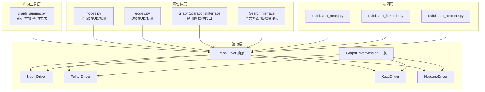
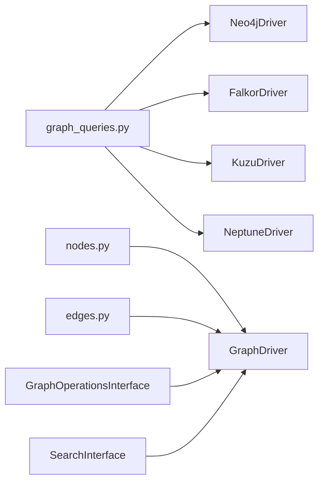

# 数据库集成

<cite>
**本文引用的文件**
- [graphiti_core/driver/driver.py](file://graphiti_core/driver/driver.py)
- [graphiti_core/driver/neo4j_driver.py](file://graphiti_core/driver/neo4j_driver.py)
- [graphiti_core/driver/falkordb_driver.py](file://graphiti_core/driver/falkordb_driver.py)
- [graphiti_core/driver/kuzu_driver.py](file://graphiti_core/driver/kuzu_driver.py)
- [graphiti_core/driver/neptune_driver.py](file://graphiti_core/driver/neptune_driver.py)
- [graphiti_core/driver/graph_operations/graph_operations.py](file://graphiti_core/driver/graph_operations/graph_operations.py)
- [graphiti_core/driver/search_interface/search_interface.py](file://graphiti_core/driver/search_interface/search_interface.py)
- [graphiti_core/graph_queries.py](file://graphiti_core/graph_queries.py)
- [graphiti_core/nodes.py](file://graphiti_core/nodes.py)
- [graphiti_core/edges.py](file://graphiti_core/edges.py)
- [examples/quickstart/quickstart_neo4j.py](file://examples/quickstart/quickstart_neo4j.py)
- [examples/quickstart/quickstart_falkordb.py](file://examples/quickstart/quickstart_falkordb.py)
- [examples/quickstart/quickstart_neptune.py](file://examples/quickstart/quickstart_neptune.py)
</cite>

## 目录
1. [简介](#简介)
2. [项目结构](#项目结构)
3. [核心组件](#核心组件)
4. [架构总览](#架构总览)
5. [详细组件分析](#详细组件分析)
6. [依赖关系分析](#依赖关系分析)
7. [性能考量](#性能考量)
8. [故障排查指南](#故障排查指南)
9. [结论](#结论)
10. [附录：多数据库切换与迁移指南](#附录多数据库切换与迁移指南)

## 简介
本文件系统性介绍 GraphDriver 抽象接口及对 Neo4j、FalkorDB、Kuzu 和 Amazon Neptune 的支持。内容涵盖：
- 各数据库的特性、性能表现与适用场景
- GraphDriver 抽象接口的实现机制
- 具体驱动（如 Neo4jDriver）如何封装原生客户端执行 Cypher 查询
- 图操作（graph_operations）的通用方法（节点/边 CRUD）
- 连接配置、事务管理、错误处理与性能调优（连接池、批处理）
- 多数据库切换的迁移指南

## 项目结构
围绕“驱动层”与“上层业务”的分层设计：
- 驱动层：统一抽象 GraphDriver 及其会话 GraphDriverSession；针对不同后端提供具体实现
- 查询工具层：graph_queries 提供跨数据库的索引与查询生成
- 图实体层：nodes/edges 定义节点/边的保存、删除等通用逻辑，并通过驱动执行
- 示例层：examples 展示如何以不同驱动初始化 Graphiti 并进行基本操作

图表来源
- [graphiti_core/driver/driver.py](file://graphiti_core/driver/driver.py#L42-L125)
- [graphiti_core/driver/neo4j_driver.py](file://graphiti_core/driver/neo4j_driver.py#L31-L118)
- [graphiti_core/driver/falkordb_driver.py](file://graphiti_core/driver/falkordb_driver.py#L114-L363)
- [graphiti_core/driver/kuzu_driver.py](file://graphiti_core/driver/kuzu_driver.py#L93-L183)
- [graphiti_core/driver/neptune_driver.py](file://graphiti_core/driver/neptune_driver.py#L109-L306)
- [graphiti_core/graph_queries.py](file://graphiti_core/graph_queries.py#L28-L163)
- [graphiti_core/nodes.py](file://graphiti_core/nodes.py#L87-L200)
- [graphiti_core/edges.py](file://graphiti_core/edges.py#L45-L120)
- [examples/quickstart/quickstart_neo4j.py](file://examples/quickstart/quickstart_neo4j.py#L57-L240)
- [examples/quickstart/quickstart_falkordb.py](file://examples/quickstart/quickstart_falkordb.py#L65-L251)
- [examples/quickstart/quickstart_neptune.py](file://examples/quickstart/quickstart_neptune.py#L61-L253)

章节来源
- [graphiti_core/driver/driver.py](file://graphiti_core/driver/driver.py#L42-L125)
- [graphiti_core/graph_queries.py](file://graphiti_core/graph_queries.py#L28-L163)
- [graphiti_core/nodes.py](file://graphiti_core/nodes.py#L87-L200)
- [graphiti_core/edges.py](file://graphiti_core/edges.py#L45-L120)

## 核心组件
- GraphProvider 枚举：标识后端类型（neo4j、falkordb、kuzu、neptune）
- GraphDriver 抽象类：定义统一接口（执行查询、会话、关闭、索引/约束构建、全文查询构建）
- GraphDriverSession 抽象类：统一会话生命周期（异步上下文、run/close/execute_write）
- 具体驱动实现：
  - Neo4jDriver：基于异步 Neo4j 客户端，支持索引构建、健康检查
  - FalkorDriver：基于 FalkorDB 异步客户端，内置全文查询构建、时间参数转换、结果格式化
  - KuzuDriver：基于 Kuzu 异步连接，显式 schema，批量并发控制
  - NeptuneDriver：基于 LangChain AWS 组件与 OpenSearch（AOSS），索引在 AOSS 上，支持批量写入与查询
- GraphOperationsInterface：通用图操作接口（节点/边的保存、删除、批量、嵌入加载）
- SearchInterface：全文检索与向量相似度搜索接口
- graph_queries：跨数据库的索引与全文检索查询生成器

章节来源
- [graphiti_core/driver/driver.py](file://graphiti_core/driver/driver.py#L42-L125)
- [graphiti_core/driver/neo4j_driver.py](file://graphiti_core/driver/neo4j_driver.py#L31-L118)
- [graphiti_core/driver/falkordb_driver.py](file://graphiti_core/driver/falkordb_driver.py#L114-L363)
- [graphiti_core/driver/kuzu_driver.py](file://graphiti_core/driver/kuzu_driver.py#L93-L183)
- [graphiti_core/driver/neptune_driver.py](file://graphiti_core/driver/neptune_driver.py#L109-L306)
- [graphiti_core/driver/graph_operations/graph_operations.py](file://graphiti_core/driver/graph_operations/graph_operations.py#L22-L192)
- [graphiti_core/driver/search_interface/search_interface.py](file://graphiti_core/driver/search_interface/search_interface.py#L22-L90)
- [graphiti_core/graph_queries.py](file://graphiti_core/graph_queries.py#L28-L163)

## 架构总览
下图展示 GraphDriver 抽象与各具体驱动的关系，以及与查询工具层、图实体层的交互。

```mermaid
classDiagram
class GraphProvider {
<<enum>>
+NEO4J
+FALKORDB
+KUZU
+NEPTUNE
}
class GraphDriver {
+provider : GraphProvider
+fulltext_syntax : str
+_database : str
+default_group_id : str
+search_interface
+graph_operations_interface
+execute_query(cypher_query_, **kwargs)
+session(database=None)
+close()
+delete_all_indexes()
+with_database(database)
+build_indices_and_constraints(delete_existing=False)
+build_fulltext_query(query, group_ids, max_query_length)
}
class GraphDriverSession {
+provider : GraphProvider
+run(query, **kwargs)
+close()
+execute_write(func, *args, **kwargs)
+__aenter__()
+__aexit__(exc_type, exc, tb)
}
class Neo4jDriver {
+provider = NEO4J
+execute_query(cypher_query_, **kwargs)
+session(database=None)
+close()
+delete_all_indexes()
+build_indices_and_constraints(delete_existing=False)
+health_check()
}
class FalkorDriver {
+provider = FALKORDB
+fulltext_syntax = "@"
+default_group_id = "_"
+execute_query(cypher_query_, **kwargs)
+session(database=None)
+close()
+delete_all_indexes()
+build_indices_and_constraints(delete_existing=False)
+clone(database)
+health_check()
+build_fulltext_query(query, group_ids, max_query_length)
+sanitize(query)
}
class KuzuDriver {
+provider = KUZU
+execute_query(cypher_query_, **kwargs)
+session(database=None)
+close()
+delete_all_indexes(database_)
+build_indices_and_constraints(delete_existing=False)
+setup_schema()
}
class NeptuneDriver {
+provider = NEPTUNE
+execute_query(cypher_query_, **kwargs)
+session(database=None)
+close()
+delete_all_indexes()
+build_indices_and_constraints(delete_existing=False)
+create_aoss_indices()
+delete_aoss_indices()
+run_aoss_query(name, query_text, limit)
+save_to_aoss(name, data)
}
class GraphOperationsInterface {
+node_save(node, driver)
+node_delete(node, driver)
+node_save_bulk(_cls, driver, transaction, nodes, batch_size)
+node_delete_by_group_id(_cls, driver, group_id, batch_size)
+node_delete_by_uuids(_cls, driver, uuids, group_id, batch_size)
+node_load_embeddings(node, driver)
+node_load_embeddings_bulk(driver, nodes, batch_size)
+episodic_node_save(node, driver)
+episodic_node_delete(node, driver)
+episodic_node_save_bulk(_cls, driver, transaction, nodes, batch_size)
+episodic_edge_save_bulk(_cls, driver, transaction, episodic_edges, batch_size)
+episodic_node_delete_by_group_id(_cls, driver, group_id, batch_size)
+episodic_node_delete_by_uuids(_cls, driver, uuids, group_id, batch_size)
+edge_save(edge, driver)
+edge_delete(edge, driver)
+edge_save_bulk(_cls, driver, transaction, edges, batch_size)
+edge_delete_by_uuids(_cls, driver, uuids, group_id)
+edge_load_embeddings(edge, driver)
+edge_load_embeddings_bulk(driver, edges, batch_size)
}
class SearchInterface {
+edge_fulltext_search(driver, query, search_filter, group_ids, limit)
+edge_similarity_search(driver, search_vector, source_node_uuid, target_node_uuid, search_filter, group_ids, limit, min_score)
+node_fulltext_search(driver, query, search_filter, group_ids, limit)
+node_similarity_search(driver, search_vector, search_filter, group_ids, limit, min_score)
+episode_fulltext_search(driver, query, search_filter, group_ids, limit)
+build_node_search_filters(search_filters)
+build_edge_search_filters(search_filters)
}
GraphDriver <|-- Neo4jDriver
GraphDriver <|-- FalkorDriver
GraphDriver <|-- KuzuDriver
GraphDriver <|-- NeptuneDriver
GraphDriverSession <|-- FalkorDriverSession
GraphDriverSession <|-- KuzuDriverSession
GraphDriverSession <|-- NeptuneDriverSession
GraphDriver --> GraphOperationsInterface : "组合"
GraphDriver --> SearchInterface : "组合"
```

图表来源
- [graphiti_core/driver/driver.py](file://graphiti_core/driver/driver.py#L42-L125)
- [graphiti_core/driver/neo4j_driver.py](file://graphiti_core/driver/neo4j_driver.py#L31-L118)
- [graphiti_core/driver/falkordb_driver.py](file://graphiti_core/driver/falkordb_driver.py#L114-L363)
- [graphiti_core/driver/kuzu_driver.py](file://graphiti_core/driver/kuzu_driver.py#L93-L183)
- [graphiti_core/driver/neptune_driver.py](file://graphiti_core/driver/neptune_driver.py#L109-L306)
- [graphiti_core/driver/graph_operations/graph_operations.py](file://graphiti_core/driver/graph_operations/graph_operations.py#L22-L192)
- [graphiti_core/driver/search_interface/search_interface.py](file://graphiti_core/driver/search_interface/search_interface.py#L22-L90)

## 详细组件分析

### GraphDriver 抽象与会话
- 统一职责：提供跨数据库一致的查询执行、索引/约束管理、全文查询构建、数据库切换能力
- 关键点：
  - with_database 返回浅拷贝，复用连接（适用于 FalkorDB、Neo4j）
  - build_indices_and_constraints 支持删除现有索引后重建
  - build_fulltext_query 由具体驱动实现（如 FalkorDB 使用 RedisSearch 语法）

章节来源
- [graphiti_core/driver/driver.py](file://graphiti_core/driver/driver.py#L42-L125)

### Neo4jDriver
- 特性
  - 基于异步 Neo4j 客户端，支持 execute_query、session、close
  - 自动构建索引与约束，支持健康检查
  - 默认 group_id 为空字符串
- 查询执行
  - 将 database_ 参数注入到参数字典中，确保查询在正确数据库执行
  - 捕获异常并记录详细信息
- 事务与会话
  - session 返回原生会话对象，可配合事务使用
- 性能
  - 通过异步客户端提升吞吐
  - 建议结合批量写入与索引优化

章节来源
- [graphiti_core/driver/neo4j_driver.py](file://graphiti_core/driver/neo4j_driver.py#L31-L118)
- [graphiti_core/graph_queries.py](file://graphiti_core/graph_queries.py#L28-L69)

### FalkorDriver
- 特性
  - 多租户图数据库，支持 select_graph 切换图
  - 全文查询使用 RedisSearch 语法（fulltext_syntax = "@"）
  - 内置全文查询构建、停用词过滤、时间参数转换
  - 结果格式化为统一的列表字典结构
- 查询执行
  - 批量查询时将参数中的 datetime 转换为字符串
  - 对重复索引存在的情况进行日志提示
- 事务与会话
  - FalkorDriverSession 的 execute_write 直接 await 传入函数
- 克隆与数据库切换
  - clone 支持在相同连接上切换数据库或使用默认组标识符

章节来源
- [graphiti_core/driver/falkordb_driver.py](file://graphiti_core/driver/falkordb_driver.py#L114-L363)
- [graphiti_core/graph_queries.py](file://graphiti_core/graph_queries.py#L72-L108)

### KuzuDriver
- 特性
  - 显式 schema，所有表/关系在初始化时创建
  - 异步连接支持并发查询上限（max_concurrent_queries）
  - 边“关系”通过中间节点 RelatesToNode_ 表达，避免边属性上的全文索引限制
- 查询执行
  - 移除不支持的参数（如 database_、routing_）
  - 将结果 rows_as_dict 转换为字典列表
- 事务与会话
  - KuzuDriverSession 的 execute_write 直接 await 传入函数
- 索引与约束
  - 索引在 schema 初始化时创建，运行时不可动态变更

章节来源
- [graphiti_core/driver/kuzu_driver.py](file://graphiti_core/driver/kuzu_driver.py#L93-L183)
- [graphiti_core/graph_queries.py](file://graphiti_core/graph_queries.py#L110-L117)

### NeptuneDriver
- 特性
  - 基于 LangChain AWS 的 NeptuneGraph/NeptuneAnalyticsGraph
  - 全文索引在 OpenSearch（AOSS）上维护，提供索引创建/删除、批量写入与查询
  - 支持批量写入 AOSS 文档
- 查询执行
  - 参数中 datetime 自动转为 ISO 字符串，列表中 datetime 自动包装为 datetime()
- 事务与会话
  - NeptuneDriverSession 的 execute_write 直接 await 传入函数
- 索引与全文
  - build_indices_and_constraints 在 AOSS 上创建预定义索引
  - run_aoss_query/save_to_aoss 提供 AOSS 查询与批量写入

章节来源
- [graphiti_core/driver/neptune_driver.py](file://graphiti_core/driver/neptune_driver.py#L109-L306)
- [graphiti_core/graph_queries.py](file://graphiti_core/graph_queries.py#L118-L127)

### 图操作（GraphOperationsInterface）
- 覆盖范围：节点/边的保存、删除、批量、嵌入加载
- 设计要点：
  - 通过接口解耦具体驱动，便于扩展新驱动时仅需实现该接口
  - 批量操作支持 batch_size 控制事务大小
- 与节点/边模型的协作：
  - nodes.py/edges.py 中的 Node/Edge 类在需要时委托 GraphOperationsInterface 或直接调用驱动执行

章节来源
- [graphiti_core/driver/graph_operations/graph_operations.py](file://graphiti_core/driver/graph_operations/graph_operations.py#L22-L192)
- [graphiti_core/nodes.py](file://graphiti_core/nodes.py#L87-L200)
- [graphiti_core/edges.py](file://graphiti_core/edges.py#L45-L120)

### 搜索接口（SearchInterface）
- 能力：节点/边/剧集的全文检索与向量相似度检索
- 设计要点：
  - 通过异步接口与具体驱动解耦
  - 支持按 group_ids 过滤与 limit 控制

章节来源
- [graphiti_core/driver/search_interface/search_interface.py](file://graphiti_core/driver/search_interface/search_interface.py#L22-L90)

### 查询工具（graph_queries）
- 功能：
  - 生成跨数据库的索引创建语句（范围索引、全文索引）
  - 生成节点/关系的全文检索查询
  - 生成向量余弦相似度函数表达式（不同数据库语法差异）
- 适配映射：
  - Neo4j/FalkorDB/Kuzu 的索引名称与标签映射
  - 不同数据库的全文查询语法差异

章节来源
- [graphiti_core/graph_queries.py](file://graphiti_core/graph_queries.py#L28-L163)

### 示例与使用流程
- Neo4j 示例：展示如何初始化 Graphiti、添加剧集、执行混合检索、节点检索与清理
- FalkorDB 示例：展示如何使用 FalkorDriver 初始化 Graphiti、执行检索与清理
- Neptune 示例：展示如何使用 NeptuneDriver 初始化 Graphiti、清理 AOSS 索引与数据、构建索引与检索

章节来源
- [examples/quickstart/quickstart_neo4j.py](file://examples/quickstart/quickstart_neo4j.py#L57-L240)
- [examples/quickstart/quickstart_falkordb.py](file://examples/quickstart/quickstart_falkordb.py#L65-L251)
- [examples/quickstart/quickstart_neptune.py](file://examples/quickstart/quickstart_neptune.py#L61-L253)

## 依赖关系分析
- 驱动层依赖关系
  - Neo4jDriver 依赖 graph_queries 的索引生成
  - FalkorDriver 依赖 graph_queries 的索引生成与停用词常量
  - KuzuDriver 依赖显式 schema 定义与 graph_queries 的索引生成（Kuzu 无动态索引）
  - NeptuneDriver 依赖 AOSS 客户端与 LangChain AWS 组件
- 实体层依赖关系
  - nodes/edges 通过 GraphDriver 执行查询，部分逻辑根据 provider 分支处理
- 接口层依赖关系
  - GraphOperationsInterface/SearchInterface 作为策略接口被 GraphDriver 组合

图表来源
- [graphiti_core/graph_queries.py](file://graphiti_core/graph_queries.py#L28-L163)
- [graphiti_core/driver/neo4j_driver.py](file://graphiti_core/driver/neo4j_driver.py#L31-L118)
- [graphiti_core/driver/falkordb_driver.py](file://graphiti_core/driver/falkordb_driver.py#L114-L363)
- [graphiti_core/driver/kuzu_driver.py](file://graphiti_core/driver/kuzu_driver.py#L93-L183)
- [graphiti_core/driver/neptune_driver.py](file://graphiti_core/driver/neptune_driver.py#L109-L306)
- [graphiti_core/nodes.py](file://graphiti_core/nodes.py#L87-L200)
- [graphiti_core/edges.py](file://graphiti_core/edges.py#L45-L120)

## 性能考量
- 连接与并发
  - Neo4jDriver：使用异步客户端，建议在高并发场景下合理设置数据库路由与连接池参数
  - FalkorDriver：支持多租户图选择，注意参数中 datetime 的转换开销
  - KuzuDriver：通过 max_concurrent_queries 控制并发，显式 schema 减少运行时模式变更成本
  - NeptuneDriver：AOSS 连接池大小已配置，批量写入时建议合并请求
- 批处理
  - Neo4j/Neptune：支持 IN 语句与事务批处理（如 DETACH DELETE IN TRANSACTIONS）
  - FalkorDB/Kuzu：批量查询时逐条执行，建议外部聚合后再提交
- 索引与全文
  - Neo4j：支持动态索引与全文索引，建议在导入前先删除旧索引再重建
  - FalkorDB：RedisSearch 语法，停用词与分词规则影响检索质量
  - Kuzu：显式 schema，FTS 索引在初始化时创建
  - Neptune：AOSS 索引，建议在导入前删除旧索引并等待索引就绪
- 向量相似度
  - 不同数据库的向量相似度函数语法不同，graph_queries 已做适配

章节来源
- [graphiti_core/driver/neo4j_driver.py](file://graphiti_core/driver/neo4j_driver.py#L31-L118)
- [graphiti_core/driver/falkordb_driver.py](file://graphiti_core/driver/falkordb_driver.py#L114-L363)
- [graphiti_core/driver/kuzu_driver.py](file://graphiti_core/driver/kuzu_driver.py#L93-L183)
- [graphiti_core/driver/neptune_driver.py](file://graphiti_core/driver/neptune_driver.py#L109-L306)
- [graphiti_core/graph_queries.py](file://graphiti_core/graph_queries.py#L142-L163)

## 故障排查指南
- 连接与认证
  - Neo4j：使用 health_check 验证连通性
  - FalkorDB：执行简单查询验证可用性
  - Neptune：确认 endpoint 与 AOSS endpoint 正确
- 参数类型问题
  - Neo4j：确保 database_ 注入成功
  - FalkorDB/Neptune：datetime 参数需转换为字符串或包装为 datetime()
- 索引冲突
  - Neo4j/FalkorDB：重复索引会抛出异常，需先删除再创建
  - Neptune：AOSS 索引创建前先删除
- 查询失败
  - 记录完整查询与参数，定位语法或字段名不匹配问题
- 事务与批处理
  - Neo4j：使用 DETACH DELETE IN TRANSACTIONS 控制批量删除
  - Kuzu：边通过中间节点删除，需先删中间节点再删实体节点

章节来源
- [graphiti_core/driver/neo4j_driver.py](file://graphiti_core/driver/neo4j_driver.py#L110-L118)
- [graphiti_core/driver/falkordb_driver.py](file://graphiti_core/driver/falkordb_driver.py#L174-L188)
- [graphiti_core/driver/neptune_driver.py](file://graphiti_core/driver/neptune_driver.py#L191-L213)
- [graphiti_core/nodes.py](file://graphiti_core/nodes.py#L101-L149)
- [graphiti_core/edges.py](file://graphiti_core/edges.py#L55-L82)

## 结论
- GraphDriver 抽象提供了统一的跨数据库访问层，屏蔽了 Neo4j、FalkorDB、Kuzu、Neptune 的差异
- 各驱动在查询执行、索引管理、全文检索与事务处理方面各有侧重
- graph_operations 与 search_interface 使上层业务与底层驱动解耦，便于扩展与维护
- 建议在生产环境结合批量写入、索引预热与连接池参数进行性能调优

## 附录：多数据库切换与迁移指南
- 切换步骤
  1) 选择目标驱动（Neo4j/FalkorDB/Kuzu/Neptune），准备连接参数
  2) 初始化 GraphDriver（如 Neo4jDriver(host, user, password, database)）
  3) 如需切换数据库，使用 with_database 或驱动的 clone 方法
  4) 重新构建索引与约束（delete_all_indexes + build_indices_and_constraints）
  5) 导入数据并验证检索结果
- 注意事项
  - Neo4j：支持动态索引与全文索引
  - FalkorDB：全文查询语法与停用词处理需关注
  - Kuzu：显式 schema，FTS 索引在初始化时创建
  - Neptune：AOSS 索引与批量写入需单独管理
- 示例参考
  - Neo4j：examples/quickstart/quickstart_neo4j.py
  - FalkorDB：examples/quickstart/quickstart_falkordb.py
  - Neptune：examples/quickstart/quickstart_neptune.py

章节来源
- [graphiti_core/driver/driver.py](file://graphiti_core/driver/driver.py#L99-L116)
- [graphiti_core/driver/falkordb_driver.py](file://graphiti_core/driver/falkordb_driver.py#L252-L266)
- [graphiti_core/driver/neo4j_driver.py](file://graphiti_core/driver/neo4j_driver.py#L63-L77)
- [examples/quickstart/quickstart_neo4j.py](file://examples/quickstart/quickstart_neo4j.py#L57-L240)
- [examples/quickstart/quickstart_falkordb.py](file://examples/quickstart/quickstart_falkordb.py#L65-L251)
- [examples/quickstart/quickstart_neptune.py](file://examples/quickstart/quickstart_neptune.py#L61-L253)