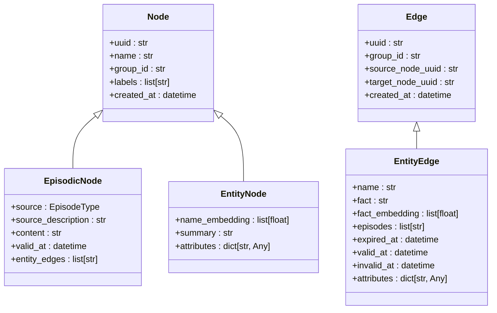
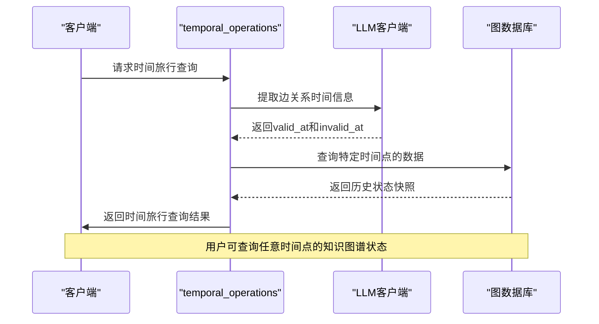
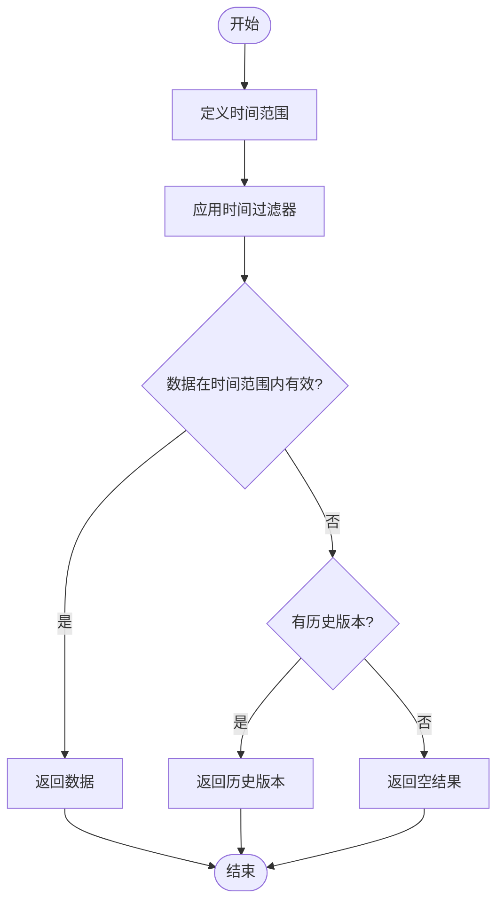

# 时间旅行查询

<cite>
**本文档引用的文件**   
- [temporal_operations.py](file://graphiti_core/utils/maintenance/temporal_operations.py)
- [datetime_utils.py](file://graphiti_core/utils/datetime_utils.py)
- [node_db_queries.py](file://graphiti_core/models/nodes/node_db_queries.py)
- [edge_db_queries.py](file://graphiti_core/models/edges/edge_db_queries.py)
- [search_filters.py](file://graphiti_core/search/search_filters.py)
- [nodes.py](file://graphiti_core/nodes.py)
- [edges.py](file://graphiti_core/edges.py)
- [search.py](file://graphiti_core/search/search.py)
- [search_utils.py](file://graphiti_core/search/search_utils.py)
- [search_config.py](file://graphiti_core/search/search_config.py)
- [test_temporal_operations_int.py](file://tests/utils/maintenance/test_temporal_operations_int.py)
</cite>

## 目录
1. [引言](#引言)
2. [双时间数据模型设计原理](#双时间数据模型设计原理)
3. [时间旅行查询实现](#时间旅行查询实现)
4. [时间范围过滤与版本控制](#时间范围过滤与版本控制)
5. [实际用例](#实际用例)
6. [性能优化建议](#性能优化建议)
7. [结论](#结论)

## 引言
本文档详细阐述了时间感知功能的专项设计，重点介绍双时间数据模型（双时间轴：事务时间与有效时间）的设计原理与优势。文档说明了如何通过temporal_operations实现历史状态查询（"时间旅行"），例如检索特定时间点的知识图谱快照。同时，文档描述了时间范围过滤、版本控制和数据生命周期管理的实现细节，提供了审计追踪、状态回滚和趋势分析等实际用例，并给出了时间精度配置、索引优化和查询性能的指导建议。

**Section sources**
- [temporal_operations.py](file://graphiti_core/utils/maintenance/temporal_operations.py#L1-L108)
- [datetime_utils.py](file://graphiti_core/utils/datetime_utils.py#L1-L56)

## 双时间数据模型设计原理
双时间数据模型采用事务时间与有效时间两个时间轴来管理数据的时间维度。事务时间记录数据在数据库中被创建或修改的时间，而有效时间表示数据在现实世界中为真或有效的时间段。这种设计允许系统同时追踪数据的历史状态和现实世界的时间变化。

在本系统中，EpisodicNode类包含valid_at字段，表示原始文档创建的时间，即有效时间。EntityEdge类包含valid_at、invalid_at和expired_at字段，用于精确控制边关系的有效期。这种设计使得系统能够准确地表示事实在特定时间点的状态，支持复杂的时间查询和历史数据分析。

**Diagram sources **
- [nodes.py](file://graphiti_core/nodes.py#L87-L807)
- [edges.py](file://graphiti_core/edges.py#L45-L632)

**Section sources**
- [nodes.py](file://graphiti_core/nodes.py#L295-L306)
- [edges.py](file://graphiti_core/edges.py#L221-L240)

## 时间旅行查询实现
时间旅行查询通过temporal_operations模块中的函数实现，允许用户检索特定时间点的知识图谱快照。系统利用有效时间（valid_at）和事务时间（created_at）来确定数据在特定时间点的状态。

核心功能由extract_edge_dates和get_edge_contradictions函数实现。extract_edge_dates函数使用LLM客户端从边关系事实中提取有效时间范围，而get_edge_contradictions函数检测新边关系与现有边关系之间的矛盾，实现自动版本控制和数据一致性维护。

**Diagram sources **
- [temporal_operations.py](file://graphiti_core/utils/maintenance/temporal_operations.py#L33-L71)
- [temporal_operations.py](file://graphiti_core/utils/maintenance/temporal_operations.py#L74-L107)

**Section sources**
- [temporal_operations.py](file://graphiti_core/utils/maintenance/temporal_operations.py#L33-L108)
- [search.py](file://graphiti_core/search/search.py#L68-L183)

## 时间范围过滤与版本控制
系统通过search_filters模块实现时间范围过滤功能，支持基于有效时间、事务时间和其他时间字段的复杂查询。SearchFilters类定义了valid_at、invalid_at、created_at和expired_at等时间过滤条件，允许用户精确指定时间范围。

版本控制通过检测边关系之间的矛盾实现。当新边关系与现有边关系冲突时，系统自动标记旧边关系为无效。这种机制确保了数据的一致性和准确性，同时保留了历史信息供审计和分析使用。

**Diagram sources **
- [search_filters.py](file://graphiti_core/search/search_filters.py#L37-L54)
- [edges.py](file://graphiti_core/edges.py#L235-L237)

**Section sources**
- [search_filters.py](file://graphiti_core/search/search_filters.py#L37-L252)
- [edges.py](file://graphiti_core/edges.py#L221-L240)

## 实际用例
### 审计追踪
系统能够完整记录数据的变更历史，支持详细的审计追踪。通过查询特定时间范围内的数据变更，可以重建系统的完整历史状态，满足合规性和审计要求。

### 状态回滚
当系统出现错误或需要恢复到先前状态时，时间旅行查询功能允许快速回滚到任意历史时间点的状态。这种能力对于数据恢复和错误纠正至关重要。

### 趋势分析
通过分析不同时间点的数据状态，系统支持复杂的时间序列分析和趋势预测。用户可以观察实体关系随时间的变化模式，发现潜在的业务洞察。

**Section sources**
- [test_temporal_operations_int.py](file://tests/utils/maintenance/test_temporal_operations_int.py#L94-L269)
- [search.py](file://graphiti_core/search/search.py#L68-L183)

## 性能优化建议
### 时间精度配置
合理配置时间精度可以显著影响查询性能。对于不需要高精度时间的应用场景，建议使用较低的时间精度，减少索引大小和查询复杂度。

### 索引优化
为时间字段创建适当的索引是提高查询性能的关键。建议为valid_at、created_at等常用时间过滤字段创建复合索引，以加速时间范围查询。

### 查询性能
使用批量查询和并行处理可以提高大规模时间查询的性能。避免在单个查询中处理过多的时间点，而是将大范围查询分解为多个小范围查询并行执行。

**Section sources**
- [node_db_queries.py](file://graphiti_core/models/nodes/node_db_queries.py#L22-L58)
- [edge_db_queries.py](file://graphiti_core/models/edges/edge_db_queries.py#L63-L121)
- [search_utils.py](file://graphiti_core/search/search_utils.py#L70-L81)

## 结论
双时间数据模型为系统提供了强大的时间感知能力，支持复杂的时间旅行查询和历史状态分析。通过事务时间与有效时间的结合，系统能够准确地表示和查询数据在不同时间点的状态。时间范围过滤、版本控制和数据生命周期管理功能确保了数据的一致性和完整性。实际用例表明，该设计在审计追踪、状态回滚和趋势分析等方面具有重要价值。通过合理的性能优化，系统能够在大规模数据集上高效执行时间查询，满足各种应用场景的需求。