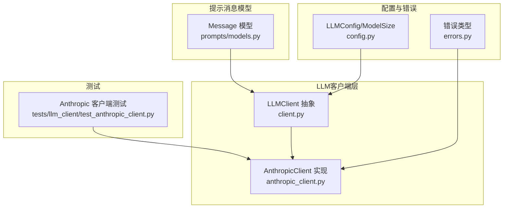
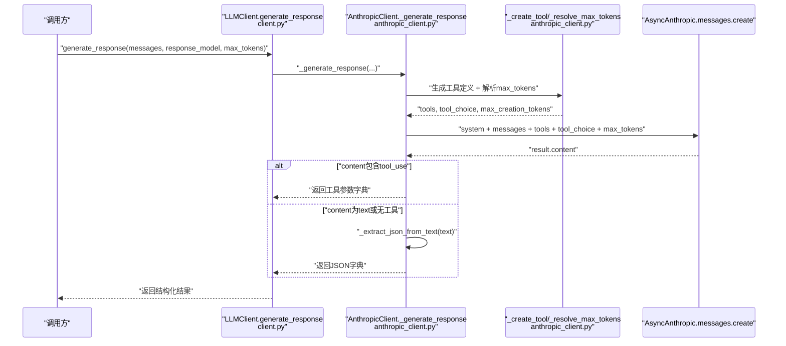
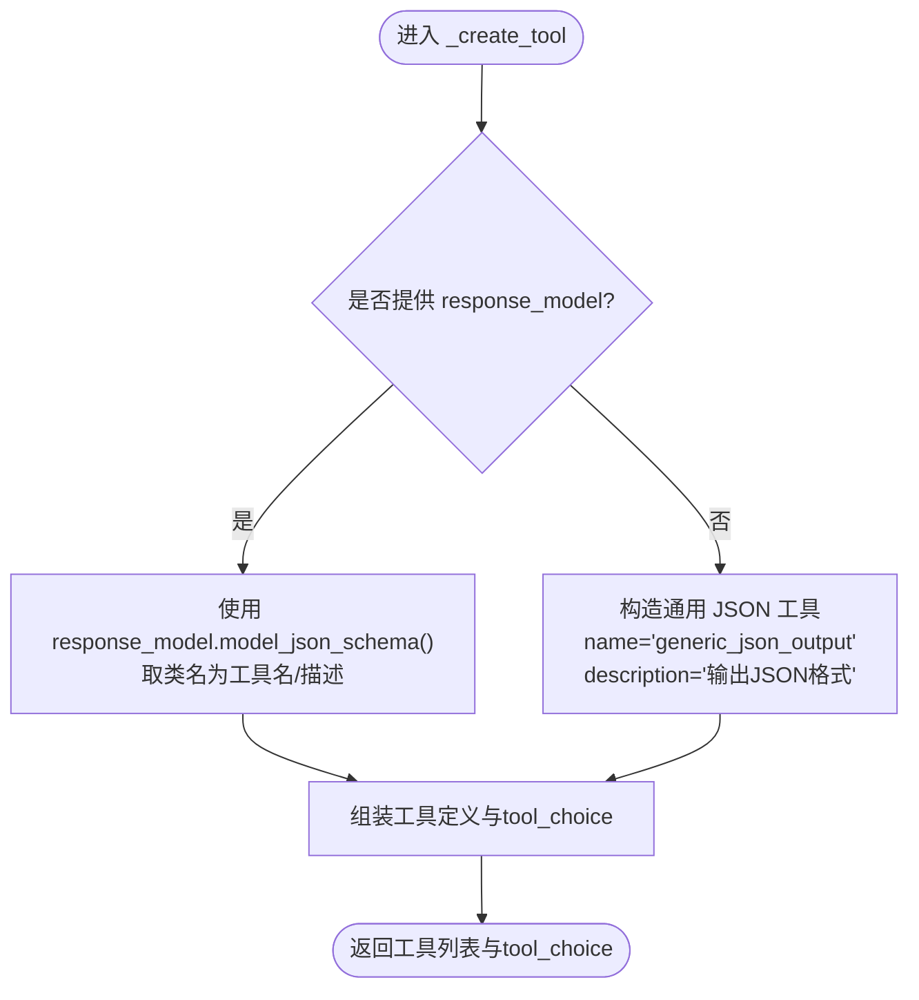
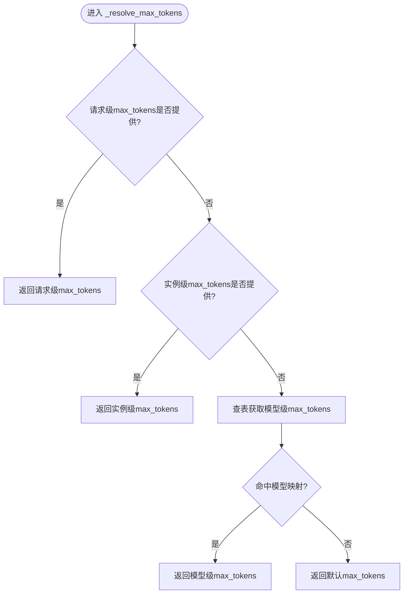
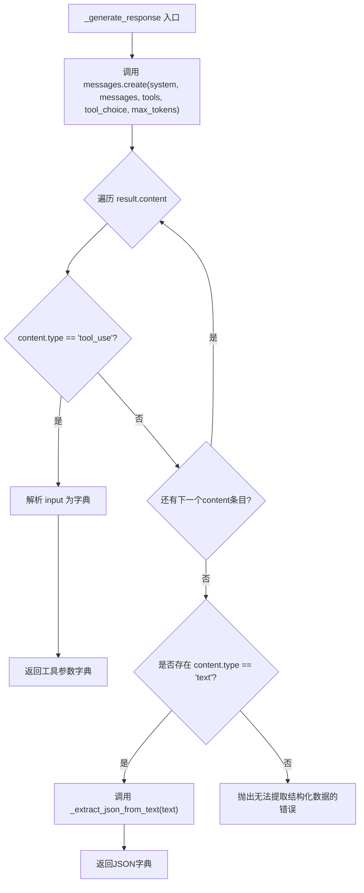
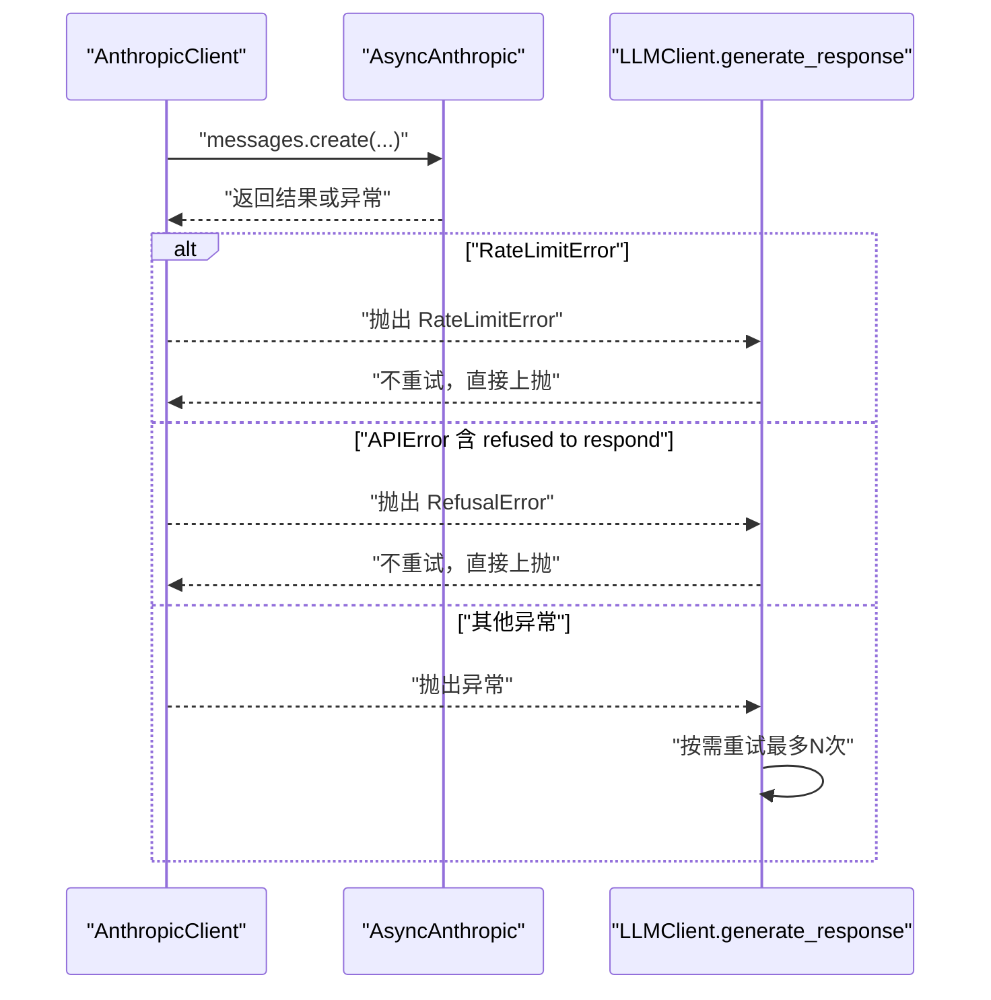
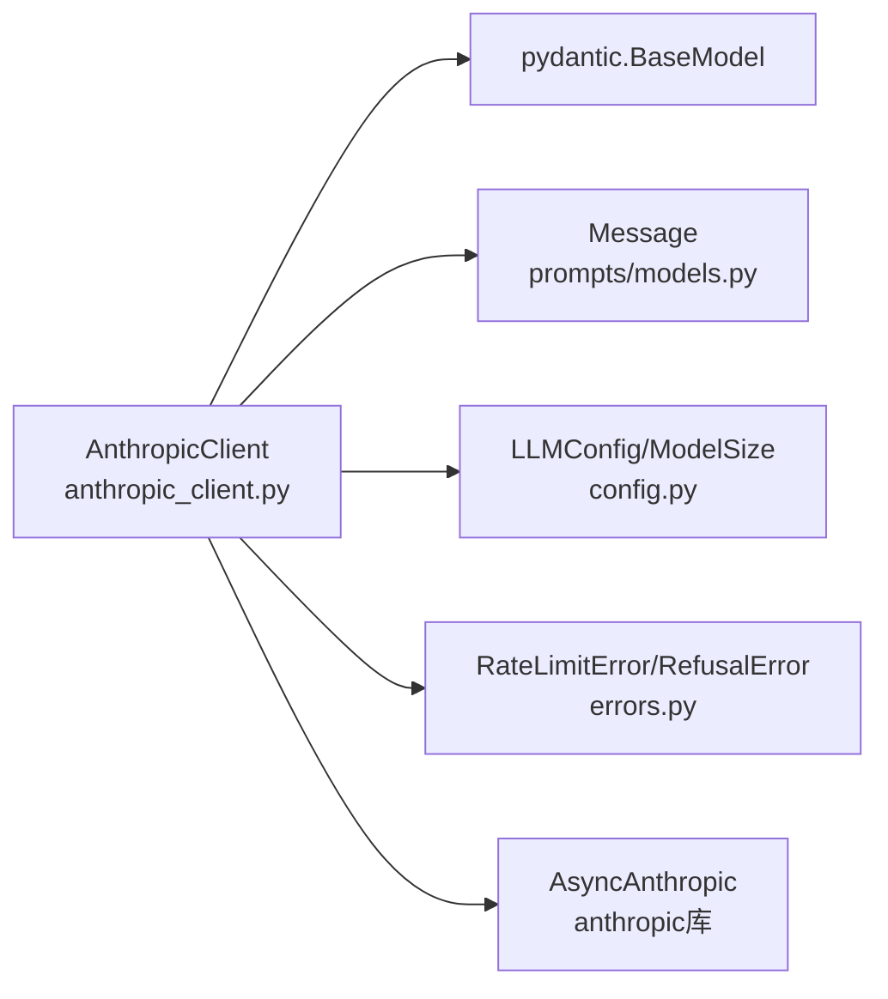
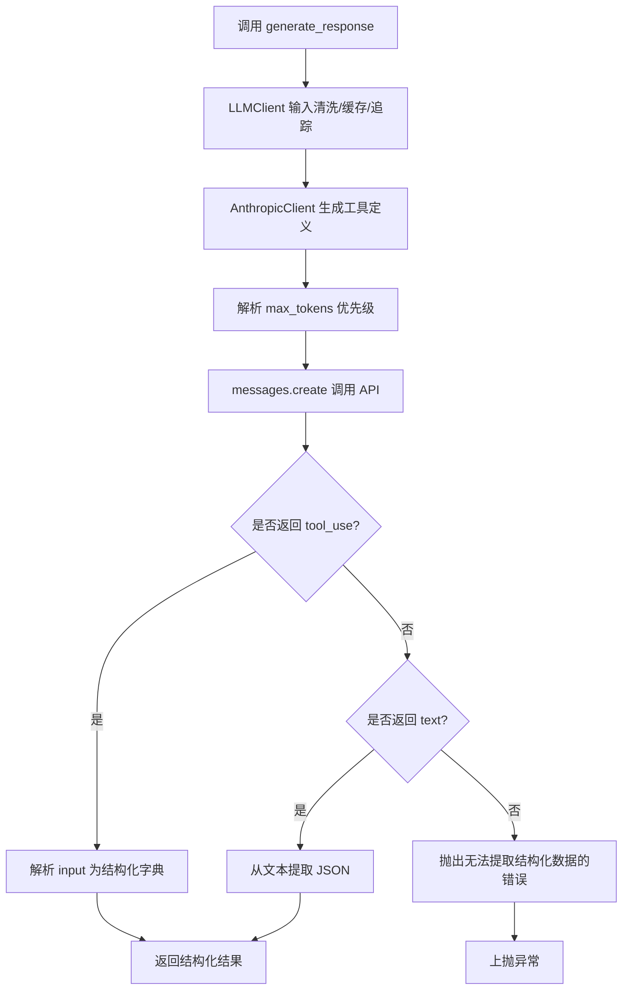

# Anthropic客户端

<cite>
**本文引用的文件**
- [anthropic_client.py](file://graphiti_core/llm_client/anthropic_client.py)
- [client.py](file://graphiti_core/llm_client/client.py)
- [errors.py](file://graphiti_core/llm_client/errors.py)
- [config.py](file://graphiti_core/llm_client/config.py)
- [models.py](file://graphiti_core/prompts/models.py)
- [test_anthropic_client.py](file://tests/llm_client/test_anthropic_client.py)
</cite>

## 目录
1. [简介](#简介)
2. [项目结构](#项目结构)
3. [核心组件](#核心组件)
4. [架构总览](#架构总览)
5. [详细组件分析](#详细组件分析)
6. [依赖关系分析](#依赖关系分析)
7. [性能考量](#性能考量)
8. [故障排查指南](#故障排查指南)
9. [结论](#结论)
10. [附录](#附录)

## 简介
本文件深入解析 Anthropic 客户端（AnthropicClient）的实现，重点说明其“工具调用（tool use）”架构设计：通过为每次请求动态生成工具定义，强制模型以结构化输出的方式返回结果，从而统一并稳定地获取结构化数据。文档将详细阐述以下关键点：
- 基于 Pydantic 模型的工具定义生成逻辑（_create_tool 方法）
- 通用 JSON 输出工具的回退机制
- 最大输出令牌（max_tokens）解析逻辑及优先级顺序
- 从工具使用响应中提取结构化数据的流程
- 当工具调用失败时从文本内容中回退提取 JSON 的策略
- 对 Claude 模型家族（如 claude-3、claude-4.5）的支持与不同模型的最大输出令牌限制
- 独特的错误处理策略：将内容策略违规转换为拒绝错误（RefusalError），避免无意义重试

## 项目结构
Anthropic 客户端位于 graphiti_core/llm_client 目录下，与通用 LLM 抽象、错误类型、配置等模块协同工作。整体结构如下：

图表来源
- [client.py](file://graphiti_core/llm_client/client.py#L66-L214)
- [anthropic_client.py](file://graphiti_core/llm_client/anthropic_client.py#L103-L430)
- [config.py](file://graphiti_core/llm_client/config.py#L1-L69)
- [errors.py](file://graphiti_core/llm_client/errors.py#L1-L40)
- [models.py](file://graphiti_core/prompts/models.py#L23-L33)
- [test_anthropic_client.py](file://tests/llm_client/test_anthropic_client.py#L1-L256)

章节来源
- [client.py](file://graphiti_core/llm_client/client.py#L66-L214)
- [anthropic_client.py](file://graphiti_core/llm_client/anthropic_client.py#L103-L430)
- [config.py](file://graphiti_core/llm_client/config.py#L1-L69)
- [errors.py](file://graphiti_core/llm_client/errors.py#L1-L40)
- [models.py](file://graphiti_core/prompts/models.py#L23-L33)
- [test_anthropic_client.py](file://tests/llm_client/test_anthropic_client.py#L1-L256)

## 核心组件
- AnthropicClient：面向 Anthropic Claude 的异步客户端，基于工具调用实现结构化输出，支持请求级、实例级、模型级最大输出令牌优先级解析，并内置 JSON 回退提取与拒绝错误处理。
- LLMClient 抽象：提供统一的输入清洗、缓存、追踪、重试与生成流程封装。
- LLMConfig/ModelSize：提供模型名称、温度、最大输出令牌等配置项。
- 错误类型：RateLimitError、RefusalError、EmptyResponseError。
- Message：提示消息的数据结构。

章节来源
- [anthropic_client.py](file://graphiti_core/llm_client/anthropic_client.py#L103-L430)
- [client.py](file://graphiti_core/llm_client/client.py#L66-L214)
- [config.py](file://graphiti_core/llm_client/config.py#L1-L69)
- [errors.py](file://graphiti_core/llm_client/errors.py#L1-L40)
- [models.py](file://graphiti_core/prompts/models.py#L23-L33)

## 架构总览
AnthropicClient 的核心思想是“工具驱动的结构化输出”。无论是否提供 Pydantic 模型，都会为每次请求动态生成一个工具定义，并要求模型以工具调用的形式返回结构化数据；若模型未按约定返回工具调用，则尝试从文本内容中提取 JSON。同时，客户端对不同 Claude 模型的最大输出令牌进行映射，并在生成阶段动态解析优先级，确保不同模型充分利用其输出能力。

图表来源
- [client.py](file://graphiti_core/llm_client/client.py#L149-L214)
- [anthropic_client.py](file://graphiti_core/llm_client/anthropic_client.py#L254-L430)

## 详细组件分析

### 工具定义生成：_create_tool
- 若提供 response_model（Pydantic 模型），则使用该模型的 JSON Schema 作为工具输入模式，并以模型类名作为工具名与描述。
- 若未提供 response_model，则生成一个通用 JSON 输出工具，允许任意 JSON 结构，便于在无强类型约束时仍能获得结构化输出。
- 返回值包含工具列表与 tool_choice，用于在 API 请求中启用工具调用。

图表来源
- [anthropic_client.py](file://graphiti_core/llm_client/anthropic_client.py#L177-L214)

章节来源
- [anthropic_client.py](file://graphiti_core/llm_client/anthropic_client.py#L177-L214)
- [test_anthropic_client.py](file://tests/llm_client/test_anthropic_client.py#L209-L224)

### 最大输出令牌解析：_resolve_max_tokens 与 _get_max_tokens_for_model
- 优先级顺序（最高到最低）：
  1) 请求级 max_tokens（调用 generate_response 时传入）
  2) 实例级 max_tokens（客户端初始化时设置）
  3) 模型级映射（根据模型名查表）
  4) 默认值（DEFAULT_ANTHROPIC_MAX_TOKENS）
- 不同 Claude 模型的最大输出令牌限制来自内置映射，例如 Claude 4.5 系列通常为 65536，Claude 3.5 系列通常为 8192，Claude 3 系列通常为 4096，Claude 2 系列通常为 4096。

图表来源
- [anthropic_client.py](file://graphiti_core/llm_client/anthropic_client.py#L215-L253)
- [anthropic_client.py](file://graphiti_core/llm_client/anthropic_client.py#L70-L101)

章节来源
- [anthropic_client.py](file://graphiti_core/llm_client/anthropic_client.py#L215-L253)
- [anthropic_client.py](file://graphiti_core/llm_client/anthropic_client.py#L70-L101)

### 结构化数据提取流程
- 生成阶段：客户端调用 AsyncAnthropic.messages.create，传入 tools 与 tool_choice。
- 成功路径：遍历 result.content，若存在 type 为 tool_use 的条目，解析其 input（字典或字符串 JSON）并直接返回。
- 回退路径：若不存在 tool_use，但存在 text 条目，则调用 _extract_json_from_text 从文本中提取 JSON 字典；否则抛出错误。
- 失败路径：捕获速率限制与 API 异常；对内容策略违规（含“refused to respond”字样）转换为 RefusalError，避免重试。

图表来源
- [anthropic_client.py](file://graphiti_core/llm_client/anthropic_client.py#L254-L332)

章节来源
- [anthropic_client.py](file://graphiti_core/llm_client/anthropic_client.py#L254-L332)

### JSON 回退提取：_extract_json_from_text
- 从文本中查找第一个 '{' 与最后一个 '}'，截取子串并解析为 JSON 字典。
- 若找不到有效 JSON 或解析失败，抛出 ValueError，交由上层重试或错误处理逻辑处理。

章节来源
- [anthropic_client.py](file://graphiti_core/llm_client/anthropic_client.py#L151-L176)
- [test_anthropic_client.py](file://tests/llm_client/test_anthropic_client.py#L199-L209)

### Claude 模型家族支持与最大输出令牌
- 内置模型枚举与默认模型（DEFAULT_MODEL）覆盖 Claude 4.5、3.7、3.5、3、2 等系列。
- ANTHROPIC_MODEL_MAX_TOKENS 映射提供各模型的标准最大输出令牌限制，未在映射中的模型使用默认值。
- 该映射用于在生成阶段动态解析 max_tokens，使不同模型充分利用其输出能力。

章节来源
- [anthropic_client.py](file://graphiti_core/llm_client/anthropic_client.py#L49-L101)
- [anthropic_client.py](file://graphiti_core/llm_client/anthropic_client.py#L215-L253)

### 错误处理策略：RefusalError 与重试控制
- 速率限制：捕获 RateLimitError 并向上抛出，不触发重试。
- 内容策略违规：捕获 APIError，若消息包含“refused to respond”，转换为 RefusalError，避免重试。
- 其他异常：在 generate_response 中进行有限次数重试；若 response_model 存在，验证失败会将错误信息作为后续用户消息注入，引导模型修正输出。
- LLMClient 层提供统一的重试装饰器与缓存、追踪能力，AnthropicClient 在其之上叠加了专用错误策略。

图表来源
- [anthropic_client.py](file://graphiti_core/llm_client/anthropic_client.py#L321-L332)
- [client.py](file://graphiti_core/llm_client/client.py#L110-L142)

章节来源
- [anthropic_client.py](file://graphiti_core/llm_client/anthropic_client.py#L321-L332)
- [client.py](file://graphiti_core/llm_client/client.py#L110-L142)
- [errors.py](file://graphiti_core/llm_client/errors.py#L18-L40)

### 与 LLMClient 的协作
- LLMClient 负责：
  - 输入清洗（去除无效字符与零宽字符）
  - 缓存（可选）
  - 追踪（span）
  - 统一的 generate_response 流程与重试装饰器
  - 在有 response_model 时追加 JSON Schema 指令
- AnthropicClient 覆写 _generate_response，实现工具调用与结构化输出提取，并在错误处理上增加 RefusalError 特殊分支。

章节来源
- [client.py](file://graphiti_core/llm_client/client.py#L66-L214)
- [anthropic_client.py](file://graphiti_core/llm_client/anthropic_client.py#L333-L430)

## 依赖关系分析
- AnthropicClient 依赖：
  - anthropic.AsyncAnthropic（外部库）
  - pydantic.BaseModel（用于工具定义与结构化输出校验）
  - graphiti_core.prompts.models.Message（消息结构）
  - graphiti_core.llm_client.config.LLMConfig/ModelSize（配置）
  - graphiti_core.llm_client.errors.RateLimitError/RefusalError（错误类型）

图表来源
- [anthropic_client.py](file://graphiti_core/llm_client/anthropic_client.py#L1-L66)
- [models.py](file://graphiti_core/prompts/models.py#L23-L33)
- [config.py](file://graphiti_core/llm_client/config.py#L1-L69)
- [errors.py](file://graphiti_core/llm_client/errors.py#L1-L40)

章节来源
- [anthropic_client.py](file://graphiti_core/llm_client/anthropic_client.py#L1-L66)
- [models.py](file://graphiti_core/prompts/models.py#L23-L33)
- [config.py](file://graphiti_core/llm_client/config.py#L1-L69)
- [errors.py](file://graphiti_core/llm_client/errors.py#L1-L40)

## 性能考量
- 动态解析 max_tokens：根据模型能力选择上限，避免过小限制导致截断，过大限制导致成本上升。
- 工具调用优先：减少模型“自由发挥”的不确定性，降低后处理成本。
- 缓存与追踪：LLMClient 提供可选缓存与追踪，有助于定位性能瓶颈与重复调用。
- 重试策略：仅对可恢复错误重试，避免对速率限制与内容策略违规进行无意义重试。

[本节为通用建议，无需列出具体文件来源]

## 故障排查指南
- 工具调用未返回：确认 response_model 是否正确传入，或是否期望通用 JSON 工具；检查 _create_tool 的返回值。
- JSON 回退失败：检查文本中是否包含可被 _extract_json_from_text 正确识别的 JSON 片段；必要时放宽输入清洗规则或提供更明确的 JSON 指令。
- 速率限制：收到 RateLimitError 时应等待或降低并发；RefusalError 表示内容策略违规，需调整提示或输入内容。
- 模型上限不足：检查 ANTHROPIC_MODEL_MAX_TOKENS 映射与 _resolve_max_tokens 的优先级，必要时显式传入更大的 max_tokens。
- 重试循环：若 response_model 验证失败，系统会将错误信息作为新用户消息注入并重试；观察日志可定位问题。

章节来源
- [anthropic_client.py](file://graphiti_core/llm_client/anthropic_client.py#L151-L176)
- [anthropic_client.py](file://graphiti_core/llm_client/anthropic_client.py#L254-L332)
- [anthropic_client.py](file://graphiti_core/llm_client/anthropic_client.py#L333-L430)
- [client.py](file://graphiti_core/llm_client/client.py#L110-L142)
- [errors.py](file://graphiti_core/llm_client/errors.py#L18-L40)

## 结论
AnthropicClient 通过“工具驱动的结构化输出”实现了对所有请求的一致性与稳定性，结合 Pydantic 模型的强类型约束与通用 JSON 工具的回退机制，能够在不同 Claude 模型之间灵活适配并充分利用其输出能力。其独特的错误处理策略（将内容策略违规转换为拒绝错误）有效避免了无效重试，提升了系统的鲁棒性与成本效率。

[本节为总结性内容，无需列出具体文件来源]

## 附录

### 关键流程图：从工具使用到结构化输出

图表来源
- [client.py](file://graphiti_core/llm_client/client.py#L149-L214)
- [anthropic_client.py](file://graphiti_core/llm_client/anthropic_client.py#L177-L214)
- [anthropic_client.py](file://graphiti_core/llm_client/anthropic_client.py#L215-L253)
- [anthropic_client.py](file://graphiti_core/llm_client/anthropic_client.py#L254-L332)