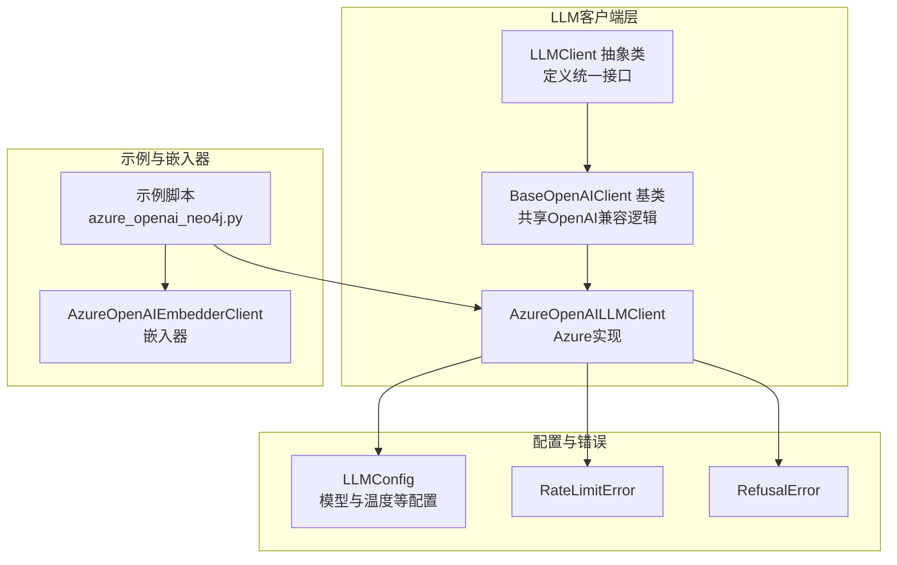
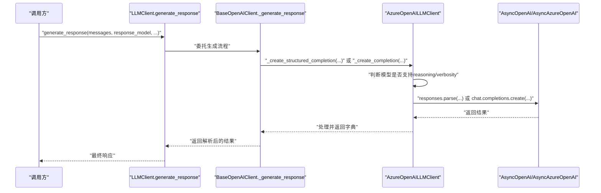
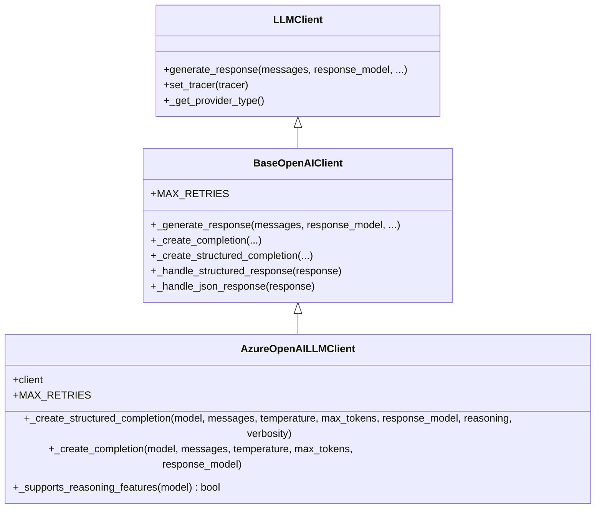
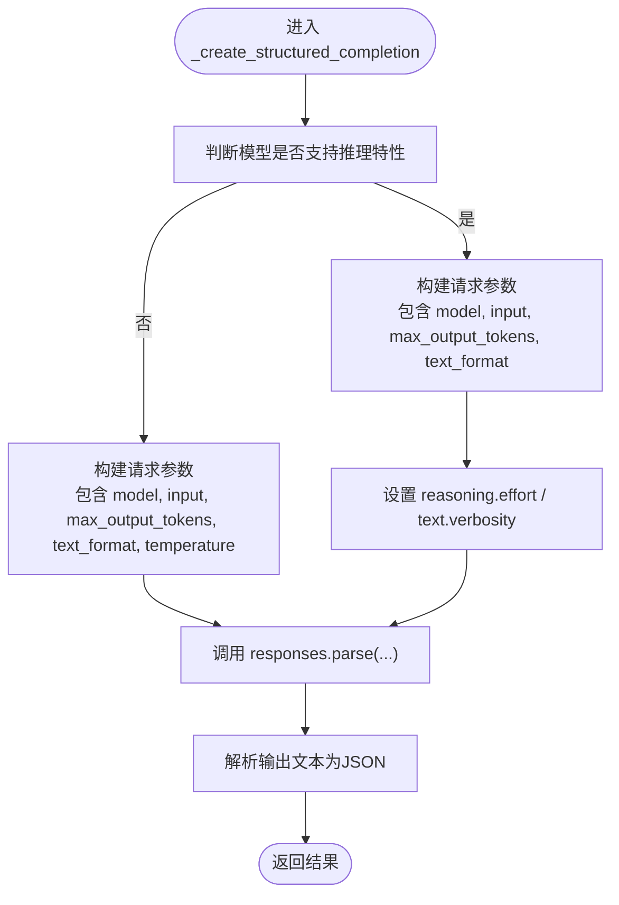
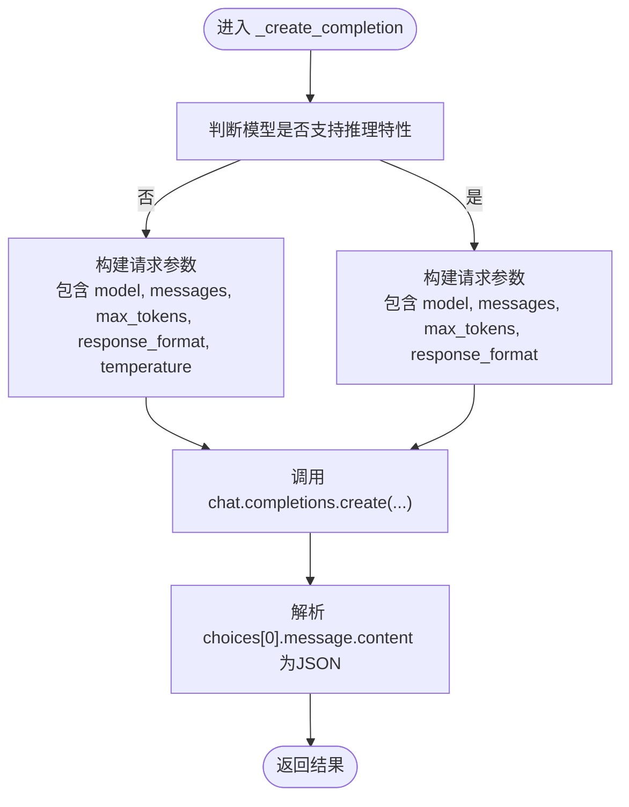
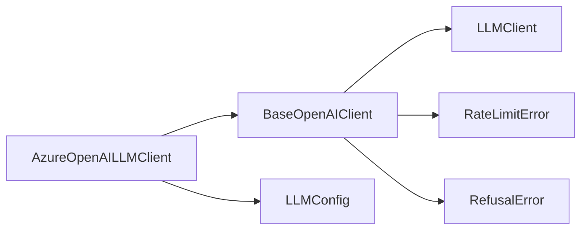

# Azure OpenAI客户端

<cite>
**本文引用的文件**
- [graphiti_core/llm_client/azure_openai_client.py](file://graphiti_core/llm_client/azure_openai_client.py)
- [graphiti_core/llm_client/openai_base_client.py](file://graphiti_core/llm_client/openai_base_client.py)
- [graphiti_core/llm_client/client.py](file://graphiti_core/llm_client/client.py)
- [graphiti_core/llm_client/config.py](file://graphiti_core/llm_client/config.py)
- [graphiti_core/llm_client/errors.py](file://graphiti_core/llm_client/errors.py)
- [graphiti_core/embedder/azure_openai.py](file://graphiti_core/embedder/azure_openai.py)
- [examples/azure-openai/azure_openai_neo4j.py](file://examples/azure-openai/azure_openai_neo4j.py)
- [examples/azure-openai/README.md](file://examples/azure-openai/README.md)
- [examples/azure-openai/.env.example](file://examples/azure-openai/.env.example)
- [tests/llm_client/test_azure_openai_client.py](file://tests/llm_client/test_azure_openai_client.py)
</cite>

## 目录
1. [简介](#简介)
2. [项目结构](#项目结构)
3. [核心组件](#核心组件)
4. [架构总览](#架构总览)
5. [详细组件分析](#详细组件分析)
6. [依赖关系分析](#依赖关系分析)
7. [性能考量](#性能考量)
8. [故障排查指南](#故障排查指南)
9. [结论](#结论)
10. [附录](#附录)

## 简介
本文件系统性说明 Azure OpenAI 客户端的设计与实现，重点围绕 AzureOpenAILLMClient 类展开，解释其如何通过 AsyncAzureOpenAI 或兼容 Azure v1 API 的 AsyncOpenAI 实例作为依赖；如何利用 responses.parse API 进行结构化补全；以及如何适配 Azure 推理模型（如 o1、o3、gpt-5）的 reasoning 和 verbosity 参数。同时提供在 Azure 环境中配置客户端、管理资源部署与处理常见错误的实用指南。

## 项目结构
Azure OpenAI 客户端位于 LLM 客户端子系统中，采用“抽象基类 + 具体实现”的分层设计：
- 抽象接口与通用逻辑：LLMClient 抽象类、BaseOpenAIClient 基类
- Azure 实现：AzureOpenAILLMClient
- 配置与错误类型：LLMConfig、RateLimitError、RefusalError
- 示例与嵌入器：示例脚本展示如何将 Azure OpenAI 与 Neo4j 结合；嵌入器 AzureOpenAIEmbedderClient 展示了与 Azure OpenAI 的一致用法

图表来源
- [graphiti_core/llm_client/client.py](file://graphiti_core/llm_client/client.py#L66-L243)
- [graphiti_core/llm_client/openai_base_client.py](file://graphiti_core/llm_client/openai_base_client.py#L40-L262)
- [graphiti_core/llm_client/azure_openai_client.py](file://graphiti_core/llm_client/azure_openai_client.py#L30-L116)
- [graphiti_core/llm_client/config.py](file://graphiti_core/llm_client/config.py#L28-L69)
- [graphiti_core/llm_client/errors.py](file://graphiti_core/llm_client/errors.py#L18-L40)
- [examples/azure-openai/azure_openai_neo4j.py](file://examples/azure-openai/azure_openai_neo4j.py#L68-L100)
- [graphiti_core/embedder/azure_openai.py](file://graphiti_core/embedder/azure_openai.py#L27-L72)

章节来源
- [graphiti_core/llm_client/client.py](file://graphiti_core/llm_client/client.py#L66-L243)
- [graphiti_core/llm_client/openai_base_client.py](file://graphiti_core/llm_client/openai_base_client.py#L40-L262)
- [graphiti_core/llm_client/azure_openai_client.py](file://graphiti_core/llm_client/azure_openai_client.py#L30-L116)
- [examples/azure-openai/azure_openai_neo4j.py](file://examples/azure-openai/azure_openai_neo4j.py#L68-L100)

## 核心组件
- AzureOpenAILLMClient：面向 Azure OpenAI 的具体实现，支持两种客户端注入方式：
  - AsyncAzureOpenAI：原生 Azure 客户端
  - AsyncOpenAI（配置为 Azure v1 API 端点）：通过 base_url 指向 Azure 资源的 /openai/v1/ 兼容层
- BaseOpenAIClient：封装 OpenAI 兼容的通用逻辑，包括消息格式转换、响应解析、重试与错误处理
- LLMClient：抽象接口，定义统一的 generate_response 流程
- LLMConfig：模型名称、温度、最大 token 等配置
- 错误类型：RateLimitError、RefusalError 等

章节来源
- [graphiti_core/llm_client/azure_openai_client.py](file://graphiti_core/llm_client/azure_openai_client.py#L30-L116)
- [graphiti_core/llm_client/openai_base_client.py](file://graphiti_core/llm_client/openai_base_client.py#L40-L262)
- [graphiti_core/llm_client/client.py](file://graphiti_core/llm_client/client.py#L66-L243)
- [graphiti_core/llm_client/config.py](file://graphiti_core/llm_client/config.py#L28-L69)
- [graphiti_core/llm_client/errors.py](file://graphiti_core/llm_client/errors.py#L18-L40)

## 架构总览
AzureOpenAILLMClient 在调用链中的位置如下：
- 外部调用通过 LLMClient.generate_response 触发
- BaseOpenAIClient 负责消息格式转换、模型选择、重试与错误处理
- AzureOpenAILLMClient 提供具体实现：
  - 结构化补全：使用 responses.parse API
  - 非结构化补全：使用 chat.completions.create 并强制 response_format 为 json_object
- 对 Azure 推理模型（o1/o3/gpt-5）进行特殊处理：根据模型前缀决定是否启用 reasoning/verbosity，并在这些模型上移除 temperature

图表来源
- [graphiti_core/llm_client/client.py](file://graphiti_core/llm_client/client.py#L149-L214)
- [graphiti_core/llm_client/openai_base_client.py](file://graphiti_core/llm_client/openai_base_client.py#L132-L209)
- [graphiti_core/llm_client/azure_openai_client.py](file://graphiti_core/llm_client/azure_openai_client.py#L56-L116)

## 详细组件分析

### AzureOpenAILLMClient 设计要点
- 依赖注入：构造函数接收 AsyncAzureOpenAI 或 AsyncOpenAI 实例，并将其保存为内部 client
- 结构化补全：使用 responses.parse API，传入 model、messages、max_output_tokens、text_format 等参数
- 非结构化补全：使用 chat.completions.create，并设置 response_format 为 json_object
- Azure 推理模型适配：通过 _supports_reasoning_features 判断模型前缀是否为 o1/o3/gpt-5，若支持则：
  - 移除 temperature（避免与 reasoning/verbosity 冲突）
  - 支持 reasoning.effort 与 text.verbosity 参数

图表来源
- [graphiti_core/llm_client/client.py](file://graphiti_core/llm_client/client.py#L66-L243)
- [graphiti_core/llm_client/openai_base_client.py](file://graphiti_core/llm_client/openai_base_client.py#L40-L262)
- [graphiti_core/llm_client/azure_openai_client.py](file://graphiti_core/llm_client/azure_openai_client.py#L30-L116)

章节来源
- [graphiti_core/llm_client/azure_openai_client.py](file://graphiti_core/llm_client/azure_openai_client.py#L30-L116)

### 结构化补全流程（responses.parse）
- 输入参数映射：model、messages、max_output_tokens、text_format（Pydantic 模型类型）
- 温度控制：当模型支持推理特性时，移除 temperature，改由 reasoning 控制
- 推理与冗长度：当模型支持推理特性时，分别传入 reasoning.effort 与 text.verbosity
- 返回值处理：从 responses.parse 返回的对象中提取输出文本并解析为 JSON 字典

图表来源
- [graphiti_core/llm_client/azure_openai_client.py](file://graphiti_core/llm_client/azure_openai_client.py#L56-L86)
- [graphiti_core/llm_client/openai_base_client.py](file://graphiti_core/llm_client/openai_base_client.py#L116-L126)

章节来源
- [graphiti_core/llm_client/azure_openai_client.py](file://graphiti_core/llm_client/azure_openai_client.py#L56-L86)
- [tests/llm_client/test_azure_openai_client.py](file://tests/llm_client/test_azure_openai_client.py#L46-L74)

### 非结构化补全流程（chat.completions.create）
- 强制 JSON 输出：response_format 设置为 json_object
- 温度控制：当模型支持推理特性时，移除 temperature
- 返回值处理：从 choices[0].message.content 中读取 JSON 字符串并解析

图表来源
- [graphiti_core/llm_client/azure_openai_client.py](file://graphiti_core/llm_client/azure_openai_client.py#L87-L109)
- [graphiti_core/llm_client/openai_base_client.py](file://graphiti_core/llm_client/openai_base_client.py#L127-L131)

章节来源
- [graphiti_core/llm_client/azure_openai_client.py](file://graphiti_core/llm_client/azure_openai_client.py#L87-L109)
- [tests/llm_client/test_azure_openai_client.py](file://tests/llm_client/test_azure_openai_client.py#L101-L110)

### Azure 推理模型与参数适配
- 模型识别：以 o1、o3、gpt-5 开头的模型视为支持推理特性
- 温度移除：在推理模型上不传递 temperature，改由 reasoning 控制
- 推理与冗长度：推理模型支持 reasoning.effort 与 text.verbosity 参数

章节来源
- [graphiti_core/llm_client/azure_openai_client.py](file://graphiti_core/llm_client/azure_openai_client.py#L111-L116)
- [tests/llm_client/test_azure_openai_client.py](file://tests/llm_client/test_azure_openai_client.py#L76-L110)

### 与嵌入器的协同
- 嵌入器 AzureOpenAIEmbedderClient 同样支持 AsyncAzureOpenAI 或 AsyncOpenAI（Azure v1 API），用于语义搜索与图构建
- 两者共享相同的 Azure 客户端注入模式，便于在同一 Azure 资源下统一管理

章节来源
- [graphiti_core/embedder/azure_openai.py](file://graphiti_core/embedder/azure_openai.py#L27-L72)
- [examples/azure-openai/azure_openai_neo4j.py](file://examples/azure-openai/azure_openai_neo4j.py#L77-L90)

## 依赖关系分析
- 继承关系：AzureOpenAILLMClient 继承自 BaseOpenAIClient，后者继承自 LLMClient
- 依赖注入：AzureOpenAILLMClient 依赖 AsyncAzureOpenAI 或 AsyncOpenAI 实例
- 配置依赖：LLMConfig 提供模型名、温度、最大 token 等参数
- 错误类型：BaseOpenAIClient 在生成响应过程中抛出 RateLimitError、RefusalError 等

图表来源
- [graphiti_core/llm_client/azure_openai_client.py](file://graphiti_core/llm_client/azure_openai_client.py#L30-L116)
- [graphiti_core/llm_client/openai_base_client.py](file://graphiti_core/llm_client/openai_base_client.py#L40-L262)
- [graphiti_core/llm_client/client.py](file://graphiti_core/llm_client/client.py#L66-L243)
- [graphiti_core/llm_client/errors.py](file://graphiti_core/llm_client/errors.py#L18-L40)

章节来源
- [graphiti_core/llm_client/azure_openai_client.py](file://graphiti_core/llm_client/azure_openai_client.py#L30-L116)
- [graphiti_core/llm_client/openai_base_client.py](file://graphiti_core/llm_client/openai_base_client.py#L40-L262)
- [graphiti_core/llm_client/client.py](file://graphiti_core/llm_client/client.py#L66-L243)
- [graphiti_core/llm_client/errors.py](file://graphiti_core/llm_client/errors.py#L18-L40)

## 性能考量
- 重试策略：BaseOpenAIClient 在生成响应时内置重试机制，针对服务器错误与速率限制进行指数退避重试
- 缓存：LLMClient 支持可选缓存，可通过 set_tracer 与缓存目录进行追踪与命中优化（AzureOpenAILLMClient 默认未启用缓存）
- 请求参数：推理模型上移除 temperature，减少无效参数带来的 API 调用开销
- 批量嵌入：嵌入器支持批量创建，降低网络往返次数

章节来源
- [graphiti_core/llm_client/client.py](file://graphiti_core/llm_client/client.py#L110-L121)
- [graphiti_core/llm_client/client.py](file://graphiti_core/llm_client/client.py#L149-L214)
- [graphiti_core/embedder/azure_openai.py](file://graphiti_core/embedder/azure_openai.py#L61-L72)

## 故障排查指南
- Azure 端点与密钥
  - 确认 AZURE_OPENAI_ENDPOINT 以 .openai.azure.com 结尾
  - 确认 AZURE_OPENAI_API_KEY 正确且有权限访问部署
- 部署名称
  - AZURE_OPENAI_DEPLOYMENT 与 AZURE_OPENAI_EMBEDDING_DEPLOYMENT 必须与 Azure 控制台中的实际部署名称一致
- 推理模型参数
  - 对于 o1/o3/gpt-5 模型，不要手动传入 temperature；应通过 reasoning/verbosity 控制推理强度与输出冗长度
- 常见错误
  - 认证失败：检查 API Key 与端点
  - 速率限制：等待后重试或调整调用频率
  - 连接错误：检查网络连通性与代理设置
- 示例参考
  - 参考示例脚本中的初始化与环境变量配置，确保与实际 Azure 资源一致

章节来源
- [examples/azure-openai/README.md](file://examples/azure-openai/README.md#L129-L141)
- [examples/azure-openai/.env.example](file://examples/azure-openai/.env.example#L1-L11)
- [examples/azure-openai/azure_openai_neo4j.py](file://examples/azure-openai/azure_openai_neo4j.py#L56-L66)
- [graphiti_core/llm_client/openai_base_client.py](file://graphiti_core/llm_client/openai_base_client.py#L164-L183)

## 结论
AzureOpenAILLMClient 将 Azure OpenAI 的 responses.parse 与 chat.completions.create 能力整合到统一的 LLM 客户端接口中，通过模型前缀识别推理能力，并在推理模型上正确传递 reasoning/verbosity 参数，同时移除 temperature 以避免冲突。结合嵌入器与示例脚本，可在 Azure 环境中快速搭建基于知识图谱的实体抽取与关系分析流程。

## 附录

### 在 Azure 环境中配置客户端与部署管理
- 使用 AsyncOpenAI 与 Azure v1 API 兼容层
  - 将 base_url 设置为 https://your-resource-name.openai.azure.com/openai/v1/
  - 保持 api_key 为 Azure OpenAI 密钥
- 使用 AsyncAzureOpenAI
  - 直接传入 AsyncAzureOpenAI 实例，无需修改 base_url
- 部署管理
  - Chat Completion 模型部署名称写入 AZURE_OPENAI_DEPLOYMENT
  - Embedding 模型部署名称写入 AZURE_OPENAI_EMBEDDING_DEPLOYMENT
- 示例脚本
  - 参考示例脚本中的初始化流程，将 LLM 与嵌入器客户端注入 Graphiti

章节来源
- [examples/azure-openai/README.md](file://examples/azure-openai/README.md#L36-L41)
- [examples/azure-openai/README.md](file://examples/azure-openai/README.md#L82-L113)
- [examples/azure-openai/azure_openai_neo4j.py](file://examples/azure-openai/azure_openai_neo4j.py#L77-L100)