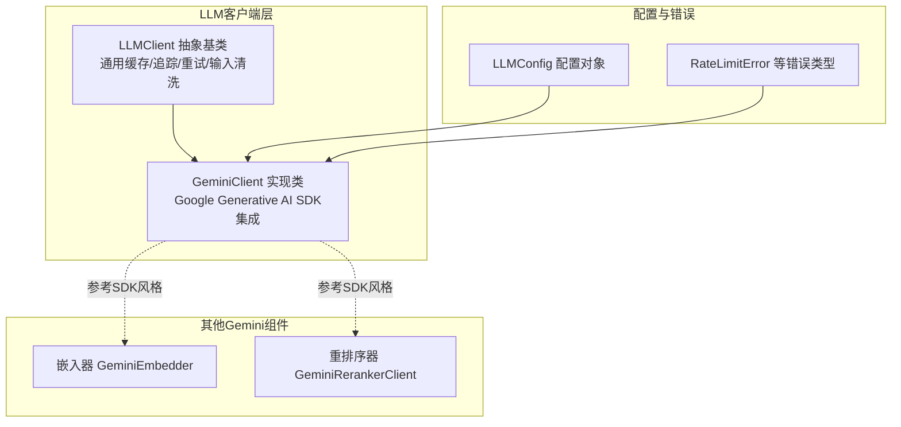
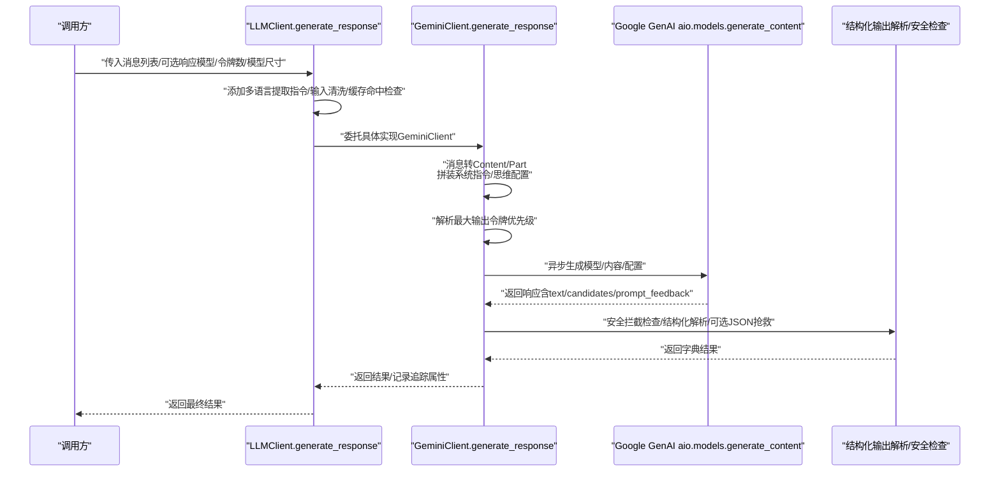
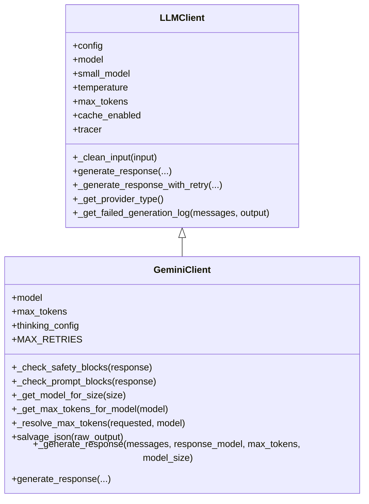
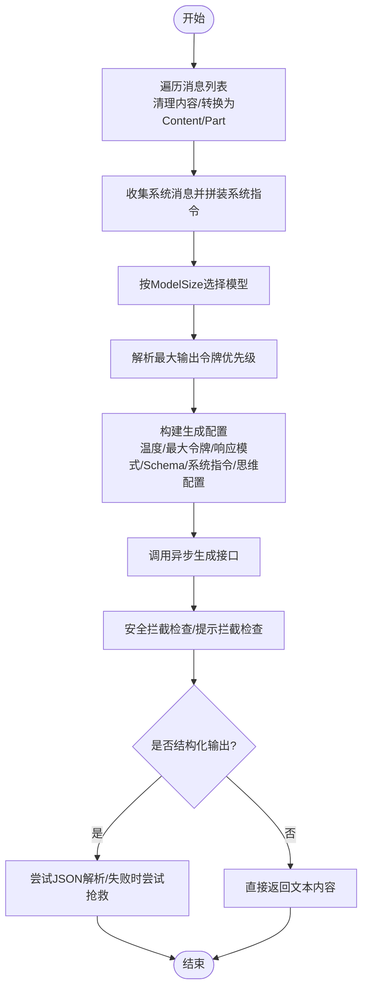
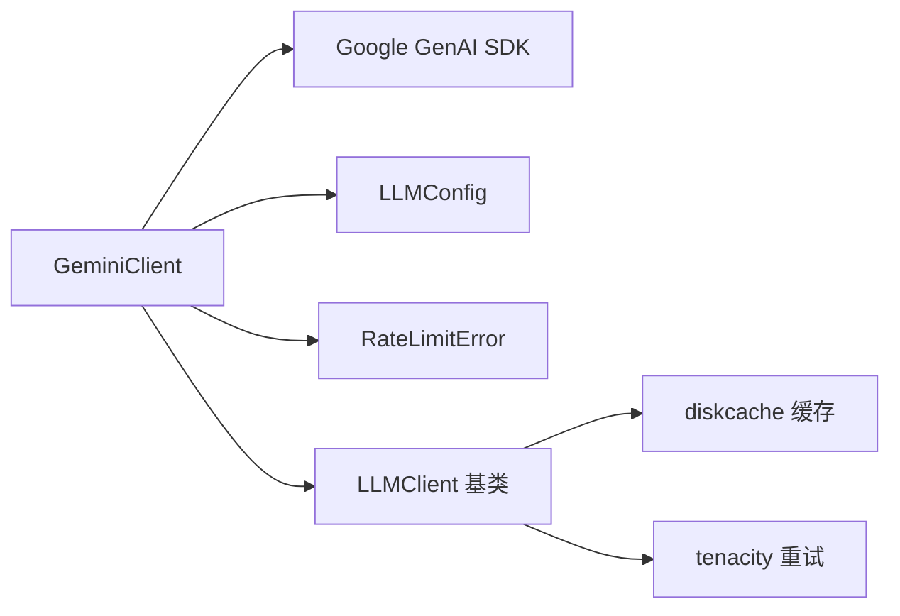

# Gemini客户端

<cite>
**本文引用的文件**
- [graphiti_core/llm_client/gemini_client.py](file://graphiti_core/llm_client/gemini_client.py)
- [graphiti_core/llm_client/client.py](file://graphiti_core/llm_client/client.py)
- [graphiti_core/llm_client/config.py](file://graphiti_core/llm_client/config.py)
- [graphiti_core/llm_client/errors.py](file://graphiti_core/llm_client/errors.py)
- [tests/llm_client/test_gemini_client.py](file://tests/llm_client/test_gemini_client.py)
- [graphiti_core/embedder/gemini.py](file://graphiti_core/embedder/gemini.py)
- [graphiti_core/cross_encoder/gemini_reranker_client.py](file://graphiti_core/cross_encoder/gemini_reranker_client.py)
</cite>

## 目录
1. [简介](#简介)
2. [项目结构](#项目结构)
3. [核心组件](#核心组件)
4. [架构总览](#架构总览)
5. [详细组件分析](#详细组件分析)
6. [依赖关系分析](#依赖关系分析)
7. [性能考量](#性能考量)
8. [故障排查指南](#故障排查指南)
9. [结论](#结论)
10. [附录](#附录)

## 简介
本文件面向Graphiti的Gemini客户端，系统性说明其如何基于Google Generative AI SDK与Gemini API进行集成，重点覆盖以下方面：
- 异步生成流程与消息格式转换
- 模型参数配置（温度、最大输出令牌、思维配置等）
- 结构化输出请求的处理（JSON模式提示与Pydantic模型解析）
- 多Gemini模型支持与令牌上限管理
- 与Graphiti通用LLMClient接口的适配
- 配置API密钥与模型名称的方法
- 错误处理与重试机制如何与核心框架集成

## 项目结构
Gemini客户端位于Graphiti的LLM客户端子模块中，采用“通用接口 + 具体实现”的分层设计：
- 通用接口与基础能力：LLMClient抽象类与通用缓存、追踪、输入清洗、重试策略
- 具体实现：GeminiClient继承LLMClient，封装Google Generative AI SDK调用细节
- 测试与验证：通过单元测试覆盖初始化、结构化输出、令牌上限、安全拦截、重试逻辑等场景
- 相关配套：嵌入器与重排序器也使用相同的Google GenAI客户端，体现统一SDK集成风格

图表来源
- [graphiti_core/llm_client/client.py](file://graphiti_core/llm_client/client.py#L66-L243)
- [graphiti_core/llm_client/gemini_client.py](file://graphiti_core/llm_client/gemini_client.py#L69-L120)
- [graphiti_core/llm_client/config.py](file://graphiti_core/llm_client/config.py#L23-L69)
- [graphiti_core/llm_client/errors.py](file://graphiti_core/llm_client/errors.py#L18-L40)
- [graphiti_core/embedder/gemini.py](file://graphiti_core/embedder/gemini.py#L45-L112)
- [graphiti_core/cross_encoder/gemini_reranker_client.py](file://graphiti_core/cross_encoder/gemini_reranker_client.py#L43-L117)

章节来源
- [graphiti_core/llm_client/gemini_client.py](file://graphiti_core/llm_client/gemini_client.py#L69-L120)
- [graphiti_core/llm_client/client.py](file://graphiti_core/llm_client/client.py#L66-L243)
- [graphiti_core/llm_client/config.py](file://graphiti_core/llm_client/config.py#L23-L69)
- [graphiti_core/llm_client/errors.py](file://graphiti_core/llm_client/errors.py#L18-L40)
- [graphiti_core/embedder/gemini.py](file://graphiti_core/embedder/gemini.py#L45-L112)
- [graphiti_core/cross_encoder/gemini_reranker_client.py](file://graphiti_core/cross_encoder/gemini_reranker_client.py#L43-L117)

## 核心组件
- LLMClient抽象基类：提供统一的生成接口、缓存、追踪、输入清洗、重试策略与失败日志记录
- GeminiClient：具体实现，负责将消息转换为Google SDK所需的Content/Part结构，设置生成配置（温度、最大输出令牌、响应模式、系统指令、思维配置），调用异步生成接口，并处理安全拦截与结构化输出解析
- LLMConfig：集中管理API密钥、主/小模型名、温度、最大令牌数等配置
- RateLimitError：速率限制异常类型，用于区分可重试与不可重试错误

章节来源
- [graphiti_core/llm_client/client.py](file://graphiti_core/llm_client/client.py#L66-L243)
- [graphiti_core/llm_client/gemini_client.py](file://graphiti_core/llm_client/gemini_client.py#L69-L120)
- [graphiti_core/llm_client/config.py](file://graphiti_core/llm_client/config.py#L23-L69)
- [graphiti_core/llm_client/errors.py](file://graphiti_core/llm_client/errors.py#L18-L40)

## 架构总览
下图展示Gemini客户端从调用到返回的关键交互路径，包括消息格式转换、生成配置、异步调用与结果解析。

图表来源
- [graphiti_core/llm_client/client.py](file://graphiti_core/llm_client/client.py#L149-L214)
- [graphiti_core/llm_client/gemini_client.py](file://graphiti_core/llm_client/gemini_client.py#L233-L447)

## 详细组件分析

### GeminiClient类与异步生成流程
- 继承关系：GeminiClient继承LLMClient，复用通用缓存、追踪、输入清洗与重试策略
- 初始化：接收LLMConfig、是否启用缓存、最大输出令牌、思维配置；若未提供则创建Google GenAI客户端实例
- 异步生成：_generate_response负责消息格式转换、生成配置构建、调用Google GenAI异步生成接口、安全拦截检查与结构化输出解析
- 重试与错误处理：generate_response在父类基础上增加应用层重试与安全拦截的快速失败策略

图表来源
- [graphiti_core/llm_client/client.py](file://graphiti_core/llm_client/client.py#L66-L243)
- [graphiti_core/llm_client/gemini_client.py](file://graphiti_core/llm_client/gemini_client.py#L69-L120)
- [graphiti_core/llm_client/gemini_client.py](file://graphiti_core/llm_client/gemini_client.py#L233-L447)

章节来源
- [graphiti_core/llm_client/gemini_client.py](file://graphiti_core/llm_client/gemini_client.py#L69-L120)
- [graphiti_core/llm_client/gemini_client.py](file://graphiti_core/llm_client/gemini_client.py#L233-L447)
- [graphiti_core/llm_client/client.py](file://graphiti_core/llm_client/client.py#L66-L243)

### 消息格式转换与生成配置
- 消息转换：将Message(role, content)转换为Google SDK的Content/Part结构；支持系统消息前置与合并
- 生成配置：包含温度、最大输出令牌、响应MIME类型（结构化输出时为JSON）、响应Schema（Pydantic模型）、系统指令、思维配置
- 模型选择：根据ModelSize选择主模型或小模型，默认主模型与小模型名称定义于类常量
- 令牌上限：提供模型映射表与默认上限，支持显式参数、实例级配置、模型映射三级优先级解析

图表来源
- [graphiti_core/llm_client/gemini_client.py](file://graphiti_core/llm_client/gemini_client.py#L233-L352)
- [graphiti_core/llm_client/gemini_client.py](file://graphiti_core/llm_client/gemini_client.py#L353-L447)

章节来源
- [graphiti_core/llm_client/gemini_client.py](file://graphiti_core/llm_client/gemini_client.py#L233-L352)
- [graphiti_core/llm_client/gemini_client.py](file://graphiti_core/llm_client/gemini_client.py#L353-L447)

### 结构化输出与JSON抢救
- 结构化输出：当提供Pydantic模型时，生成配置使用response_mime_type为JSON与response_schema为该模型；服务端返回JSON字符串后，先尝试JSON解析，再用模型校验，最后以字典形式返回
- JSON抢救：当解析失败且存在截断输出时，尝试从末尾寻找数组或对象闭合括号，截取并尝试解析，提升鲁棒性
- 测试覆盖：单元测试验证了系统消息处理、结构化输出解析、抢救逻辑、空响应与多次重试等行为

章节来源
- [graphiti_core/llm_client/gemini_client.py](file://graphiti_core/llm_client/gemini_client.py#L233-L352)
- [tests/llm_client/test_gemini_client.py](file://tests/llm_client/test_gemini_client.py#L124-L173)
- [tests/llm_client/test_gemini_client.py](file://tests/llm_client/test_gemini_client.py#L262-L303)

### 安全拦截与提示拦截
- 安全拦截：检测候选完成原因是否为SAFETY，并读取安全评分；若存在被阻止类别，则抛出异常
- 提示拦截：检测prompt_feedback是否存在block_reason，若被阻止则抛出异常
- 快速失败：在generate_response中，遇到安全拦截会立即停止重试并抛出异常

章节来源
- [graphiti_core/llm_client/gemini_client.py](file://graphiti_core/llm_client/gemini_client.py#L125-L160)
- [tests/llm_client/test_gemini_client.py](file://tests/llm_client/test_gemini_client.py#L223-L261)

### 令牌上限管理与优先级
- 优先级顺序（最高到最低）：显式max_tokens参数 > 实例级max_tokens > 模型映射表 > 默认上限
- 模型映射：包含Gemini 2.5、2.0、1.5系列模型的最大输出令牌值
- 测试验证：覆盖不同模型与优先级场景，确保生成配置正确传递

章节来源
- [graphiti_core/llm_client/gemini_client.py](file://graphiti_core/llm_client/gemini_client.py#L168-L199)
- [tests/llm_client/test_gemini_client.py](file://tests/llm_client/test_gemini_client.py#L367-L425)
- [tests/llm_client/test_gemini_client.py](file://tests/llm_client/test_gemini_client.py#L444-L479)

### 与Graphiti通用LLMClient接口的适配
- 通用接口：LLMClient提供统一的generate_response入口，负责缓存、追踪、输入清洗与重试策略
- Gemini实现：GeminiClient在父类基础上补充应用层重试（非速率限制类错误）与安全拦截快速失败
- 多语言提取：通过工具函数在系统消息中追加多语言提取指令，保证抽取信息的语言一致性

章节来源
- [graphiti_core/llm_client/client.py](file://graphiti_core/llm_client/client.py#L149-L214)
- [graphiti_core/llm_client/gemini_client.py](file://graphiti_core/llm_client/gemini_client.py#L353-L447)

### 配置API密钥与模型名称
- API密钥：通过LLMConfig.api_key注入；GeminiClient内部使用genai.Client(api_key=...)创建客户端
- 模型名称：LLMConfig.model为主模型，LLMConfig.small_model为小模型；GeminiClient默认主模型与小模型名称定义于类常量
- 嵌入器与重排序器：同样使用相同SDK风格，分别通过EmbedderConfig与LLMConfig注入API密钥

章节来源
- [graphiti_core/llm_client/config.py](file://graphiti_core/llm_client/config.py#L28-L69)
- [graphiti_core/llm_client/gemini_client.py](file://graphiti_core/llm_client/gemini_client.py#L112-L124)
- [graphiti_core/embedder/gemini.py](file://graphiti_core/embedder/gemini.py#L45-L87)
- [graphiti_core/cross_encoder/gemini_reranker_client.py](file://graphiti_core/cross_encoder/gemini_reranker_client.py#L43-L72)

### 错误处理与重试机制
- 速率限制识别：在生成异常中识别“rate limit”、“quota”、“resource_exhausted”、“429”等关键词，转换为RateLimitError
- 应用层重试：generate_response对非速率限制类错误进行最多两次重试；每次重试会向消息队列追加错误上下文，帮助模型修正输出
- 安全拦截快速失败：遇到安全拦截或提示拦截时，不进行重试并立即抛出异常
- 失败日志：记录完整输入消息与原始输出，便于调试

章节来源
- [graphiti_core/llm_client/gemini_client.py](file://graphiti_core/llm_client/gemini_client.py#L339-L352)
- [graphiti_core/llm_client/gemini_client.py](file://graphiti_core/llm_client/gemini_client.py#L391-L447)
- [graphiti_core/llm_client/client.py](file://graphiti_core/llm_client/client.py#L229-L243)
- [tests/llm_client/test_gemini_client.py](file://tests/llm_client/test_gemini_client.py#L185-L222)
- [tests/llm_client/test_gemini_client.py](file://tests/llm_client/test_gemini_client.py#L281-L303)

## 依赖关系分析
- 组件耦合
  - GeminiClient强依赖Google GenAI SDK（genai.Client/aio.models.generate_content）
  - 与LLMClient保持松耦合，通过抽象接口与通用配置对象交互
  - 与错误类型（RateLimitError）配合，形成清晰的错误语义
- 外部依赖
  - Google Generative AI SDK：用于异步内容生成与嵌入
  - diskcache：用于LLM响应缓存
  - tenacity：用于通用重试策略（LLMClient基类）
- 循环依赖
  - 无循环依赖，各模块职责清晰

图表来源
- [graphiti_core/llm_client/gemini_client.py](file://graphiti_core/llm_client/gemini_client.py#L69-L120)
- [graphiti_core/llm_client/client.py](file://graphiti_core/llm_client/client.py#L66-L121)
- [graphiti_core/llm_client/errors.py](file://graphiti_core/llm_client/errors.py#L18-L40)

章节来源
- [graphiti_core/llm_client/gemini_client.py](file://graphiti_core/llm_client/gemini_client.py#L69-L120)
- [graphiti_core/llm_client/client.py](file://graphiti_core/llm_client/client.py#L66-L121)
- [graphiti_core/llm_client/errors.py](file://graphiti_core/llm_client/errors.py#L18-L40)

## 性能考量
- 异步I/O：使用aio.models.generate_content，避免阻塞主线程，适合高并发场景
- 令牌上限：合理设置max_output_tokens，避免超限导致的错误与重试
- 缓存：开启缓存可显著降低重复请求成本，建议在稳定提示下启用
- 重试策略：仅对可恢复的应用层错误进行有限次重试，避免放大负载
- 输入清洗：去除无效Unicode与控制字符，减少模型拒答与解析失败

## 故障排查指南
- 速率限制
  - 现象：抛出RateLimitError
  - 排查：确认API配额与请求频率；不要对速率限制错误进行重试
- 安全拦截
  - 现象：抛出异常，包含被阻止的安全类别与概率
  - 排查：调整提示内容，避免敏感主题；必要时使用更严格的系统指令
- 结构化输出解析失败
  - 现象：多次重试后仍失败
  - 排查：检查Pydantic模型schema与系统指令；尝试简化输出格式；启用JSON抢救
- 空响应或截断输出
  - 现象：raw_output为空或不完整
  - 排查：增大max_output_tokens；优化提示；启用JSON抢救
- 日志定位
  - 使用失败日志记录功能，查看完整输入与原始输出，辅助问题定位

章节来源
- [graphiti_core/llm_client/gemini_client.py](file://graphiti_core/llm_client/gemini_client.py#L339-L352)
- [graphiti_core/llm_client/gemini_client.py](file://graphiti_core/llm_client/gemini_client.py#L441-L447)
- [graphiti_core/llm_client/client.py](file://graphiti_core/llm_client/client.py#L229-L243)
- [tests/llm_client/test_gemini_client.py](file://tests/llm_client/test_gemini_client.py#L223-L261)

## 结论
Gemini客户端在Graphiti中实现了对Google Generative AI SDK的深度集成，具备如下特点：
- 严格遵循Graphiti通用LLMClient接口，统一缓存、追踪与重试策略
- 支持结构化输出（JSON Schema + Pydantic模型），并提供JSON抢救机制
- 提供令牌上限管理与多模型支持，满足不同场景需求
- 对安全拦截与速率限制进行明确区分与处理，保障稳定性
- 测试覆盖全面，涵盖初始化、模型选择、令牌上限、安全拦截、重试与解析等关键路径

## 附录

### 配置要点
- API密钥：通过LLMConfig.api_key注入
- 主/小模型：通过LLMConfig.model与LLMConfig.small_model指定
- 温度与最大令牌：通过LLMConfig.temperature与LLMConfig.max_tokens或调用时max_tokens参数设置
- 思维配置：通过构造函数的thinking_config参数传入（适用于支持思维的模型）

章节来源
- [graphiti_core/llm_client/config.py](file://graphiti_core/llm_client/config.py#L28-L69)
- [graphiti_core/llm_client/gemini_client.py](file://graphiti_core/llm_client/gemini_client.py#L112-L124)

### 模型支持与令牌上限
- 支持模型族：Gemini 2.5、2.0、1.5系列
- 令牌上限映射：包含各模型的最大输出令牌值，未知模型回退至默认上限
- 优先级：显式参数 > 实例级配置 > 模型映射 > 默认上限

章节来源
- [graphiti_core/llm_client/gemini_client.py](file://graphiti_core/llm_client/gemini_client.py#L47-L67)
- [graphiti_core/llm_client/gemini_client.py](file://graphiti_core/llm_client/gemini_client.py#L168-L199)
- [tests/llm_client/test_gemini_client.py](file://tests/llm_client/test_gemini_client.py#L444-L479)

### 与嵌入器/重排序器的一致性
- 嵌入器与重排序器均采用相同SDK风格，统一API密钥注入与异步调用模式，便于在Graphiti生态内协同使用

章节来源
- [graphiti_core/embedder/gemini.py](file://graphiti_core/embedder/gemini.py#L45-L112)
- [graphiti_core/cross_encoder/gemini_reranker_client.py](file://graphiti_core/cross_encoder/gemini_reranker_client.py#L43-L117)