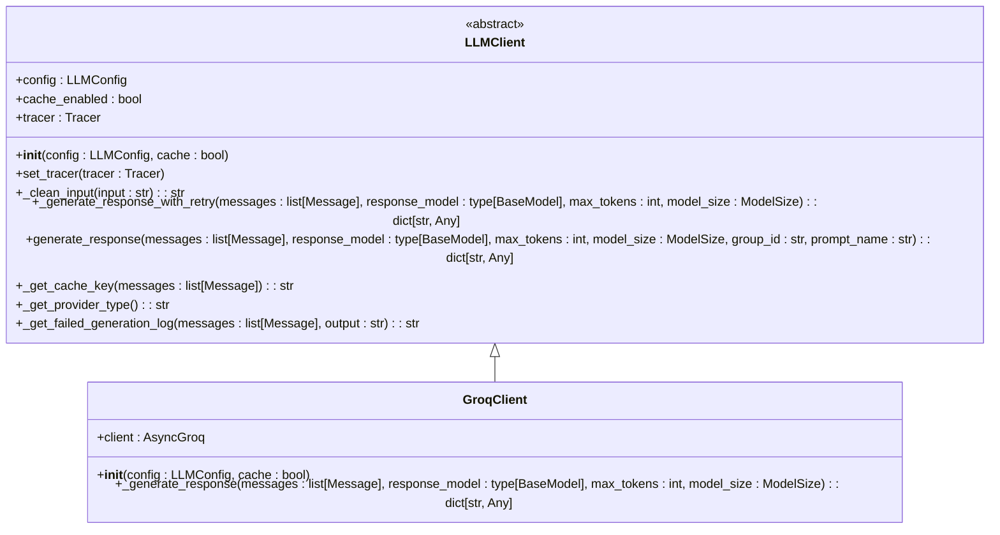
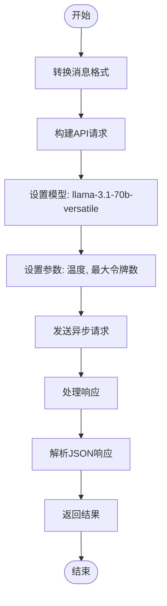
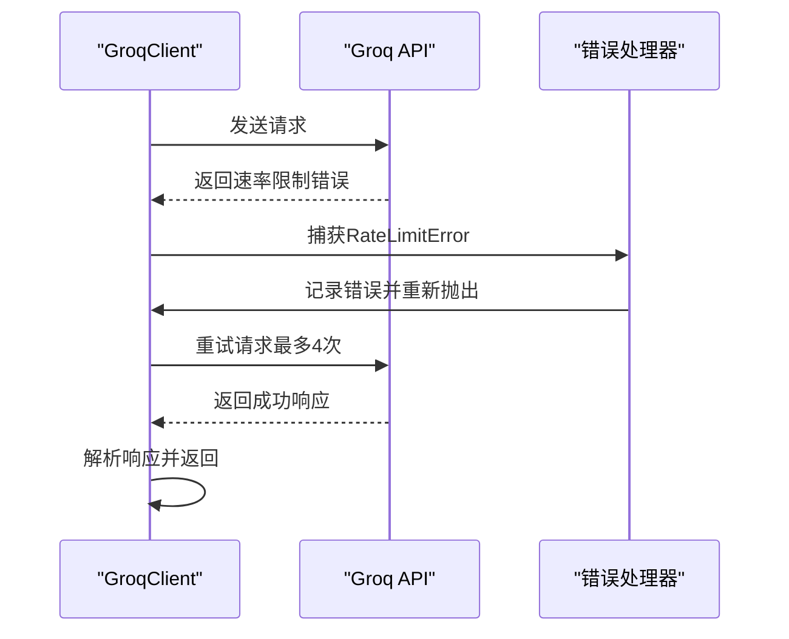

# Groq客户端

<cite>
**本文档中引用的文件**  
- [groq_client.py](file://graphiti_core/llm_client/groq_client.py)
- [client.py](file://graphiti_core/llm_client/client.py)
- [config.py](file://graphiti_core/llm_client/config.py)
- [errors.py](file://graphiti_core/llm_client/errors.py)
</cite>

## 目录
1. [简介](#简介)
2. [项目结构](#项目结构)
3. [核心组件](#核心组件)
4. [架构概述](#架构概述)
5. [详细组件分析](#详细组件分析)
6. [依赖分析](#依赖分析)
7. [性能考虑](#性能考虑)
8. [故障排除指南](#故障排除指南)
9. [结论](#结论)

## 简介
GroqClient 是 Graphiti 项目中的一个关键组件，用于与 Groq API 集成，提供对 Llama 3 等开源模型的极低延迟访问。该客户端通过异步调用实现高性能，并遵循 LLMClient 规范。本文档详细介绍了其消息传递、模型选择（如 llama3-8b-8192）、参数配置（温度、最大令牌数）以及流式响应和结构化输出的处理机制。

## 项目结构
GroqClient 位于 `graphiti_core/llm_client/` 目录下，是 LLM 客户端模块的一部分。该模块包含多个客户端实现，包括 Anthropic、Azure OpenAI、Gemini 和 Groq。GroqClient 依赖于 `client.py` 中定义的抽象基类 `LLMClient`，并使用 `config.py` 中的配置类来管理模型参数。

```mermaid
graph TD
subgraph "LLM客户端模块"
GroqClient[groq_client.py]
Client[client.py]
Config[config.py]
Errors[errors.py]
end
GroqClient --> Client : "继承"
GroqClient --> Config : "使用"
GroqClient --> Errors : "处理"
```

**图示来源**
- [groq_client.py](file://graphiti_core/llm_client/groq_client.py#L48-L85)
- [client.py](file://graphiti_core/llm_client/client.py#L66-L243)
- [config.py](file://graphiti_core/llm_client/config.py#L28-L69)

**节来源**
- [groq_client.py](file://graphiti_core/llm_client/groq_client.py#L1-L86)
- [client.py](file://graphiti_core/llm_client/client.py#L1-L243)

## 核心组件
GroqClient 的核心功能包括异步调用、消息格式转换、模型参数配置和错误处理。它通过 `AsyncGroq` 客户端与 Groq API 进行通信，并实现了 `_generate_response` 方法以符合 LLMClient 规范。

**节来源**
- [groq_client.py](file://graphiti_core/llm_client/groq_client.py#L48-L85)
- [client.py](file://graphiti_core/llm_client/client.py#L133-L141)

## 架构概述
GroqClient 的架构基于异步编程模式，利用 `AsyncGroq` 客户端实现非阻塞调用。它继承自 `LLMClient` 抽象基类，遵循统一的接口规范。客户端通过配置类 `LLMConfig` 管理模型参数，并使用缓存和重试策略优化性能。



**图示来源**
- [client.py](file://graphiti_core/llm_client/client.py#L66-L243)
- [groq_client.py](file://graphiti_core/llm_client/groq_client.py#L48-L85)

## 详细组件分析

### GroqClient 分析
GroqClient 实现了 LLMClient 规范，提供了与 Groq API 的集成。它使用 `AsyncGroq` 客户端进行异步调用，并通过 `_generate_response` 方法生成响应。

#### 消息传递与模型选择
GroqClient 将内部 `Message` 对象转换为 Groq API 所需的格式，并支持模型选择和参数配置。



**图示来源**
- [groq_client.py](file://graphiti_core/llm_client/groq_client.py#L58-L85)
- [client.py](file://graphiti_core/llm_client/client.py#L149-L213)

#### 错误处理与重试
GroqClient 实现了错误处理和重试机制，以应对速率限制和其他异常情况。



**图示来源**
- [groq_client.py](file://graphiti_core/llm_client/groq_client.py#L81-L85)
- [client.py](file://graphiti_core/llm_client/client.py#L110-L120)

**节来源**
- [groq_client.py](file://graphiti_core/llm_client/groq_client.py#L1-L86)
- [errors.py](file://graphiti_core/llm_client/errors.py#L18-L24)

## 依赖分析
GroqClient 依赖于多个外部库和内部模块，包括 `groq`、`pydantic`、`diskcache` 和 `tenacity`。它还依赖于 `graphiti_core` 中的其他模块，如 `prompts` 和 `tracer`。

```mermaid
graph TD
GroqClient --> groq : "异步API客户端"
GroqClient --> pydantic : "数据验证"
GroqClient --> diskcache : "缓存"
GroqClient --> tenacity : "重试逻辑"
GroqClient --> prompts : "消息模型"
GroqClient --> tracer : "追踪"
```

**图示来源**
- [groq_client.py](file://graphiti_core/llm_client/groq_client.py#L17-L34)
- [client.py](file://graphiti_core/llm_client/client.py#L23-L26)

**节来源**
- [groq_client.py](file://graphiti_core/llm_client/groq_client.py#L1-L86)
- [client.py](file://graphiti_core/llm_client/client.py#L1-L243)

## 性能考虑
GroqClient 通过异步调用、缓存和重试策略优化性能。它利用 Groq 的高速度优势，提供低延迟的模型访问。缓存策略基于消息内容和模型的哈希值，确保重复请求的高效处理。

## 故障排除指南
当 GroqClient 遇到问题时，应首先检查 API 密钥是否正确配置。常见的错误包括速率限制错误和认证错误。日志记录可以帮助诊断问题，特别是 `_get_failed_generation_log` 方法提供的详细信息。

**节来源**
- [errors.py](file://graphiti_core/llm_client/errors.py#L18-L40)
- [client.py](file://graphiti_core/llm_client/client.py#L229-L243)

## 结论
GroqClient 是一个高效、可靠的 LLM 客户端，专为与 Groq API 集成而设计。它通过异步调用和缓存策略提供高性能，并遵循统一的 LLMClient 规范。其错误处理和重试机制确保了在各种情况下的稳定性。