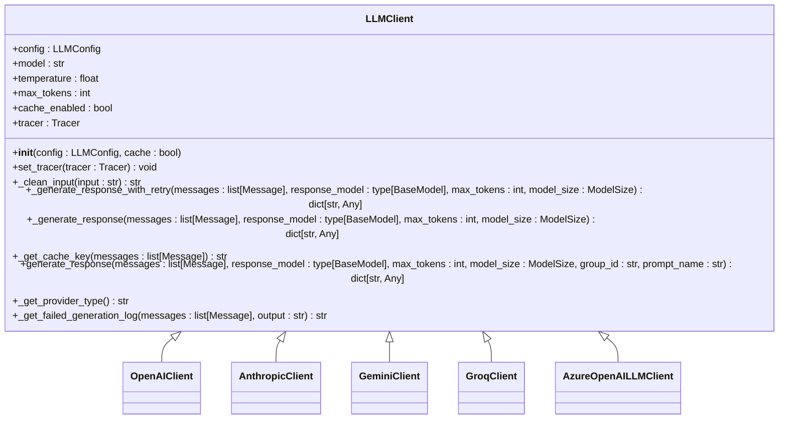
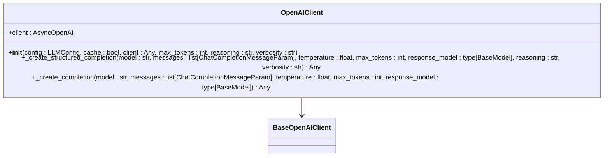
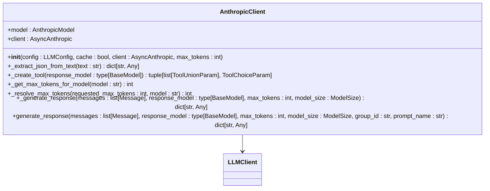
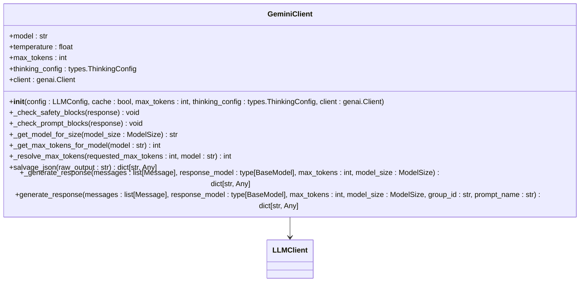
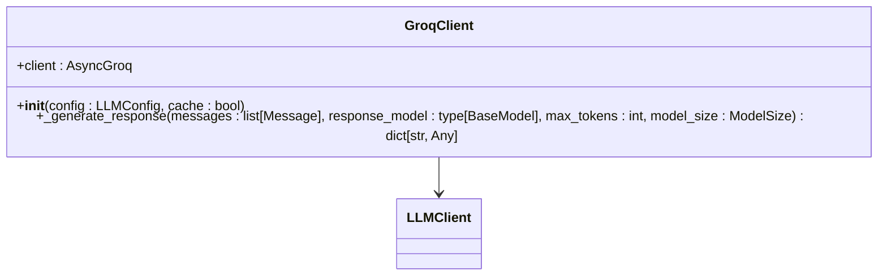
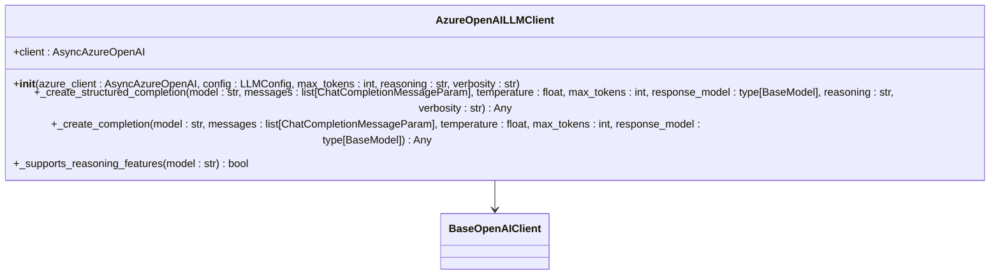

# LLM客户端

<cite>
**本文档中引用的文件**  
- [client.py](file://graphiti_core/llm_client/client.py)
- [openai_client.py](file://graphiti_core/llm_client/openai_client.py)
- [anthropic_client.py](file://graphiti_core/llm_client/anthropic_client.py)
- [gemini_client.py](file://graphiti_core/llm_client/gemini_client.py)
- [groq_client.py](file://graphiti_core/llm_client/groq_client.py)
- [azure_openai_client.py](file://graphiti_core/llm_client/azure_openai_client.py)
- [openai_base_client.py](file://graphiti_core/llm_client/openai_base_client.py)
- [config.py](file://graphiti_core/llm_client/config.py)
- [errors.py](file://graphiti_core/llm_client/errors.py)
</cite>

## 目录
1. [简介](#简介)
2. [核心组件](#核心组件)
3. [LLMClient抽象基类](#llmclient抽象基类)
4. [具体实现分析](#具体实现分析)
5. [LLM调用流程](#llm调用流程)
6. [性能优化策略](#性能优化策略)
7. [配置选项与扩展点](#配置选项与扩展点)
8. [故障排除指南](#故障排除指南)

## 简介
LLM客户端是Graphiti框架的核心组件，负责与各种大型语言模型（LLM）提供商进行交互。该客户端提供了一个统一的接口，支持OpenAI、Anthropic、Gemini、Groq和Azure OpenAI等多种LLM提供商。通过抽象基类LLMClient，实现了跨提供商的一致性，同时允许每个具体实现针对特定提供商的API特性进行优化。客户端集成了重试机制、缓存功能和错误处理，确保了与LLM API交互的可靠性和性能。

## 核心组件

LLM客户端的核心组件包括抽象基类LLMClient、具体实现类（如OpenAIClient、AnthropicClient等）以及配置和错误处理模块。这些组件共同协作，提供了一个健壮且灵活的LLM交互框架。

**本文档中引用的文件**  
- [client.py](file://graphiti_core/llm_client/client.py)
- [config.py](file://graphiti_core/llm_client/config.py)
- [errors.py](file://graphiti_core/llm_client/errors.py)

## LLMClient抽象基类

LLMClient是一个抽象基类，定义了与LLM API交互的核心接口和通用功能。它提供了输入清理、缓存、重试机制和遥测支持等跨提供商的通用功能。



**Diagram sources**
- [client.py](file://graphiti_core/llm_client/client.py#L66-L243)

**本文档中引用的文件**  
- [client.py](file://graphiti_core/llm_client/client.py)

## 具体实现分析

### OpenAI客户端实现
OpenAIClient实现了与OpenAI API的交互，继承自BaseOpenAIClient，共享OpenAI兼容API的通用逻辑。它支持结构化输出和普通JSON格式的生成。



**Diagram sources**
- [openai_client.py](file://graphiti_core/llm_client/openai_client.py#L27-L116)
- [openai_base_client.py](file://graphiti_core/llm_client/openai_base_client.py#L40-L262)

**本文档中引用的文件**  
- [openai_client.py](file://graphiti_core/llm_client/openai_client.py)
- [openai_base_client.py](file://graphiti_core/llm_client/openai_base_client.py)

### Anthropic客户端实现
AnthropicClient实现了与Anthropic API的交互，使用工具调用（tool use）机制来实现结构化输出。它具有特定的错误处理逻辑，能够区分速率限制错误和内容拒绝错误。



**Diagram sources**
- [anthropic_client.py](file://graphiti_core/llm_client/anthropic_client.py#L103-L430)

**本文档中引用的文件**  
- [anthropic_client.py](file://graphiti_core/llm_client/anthropic_client.py)

### Gemini客户端实现
GeminiClient实现了与Google Gemini API的交互，支持思考配置（thinking config）和安全过滤检查。它具有JSON恢复功能，能够从截断或格式错误的输出中恢复数据。



**Diagram sources**
- [gemini_client.py](file://graphiti_core/llm_client/gemini_client.py#L69-L447)

**本文档中引用的文件**  
- [gemini_client.py](file://graphiti_core/llm_client/gemini_client.py)

### Groq客户端实现
GroqClient实现了与Groq API的交互，这是一个轻量级的实现，专注于与Groq的兼容性。它使用标准的聊天完成接口来生成响应。



**Diagram sources**
- [groq_client.py](file://graphiti_core/llm_client/groq_client.py#L48-L86)

**本文档中引用的文件**  
- [groq_client.py](file://graphiti_core/llm_client/groq_client.py)

### Azure OpenAI客户端实现
AzureOpenAILLMClient实现了与Azure OpenAI服务的交互，继承自BaseOpenAIClient，共享OpenAI兼容API的通用逻辑。它支持Azure特定的配置和功能。



**Diagram sources**
- [azure_openai_client.py](file://graphiti_core/llm_client/azure_openai_client.py#L30-L116)

**本文档中引用的文件**  
- [azure_openai_client.py](file://graphiti_core/llm_client/azure_openai_client.py)

## LLM调用流程

LLM调用流程包括输入清理、缓存检查、重试机制和响应处理。以下序列图展示了完整的调用流程：

```mermaid
sequenceDiagram
participant Client as "客户端应用"
participant LLMClient as "LLMClient"
participant Cache as "缓存"
participant Provider as "LLM提供商"
Client->>LLMClient : generate_response(messages)
LLMClient->>LLMClient : _clean_input(输入)
LLMClient->>LLMClient : 添加多语言提取指令
LLMClient->>Cache : 检查缓存
alt 缓存命中
Cache-->>LLMClient : 返回缓存响应
LLMClient-->>Client : 返回响应
else 缓存未命中
Cache-->>LLMClient : 无缓存
loop 重试循环
LLMClient->>Provider : _generate_response(消息)
Provider-->>LLMClient : 响应或错误
alt 响应成功
LLMClient->>LLMClient : 验证响应
LLMClient->>Cache : 存储响应到缓存
LLMClient-->>Client : 返回响应
break 成功
else 响应失败
alt 速率限制或拒绝错误
LLMClient-->>Client : 抛出错误
break 不重试
else 其他错误
LLMClient->>LLMClient : 添加错误上下文到消息
LLMClient->>LLMClient : 重试计数++
Note over LLMClient : 最多重试2次
end
end
end
end
```

**Diagram sources**
- [client.py](file://graphiti_core/llm_client/client.py#L149-L213)
- [anthropic_client.py](file://graphiti_core/llm_client/anthropic_client.py#L333-L430)
- [gemini_client.py](file://graphiti_core/llm_client/gemini_client.py#L353-L447)
- [openai_base_client.py](file://graphiti_core/llm_client/openai_base_client.py#L184-L262)

**本文档中引用的文件**  
- [client.py](file://graphiti_core/llm_client/client.py)
- [anthropic_client.py](file://graphiti_core/llm_client/anthropic_client.py)
- [gemini_client.py](file://graphiti_core/llm_client/gemini_client.py)
- [openai_base_client.py](file://graphiti_core/llm_client/openai_base_client.py)

## 性能优化策略

LLM客户端采用了多种性能优化策略，包括异步操作、连接池和缓存机制。异步操作允许并发处理多个LLM请求，提高了整体吞吐量。连接池减少了建立新连接的开销，特别是在高负载情况下。缓存机制避免了重复的LLM调用，显著降低了延迟和成本。

**本文档中引用的文件**  
- [client.py](file://graphiti_core/llm_client/client.py)
- [openai_client.py](file://graphiti_core/llm_client/openai_client.py)
- [anthropic_client.py](file://graphiti_core/llm_client/anthropic_client.py)

## 配置选项与扩展点

LLM客户端提供了丰富的配置选项和扩展点。用户可以通过LLMConfig类配置API密钥、模型、温度和最大令牌数等参数。对于高级用户，可以通过继承LLMClient抽象基类来实现新的LLM提供商客户端。此外，客户端支持通过set_tracer方法集成自定义遥测系统。

**本文档中引用的文件**  
- [config.py](file://graphiti_core/llm_client/config.py)
- [client.py](file://graphiti_core/llm_client/client.py)

## 故障排除指南

当遇到LLM客户端问题时，首先检查API密钥是否正确配置。对于速率限制错误，实现适当的退避策略。对于内容拒绝错误，审查输入内容是否符合提供商的使用政策。启用详细日志记录可以帮助诊断连接问题和响应格式错误。如果遇到JSON解析错误，检查响应模型定义是否与LLM输出匹配。

**本文档中引用的文件**  
- [errors.py](file://graphiti_core/llm_client/errors.py)
- [client.py](file://graphiti_core/llm_client/client.py)
- [anthropic_client.py](file://graphiti_core/llm_client/anthropic_client.py)
- [gemini_client.py](file://graphiti_core/llm_client/gemini_client.py)