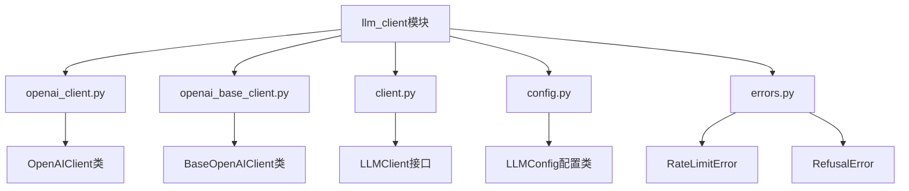
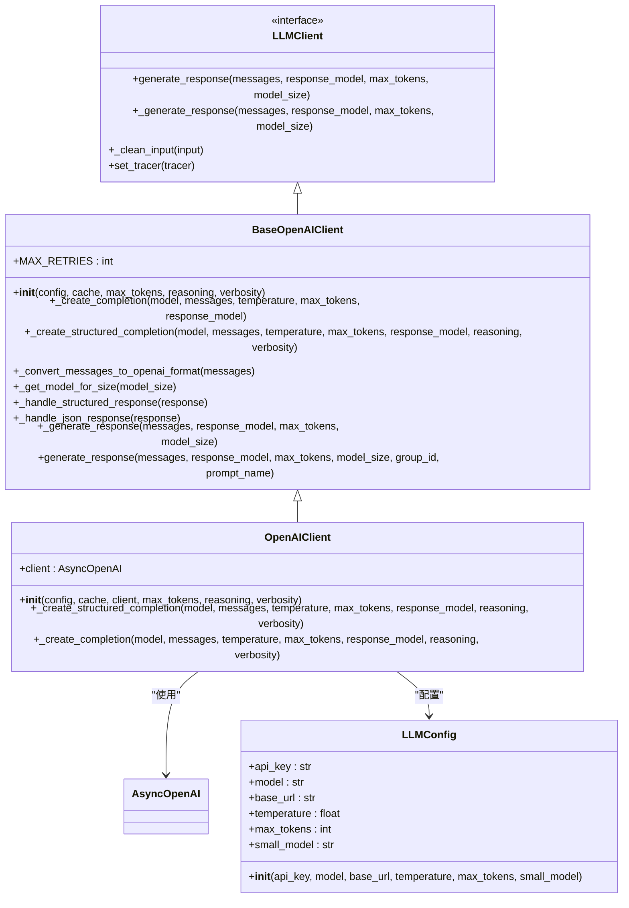
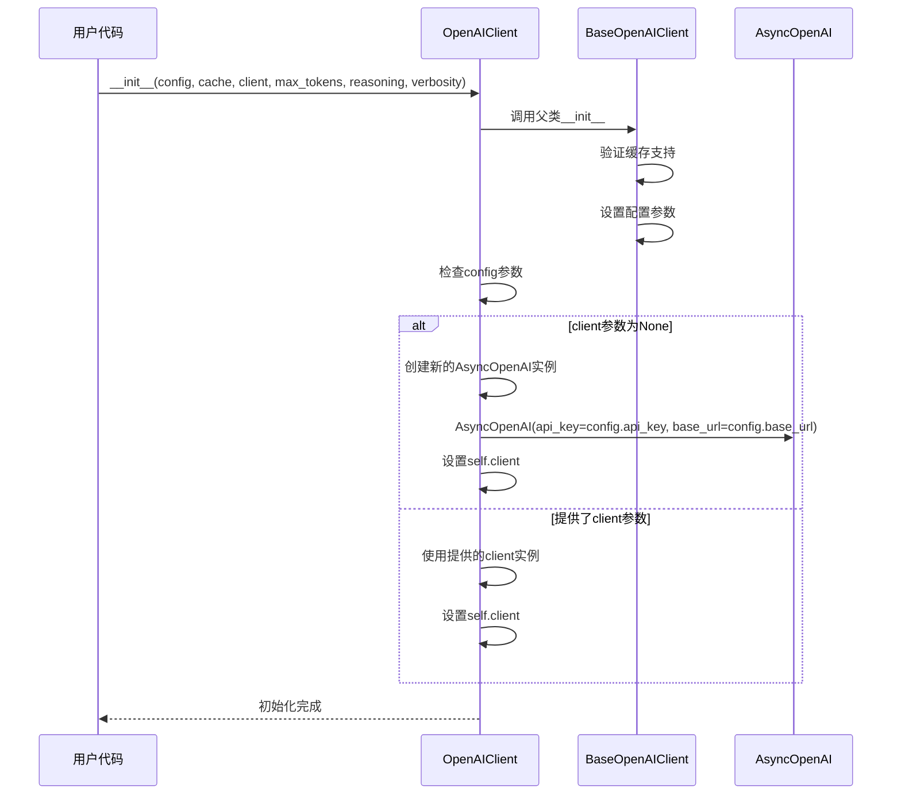
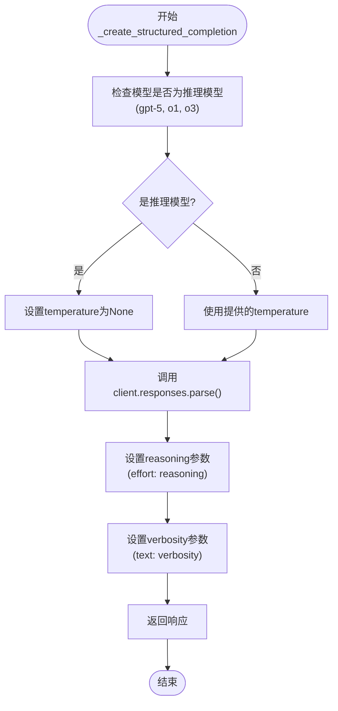
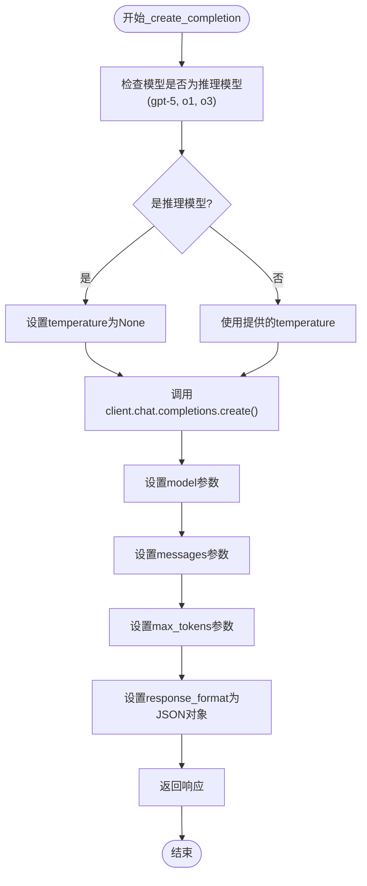
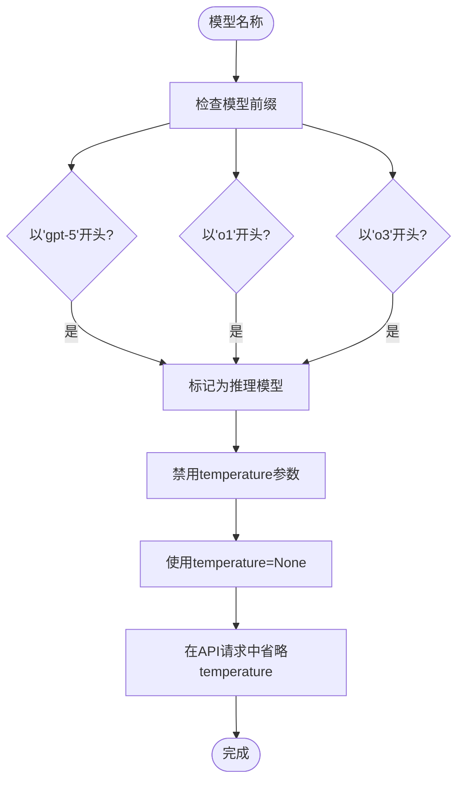
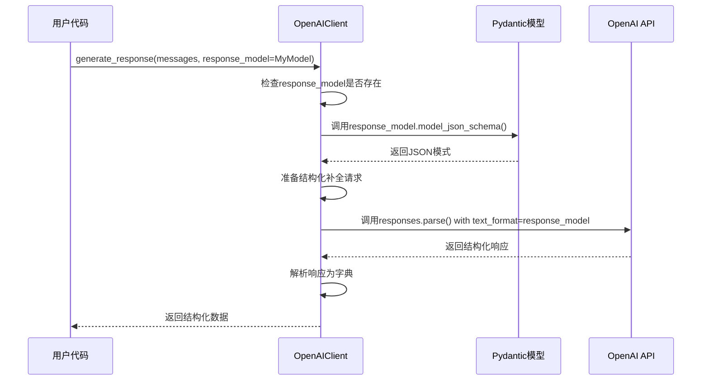
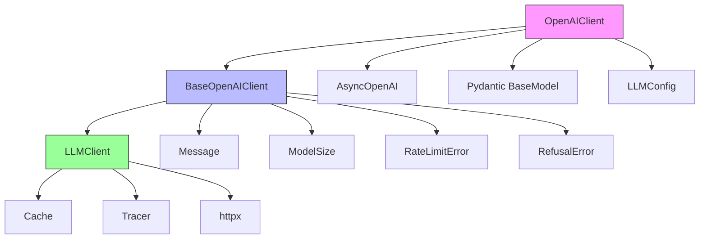
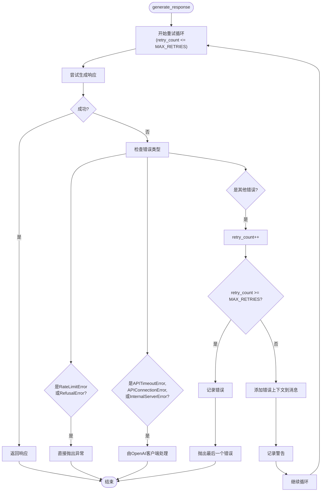

# OpenAI客户端

<cite>
**本文档中引用的文件**   
- [openai_client.py](file://graphiti_core/llm_client/openai_client.py)
- [openai_base_client.py](file://graphiti_core/llm_client/openai_base_client.py)
- [client.py](file://graphiti_core/llm_client/client.py)
- [config.py](file://graphiti_core/llm_client/config.py)
- [errors.py](file://graphiti_core/llm_client/errors.py)
</cite>

## 目录
1. [简介](#简介)
2. [项目结构](#项目结构)
3. [核心组件](#核心组件)
4. [架构概述](#架构概述)
5. [详细组件分析](#详细组件分析)
6. [依赖分析](#依赖分析)
7. [性能考虑](#性能考虑)
8. [故障排除指南](#故障排除指南)
9. [结论](#结论)

## 简介
OpenAIClient类是graphiti_core项目中用于与OpenAI API进行交互的核心组件。该类继承自BaseOpenAIClient并实现LLMClient接口，提供与OpenAI语言模型通信的功能。本文档详细说明了其如何使用AsyncOpenAI客户端处理结构化补全和常规补全请求，包括对gpt-5系列推理模型的特殊处理、reasoning和verbosity选项的支持，以及客户端初始化时的配置机制。

## 项目结构
OpenAIClient类位于graphiti_core/llm_client目录下，是LLM客户端模块的一部分。该模块包含多个客户端实现，支持不同的语言模型提供商，其中OpenAIClient专门用于与OpenAI服务交互。

**图源**
- [openai_client.py](file://graphiti_core/llm_client/openai_client.py#L27-L115)
- [openai_base_client.py](file://graphiti_core/llm_client/openai_base_client.py#L40-L262)
- [client.py](file://graphiti_core/llm_client/client.py#L66-L243)
- [config.py](file://graphiti_core/llm_client/config.py#L28-L68)
- [errors.py](file://graphiti_core/llm_client/errors.py#L18-L40)

**节源**
- [openai_client.py](file://graphiti_core/llm_client/openai_client.py#L1-L115)
- [openai_base_client.py](file://graphiti_core/llm_client/openai_base_client.py#L1-L262)

## 核心组件
OpenAIClient类是OpenAI API交互的主要入口点，封装了与AsyncOpenAI客户端的通信逻辑。该类通过继承BaseOpenAIClient实现了LLMClient接口，提供了创建结构化补全和常规补全的功能。核心功能包括使用Pydantic模型进行结构化输出、处理gpt-5系列模型的特殊要求，以及实现错误处理和重试逻辑。

**节源**
- [openai_client.py](file://graphiti_core/llm_client/openai_client.py#L27-L115)
- [openai_base_client.py](file://graphiti_core/llm_client/openai_base_client.py#L40-L262)

## 架构概述
OpenAIClient的架构基于分层设计模式，其中OpenAIClient继承自BaseOpenAIClient，而BaseOpenAIClient又实现了LLMClient接口。这种设计允许在不同OpenAI兼容的API之间共享通用逻辑，同时为特定实现提供扩展点。客户端使用AsyncOpenAI进行异步API调用，并通过配置类管理API密钥、基础URL和其他参数。

**图源**
- [openai_client.py](file://graphiti_core/llm_client/openai_client.py#L27-L115)
- [openai_base_client.py](file://graphiti_core/llm_client/openai_base_client.py#L40-L262)
- [client.py](file://graphiti_core/llm_client/client.py#L66-L243)
- [config.py](file://graphiti_core/llm_client/config.py#L28-L68)

## 详细组件分析

### OpenAIClient分析
OpenAIClient类提供了与OpenAI API交互的具体实现，主要通过_async_openai_client属性与OpenAI服务通信。该类实现了两个核心方法：_create_structured_completion用于创建结构化补全，_create_completion用于创建常规补全。

#### 初始化机制
OpenAIClient的初始化过程允许通过LLMConfig对象配置API密钥和基础URL，或者直接传入自定义的AsyncOpenAI客户端实例。这种设计提供了灵活性，既支持标准配置，也支持自定义客户端配置。

**图源**
- [openai_client.py](file://graphiti_core/llm_client/openai_client.py#L38-L64)
- [openai_base_client.py](file://graphiti_core/llm_client/openai_base_client.py#L51-L69)

#### 结构化补全实现
_create_structured_completion方法使用OpenAI的beta parse API创建结构化补全，支持通过response_model参数指定Pydantic模型进行输出格式化。该方法还支持reasoning和verbosity选项，为gpt-5系列模型提供特殊处理。

**图源**
- [openai_client.py](file://graphiti_core/llm_client/openai_client.py#L65-L91)

#### 常规补全实现
_create_completion方法创建常规补全请求，强制响应格式为JSON对象。与结构化补全类似，该方法也对gpt-5系列模型禁用温度参数，并通过response_format参数确保JSON输出。

**图源**
- [openai_client.py](file://graphiti_core/llm_client/openai_client.py#L93-L115)

### gpt-5系列模型特殊处理
OpenAIClient对gpt-5系列推理模型（包括gpt-5、o1和o3系列）进行了特殊处理，主要体现在温度参数的管理上。这些推理模型不支持温度参数，因此在调用API时会自动将temperature设置为None。

**图源**
- [openai_client.py](file://graphiti_core/llm_client/openai_client.py#L77-L84)
- [openai_client.py](file://graphiti_core/llm_client/openai_client.py#L105-L112)

### 结构化输出与Pydantic模型
OpenAIClient通过response_model参数支持Pydantic模型的结构化输出，允许开发者定义期望的响应格式。系统会自动将Pydantic模型转换为JSON模式，并在请求中使用。

**图源**
- [openai_client.py](file://graphiti_core/llm_client/openai_client.py#L65-L91)
- [openai_base_client.py](file://graphiti_core/llm_client/openai_base_client.py#L144-L154)

## 依赖分析
OpenAIClient的依赖关系清晰地展示了其在整体架构中的位置和与其他组件的交互方式。该类直接依赖于AsyncOpenAI客户端进行API通信，同时继承自BaseOpenAIClient以共享通用逻辑。

**图源**
- [openai_client.py](file://graphiti_core/llm_client/openai_client.py#L19-L24)
- [openai_base_client.py](file://graphiti_core/llm_client/openai_base_client.py#L23-L31)
- [client.py](file://graphiti_core/llm_client/client.py#L23-L31)

**节源**
- [openai_client.py](file://graphiti_core/llm_client/openai_client.py#L1-L115)
- [openai_base_client.py](file://graphiti_core/llm_client/openai_base_client.py#L1-L262)
- [client.py](file://graphiti_core/llm_client/client.py#L1-L243)
- [config.py](file://graphiti_core/llm_client/config.py#L1-L68)
- [errors.py](file://graphiti_core/llm_client/errors.py#L1-L40)

## 性能考虑
OpenAIClient在设计时考虑了性能和可靠性，实现了重试逻辑和错误处理机制。系统最多重试两次，并对不同类型的错误采取不同的处理策略。对于速率限制错误和拒绝错误，系统不会重试，而是直接抛出异常；对于API超时、连接错误和内部服务器错误，由OpenAI客户端处理重试。

**图源**
- [openai_base_client.py](file://graphiti_core/llm_client/openai_base_client.py#L214-L261)

## 故障排除指南
当使用OpenAIClient时，可能会遇到各种错误情况。以下是常见问题及其解决方案：

1. **认证错误**：如果出现AuthenticationError，请检查API密钥是否正确。系统会在日志中记录详细的认证错误信息。

2. **速率限制错误**：RateLimitError表示请求超出了API的速率限制。系统不会自动重试此类错误，需要等待一段时间后重试。

3. **连接错误**：如果出现连接错误，请检查网络连接和API基础URL配置是否正确。

4. **响应格式错误**：如果LLM返回的响应不符合预期格式，系统会自动添加错误上下文并重试，最多重试两次。

5. **模型长度限制**：如果输出长度超过最大令牌数，会抛出LengthFinishReasonError异常。

**节源**
- [openai_base_client.py](file://graphiti_core/llm_client/openai_base_client.py#L164-L182)
- [errors.py](file://graphiti_core/llm_client/errors.py#L18-L40)

## 结论
OpenAIClient类提供了一个功能完整且设计良好的接口，用于与OpenAI API进行交互。通过继承BaseOpenAIClient并实现LLMClient接口，该类实现了代码重用和扩展性。其主要特性包括对结构化补全和常规补全的支持、对gpt-5系列推理模型的特殊处理、reasoning和verbosity选项的支持，以及健壮的错误处理和重试机制。客户端的初始化设计灵活，既支持标准配置，也允许使用自定义的AsyncOpenAI客户端实例。整体架构清晰，依赖关系明确，为开发者提供了可靠且易于使用的OpenAI API访问方式。