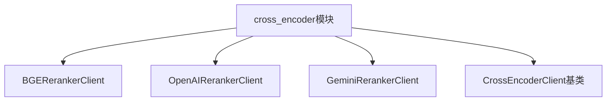
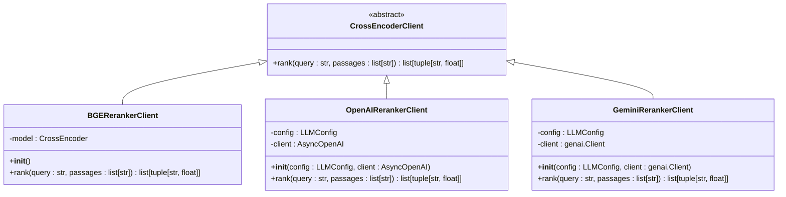
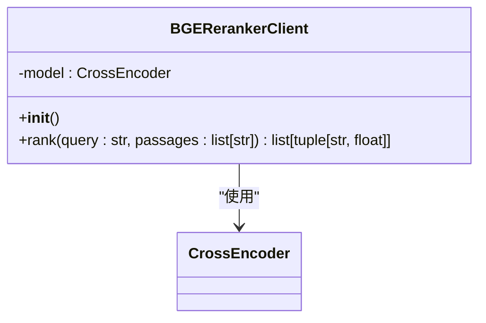
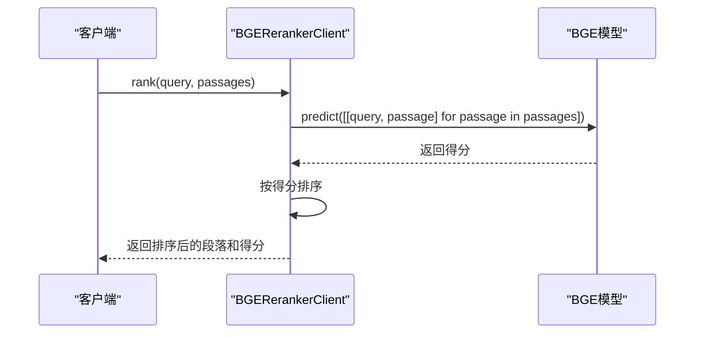

# BGE 交叉编码器

<cite>
**本文档中引用的文件**   
- [bge_reranker_client.py](file://graphiti_core/cross_encoder/bge_reranker_client.py)
- [client.py](file://graphiti_core/cross_encoder/client.py)
- [openai_reranker_client.py](file://graphiti_core/cross_encoder/openai_reranker_client.py)
- [gemini_reranker_client.py](file://graphiti_core/cross_encoder/gemini_reranker_client.py)
- [search.py](file://graphiti_core/search/search.py)
- [pyproject.toml](file://pyproject.toml)
- [test_bge_reranker_client_int.py](file://tests/cross_encoder/test_bge_reranker_client_int.py)
</cite>

## 目录
1. [简介](#简介)
2. [项目结构](#项目结构)
3. [核心组件](#核心组件)
4. [架构概述](#架构概述)
5. [详细组件分析](#详细组件分析)
6. [依赖分析](#依赖分析)
7. [性能考量](#性能考量)
8. [故障排查指南](#故障排查指南)
9. [结论](#结论)

## 简介
本文档全面介绍了BGE交叉编码器的实现和使用，重点说明了BGERerankerClient如何集成本地或远程部署的BGE重排序模型。文档详细解释了模型加载、输入预处理和输出解析的完整流程，并对比了其与云服务（如OpenAI）在延迟、成本和数据隐私方面的优劣。同时提供了模型部署的最佳实践和性能调优参数（如batch_size、max_length），并包含故障排查指南，解决模型加载失败、推理超时等问题。

## 项目结构
项目结构清晰地组织了各个功能模块，其中交叉编码器相关的代码位于`graphiti_core/cross_encoder/`目录下。该目录包含了BGE、OpenAI和Gemini三种重排序客户端的实现，以及它们共同继承的抽象基类。



**Diagram sources**
- [bge_reranker_client.py](file://graphiti_core/cross_encoder/bge_reranker_client.py)
- [openai_reranker_client.py](file://graphiti_core/cross_encoder/openai_reranker_client.py)
- [gemini_reranker_client.py](file://graphiti_core/cross_encoder/gemini_reranker_client.py)
- [client.py](file://graphiti_core/cross_encoder/client.py)

**Section sources**
- [bge_reranker_client.py](file://graphiti_core/cross_encoder/bge_reranker_client.py)
- [openai_reranker_client.py](file://graphiti_core/cross_encoder/openai_reranker_client.py)
- [gemini_reranker_client.py](file://graphiti_core/cross_encoder/gemini_reranker_client.py)
- [client.py](file://graphiti_core/cross_encoder/client.py)

## 核心组件
BGE交叉编码器的核心组件是`BGERerankerClient`类，它继承自`CrossEncoderClient`抽象基类。该类负责加载BGE重排序模型，并提供对查询和段落进行排序的功能。模型在初始化时自动加载，排序操作通过异步方法`rank`实现，该方法将查询和段落对输入模型进行预测，并返回按相关性排序的结果。

**Section sources**
- [bge_reranker_client.py](file://graphiti_core/cross_encoder/bge_reranker_client.py#L34-L55)
- [client.py](file://graphiti_core/cross_encoder/client.py#L20-L41)

## 架构概述
BGE交叉编码器的架构基于抽象基类`CrossEncoderClient`，它定义了所有重排序客户端必须实现的接口。具体的实现类（如`BGERerankerClient`）负责具体的模型加载和推理逻辑。这种设计模式使得系统可以轻松地集成不同的重排序模型，而无需修改使用这些客户端的上层代码。



**Diagram sources**
- [client.py](file://graphiti_core/cross_encoder/client.py#L20-L41)
- [bge_reranker_client.py](file://graphiti_core/cross_encoder/bge_reranker_client.py#L34-L55)
- [openai_reranker_client.py](file://graphiti_core/cross_encoder/openai_reranker_client.py#L34-L124)
- [gemini_reranker_client.py](file://graphiti_core/cross_encoder/gemini_reranker_client.py#L43-L162)

## 详细组件分析

### BGERerankerClient 分析
`BGERerankerClient`是BGE重排序模型的具体实现。它在初始化时加载`BAAI/bge-reranker-v2-m3`模型，并通过`rank`方法对查询和段落进行排序。排序过程将查询和每个段落组成一对，输入模型进行预测，然后根据预测得分对结果进行排序。

#### 类图


**Diagram sources**
- [bge_reranker_client.py](file://graphiti_core/cross_encoder/bge_reranker_client.py#L34-L55)
- [client.py](file://graphiti_core/cross_encoder/client.py#L20-L41)

#### 排序流程序列图


**Diagram sources**
- [bge_reranker_client.py](file://graphiti_core/cross_encoder/bge_reranker_client.py#L38-L55)

**Section sources**
- [bge_reranker_client.py](file://graphiti_core/cross_encoder/bge_reranker_client.py#L34-L55)
- [test_bge_reranker_client_int.py](file://tests/cross_encoder/test_bge_reranker_client_int.py#L22-L79)

### 与云服务的对比分析
BGE交叉编码器与云服务（如OpenAI和Gemini）在多个方面存在显著差异：

| 比较维度 | BGE交叉编码器 | OpenAI云服务 | Gemini云服务 |
|---------|-------------|------------|------------|
| **延迟** | 本地部署，延迟较低 | 网络延迟，延迟较高 | 网络延迟，延迟较高 |
| **成本** | 一次性部署成本，无按次计费 | 按API调用次数计费 | 按API调用次数计费 |
| **数据隐私** | 数据完全本地处理，隐私性高 | 数据需上传至云端，隐私性较低 | 数据需上传至云端，隐私性较低 |
| **模型控制** | 完全控制模型和参数 | 依赖云服务提供的模型 | 依赖云服务提供的模型 |
| **部署复杂度** | 需要本地部署和维护 | 无需部署，直接调用API | 无需部署，直接调用API |

**Section sources**
- [bge_reranker_client.py](file://graphiti_core/cross_encoder/bge_reranker_client.py)
- [openai_reranker_client.py](file://graphiti_core/cross_encoder/openai_reranker_client.py)
- [gemini_reranker_client.py](file://graphiti_core/cross_encoder/gemini_reranker_client.py)

## 依赖分析
BGE交叉编码器的主要依赖是`sentence-transformers`库，该库提供了加载和使用BGE模型的功能。在`pyproject.toml`文件中，该依赖被列为可选依赖，用户需要通过`pip install graphiti-core[sentence-transformers]`来安装。

```mermaid
graph TD
BGERerankerClient --> sentence_transformers : "依赖"
sentence_transformers --> CrossEncoder : "提供"
```

**Diagram sources**
- [pyproject.toml](file://pyproject.toml#L36)
- [bge_reranker_client.py](file://graphiti_core/cross_encoder/bge_reranker_client.py#L24-L29)

**Section sources**
- [pyproject.toml](file://pyproject.toml#L36)
- [bge_reranker_client.py](file://graphiti_core/cross_encoder/bge_reranker_client.py#L24-L29)

## 性能考量
BGE交叉编码器的性能受多个因素影响，包括模型大小、输入长度和批处理大小。为了优化性能，建议根据实际需求调整`max_length`和`batch_size`参数。对于高并发场景，可以考虑使用GPU加速推理过程。

## 故障排查指南
以下是一些常见问题及其解决方案：

- **模型加载失败**：确保已安装`sentence-transformers`库，并检查网络连接是否正常。
- **推理超时**：检查输入文本长度是否过长，适当减少`max_length`参数。
- **内存不足**：对于大型模型，确保有足够的内存资源，或考虑使用更小的模型版本。

**Section sources**
- [bge_reranker_client.py](file://graphiti_core/cross_encoder/bge_reranker_client.py#L24-L29)
- [test_bge_reranker_client_int.py](file://tests/cross_encoder/test_bge_reranker_client_int.py)

## 结论
BGE交叉编码器提供了一种高效、隐私友好的重排序解决方案，特别适合对数据隐私有高要求的场景。通过与云服务的对比，可以看出其在延迟和成本方面的优势。然而，部署和维护的复杂度较高，需要权衡利弊后选择合适的方案。