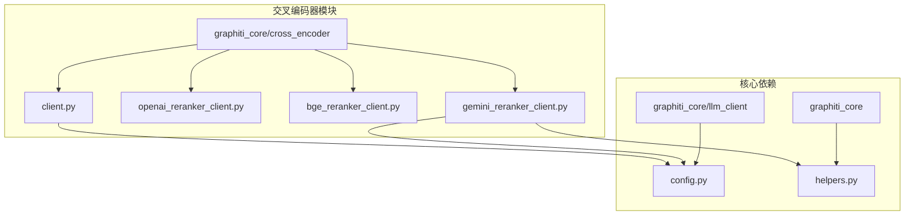
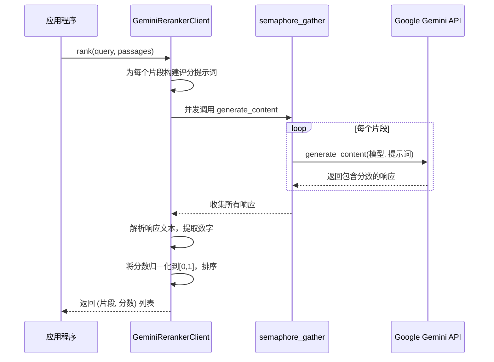
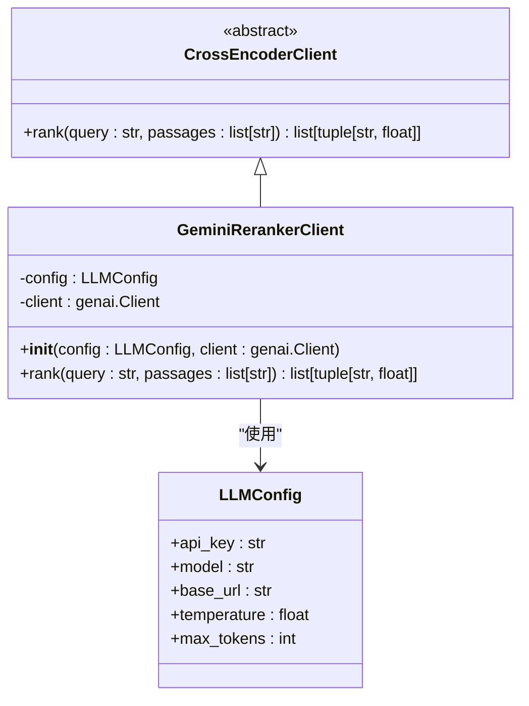
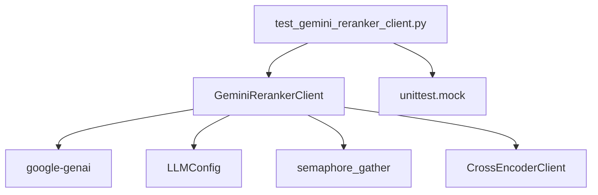

# Gemini 交叉编码器

<cite>
**本文档中引用的文件**   
- [gemini_reranker_client.py](file://graphiti_core/cross_encoder/gemini_reranker_client.py)
- [client.py](file://graphiti_core/cross_encoder/client.py)
- [config.py](file://graphiti_core/llm_client/config.py)
- [helpers.py](file://graphiti_core/helpers.py)
- [test_gemini_reranker_client.py](file://tests/cross_encoder/test_gemini_reranker_client.py)
- [openai_reranker_client.py](file://graphiti_core/cross_encoder/openai_reranker_client.py)
- [bge_reranker_client.py](file://graphiti_core/cross_encoder/bge_reranker_client.py)
- [README.md](file://examples/quickstart/README.md)
</cite>

## 目录
1. [简介](#简介)
2. [项目结构](#项目结构)
3. [核心组件](#核心组件)
4. [架构概述](#架构概述)
5. [详细组件分析](#详细组件分析)
6. [依赖分析](#依赖分析)
7. [性能考虑](#性能考虑)
8. [故障排除指南](#故障排除指南)
9. [结论](#结论)

## 简介
Gemini 交叉编码器是 Graphiti 框架中的一个关键组件，专门用于实现基于 Google Gemini API 的重排序功能。该组件通过 `GeminiRerankerClient` 类与 Google Gemini API 对接，对检索到的文档片段进行相关性评分和排序。其核心机制是利用 Gemini 模型对查询（query）和每个文档片段（passage）进行独立的相关性评分，然后根据评分对片段进行排序。该客户端支持通过 Google Cloud 凭证进行认证，并提供了灵活的配置选项，如模型版本、项目ID和区域选择。此外，它还具备处理多语言查询和片段的能力，并能与其他 Graphiti 服务（如嵌入生成）协同工作，以构建更强大的检索增强生成（RAG）系统。本文档将深入探讨其技术实现、配置方法、性能特征和最佳实践。

## 项目结构
Graphiti 项目的结构清晰地将交叉编码器功能组织在 `graphiti_core/cross_encoder/` 目录下。该目录包含了实现不同重排序策略的核心模块。`gemini_reranker_client.py` 是本技术文档的核心文件，它实现了与 Google Gemini API 的对接。`client.py` 定义了所有重排序客户端必须遵循的抽象接口 `CrossEncoderClient`。其他文件如 `openai_reranker_client.py` 和 `bge_reranker_client.py` 则提供了与 OpenAI 和本地 BGE 模型集成的替代实现，展示了框架的可扩展性。相关的配置和辅助功能则分散在 `llm_client/` 和 `helpers.py` 等文件中。



**Diagram sources**
- [gemini_reranker_client.py](file://graphiti_core/cross_encoder/gemini_reranker_client.py)
- [config.py](file://graphiti_core/llm_client/config.py)
- [helpers.py](file://graphiti_core/helpers.py)

**Section sources**
- [gemini_reranker_client.py](file://graphiti_core/cross_encoder/gemini_reranker_client.py)
- [client.py](file://graphiti_core/cross_encoder/client.py)

## 核心组件
`GeminiRerankerClient` 是实现重排序功能的核心类。它继承自 `CrossEncoderClient` 抽象基类，确保了与框架中其他重排序器的接口一致性。该客户端的核心功能是 `rank` 方法，它接收一个查询和一组文档片段，然后通过并发调用 Gemini API 为每个片段生成一个 0 到 100 的相关性分数。这些分数随后被归一化到 [0,1] 区间，并按降序排列返回。与依赖 logprobs 的 OpenAI 重排序器不同，Gemini 重排序器采用直接评分法，通过精心设计的提示词（prompt）引导模型输出一个纯数字分数。客户端还集成了错误处理机制，能够识别并抛出 `RateLimitError`，以便上层应用进行重试或降级处理。

**Section sources**
- [gemini_reranker_client.py](file://graphiti_core/cross_encoder/gemini_reranker_client.py#L43-L162)
- [client.py](file://graphiti_core/cross_encoder/client.py#L20-L41)

## 架构概述
Gemini 交叉编码器的架构遵循了清晰的分层设计。在顶层，`GeminiRerankerClient` 作为应用与外部 API 之间的适配器。它依赖于 `LLMConfig` 对象来管理 API 密钥、模型名称等配置信息。在执行重排序时，`rank` 方法会利用 `helpers.py` 中定义的 `semaphore_gather` 函数来并发执行多个 API 调用，这极大地提高了处理大量片段时的效率。每个 API 调用都通过 `google.genai` 库的异步客户端发送，该客户端在初始化时根据配置的 API 密钥创建。整个流程包括：构建评分提示词、并发发送请求、解析响应文本以提取数字分数、归一化和排序。这种架构确保了高吞吐量和低延迟，同时通过抽象接口保持了代码的可维护性和可替换性。



**Diagram sources**
- [gemini_reranker_client.py](file://graphiti_core/cross_encoder/gemini_reranker_client.py#L73-L147)
- [helpers.py](file://graphiti_core/helpers.py#L106-L116)

## 详细组件分析

### GeminiRerankerClient 分析
`GeminiRerankerClient` 的实现细节体现了其高效和健壮的设计。在初始化时，它接受一个可选的 `LLMConfig` 对象，其中包含了连接到 Gemini API 所需的 `api_key`。如果未提供自定义的 `genai.Client`，客户端会自动使用该密钥创建一个新的异步客户端实例。其 `rank` 方法首先处理边界情况，例如当片段列表为空或只有一个片段时，直接返回结果。对于多个片段，它会为每个片段构造一个标准化的提示词，明确要求模型“只提供一个0到100之间的数字”。这个提示词还包含一个系统指令，将模型的角色设定为“专家评分员”，以确保评分的一致性。

#### 对象导向组件


**Diagram sources**
- [gemini_reranker_client.py](file://graphiti_core/cross_encoder/gemini_reranker_client.py#L43-L162)
- [client.py](file://graphiti_core/cross_encoder/client.py#L20-L41)
- [config.py](file://graphiti_core/llm_client/config.py#L28-L69)

#### API/服务组件
```mermaid
sequenceDiagram
participant Client as GeminiRerankerClient
participant API as Gemini API
participant Parser as 响应解析器
Client->>Client : 构造评分提示词
loop 每个片段
Client->>API : generate_content(模型=gemini-2.5-flash-lite, 内容=提示词, config={temperature=0.0, max_output_tokens=3})
end
API-->>Client : 返回文本响应
Client->>Parser : 提取数字
alt 响应包含数字
Parser-->>Client : 返回归一化分数
else 响应无效
Parser-->>Client : 返回0.0
end
Client->>Client : 按分数降序排序
Client-->> : 返回排序结果
```

**Diagram sources**
- [gemini_reranker_client.py](file://graphiti_core/cross_encoder/gemini_reranker_client.py#L103-L147)

#### 复杂逻辑组件
```mermaid
flowchart TD
Start([开始]) --> CheckLength{片段数量 <= 1?}
CheckLength --> |是| ReturnFullScore[返回所有片段分数为1.0]
CheckLength --> |否| BuildPrompts[为每个片段构建评分提示词]
BuildPrompts --> ConcurrentCall[并发调用Gemini API]
ConcurrentCall --> ResponseReceived{收到响应?}
ResponseReceived --> |是| ExtractScore[从响应文本中提取数字]
ExtractScore --> ValidNumber{提取到有效数字?}
ValidNumber --> |是| Normalize[分数 = min(1.0, max(0.0, 提取值 / 100))]
ValidNumber --> |否| AssignZero[分数 = 0.0]
Normalize --> CollectResults
AssignZero --> CollectResults
CollectResults[收集所有(片段, 分数)对] --> SortResults[按分数降序排序]
SortResults --> ReturnResults[返回排序后的结果列表]
ResponseReceived --> |否| HandleError[记录错误，抛出异常]
HandleError --> ReturnResults
ReturnFullScore --> ReturnResults
ReturnResults --> End([结束])
```

**Diagram sources**
- [gemini_reranker_client.py](file://graphiti_core/cross_encoder/gemini_reranker_client.py#L73-L147)

**Section sources**
- [gemini_reranker_client.py](file://graphiti_core/cross_encoder/gemini_reranker_client.py#L1-L162)
- [test_gemini_reranker_client.py](file://tests/cross_encoder/test_gemini_reranker_client.py#L1-L354)

### 配置与认证
`GeminiRerankerClient` 的认证和配置完全依赖于 `LLMConfig` 对象。用户需要在 `LLMConfig` 中提供有效的 Google Cloud API 密钥（`api_key`）。虽然当前代码中未显式使用项目ID和区域，但 Google Cloud API 通常会根据 API 密钥关联的项目和默认区域来路由请求。模型版本通过 `config.model` 参数指定，默认值为 `gemini-2.5-flash-lite`。用户可以通过在初始化 `LLMConfig` 时设置 `model` 参数来选择其他可用的 Gemini 模型。例如：
```python
config = LLMConfig(api_key="your-google-api-key", model="gemini-pro")
reranker = GeminiRerankerClient(config=config)
```
这种设计将配置与实现分离，使得切换模型或更新凭证变得非常简单。

**Section sources**
- [gemini_reranker_client.py](file://graphiti_core/cross_encoder/gemini_reranker_client.py#L48-L72)
- [config.py](file://graphiti_core/llm_client/config.py#L37-L69)

### 多语言支持与性能
`GeminiRerankerClient` 的多语言支持能力直接继承自底层的 Google Gemini 模型。Gemini 模型经过多语言训练，能够理解和处理多种语言的查询与文档片段。在实际表现上，对于高资源语言（如英语、中文、西班牙语），其重排序性能通常非常出色。然而，对于低资源语言或特定领域的术语，表现可能会有所下降。性能方面，由于采用并发请求，处理 N 个片段的总时间主要取决于最慢的那个 API 调用，而不是 N 个调用的总和，这显著优于串行处理。但需要注意的是，每个片段都产生一次独立的 API 调用，这在成本上是线性的（O(N)），与某些能一次处理多个片段的专用重排序API不同。

**Section sources**
- [gemini_reranker_client.py](file://graphiti_core/cross_encoder/gemini_reranker_client.py#L103-L117)

## 依赖分析
`GeminiRerankerClient` 的依赖关系清晰且可控。其主要依赖项是 `google-genai` 库，这是与 Google Gemini API 交互的官方 Python 客户端。如果该库未安装，代码会抛出明确的 `ImportError`，并指导用户通过 `pip install graphiti-core[google-genai]` 进行安装。在内部，它依赖于 `graphiti_core.llm_client.LLMConfig` 来管理配置，并依赖于 `graphiti_core.helpers.semaphore_gather` 来实现并发控制。它通过继承 `graphiti_core.cross_encoder.CrossEncoderClient` 来确保接口一致性。测试文件 `test_gemini_reranker_client.py` 使用 `unittest.mock` 来模拟 `google.genai.Client`，实现了对客户端逻辑的隔离测试，而无需进行真实的 API 调用。



**Diagram sources**
- [gemini_reranker_client.py](file://graphiti_core/cross_encoder/gemini_reranker_client.py#L29-L36)
- [test_gemini_reranker_client.py](file://tests/cross_encoder/test_gemini_reranker_client.py#L19-L36)

**Section sources**
- [gemini_reranker_client.py](file://graphiti_core/cross_encoder/gemini_reranker_client.py)
- [test_gemini_reranker_client.py](file://tests/cross_encoder/test_gemini_reranker_client.py)

## 性能考虑
使用 `GeminiRerankerClient` 时，最主要的性能考虑是 API 调用的延迟和成本。由于每个文档片段都会产生一次独立的 API 调用，因此处理大量片段（例如超过 50 个）可能会导致较高的延迟和成本。为了优化性能，建议在调用重排序器之前，先使用快速的召回方法（如向量搜索或关键词搜索）将候选片段的数量限制在一个合理的范围内（例如 10-20 个）。`semaphore_gather` 函数中的 `SEMAPHORE_LIMIT` 环境变量可以控制并发请求数，防止对 API 造成过大压力。此外，将 `temperature` 设置为 0.0 确保了评分的确定性和一致性，避免了因模型随机性导致的评分波动。

## 故障排除指南
在使用 `GeminiRerankerClient` 时，可能遇到的常见问题包括：
1.  **认证失败**：确保 `LLMConfig` 中提供的 `api_key` 是有效的 Google Cloud API 密钥，并且该密钥具有调用 Gemini API 的权限。
2.  **配额或速率限制**：如果遇到 `RateLimitError`，说明已达到 API 的调用频率或配额限制。应实现指数退避重试机制，或联系 Google Cloud 支持以增加配额。
3.  **无效的响应**：如果模型返回的响应无法解析为数字（例如返回了文本解释），客户端会将其分数记为 0.0。这通常是因为提示词不够明确，但当前实现中的系统指令和低温度设置已大大降低了这种风险。
4.  **导入错误**：如果出现 `ImportError`，请按照错误信息的提示，安装 `google-genai` 依赖。

**Section sources**
- [gemini_reranker_client.py](file://graphiti_core/cross_encoder/gemini_reranker_client.py#L150-L159)
- [test_gemini_reranker_client.py](file://tests/cross_encoder/test_gemini_reranker_client.py#L220-L271)

## 结论
`GeminiRerankerClient` 为 Graphiti 框架提供了一个强大且灵活的重排序解决方案。它通过直接调用 Google Gemini API 进行相关性评分，实现了高质量的搜索结果重排序。其设计简洁，依赖明确，并通过并发处理优化了性能。虽然其按片段计费的模式需要注意成本控制，但通过与高效的召回策略结合，可以构建出性能卓越的检索系统。该组件的模块化设计也便于未来集成其他重排序服务。总体而言，它是将先进的大语言模型能力融入知识图谱搜索流程的一个成功范例。