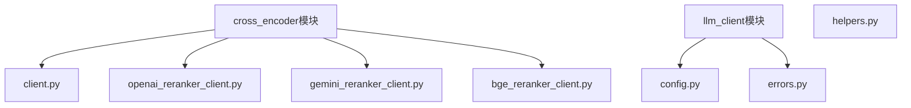
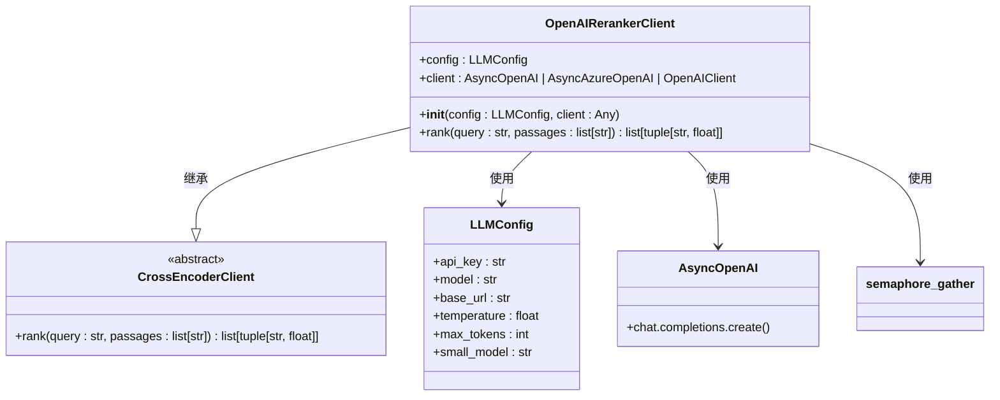
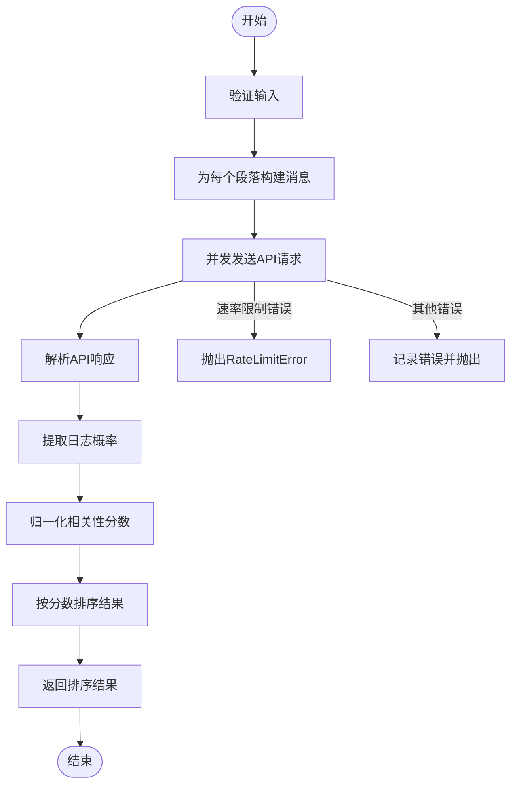
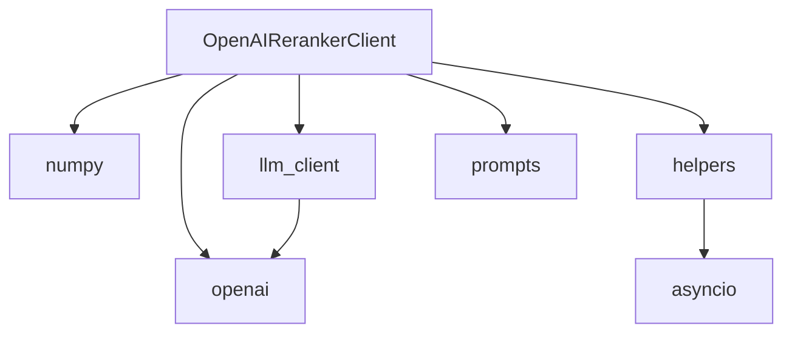

# OpenAI 交叉编码器

<cite>
**本文档中引用的文件**  
- [openai_reranker_client.py](file://graphiti_core/cross_encoder/openai_reranker_client.py)
- [client.py](file://graphiti_core/cross_encoder/client.py)
- [config.py](file://graphiti_core/llm_client/config.py)
- [helpers.py](file://graphiti_core/helpers.py)
- [azure_openai_neo4j.py](file://examples/azure-openai/azure_openai_neo4j.py)
- [errors.py](file://graphiti_core/llm_client/errors.py)
</cite>

## 目录
1. [简介](#简介)
2. [项目结构](#项目结构)
3. [核心组件](#核心组件)
4. [架构概述](#架构概述)
5. [详细组件分析](#详细组件分析)
6. [依赖分析](#依赖分析)
7. [性能考量](#性能考量)
8. [故障排除指南](#故障排除指南)
9. [结论](#结论)

## 简介
本文档深入解析了Graphiti项目中OpenAI交叉编码器的实现，重点分析了`OpenAIRerankerClient`类如何利用OpenAI的重排序模型对候选结果进行相关性评分。文档详细说明了其与OpenAI API的集成方式、认证机制和请求格式，提供了实际代码示例展示如何配置和调用该客户端。同时，文档还分析了其在高并发场景下的性能表现，并给出了连接池和异步调用的优化建议。此外，还讨论了API配额限制和成本控制策略，以及处理服务降级的容错方案。

## 项目结构
Graphiti项目的结构清晰，主要分为以下几个核心模块：
- `graphiti_core`: 核心功能模块，包含交叉编码器、驱动、嵌入器、LLM客户端等。
- `examples`: 各种使用示例，包括Azure OpenAI、电商、播客等场景。
- `mcp_server`: Model Context Protocol服务器实现。
- `server`: REST API服务。

交叉编码器相关的代码位于`graphiti_core/cross_encoder/`目录下，其中`openai_reranker_client.py`是本文档的核心分析对象。

**图源**
- [openai_reranker_client.py](file://graphiti_core/cross_encoder/openai_reranker_client.py)
- [client.py](file://graphiti_core/cross_encoder/client.py)
- [config.py](file://graphiti_core/llm_client/config.py)

## 核心组件
`OpenAIRerankerClient`是Graphiti框架中用于对搜索结果进行重排序的核心组件。它继承自抽象基类`CrossEncoderClient`，实现了基于OpenAI API的重排序功能。该客户端通过向OpenAI模型发送一个简单的布尔分类提示，利用日志概率来对每个段落进行评分和排序。

**节源**
- [openai_reranker_client.py](file://graphiti_core/cross_encoder/openai_reranker_client.py#L34-L124)
- [client.py](file://graphiti_core/cross_encoder/client.py#L20-L41)

## 架构概述
`OpenAIRerankerClient`的架构设计遵循了模块化和可扩展的原则。它依赖于`LLMConfig`类来管理配置，使用`AsyncOpenAI`客户端进行异步API调用，并通过`semaphore_gather`函数来控制并发请求的数量，防止超出API的速率限制。

**图源**
- [openai_reranker_client.py](file://graphiti_core/cross_encoder/openai_reranker_client.py#L34-L124)
- [client.py](file://graphiti_core/cross_encoder/client.py#L20-L41)
- [config.py](file://graphiti_core/llm_client/config.py#L28-L69)

## 详细组件分析

### OpenAIRerankerClient 分析
`OpenAIRerankerClient`类的实现细节如下：

#### 初始化
`__init__`方法接受一个可选的`LLMConfig`对象和一个可选的客户端实例。如果未提供配置，则使用默认配置。如果未提供客户端，则会根据配置创建一个新的`AsyncOpenAI`客户端。

#### 排名方法
`rank`方法是核心功能，它接收一个查询和一组段落，返回按相关性评分排序的结果。该方法通过以下步骤实现：
1. 为每个段落构建一个包含系统提示和用户查询的消息列表。
2. 使用`semaphore_gather`并发地向OpenAI API发送请求。
3. 解析API响应，提取日志概率。
4. 将日志概率转换为归一化的相关性分数。
5. 根据分数对结果进行排序并返回。

**图源**
- [openai_reranker_client.py](file://graphiti_core/cross_encoder/openai_reranker_client.py#L61-L119)

**节源**
- [openai_reranker_client.py](file://graphiti_core/cross_encoder/openai_reranker_client.py#L34-L124)

## 依赖分析
`OpenAIRerankerClient`依赖于多个外部库和内部模块：
- `openai`: 用于与OpenAI API进行交互。
- `numpy`: 用于数值计算，特别是概率的归一化。
- `graphiti_core.helpers`: 提供`semaphore_gather`函数用于控制并发。
- `graphiti_core.llm_client`: 提供`LLMConfig`和`RateLimitError`。
- `graphiti_core.prompts`: 提供`Message`类用于构建API请求。

这些依赖关系确保了`OpenAIRerankerClient`能够高效、可靠地工作。

**图源**
- [openai_reranker_client.py](file://graphiti_core/cross_encoder/openai_reranker_client.py)
- [helpers.py](file://graphiti_core/helpers.py)
- [config.py](file://graphiti_core/llm_client/config.py)

## 性能考量
在高并发场景下，`OpenAIRerankerClient`的性能受到API速率限制和网络延迟的影响。为了优化性能，可以采取以下措施：
- 调整`SEMAPHORE_LIMIT`环境变量以控制并发请求数量。
- 使用连接池来复用HTTP连接。
- 实现缓存机制以避免重复计算。
- 选择延迟更低的API端点。

## 故障排除指南
当使用`OpenAIRerankerClient`时，可能会遇到以下问题：
- **速率限制错误**: 当请求频率超过API限制时，会抛出`RateLimitError`。可以通过降低并发请求数量或增加重试延迟来解决。
- **空响应错误**: 当LLM返回空响应时，会抛出`EmptyResponseError`。这可能是由于输入内容不符合要求或模型内部问题导致。
- **拒绝错误**: 当LLM拒绝生成响应时，会抛出`RefusalError`。这通常是因为输入内容包含敏感或不当信息。

**节源**
- [errors.py](file://graphiti_core/llm_client/errors.py#L18-L40)
- [openai_reranker_client.py](file://graphiti_core/cross_encoder/openai_reranker_client.py#L119-L123)

## 结论
`OpenAIRerankerClient`是Graphiti框架中一个强大且灵活的组件，它利用OpenAI的重排序模型为搜索结果提供高质量的相关性评分。通过合理的配置和优化，可以在各种应用场景中实现高效、准确的重排序功能。