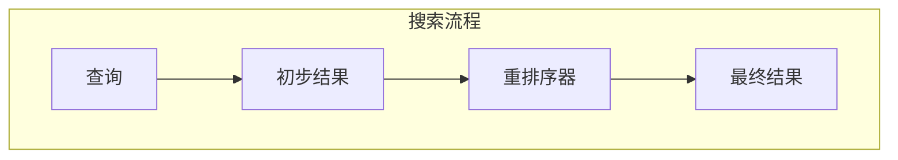
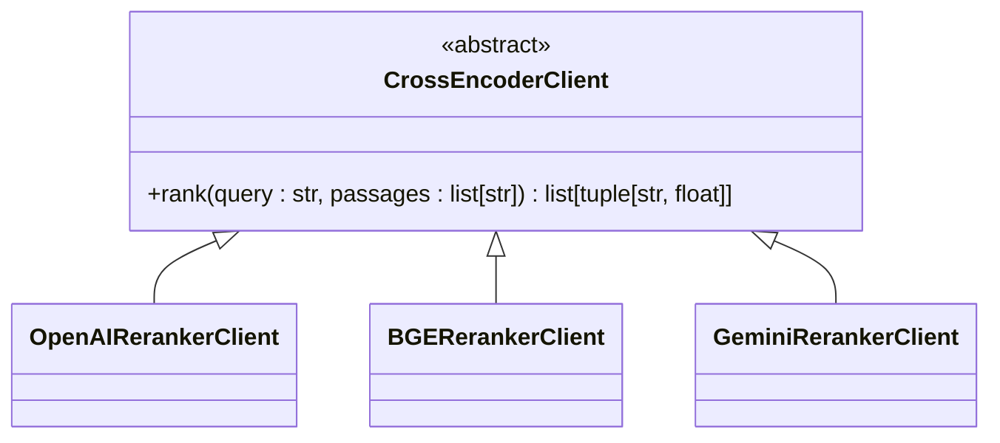
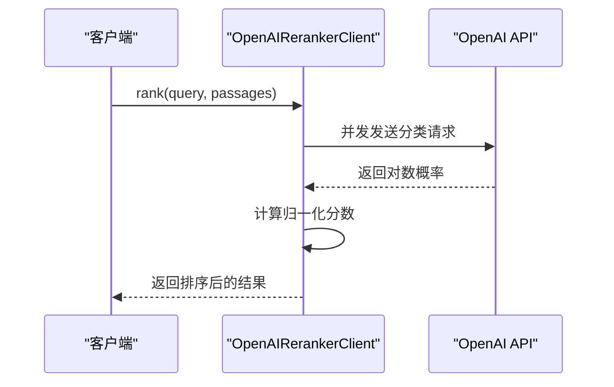
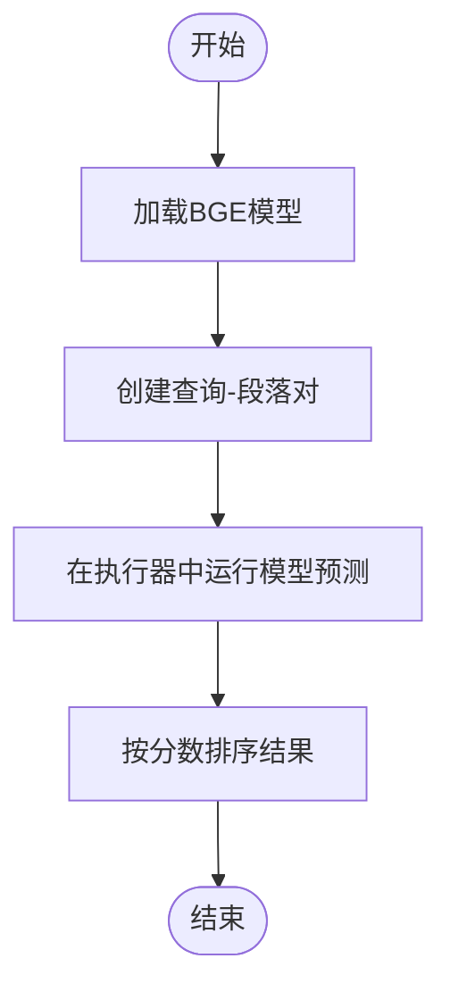
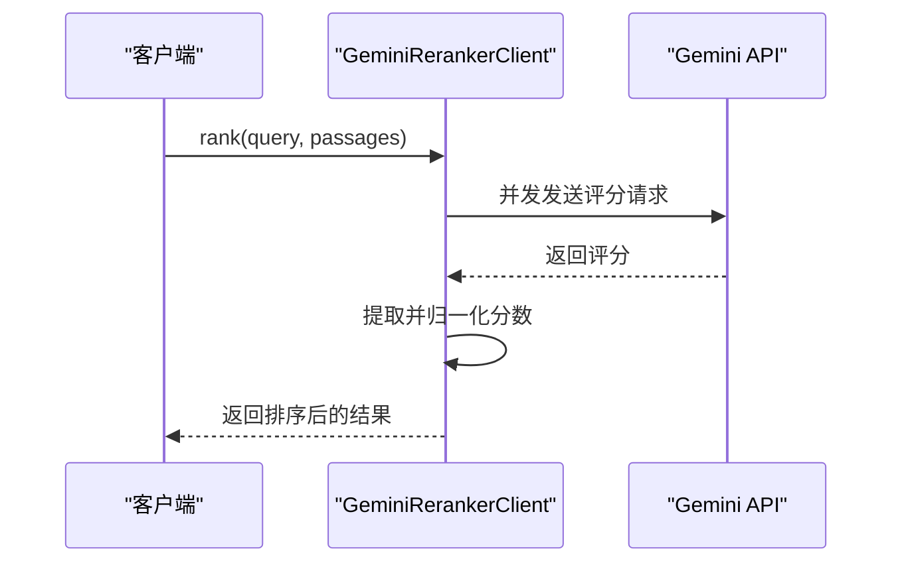
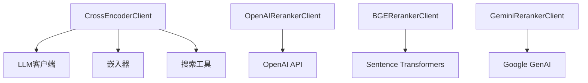

# 交叉编码器

<cite>
**本文档中引用的文件**   
- [client.py](file://graphiti_core/cross_encoder/client.py)
- [openai_reranker_client.py](file://graphiti_core/cross_encoder/openai_reranker_client.py)
- [bge_reranker_client.py](file://graphiti_core/cross_encoder/bge_reranker_client.py)
- [gemini_reranker_client.py](file://graphiti_core/cross_encoder/gemini_reranker_client.py)
- [search.py](file://graphiti_core/search/search.py)
- [search_config.py](file://graphiti_core/search/search_config.py)
- [helpers.py](file://graphiti_core/helpers.py)
</cite>

## 目录
1. [简介](#简介)
2. [核心组件](#核心组件)
3. [架构概述](#架构概述)
4. [详细组件分析](#详细组件分析)
5. [依赖分析](#依赖分析)
6. [性能考虑](#性能考虑)
7. [故障排除指南](#故障排除指南)
8. [结论](#结论)

## 简介
交叉编码器是Graphiti系统中的关键组件，用于对搜索结果进行重排序以提高结果的相关性。本文档深入解析了`CrossEncoderClient`抽象基类的设计及其在不同重排序服务（OpenAI、BGE、Gemini）中的具体实现。文档说明了交叉编码器如何通过`rank`方法对搜索结果进行重排序，并描述了重排序在混合检索流程中的关键作用。此外，文档还涵盖了性能优化策略（如批处理、异步操作）以及为高级用户提供的配置选项和扩展点概览。

## 核心组件
交叉编码器的核心是`CrossEncoderClient`抽象基类，它定义了所有重排序客户端必须实现的接口。该类位于`graphiti_core/cross_encoder/client.py`文件中，通过`abc`模块实现抽象方法。`CrossEncoderClient`的主要功能是提供一个统一的接口来对给定查询和候选段落列表进行相关性评分和排序。

**Section sources**
- [client.py](file://graphiti_core/cross_encoder/client.py#L1-L41)

## 架构概述
交叉编码器在Graphiti系统中作为搜索流程的一部分，与其他组件（如图驱动、嵌入器和搜索配置）协同工作。当执行搜索时，系统会根据配置调用相应的重排序客户端，对初步检索到的结果进行重新排序，从而提高最终结果的相关性。

**Diagram sources **
- [search.py](file://graphiti_core/search/search.py#L68-L183)
- [search_config.py](file://graphiti_core/search/search_config.py#L112-L161)

## 详细组件分析

### CrossEncoderClient 抽象基类分析
`CrossEncoderClient`是所有重排序客户端的抽象基类，定义了`rank`方法的接口。该方法接收一个查询字符串和一个段落列表，返回一个按相关性降序排列的元组列表，每个元组包含段落和其相关性分数。

**Diagram sources **
- [client.py](file://graphiti_core/cross_encoder/client.py#L20-L40)

**Section sources**
- [client.py](file://graphiti_core/cross_encoder/client.py#L1-L41)

### OpenAI 重排序客户端分析
`OpenAIRerankerClient`是`CrossEncoderClient`的一个具体实现，使用OpenAI API进行重排序。它通过发送一个简单的布尔分类器提示来并发地评估每个段落的相关性，并使用对数概率来对段落进行排序。

**Diagram sources **
- [openai_reranker_client.py](file://graphiti_core/cross_encoder/openai_reranker_client.py#L34-L124)

**Section sources**
- [openai_reranker_client.py](file://graphiti_core/cross_encoder/openai_reranker_client.py#L1-L124)

### BGE 重排序客户端分析
`BGERerankerClient`是另一个`CrossEncoderClient`的具体实现，使用BGE（BAAI/bge-reranker-v2-m3）模型进行重排序。它通过将查询和段落配对输入到交叉编码器模型中，直接获取相关性分数。

**Diagram sources **
- [bge_reranker_client.py](file://graphiti_core/cross_encoder/bge_reranker_client.py#L34-L55)

**Section sources**
- [bge_reranker_client.py](file://graphiti_core/cross_encoder/bge_reranker_client.py#L1-L55)

### Gemini 重排序客户端分析
`GeminiRerankerClient`是使用Google Gemini API进行重排序的客户端。与OpenAI重排序器不同，Gemini重排序器使用直接评分方法，每个段落单独在0-100的范围内评分，然后归一化到[0,1]范围。

**Diagram sources **
- [gemini_reranker_client.py](file://graphiti_core/cross_encoder/gemini_reranker_client.py#L43-L162)

**Section sources**
- [gemini_reranker_client.py](file://graphiti_core/cross_encoder/gemini_reranker_client.py#L1-L162)

## 依赖分析
交叉编码器组件依赖于多个其他模块，包括LLM客户端、嵌入器和搜索工具。这些依赖关系确保了重排序功能的完整性和灵活性。

**Diagram sources **
- [openai_reranker_client.py](file://graphiti_core/cross_encoder/openai_reranker_client.py#L25-L27)
- [bge_reranker_client.py](file://graphiti_core/cross_encoder/bge_reranker_client.py#L31)
- [gemini_reranker_client.py](file://graphiti_core/cross_encoder/gemini_reranker_client.py#L23)

**Section sources**
- [openai_reranker_client.py](file://graphiti_core/cross_encoder/openai_reranker_client.py#L1-L124)
- [bge_reranker_client.py](file://graphiti_core/cross_encoder/bge_reranker_client.py#L1-L55)
- [gemini_reranker_client.py](file://graphiti_core/cross_encoder/gemini_reranker_client.py#L1-L162)

## 性能考虑
交叉编码器在设计时考虑了性能优化，包括使用异步操作和信号量来限制并发请求数量。`semaphore_gather`函数在`helpers.py`中定义，用于控制并发协程的数量，防止资源耗尽。

**Section sources**
- [helpers.py](file://graphiti_core/helpers.py#L106-L116)

## 故障排除指南
在使用交叉编码器时，可能会遇到速率限制错误或无效响应等问题。系统通过捕获异常并记录错误日志来处理这些问题。例如，`GeminiRerankerClient`会将速率限制错误转换为`RateLimitError`，以便上层调用者能够适当地处理。

**Section sources**
- [gemini_reranker_client.py](file://graphiti_core/cross_encoder/gemini_reranker_client.py#L149-L161)
- [openai_reranker_client.py](file://graphiti_core/cross_encoder/openai_reranker_client.py#L119-L123)

## 结论
交叉编码器是Graphiti系统中不可或缺的组件，通过多种重排序策略显著提高了搜索结果的相关性。其模块化设计允许轻松集成不同的重排序服务，同时保持统一的接口。通过异步操作和并发控制，系统在保证性能的同时提供了灵活的配置选项，满足不同场景的需求。