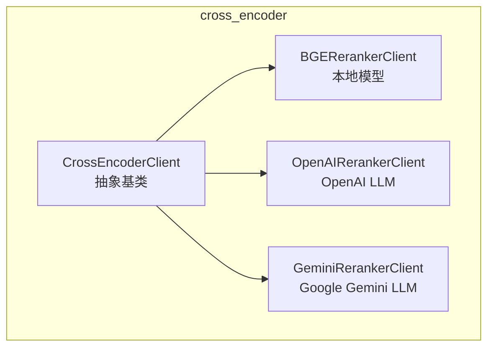
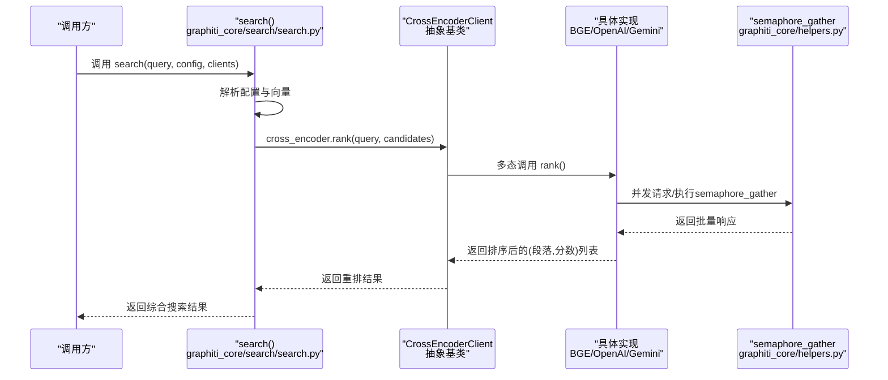
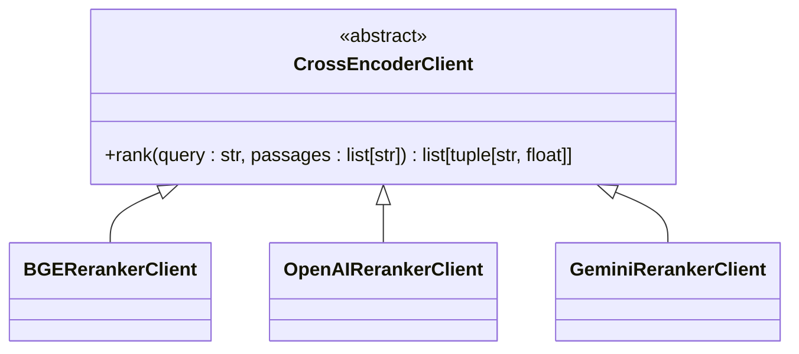
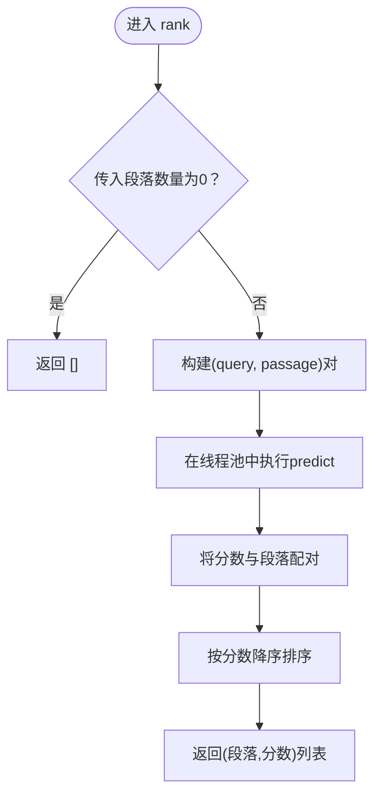
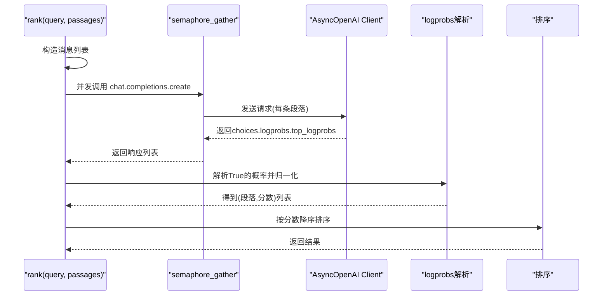
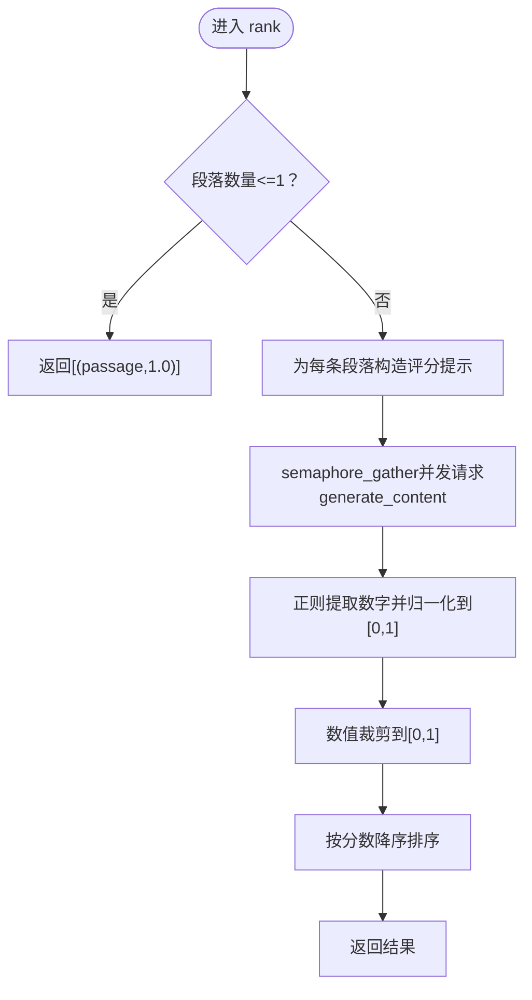
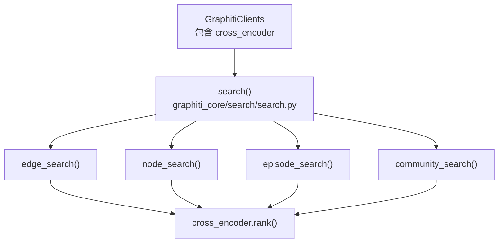
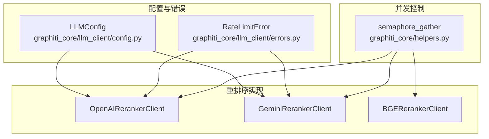

# 交叉编码器客户端基类

<cite>
**本文引用的文件**
- [graphiti_core/cross_encoder/client.py](file://graphiti_core/cross_encoder/client.py)
- [graphiti_core/cross_encoder/__init__.py](file://graphiti_core/cross_encoder/__init__.py)
- [graphiti_core/cross_encoder/bge_reranker_client.py](file://graphiti_core/cross_encoder/bge_reranker_client.py)
- [graphiti_core/cross_encoder/openai_reranker_client.py](file://graphiti_core/cross_encoder/openai_reranker_client.py)
- [graphiti_core/cross_encoder/gemini_reranker_client.py](file://graphiti_core/cross_encoder/gemini_reranker_client.py)
- [graphiti_core/search/search.py](file://graphiti_core/search/search.py)
- [graphiti_core/graphiti_types.py](file://graphiti_core/graphiti_types.py)
- [graphiti_core/llm_client/config.py](file://graphiti_core/llm_client/config.py)
- [graphiti_core/llm_client/errors.py](file://graphiti_core/llm_client/errors.py)
- [graphiti_core/helpers.py](file://graphiti_core/helpers.py)
- [tests/cross_encoder/test_bge_reranker_client_int.py](file://tests/cross_encoder/test_bge_reranker_client_int.py)
- [tests/cross_encoder/test_gemini_reranker_client.py](file://tests/cross_encoder/test_gemini_reranker_client.py)
</cite>

## 目录
1. [引言](#引言)
2. [项目结构](#项目结构)
3. [核心组件](#核心组件)
4. [架构总览](#架构总览)
5. [详细组件分析](#详细组件分析)
6. [依赖关系分析](#依赖关系分析)
7. [性能考量](#性能考量)
8. [故障排查指南](#故障排查指南)
9. [结论](#结论)
10. [附录：扩展指南与最佳实践](#附录扩展指南与最佳实践)

## 引言
本文件围绕 Graphiti 的交叉编码器客户端基类 CrossEncoderClient 进行深入技术文档化，目标是帮助开发者理解该抽象基类的设计目的、统一接口定义、与 LLM 客户端及配置系统的依赖关系，并提供继承该基类实现自定义重排序客户端的步骤、最佳实践、错误处理与超时重试策略的实现细节，以及如何添加新的重排序服务支持。

## 项目结构
交叉编码器相关代码位于 graphiti_core/cross_encoder 目录下，包含抽象基类与若干具体实现：
- 抽象基类：client.py 中的 CrossEncoderClient
- 具体实现：
  - 本地模型：bge_reranker_client.py
  - 基于 OpenAI 的 LLM 重排序：openai_reranker_client.py
  - 基于 Gemini 的 LLM 重排序：gemini_reranker_client.py
- 导出入口：__init__.py 暴露 CrossEncoderClient 与 OpenAIRerankerClient

图表来源
- [graphiti_core/cross_encoder/client.py](file://graphiti_core/cross_encoder/client.py#L20-L41)
- [graphiti_core/cross_encoder/bge_reranker_client.py](file://graphiti_core/cross_encoder/bge_reranker_client.py#L34-L55)
- [graphiti_core/cross_encoder/openai_reranker_client.py](file://graphiti_core/cross_encoder/openai_reranker_client.py#L34-L124)
- [graphiti_core/cross_encoder/gemini_reranker_client.py](file://graphiti_core/cross_encoder/gemini_reranker_client.py#L43-L162)

章节来源
- [graphiti_core/cross_encoder/__init__.py](file://graphiti_core/cross_encoder/__init__.py#L17-L21)

## 核心组件
- CrossEncoderClient（抽象基类）
  - 定义统一的异步 rank 接口，输入查询与候选段落列表，输出按相关性降序排列的（段落, 分数）元组列表。
  - 通过抽象方法约束所有实现必须提供一致的调用契约，便于在搜索流程中以多态方式注入不同重排序器。

- 具体实现
  - BGERerankerClient：基于本地 sentence-transformers 的交叉编码器，异步执行预测并通过线程池执行同步 predict，再排序返回。
  - OpenAIRerankerClient：基于 OpenAI API 的对数概率评分，使用并发请求每个段落，提取 top logprobs 并归一化为分数。
  - GeminiRerankerClient：基于 Google Gemini API 的直接打分，每条段落独立生成内容并解析数字分数，归一化到 [0,1] 后排序。

章节来源
- [graphiti_core/cross_encoder/client.py](file://graphiti_core/cross_encoder/client.py#L20-L41)
- [graphiti_core/cross_encoder/bge_reranker_client.py](file://graphiti_core/cross_encoder/bge_reranker_client.py#L34-L55)
- [graphiti_core/cross_encoder/openai_reranker_client.py](file://graphiti_core/cross_encoder/openai_reranker_client.py#L34-L124)
- [graphiti_core/cross_encoder/gemini_reranker_client.py](file://graphiti_core/cross_encoder/gemini_reranker_client.py#L43-L162)

## 架构总览
CrossEncoderClient 在搜索主流程中被注入到 GraphitiClients 客户端集合中，供边、节点、社区与剧集等不同类型的检索后重排使用。搜索主函数会并发调度各类搜索任务，并在需要时调用 cross_encoder.rank 对候选结果进行重排。

图表来源
- [graphiti_core/search/search.py](file://graphiti_core/search/search.py#L68-L184)
- [graphiti_core/graphiti_types.py](file://graphiti_core/graphiti_types.py#L26-L34)
- [graphiti_core/helpers.py](file://graphiti_core/helpers.py#L105-L117)
- [graphiti_core/cross_encoder/client.py](file://graphiti_core/cross_encoder/client.py#L20-L41)

## 详细组件分析

### 抽象基类 CrossEncoderClient
- 设计目的
  - 提供统一的异步重排序接口，屏蔽底层实现差异（本地模型 vs LLM API），使上层搜索逻辑无需关心具体重排序器类型。
  - 通过抽象方法约束实现契约，确保所有子类均提供 rank(query, passages) 的一致性行为。
- 关键点
  - rank 方法签名固定，返回值为按分数降序的（段落, 分数）元组列表，便于后续合并与排序。
  - 采用异步设计，配合并发工具实现高吞吐。

图表来源
- [graphiti_core/cross_encoder/client.py](file://graphiti_core/cross_encoder/client.py#L20-L41)
- [graphiti_core/cross_encoder/bge_reranker_client.py](file://graphiti_core/cross_encoder/bge_reranker_client.py#L34-L55)
- [graphiti_core/cross_encoder/openai_reranker_client.py](file://graphiti_core/cross_encoder/openai_reranker_client.py#L34-L124)
- [graphiti_core/cross_encoder/gemini_reranker_client.py](file://graphiti_core/cross_encoder/gemini_reranker_client.py#L43-L162)

章节来源
- [graphiti_core/cross_encoder/client.py](file://graphiti_core/cross_encoder/client.py#L20-L41)

### BGERerankerClient（本地交叉编码器）
- 实现要点
  - 使用本地 sentence-transformers 模型，构造 query 与每个段落的成对输入，异步执行 predict。
  - 线程池执行同步 predict，避免阻塞事件循环；随后按分数降序排序返回。
  - 对空输入返回空列表，单条输入直接返回（无实际重排意义）。
- 性能与资源
  - 依赖本地模型，延迟主要由模型推理决定；适合低并发或离线场景。
  - 需要安装额外依赖以启用本地模型。

图表来源
- [graphiti_core/cross_encoder/bge_reranker_client.py](file://graphiti_core/cross_encoder/bge_reranker_client.py#L34-L55)

章节来源
- [graphiti_core/cross_encoder/bge_reranker_client.py](file://graphiti_core/cross_encoder/bge_reranker_client.py#L34-L55)

### OpenAIRerankerClient（基于 OpenAI 的 LLM 重排序）
- 实现要点
  - 使用 OpenAI Chat Completions API，为每个段落构造提示，要求返回 True/False 表示相关性。
  - 开启 logprobs/top_logprobs，从 token 概率中提取 True 的归一化概率作为分数。
  - 使用 semaphore_gather 并发请求，提高吞吐。
  - 对速率限制错误进行捕获并转换为 RateLimitError，便于上层处理。
- 错误处理
  - 捕获 openai.RateLimitError 并抛出 RateLimitError。
  - 其他异常记录日志后重新抛出。

图表来源
- [graphiti_core/cross_encoder/openai_reranker_client.py](file://graphiti_core/cross_encoder/openai_reranker_client.py#L61-L124)
- [graphiti_core/helpers.py](file://graphiti_core/helpers.py#L105-L117)
- [graphiti_core/llm_client/errors.py](file://graphiti_core/llm_client/errors.py#L18-L24)

章节来源
- [graphiti_core/cross_encoder/openai_reranker_client.py](file://graphiti_core/cross_encoder/openai_reranker_client.py#L34-L124)
- [graphiti_core/llm_client/errors.py](file://graphiti_core/llm_client/errors.py#L18-L24)

### GeminiRerankerClient（基于 Gemini 的 LLM 重排序）
- 实现要点
  - 使用 Gemini 的 generate_content API，直接为每条段落生成 0-100 的相关性评分文本，解析数字并归一化到 [0,1]。
  - 使用正则表达式提取数字，若无法提取或为空则赋 0.0，保证健壮性。
  - 单条输入时直接返回 (passage, 1.0)，避免不必要的 API 调用。
  - 使用 semaphore_gather 并发请求，支持高吞吐。
  - 对速率限制（如 rate limit、quota、resource_exhausted、429）识别并抛出 RateLimitError。
- 错误处理
  - 通过字符串匹配检测速率限制相关错误，统一抛出 RateLimitError。
  - 其他异常记录日志后重新抛出。

图表来源
- [graphiti_core/cross_encoder/gemini_reranker_client.py](file://graphiti_core/cross_encoder/gemini_reranker_client.py#L73-L162)
- [graphiti_core/helpers.py](file://graphiti_core/helpers.py#L105-L117)

章节来源
- [graphiti_core/cross_encoder/gemini_reranker_client.py](file://graphiti_core/cross_encoder/gemini_reranker_client.py#L43-L162)

### 与搜索主流程的集成
- GraphitiClients 将 cross_encoder 注入到统一客户端集合中，搜索主函数在各类型检索后调用 cross_encoder.rank 进行重排。
- 搜索主流程并发调度多个搜索任务，跨类型共享同一重排序器接口，简化了多数据源的统一重排逻辑。

图表来源
- [graphiti_core/graphiti_types.py](file://graphiti_core/graphiti_types.py#L26-L34)
- [graphiti_core/search/search.py](file://graphiti_core/search/search.py#L68-L184)

章节来源
- [graphiti_core/graphiti_types.py](file://graphiti_core/graphiti_types.py#L26-L34)
- [graphiti_core/search/search.py](file://graphiti_core/search/search.py#L68-L184)

## 依赖关系分析
- 与 LLM 客户端与配置系统的关系
  - OpenAI 与 Gemini 实现依赖 LLMConfig（统一的 API Key、模型名、基础 URL、温度、最大 token 等参数）。
  - OpenAI 实现依赖 RateLimitError 以统一速率限制异常。
  - 三者均通过 semaphore_gather 控制并发度，避免过度并发导致的资源争用。
- 与搜索模块的关系
  - CrossEncoderClient 是 GraphitiClients 的一部分，贯穿边、节点、社区与剧集的检索后重排。
  - 搜索主流程在需要时才调用 cross_encoder.rank，避免不必要的开销。

图表来源
- [graphiti_core/llm_client/config.py](file://graphiti_core/llm_client/config.py#L28-L69)
- [graphiti_core/llm_client/errors.py](file://graphiti_core/llm_client/errors.py#L18-L24)
- [graphiti_core/helpers.py](file://graphiti_core/helpers.py#L105-L117)
- [graphiti_core/cross_encoder/openai_reranker_client.py](file://graphiti_core/cross_encoder/openai_reranker_client.py#L34-L124)
- [graphiti_core/cross_encoder/gemini_reranker_client.py](file://graphiti_core/cross_encoder/gemini_reranker_client.py#L43-L162)
- [graphiti_core/cross_encoder/bge_reranker_client.py](file://graphiti_core/cross_encoder/bge_reranker_client.py#L34-L55)

章节来源
- [graphiti_core/llm_client/config.py](file://graphiti_core/llm_client/config.py#L28-L69)
- [graphiti_core/llm_client/errors.py](file://graphiti_core/llm_client/errors.py#L18-L24)
- [graphiti_core/helpers.py](file://graphiti_core/helpers.py#L105-L117)

## 性能考量
- 并发控制
  - 所有实现均使用 semaphore_gather 控制并发度，避免过多并发导致 API 限流或资源耗尽。
  - 可通过环境变量调整并发上限，平衡吞吐与稳定性。
- 本地 vs LLM
  - 本地模型（BGE）延迟取决于模型大小与硬件；适合低并发或离线场景。
  - LLM 实现（OpenAI/Gemini）受网络与 API 限流影响，需合理设置并发与重试策略。
- 排序与数据结构
  - 结果列表规模通常较小（候选数量），排序复杂度可忽略不计；但建议保持稳定的排序键与去重策略。

[本节为通用性能讨论，不直接分析具体文件]

## 故障排查指南
- 速率限制
  - OpenAI：捕获速率限制异常并抛出 RateLimitError，便于上层统一处理。
  - Gemini：通过字符串匹配识别 rate limit/quota/resource_exhausted/429 等错误并抛出 RateLimitError。
- 空输入与边界情况
  - BGE：空段落列表直接返回空列表。
  - Gemini：单条段落直接返回 (passage, 1.0)。
- 日志与可观测性
  - Gemini 实现会在无法解析分数或空响应时记录警告日志，便于定位问题。
- 测试参考
  - BGE：覆盖基本功能、空输入、单条输入等场景。
  - Gemini：覆盖并发请求、无效分数处理、速率限制识别、空响应处理等。

章节来源
- [graphiti_core/cross_encoder/openai_reranker_client.py](file://graphiti_core/cross_encoder/openai_reranker_client.py#L119-L124)
- [graphiti_core/cross_encoder/gemini_reranker_client.py](file://graphiti_core/cross_encoder/gemini_reranker_client.py#L149-L162)
- [tests/cross_encoder/test_bge_reranker_client_int.py](file://tests/cross_encoder/test_bge_reranker_client_int.py#L1-L79)
- [tests/cross_encoder/test_gemini_reranker_client.py](file://tests/cross_encoder/test_gemini_reranker_client.py#L1-L354)

## 结论
CrossEncoderClient 通过统一的异步 rank 接口，将本地模型与 LLM API 的重排序能力抽象为一致的多态对象，使得搜索主流程能够以插件式的方式灵活切换不同的重排序服务。OpenAI 与 Gemini 实现展示了如何在异步环境中利用并发工具与稳健的错误处理策略，而 BGE 实现则提供了低延迟、本地化的替代方案。结合 GraphitiClients 的注入机制，该设计实现了高度解耦与可扩展的重排序体系。

[本节为总结性内容，不直接分析具体文件]

## 附录：扩展指南与最佳实践

### 继承 CrossEncoderClient 的步骤
- 步骤
  1. 创建新类并继承 CrossEncoderClient。
  2. 实现异步 rank 方法，遵循输入输出约定（query: str, passages: list[str] -> list[tuple[str, float]]）。
  3. 如需外部 API 访问，使用 LLMConfig 或自定义配置类管理凭据与模型参数。
  4. 使用 semaphore_gather 控制并发，避免过度并发导致限流。
  5. 明确错误处理策略：区分速率限制与一般错误，必要时抛出 RateLimitError。
  6. 在 __init__.py 中导出新类，便于上层导入与使用。
- 最佳实践
  - 输入校验：对空段落列表与单条输入进行特殊处理，保证行为一致。
  - 输出规范：严格按分数降序返回，确保上层合并与排序逻辑稳定。
  - 错误分类：速率限制应统一转换为 RateLimitError，便于上层重试或降级。
  - 并发与限流：根据服务端限流策略调整并发度，必要时增加指数退避重试。
  - 日志与监控：记录关键错误与异常路径，便于定位问题。

章节来源
- [graphiti_core/cross_encoder/client.py](file://graphiti_core/cross_encoder/client.py#L20-L41)
- [graphiti_core/llm_client/config.py](file://graphiti_core/llm_client/config.py#L28-L69)
- [graphiti_core/llm_client/errors.py](file://graphiti_core/llm_client/errors.py#L18-L24)
- [graphiti_core/helpers.py](file://graphiti_core/helpers.py#L105-L117)
- [graphiti_core/cross_encoder/__init__.py](file://graphiti_core/cross_encoder/__init__.py#L17-L21)

### 添加新的重排序服务支持
- 选择实现路径
  - 若使用本地模型：参考 BGERerankerClient，注意异步执行同步预测与线程池使用。
  - 若使用 LLM API：参考 OpenAIRerankerClient 或 GeminiRerankerClient，关注并发、日志概率解析或直接评分解析。
- 关键实现点
  - rank 方法：构造输入、并发请求、解析分数、排序返回。
  - 配置与客户端：使用 LLMConfig 或自定义配置类管理 API 凭据与模型参数。
  - 错误处理：识别速率限制并抛出 RateLimitError，其他异常记录日志后抛出。
  - 并发控制：使用 semaphore_gather，结合环境变量调整并发度。
- 验收与测试
  - 覆盖基本功能、空输入、单条输入、并发请求、错误处理等场景。
  - 参考现有测试文件的组织方式与断言策略。

章节来源
- [graphiti_core/cross_encoder/bge_reranker_client.py](file://graphiti_core/cross_encoder/bge_reranker_client.py#L34-L55)
- [graphiti_core/cross_encoder/openai_reranker_client.py](file://graphiti_core/cross_encoder/openai_reranker_client.py#L61-L124)
- [graphiti_core/cross_encoder/gemini_reranker_client.py](file://graphiti_core/cross_encoder/gemini_reranker_client.py#L73-L162)
- [tests/cross_encoder/test_bge_reranker_client_int.py](file://tests/cross_encoder/test_bge_reranker_client_int.py#L1-L79)
- [tests/cross_encoder/test_gemini_reranker_client.py](file://tests/cross_encoder/test_gemini_reranker_client.py#L1-L354)