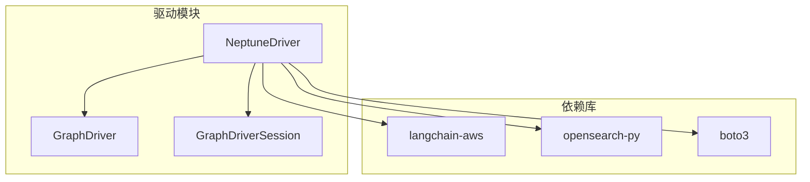
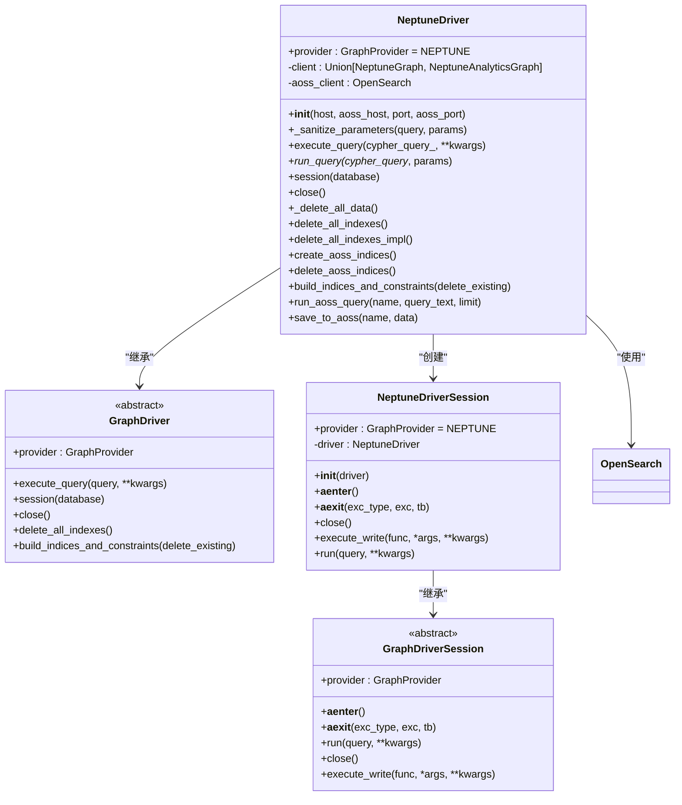
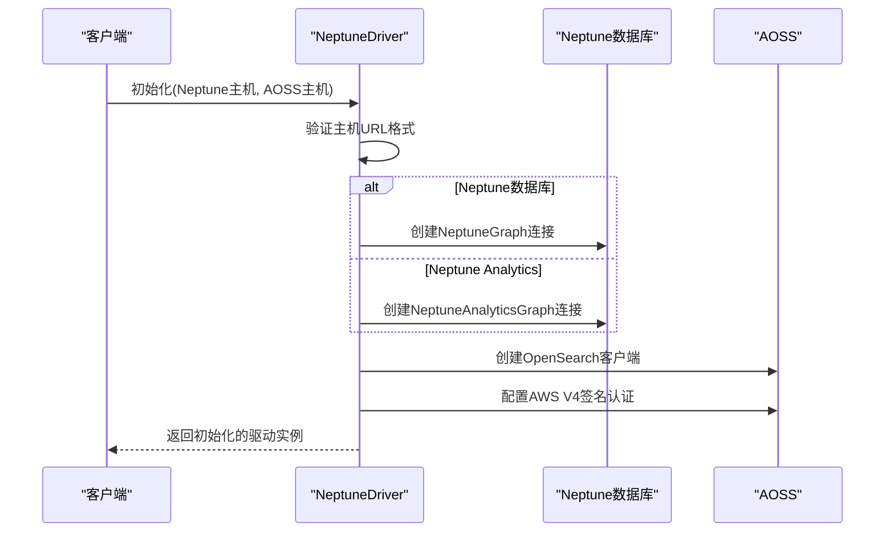
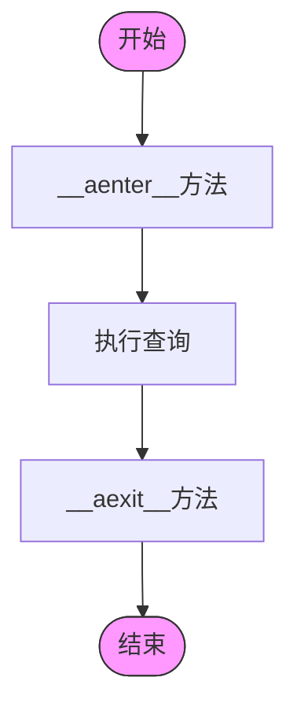
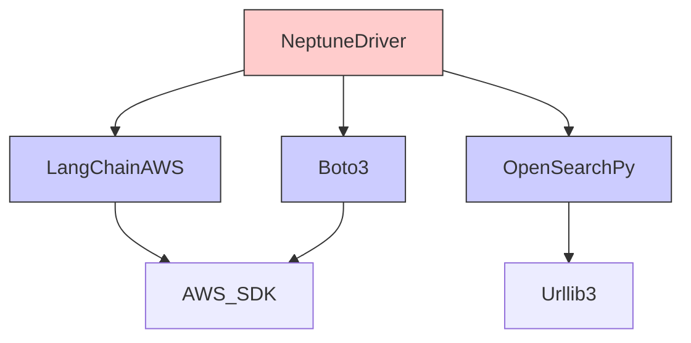

# Amazon Neptune驱动实现

<cite>
**本文档引用的文件**
- [neptune_driver.py](file://graphiti_core/driver/neptune_driver.py)
- [driver.py](file://graphiti_core/driver/driver.py)
- [quickstart_neptune.py](file://examples/quickstart/quickstart_neptune.py)
</cite>

## 目录
1. [简介](#简介)
2. [项目结构](#项目结构)
3. [核心组件](#核心组件)
4. [架构概述](#架构概述)
5. [详细组件分析](#详细组件分析)
6. [依赖分析](#依赖分析)
7. [性能考虑](#性能考虑)
8. [故障排除指南](#故障排除指南)
9. [结论](#结论)

## 简介
Amazon Neptune驱动是Graphiti框架中用于与Amazon Neptune图数据库进行交互的核心组件。该驱动实现了通过HTTP/HTTPS协议与Neptune集群通信的功能，支持Gremlin和OpenCypher查询语言的处理逻辑。驱动设计考虑了云环境特有的连接设置，包括IAM认证、SSL加密和VPC网络配置。它还提供了在分布式图数据库环境中管理会话与事务一致性的机制，并包含了大规模图数据查询的性能调优策略。

## 项目结构
Amazon Neptune驱动位于`graphiti_core/driver/`目录下，是Graphiti框架中多个图数据库驱动之一。该项目结构体现了模块化设计原则，将Neptune驱动与其他数据库驱动（如Neo4j、FalkorDB等）分离，同时共享通用的驱动接口和抽象基类。

**图源**
- [neptune_driver.py](file://graphiti_core/driver/neptune_driver.py#L108-L304)
- [driver.py](file://graphiti_core/driver/driver.py#L73-L115)

**节源**
- [neptune_driver.py](file://graphiti_core/driver/neptune_driver.py#L1-L306)
- [driver.py](file://graphiti_core/driver/driver.py#L1-L125)

## 核心组件
Neptune驱动的核心组件包括`NeptuneDriver`类和`NeptuneDriverSession`类，它们共同实现了与Amazon Neptune数据库的连接、查询执行和会话管理功能。`NeptuneDriver`类负责初始化连接、处理查询和管理索引，而`NeptuneDriverSession`类则提供了异步上下文管理器接口，确保会话的正确创建和销毁。

**节源**
- [neptune_driver.py](file://graphiti_core/driver/neptune_driver.py#L108-L304)

## 架构概述
Neptune驱动的架构设计遵循了抽象工厂模式，通过继承`GraphDriver`抽象基类来实现统一的接口。驱动支持两种Neptune服务模式：Neptune数据库集群和Neptune Analytics图。对于索引和全文搜索功能，驱动集成了Amazon OpenSearch Serverless（AOSS），通过`OpenSearch`客户端进行交互。

**图源**
- [neptune_driver.py](file://graphiti_core/driver/neptune_driver.py#L108-L304)
- [driver.py](file://graphiti_core/driver/driver.py#L48-L115)

## 详细组件分析

### NeptuneDriver分析
`NeptuneDriver`类是Amazon Neptune驱动的主要实现，负责管理与Neptune数据库的连接和查询执行。该类通过`__init__`方法初始化，根据提供的主机URL前缀（`neptune-db://`或`neptune-graph://`）来区分Neptune数据库集群和Neptune Analytics图服务。

#### 初始化与连接
驱动的初始化过程包括建立与Neptune数据库的连接以及配置Amazon OpenSearch Serverless（AOSS）客户端。连接使用AWS签名版本4进行身份验证，确保了IAM认证的安全性。SSL加密通过`use_ssl=True`和`verify_certs=True`参数启用，保证了数据传输的安全性。

**图源**
- [neptune_driver.py](file://graphiti_core/driver/neptune_driver.py#L111-L151)

#### 查询处理
驱动支持OpenCypher查询语言，通过`execute_query`方法执行查询。查询参数的处理通过`_sanitize_parameters`方法实现，该方法能够处理日期时间对象、列表和字典等复杂数据类型，并将其转换为Neptune兼容的格式。

**节源**
- [neptune_driver.py](file://graphiti_core/driver/neptune_driver.py#L108-L304)

### NeptuneDriverSession分析
`NeptuneDriverSession`类实现了`GraphDriverSession`接口，提供了异步上下文管理器功能。该类的主要作用是封装查询执行逻辑，确保在异步环境中能够正确管理会话生命周期。

#### 会话管理
会话类通过`__aenter__`和`__aexit__`方法实现了异步上下文管理器协议，允许使用`async with`语法来管理会话。尽管Neptune本身不需要显式的会话清理，但这些方法的存在确保了接口的一致性。

**图源**
- [neptune_driver.py](file://graphiti_core/driver/neptune_driver.py#L276-L304)

**节源**
- [neptune_driver.py](file://graphiti_core/driver/neptune_driver.py#L276-L304)

## 依赖分析
Neptune驱动依赖于多个外部库来实现其功能。主要依赖包括`langchain-aws`用于与Neptune服务交互，`opensearch-py`用于AOSS索引操作，以及`boto3`用于AWS身份验证。这些依赖在`pyproject.toml`文件中定义为可选依赖，通过`neptune`特性进行管理。

**图源**
- [pyproject.toml](file://pyproject.toml#L37)
- [neptune_driver.py](file://graphiti_core/driver/neptune_driver.py#L23-L25)

**节源**
- [pyproject.toml](file://pyproject.toml#L1-L107)
- [neptune_driver.py](file://graphiti_core/driver/neptune_driver.py#L1-L306)

## 性能考虑
Neptune驱动在设计时考虑了大规模图数据查询的性能优化。通过AOSS实现的全文搜索功能支持查询分页和结果流式处理，避免了大规模数据集的内存溢出问题。驱动还实现了连接池（`pool_maxsize=20`），提高了并发查询的效率。

## 故障排除指南
当遇到Neptune驱动连接问题时，应首先检查环境变量`NEPTUNE_HOST`和`AOSS_HOST`是否正确设置。查询执行失败时，驱动会记录详细的错误信息，包括执行的查询语句和参数，便于调试。索引创建问题可能需要等待60秒的延迟，以确保AOSS索引完全创建。

**节源**
- [quickstart_neptune.py](file://examples/quickstart/quickstart_neptune.py#L48-L58)
- [neptune_driver.py](file://graphiti_core/driver/neptune_driver.py#L204-L209)

## 结论
Amazon Neptune驱动通过精心设计的架构和实现，为Graphiti框架提供了与Amazon Neptune图数据库的无缝集成。驱动不仅实现了基本的连接和查询功能，还考虑了云环境特有的安全性和性能需求。通过集成AOSS实现的全文搜索功能，驱动能够处理大规模图数据的复杂查询，为构建高性能的图应用提供了坚实的基础。