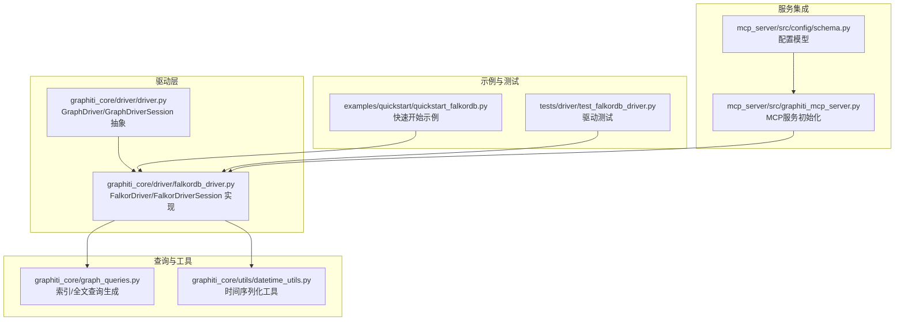
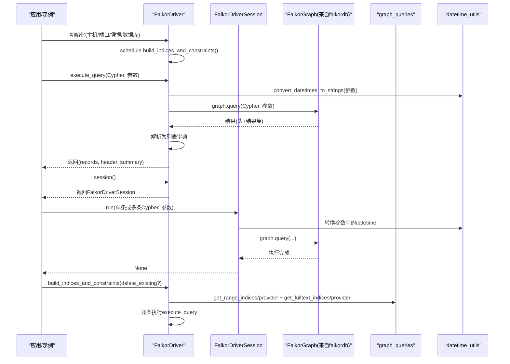
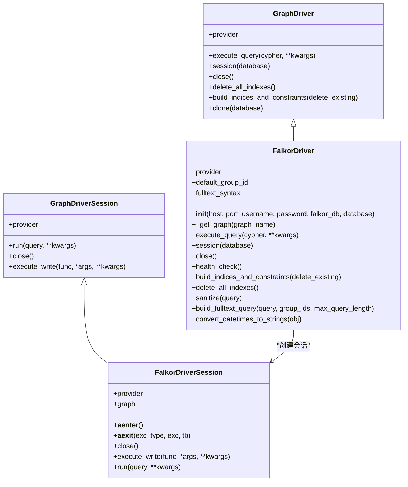
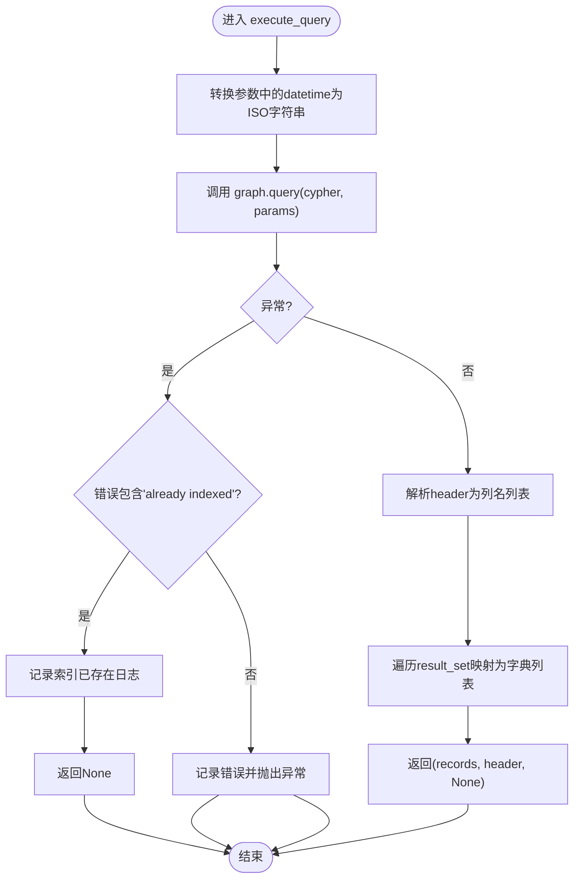
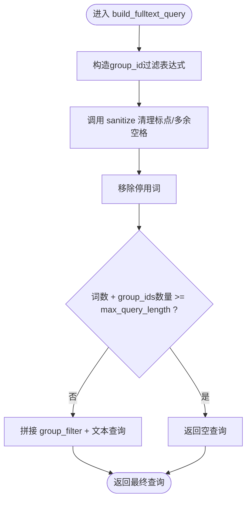
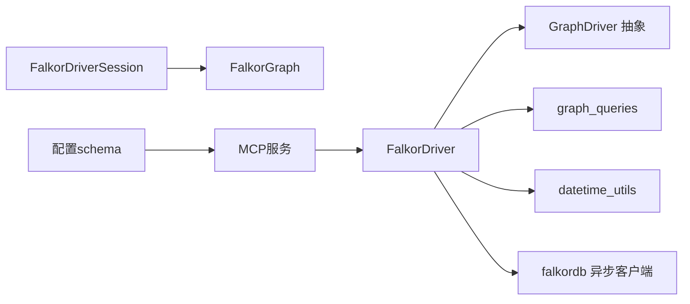

# FalkorDB驱动实现

<cite>
**本文引用的文件**
- [graphiti_core/driver/falkordb_driver.py](file://graphiti_core/driver/falkordb_driver.py)
- [graphiti_core/driver/driver.py](file://graphiti_core/driver/driver.py)
- [graphiti_core/graph_queries.py](file://graphiti_core/graph_queries.py)
- [graphiti_core/utils/datetime_utils.py](file://graphiti_core/utils/datetime_utils.py)
- [examples/quickstart/quickstart_falkordb.py](file://examples/quickstart/quickstart_falkordb.py)
- [tests/driver/test_falkordb_driver.py](file://tests/driver/test_falkordb_driver.py)
- [mcp_server/src/graphiti_mcp_server.py](file://mcp_server/src/graphiti_mcp_server.py)
- [mcp_server/src/config/schema.py](file://mcp_server/src/config/schema.py)
</cite>

## 目录
1. [简介](#简介)
2. [项目结构](#项目结构)
3. [核心组件](#核心组件)
4. [架构总览](#架构总览)
5. [详细组件分析](#详细组件分析)
6. [依赖关系分析](#依赖关系分析)
7. [性能考量](#性能考量)
8. [故障排查指南](#故障排查指南)
9. [结论](#结论)
10. [附录：配置与使用示例](#附录配置与使用示例)

## 简介
本文件面向希望在Graphiti中使用FalkorDB作为图数据库后端的开发者，系统性解析FalkorDBDriver类对GraphDriver接口的具体实现，覆盖以下关键主题：
- 基于RedisGraph模块的交互机制：查询协议、结果解析、连接管理
- 图模式匹配与全文检索：如何利用FalkorDB的图模式匹配能力执行高效查询
- build_indices_and_constraints方法在FalkorDB环境下的实际作用：标签索引与全文索引的创建
- 配置参数说明与使用示例：典型读写操作场景
- 性能考量：内存使用、查询复杂度限制
- 故障排查：响应延迟、连接中断等常见问题

## 项目结构
围绕FalkorDB驱动的相关文件组织如下：
- 驱动层：FalkorDBDriver与FalkorDriverSession实现GraphDriver接口
- 查询生成：graph_queries.py提供跨数据库的索引与全文检索查询生成
- 时间处理：datetime_utils.py提供统一的时间对象序列化策略
- 示例与测试：quickstart示例展示基本用法；单元测试覆盖关键行为
- MCP服务集成：在MCP服务中按配置自动选择FalkorDB并初始化

图表来源
- [graphiti_core/driver/driver.py](file://graphiti_core/driver/driver.py#L42-L125)
- [graphiti_core/driver/falkordb_driver.py](file://graphiti_core/driver/falkordb_driver.py#L79-L363)
- [graphiti_core/graph_queries.py](file://graphiti_core/graph_queries.py#L1-L163)
- [graphiti_core/utils/datetime_utils.py](file://graphiti_core/utils/datetime_utils.py#L1-L56)
- [examples/quickstart/quickstart_falkordb.py](file://examples/quickstart/quickstart_falkordb.py#L1-L251)
- [tests/driver/test_falkordb_driver.py](file://tests/driver/test_falkordb_driver.py#L1-L393)
- [mcp_server/src/graphiti_mcp_server.py](file://mcp_server/src/graphiti_mcp_server.py#L210-L308)
- [mcp_server/src/config/schema.py](file://mcp_server/src/config/schema.py#L190-L292)

章节来源
- [graphiti_core/driver/falkordb_driver.py](file://graphiti_core/driver/falkordb_driver.py#L79-L363)
- [graphiti_core/driver/driver.py](file://graphiti_core/driver/driver.py#L42-L125)

## 核心组件
- GraphDriver抽象：定义了统一的查询执行、会话管理、索引构建与关闭接口
- FalkorDriver：具体实现，负责连接建立、查询执行、结果格式化、索引与约束构建、健康检查、全文查询构建等
- FalkorDriverSession：会话封装，支持异步上下文管理、批量查询执行、参数转换
- graph_queries：提供跨数据库的索引与全文检索查询生成，FalkorDB专用的索引与查询语法由该模块生成
- datetime_utils：统一将datetime对象转换为ISO字符串，适配FalkorDB不直接支持datetime类型的要求

章节来源
- [graphiti_core/driver/driver.py](file://graphiti_core/driver/driver.py#L42-L125)
- [graphiti_core/driver/falkordb_driver.py](file://graphiti_core/driver/falkordb_driver.py#L114-L363)
- [graphiti_core/graph_queries.py](file://graphiti_core/graph_queries.py#L1-L163)
- [graphiti_core/utils/datetime_utils.py](file://graphiti_core/utils/datetime_utils.py#L1-L56)

## 架构总览
下图展示了GraphDriver到FalkorDB实现的调用链路与数据流：

图表来源
- [graphiti_core/driver/falkordb_driver.py](file://graphiti_core/driver/falkordb_driver.py#L168-L212)
- [graphiti_core/driver/falkordb_driver.py](file://graphiti_core/driver/falkordb_driver.py#L100-L112)
- [graphiti_core/graph_queries.py](file://graphiti_core/graph_queries.py#L28-L108)
- [graphiti_core/utils/datetime_utils.py](file://graphiti_core/utils/datetime_utils.py#L45-L56)

## 详细组件分析

### FalkorDriver类实现
- 连接与初始化
  - 支持通过主机、端口、用户名、密码或直接传入已有的FalkorDB实例进行初始化
  - 默认数据库名“default_db”，当未指定图名时使用该默认值
  - 启动事件循环时，异步调度构建索引与约束任务
- 查询执行
  - 将datetime类型的参数统一转换为ISO字符串后再提交给底层客户端
  - 捕获“索引已存在”错误并记录日志，避免中断流程
  - 将底层返回的header与result_set转换为Graphiti期望的records列表字典格式
- 会话管理
  - 提供session()方法返回FalkorDriverSession
  - close()方法根据可用的异步/同步关闭接口依次尝试关闭
- 健康检查
  - 通过简单MATCH语句验证连通性
- 全文查询构建
  - 提供sanitize方法替换特殊字符为空格，移除停用词，限制最大查询长度
  - build_fulltext_query采用RedisSearch风格的字段前缀与OR/AND组合
- 索引与约束
  - build_indices_and_constraints：基于graph_queries生成范围索引与全文索引的Cypher并逐条执行
  - delete_all_indexes：枚举现有索引并删除对应范围/全文索引

图表来源
- [graphiti_core/driver/driver.py](file://graphiti_core/driver/driver.py#L42-L125)
- [graphiti_core/driver/falkordb_driver.py](file://graphiti_core/driver/falkordb_driver.py#L79-L363)

章节来源
- [graphiti_core/driver/falkordb_driver.py](file://graphiti_core/driver/falkordb_driver.py#L114-L363)

### 查询执行与结果解析流程
- 参数转换：将包含datetime的对象递归转换为ISO字符串，确保FalkorDB可接受
- 执行：调用底层graph.query，支持单条与多条查询（列表形式）
- 解析：从header提取列名，将每行结果映射为字典，补齐缺失字段为None

图表来源
- [graphiti_core/driver/falkordb_driver.py](file://graphiti_core/driver/falkordb_driver.py#L168-L212)
- [graphiti_core/utils/datetime_utils.py](file://graphiti_core/utils/datetime_utils.py#L45-L56)

章节来源
- [graphiti_core/driver/falkordb_driver.py](file://graphiti_core/driver/falkordb_driver.py#L168-L212)
- [graphiti_core/utils/datetime_utils.py](file://graphiti_core/utils/datetime_utils.py#L1-L56)

### 全文查询构建算法
- 输入：原始查询字符串、可选的group_ids、最大查询长度
- 步骤：
  1) 使用sanitize将标点符号替换为空格并清理多余空格
  2) 移除停用词集合中的词
  3) 若最终词数与group_ids数量超过阈值则返回空查询
  4) 组合group过滤条件与文本查询，形成RedisSearch风格的查询串

图表来源
- [graphiti_core/driver/falkordb_driver.py](file://graphiti_core/driver/falkordb_driver.py#L331-L363)

章节来源
- [graphiti_core/driver/falkordb_driver.py](file://graphiti_core/driver/falkordb_driver.py#L331-L363)

### 索引与约束构建
- 范围索引：针对节点与边的关键字段（如uuid、group_id、name、created_at、valid_at、expired_at、invalid_at等）生成CREATE INDEX语句
- 全文索引：为Episodic、Entity、Community节点以及RELATES_TO关系创建全文索引，使用RedisSearch风格的字段列表与停用词配置
- 删除现有索引：通过CALL db.indexes()枚举索引，区分RANGE与FULLTEXT并分别DROP

章节来源
- [graphiti_core/graph_queries.py](file://graphiti_core/graph_queries.py#L28-L108)
- [graphiti_core/driver/falkordb_driver.py](file://graphiti_core/driver/falkordb_driver.py#L213-L251)

## 依赖关系分析
- FalkorDriver依赖
  - GraphDriver抽象接口：统一查询、会话、索引、关闭等契约
  - graph_queries：提供跨数据库的索引与全文查询生成
  - datetime_utils：统一时间序列化
  - falkordb库：底层异步客户端与Graph对象
- 会话依赖
  - FalkorDriverSession持有FalkorGraph实例，run方法支持单条或多条查询
- MCP服务集成
  - 根据配置选择FalkorDB作为数据库提供商，动态导入并初始化FalkorDriver

图表来源
- [graphiti_core/driver/falkordb_driver.py](file://graphiti_core/driver/falkordb_driver.py#L114-L212)
- [graphiti_core/graph_queries.py](file://graphiti_core/graph_queries.py#L1-L163)
- [graphiti_core/utils/datetime_utils.py](file://graphiti_core/utils/datetime_utils.py#L1-L56)
- [mcp_server/src/graphiti_mcp_server.py](file://mcp_server/src/graphiti_mcp_server.py#L210-L308)
- [mcp_server/src/config/schema.py](file://mcp_server/src/config/schema.py#L190-L292)

章节来源
- [graphiti_core/driver/falkordb_driver.py](file://graphiti_core/driver/falkordb_driver.py#L114-L212)
- [mcp_server/src/graphiti_mcp_server.py](file://mcp_server/src/graphiti_mcp_server.py#L210-L308)
- [mcp_server/src/config/schema.py](file://mcp_server/src/config/schema.py#L190-L292)

## 性能考量
- 内存使用
  - 大查询结果集会占用较多内存，建议分页或限制返回数量
  - 全文查询构建阶段会进行字符串清洗与停用词过滤，注意输入规模
- 查询复杂度限制
  - 全文查询长度受max_query_length限制，过长将返回空查询以避免无效负载
  - 建议在应用层控制查询粒度，优先使用group_id过滤缩小搜索空间
- 索引策略
  - 范围索引覆盖高频过滤字段（如uuid、group_id、created_at等），提升WHERE与ORDER BY效率
  - 全文索引适用于内容检索，但需合理设置停用词与字段列表，避免过度膨胀
- 并发与会话
  - 会话run支持批量查询，建议合并多次调用减少网络往返
  - 关闭连接时优先使用异步关闭接口，避免阻塞

[本节为通用指导，无需特定文件引用]

## 故障排查指南
- 连接失败
  - 现象：连接被拒绝或无法连接
  - 排查：确认FalkorDB服务运行状态、主机与端口配置、认证信息
  - 参考：MCP服务在连接失败时给出明确提示与启动指引
- 查询异常
  - 现象：索引已存在导致的错误
  - 处理：框架会捕获并记录“already indexed”日志，不影响整体流程
  - 其他异常：记录详细错误与查询参数，便于定位
- 参数类型问题
  - 现象：datetime对象导致类型不兼容
  - 处理：框架自动将datetime转换为ISO字符串，确保参数类型正确
- 响应延迟
  - 建议：启用范围索引、合理使用group_id过滤、避免超长全文查询

章节来源
- [mcp_server/src/graphiti_mcp_server.py](file://mcp_server/src/graphiti_mcp_server.py#L242-L279)
- [graphiti_core/driver/falkordb_driver.py](file://graphiti_core/driver/falkordb_driver.py#L168-L212)
- [tests/driver/test_falkordb_driver.py](file://tests/driver/test_falkordb_driver.py#L95-L162)

## 结论
FalkorDB驱动通过实现GraphDriver接口，提供了与Graphiti生态一致的查询、索引与会话管理能力。其核心优势在于：
- 基于RedisGraph的异步查询与结果解析
- 完整的索引体系（范围索引+全文索引）与自动化构建
- 面向全文检索的查询构建器，结合停用词与长度限制提升查询质量
- 在MCP服务中可无缝集成，按配置自动初始化

对于大规模部署，建议结合索引策略、查询粒度与并发控制，持续优化性能与稳定性。

[本节为总结性内容，无需特定文件引用]

## 附录：配置与使用示例

### 配置参数说明
- 主机与端口
  - host：FalkorDB主机地址，默认本地
  - port：FalkorDB监听端口，默认6379
- 认证
  - username/password：可选，用于需要认证的实例
- 数据库
  - database：默认“default_db”，用于多租户图选择
- 会话与参数
  - session()：返回FalkorDriverSession，支持run单条或多条Cypher
  - execute_write：直接await传入的异步函数，传入会话作为第一个参数

章节来源
- [graphiti_core/driver/falkordb_driver.py](file://graphiti_core/driver/falkordb_driver.py#L120-L167)
- [graphiti_core/driver/falkordb_driver.py](file://graphiti_core/driver/falkordb_driver.py#L201-L212)

### 使用示例
- 快速开始
  - 初始化FalkorDriver并注入Graphiti
  - 添加Episodes并执行搜索
  - 关闭连接
- 参考路径
  - [examples/quickstart/quickstart_falkordb.py](file://examples/quickstart/quickstart_falkordb.py#L56-L115)
  - [examples/quickstart/quickstart_falkordb.py](file://examples/quickstart/quickstart_falkordb.py#L148-L247)

章节来源
- [examples/quickstart/quickstart_falkordb.py](file://examples/quickstart/quickstart_falkordb.py#L56-L115)
- [examples/quickstart/quickstart_falkordb.py](file://examples/quickstart/quickstart_falkordb.py#L148-L247)

### 典型读写操作场景
- 写入
  - 使用session().run执行批量Cypher，参数中包含datetime会被自动转换
  - 或通过Graphiti高层API添加Episodes，内部触发写入
- 读取
  - execute_query执行Cypher并返回标准化结果
  - 使用build_fulltext_query生成RedisSearch风格的全文查询
- 索引
  - build_indices_and_constraints自动创建范围与全文索引
  - delete_all_indexes用于清理现有索引

章节来源
- [graphiti_core/driver/falkordb_driver.py](file://graphiti_core/driver/falkordb_driver.py#L100-L112)
- [graphiti_core/driver/falkordb_driver.py](file://graphiti_core/driver/falkordb_driver.py#L245-L251)
- [graphiti_core/driver/falkordb_driver.py](file://graphiti_core/driver/falkordb_driver.py#L331-L363)