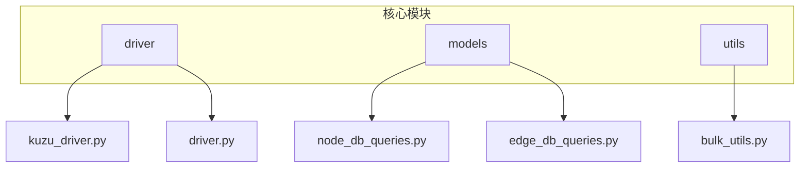
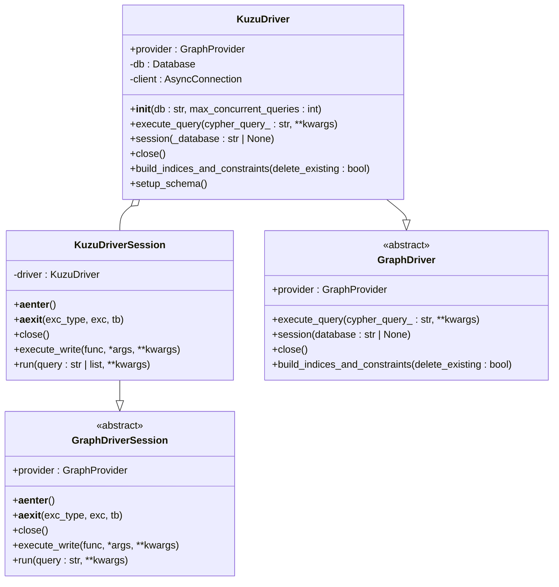
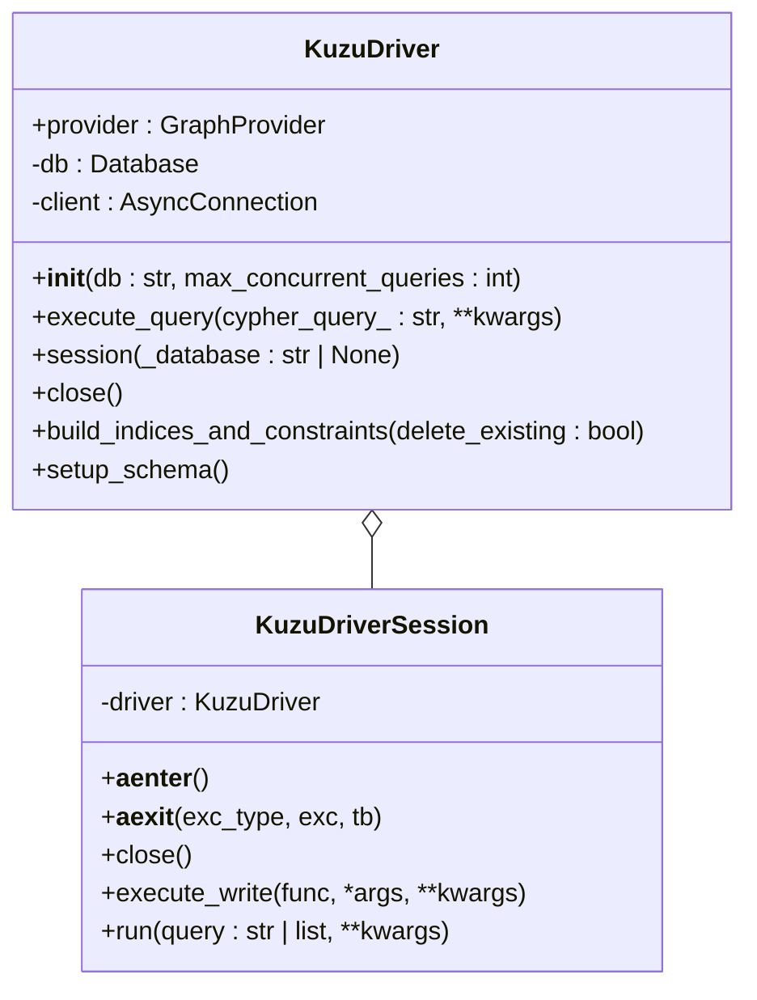
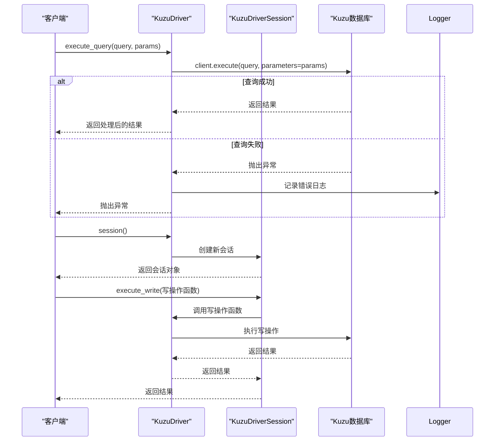
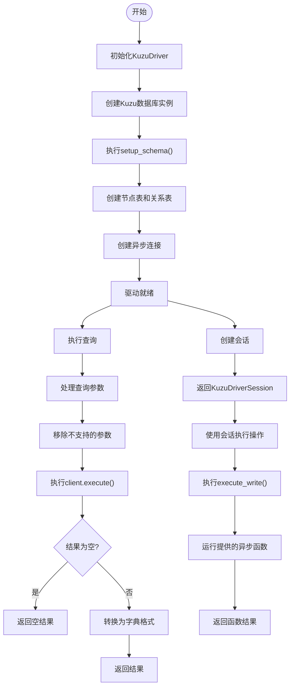
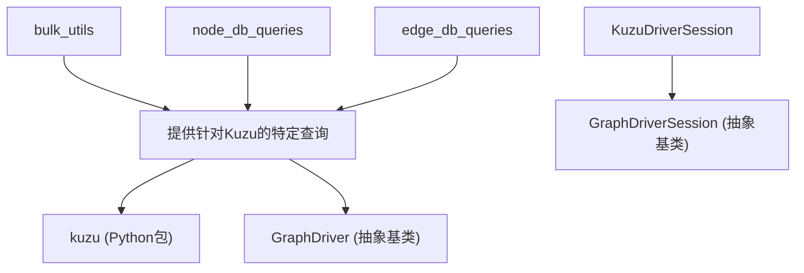

# Kuzu驱动实现

<cite>
**本文档中引用的文件**
- [kuzu_driver.py](file://graphiti_core/driver/kuzu_driver.py)
- [driver.py](file://graphiti_core/driver/driver.py)
- [node_db_queries.py](file://graphiti_core/models/nodes/node_db_queries.py)
- [edge_db_queries.py](file://graphiti_core/models/edges/edge_db_queries.py)
- [bulk_utils.py](file://graphiti_core/utils/bulk_utils.py)
- [errors.py](file://graphiti_core/errors.py)
</cite>

## 目录
1. [简介](#简介)
2. [项目结构](#项目结构)
3. [核心组件](#核心组件)
4. [架构概述](#架构概述)
5. [详细组件分析](#详细组件分析)
6. [依赖分析](#依赖分析)
7. [性能考虑](#性能考虑)
8. [故障排除指南](#故障排除指南)
9. [结论](#结论)

## 简介
本文档深入探讨了Kuzu图数据库驱动的实现，详细说明了KuzuDriver如何适配GraphDriver接口。文档解析了其基于Kuzu C++库的Python绑定进行本地图数据操作的机制，包括数据库实例加载、查询编译与执行流程。阐述了其轻量级嵌入式架构带来的优势（如低延迟、零配置部署）及相应限制。描述了索引构建过程在Kuzu中的实现方式及其对查询性能的影响。提供了本地文件路径配置、批量数据导入等典型用例的代码示例。讨论了线程安全模型、资源管理策略及常见运行时问题的应对方法。

## 项目结构
该项目采用模块化设计，核心功能集中在`graphiti_core`目录下。驱动程序实现位于`graphiti_core/driver`子目录中，其中`kuzu_driver.py`文件包含了Kuzu图数据库的具体实现。数据模型定义在`models/nodes`和`models/edges`目录中，而批量数据处理工具则位于`utils/bulk_utils.py`。整个项目结构清晰，便于维护和扩展。

**图源**
- [kuzu_driver.py](file://graphiti_core/driver/kuzu_driver.py)
- [driver.py](file://graphiti_core/driver/driver.py)
- [node_db_queries.py](file://graphiti_core/models/nodes/node_db_queries.py)
- [edge_db_queries.py](file://graphiti_core/models/edges/edge_db_queries.py)
- [bulk_utils.py](file://graphiti_core/utils/bulk_utils.py)

**节源**
- [kuzu_driver.py](file://graphiti_core/driver/kuzu_driver.py)
- [driver.py](file://graphiti_core/driver/driver.py)

## 核心组件
Kuzu驱动的核心组件包括KuzuDriver类和KuzuDriverSession类。KuzuDriver类实现了GraphDriver接口，负责数据库连接管理、查询执行和会话创建。KuzuDriverSession类则提供了事务性操作的上下文管理，确保数据操作的原子性和一致性。驱动通过Kuzu的Python绑定与底层C++库交互，实现了高效的本地数据操作。

**节源**
- [kuzu_driver.py](file://graphiti_core/driver/kuzu_driver.py#L93-L183)

## 架构概述
Kuzu驱动采用嵌入式架构，直接在应用程序进程中运行，无需独立的数据库服务器。这种设计带来了低延迟和零配置部署的优势。驱动通过异步连接（AsyncConnection）与Kuzu数据库交互，支持并发查询执行。数据模型采用节点表和关系表的显式定义，其中实体关系通过中间节点（RelatesToNode_）实现，以绕过Kuzu对边属性全文索引的限制。

**图源**
- [kuzu_driver.py](file://graphiti_core/driver/kuzu_driver.py#L93-L183)
- [driver.py](file://graphiti_core/driver/driver.py#L49-L111)

## 详细组件分析
### KuzuDriver分析
KuzuDriver类是整个驱动的核心，它实现了GraphDriver接口的所有抽象方法。初始化时，它创建一个Kuzu数据库实例和一个异步连接，支持配置最大并发查询数。`execute_query`方法负责执行Cypher查询，处理参数并返回结果。`setup_schema`方法在初始化时执行，创建预定义的节点表和关系表。

#### 对象导向组件

**图源**
- [kuzu_driver.py](file://graphiti_core/driver/kuzu_driver.py#L93-L183)

#### API/服务组件

**图源**
- [kuzu_driver.py](file://graphiti_core/driver/kuzu_driver.py#L109-L182)

**节源**
- [kuzu_driver.py](file://graphiti_core/driver/kuzu_driver.py#L93-L183)

### 复杂逻辑组件

**图源**
- [kuzu_driver.py](file://graphiti_core/driver/kuzu_driver.py#L97-L182)

**节源**
- [kuzu_driver.py](file://graphiti_core/driver/kuzu_driver.py#L93-L183)

## 依赖分析
Kuzu驱动依赖于Kuzu Python包，该包提供了对Kuzu C++库的绑定。在项目中，它通过`import kuzu`语句引入，并在`kuzu_driver.py`中实例化数据库和连接对象。驱动还依赖于`graphiti_core/driver/driver.py`中定义的抽象基类`GraphDriver`和`GraphDriverSession`，确保了与其他图数据库驱动的一致性接口。

**图源**
- [kuzu_driver.py](file://graphiti_core/driver/kuzu_driver.py#L20)
- [driver.py](file://graphiti_core/driver/driver.py#L22)
- [bulk_utils.py](file://graphiti_core/utils/bulk_utils.py#L26)
- [node_db_queries.py](file://graphiti_core/models/nodes/node_db_queries.py#L19)
- [edge_db_queries.py](file://graphiti_core/models/edges/edge_db_queries.py#L17)

**节源**
- [kuzu_driver.py](file://graphiti_core/driver/kuzu_driver.py)
- [driver.py](file://graphiti_core/driver/driver.py)

## 性能考虑
Kuzu驱动的性能特点主要体现在其嵌入式架构和异步执行模型上。由于数据库运行在应用进程中，避免了网络延迟，实现了极低的查询延迟。异步连接允许并发执行多个查询，提高了吞吐量。然而，Kuzu目前不支持动态索引创建，所有索引必须在模式设置阶段定义，这限制了运行时的灵活性。批量数据导入时，应合理设置`max_concurrent_queries`参数以平衡性能和资源消耗。

## 故障排除指南
在使用Kuzu驱动时，可能会遇到查询执行失败、连接问题或数据一致性错误。驱动通过Python的logging模块记录详细的错误信息，包括失败的查询语句和参数。对于查询失败，应检查Cypher语法和参数类型是否正确。资源管理方面，驱动依赖Python的垃圾回收机制来清理连接，无需显式关闭。常见问题包括模式定义错误和并发查询过多导致的性能下降。

**节源**
- [kuzu_driver.py](file://graphiti_core/driver/kuzu_driver.py#L117-L122)
- [errors.py](file://graphiti_core/errors.py)

## 结论
Kuzu驱动通过适配GraphDriver接口，为图数据库操作提供了一致的API。其基于Kuzu C++库的Python绑定实现了高效的本地数据操作，嵌入式架构带来了低延迟和零配置部署的优势。尽管在动态索引创建方面存在限制，但其显式模式定义和异步执行模型使其成为需要高性能本地图数据存储应用的理想选择。通过合理配置和使用批量操作，可以充分发挥其性能潜力。