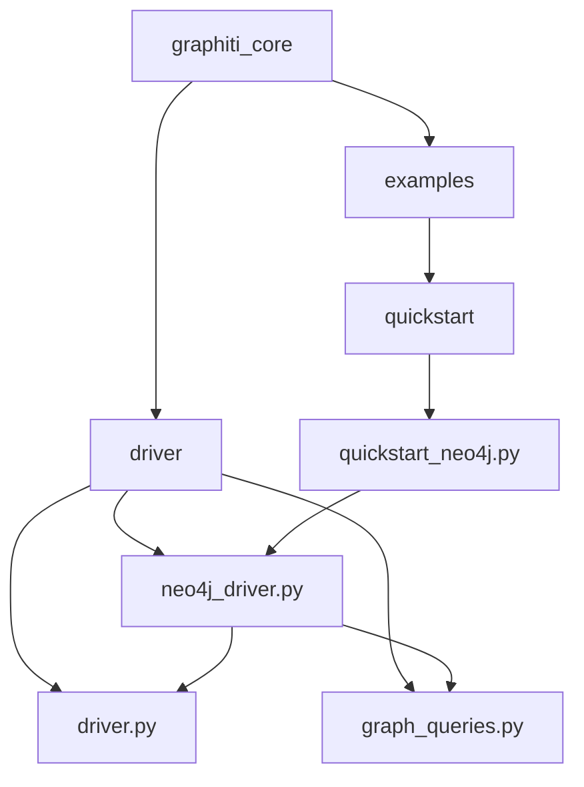
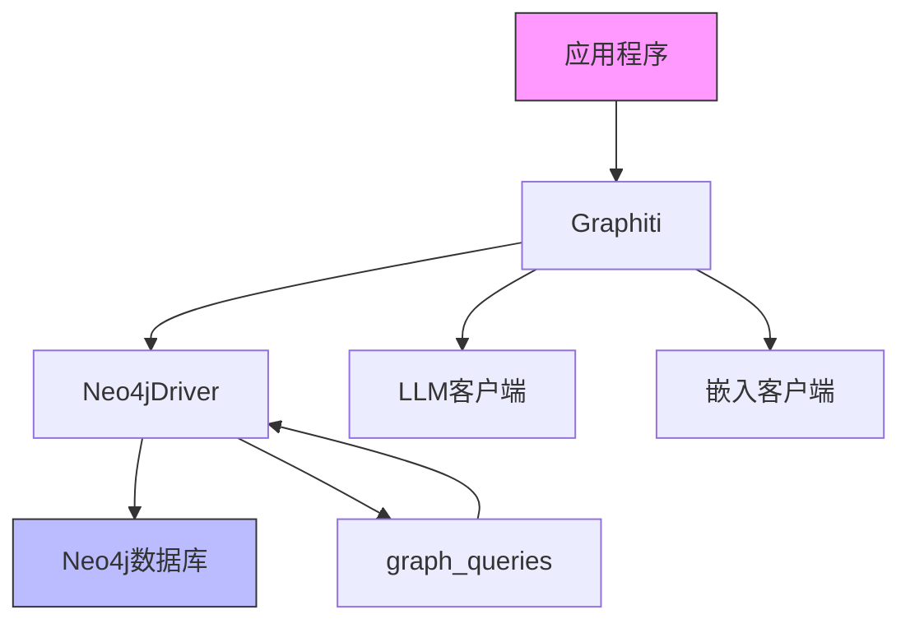
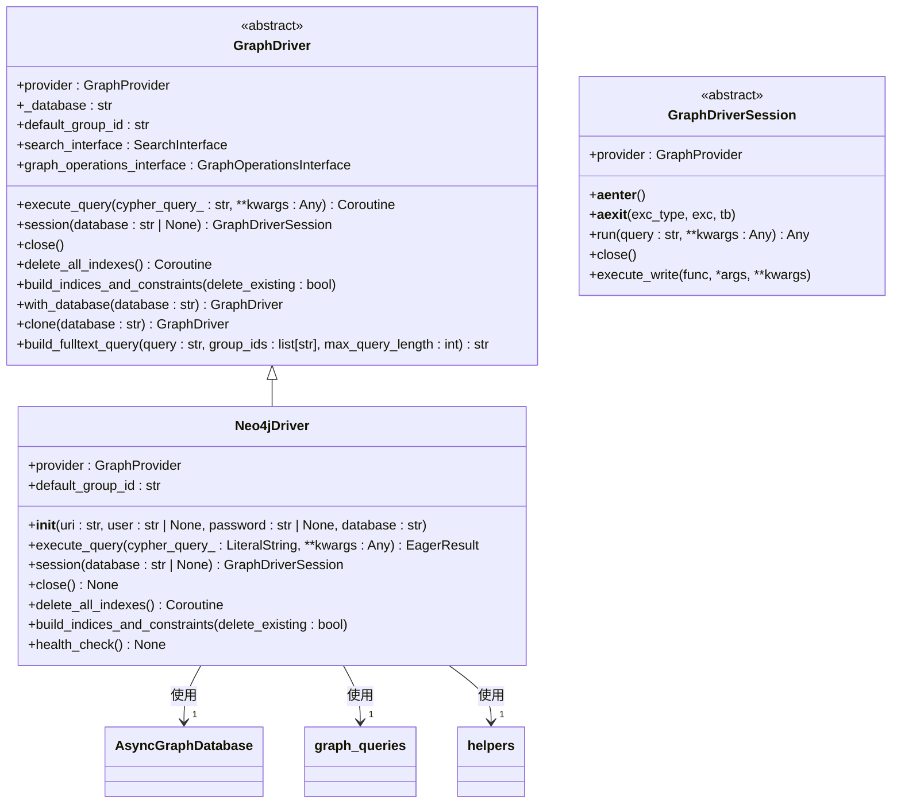
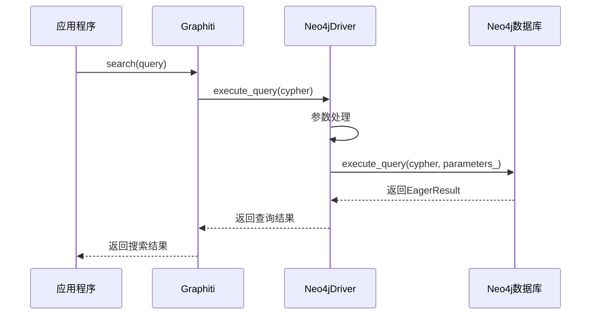
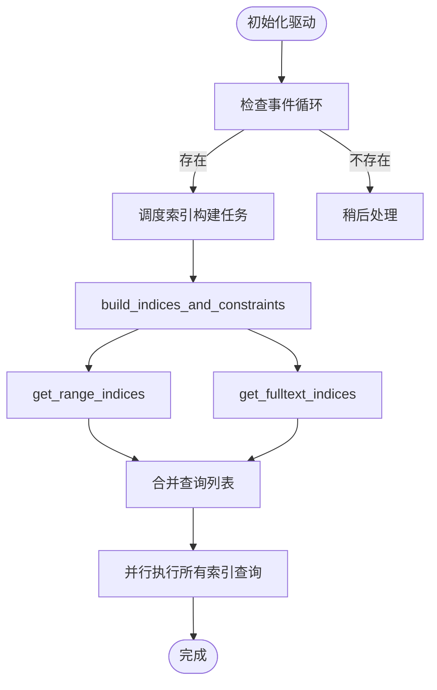
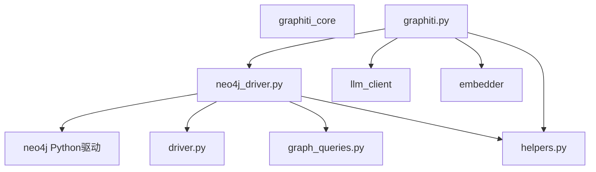

# Neo4j驱动实现

<cite>
**本文档引用的文件**  
- [neo4j_driver.py](file://graphiti_core/driver/neo4j_driver.py)
- [driver.py](file://graphiti_core/driver/driver.py)
- [graph_queries.py](file://graphiti_core/graph_queries.py)
- [helpers.py](file://graphiti_core/helpers.py)
- [graphiti.py](file://graphiti_core/graphiti.py)
- [errors.py](file://graphiti_core/errors.py)
- [quickstart_neo4j.py](file://examples/quickstart/quickstart_neo4j.py)
</cite>

## 目录
1. [简介](#简介)
2. [项目结构](#项目结构)
3. [核心组件](#核心组件)
4. [架构概述](#架构概述)
5. [详细组件分析](#详细组件分析)
6. [依赖分析](#依赖分析)
7. [性能考虑](#性能考虑)
8. [故障排除指南](#故障排除指南)
9. [结论](#结论)

## 简介
本文档详细阐述了基于Neo4j的图数据库驱动实现，重点介绍`Neo4jDriver`类如何继承并实现`GraphDriver`接口。文档涵盖了连接池管理、会话创建、Cypher查询执行流程、索引与约束构建逻辑等核心机制。通过实际代码示例展示连接配置、查询调用和错误处理的最佳实践。同时分析了参数化查询、异步执行和事务控制等性能优化点，并提供了针对连接超时、集群配置等常见问题的解决方案和监控调试建议。

## 项目结构
项目采用模块化设计，核心驱动功能位于`graphiti_core/driver`目录下，其中`neo4j_driver.py`实现了Neo4j专用的驱动逻辑。驱动层通过`driver.py`定义的抽象接口与上层应用解耦，支持多种图数据库后端。查询构建逻辑在`graph_queries.py`中实现，确保数据库无关性。`examples/quickstart`目录提供了快速入门示例，展示了如何初始化和使用Neo4j驱动。

**图源**  
- [neo4j_driver.py](file://graphiti_core/driver/neo4j_driver.py)
- [driver.py](file://graphiti_core/driver/driver.py)
- [graph_queries.py](file://graphiti_core/graph_queries.py)
- [quickstart_neo4j.py](file://examples/quickstart/quickstart_neo4j.py)

**本节来源**  
- [neo4j_driver.py](file://graphiti_core/driver/neo4j_driver.py)
- [driver.py](file://graphiti_core/driver/driver.py)
- [graph_queries.py](file://graphiti_core/graph_queries.py)
- [quickstart_neo4j.py](file://examples/quickstart/quickstart_neo4j.py)

## 核心组件
`Neo4jDriver`类是Neo4j图数据库的核心驱动实现，它继承自抽象基类`GraphDriver`，实现了连接管理、查询执行、会话创建和索引构建等关键功能。该驱动利用`neo4j.AsyncGraphDatabase`提供异步连接池支持，确保高并发场景下的性能表现。`build_indices_and_constraints`方法负责初始化数据库的索引和约束，为后续查询操作提供性能保障。

**本节来源**  
- [neo4j_driver.py](file://graphiti_core/driver/neo4j_driver.py#L30-L116)
- [driver.py](file://graphiti_core/driver/driver.py#L73-L115)

## 架构概述
系统采用分层架构设计，上层应用通过`Graphiti`类与图数据库交互，该类封装了驱动初始化、查询执行和结果处理的复杂性。`Neo4jDriver`作为底层驱动，负责与Neo4j服务器的直接通信，管理连接池和执行Cypher查询。`GraphDriver`接口定义了所有图数据库驱动必须实现的契约，确保不同数据库后端的可替换性。`graph_queries.py`模块提供数据库无关的查询生成能力，将高层查询请求转换为特定数据库的原生语法。

**图源**  
- [graphiti.py](file://graphiti_core/graphiti.py#L128-L800)
- [neo4j_driver.py](file://graphiti_core/driver/neo4j_driver.py#L30-L116)
- [graph_queries.py](file://graphiti_core/graph_queries.py#L1-L163)

## 详细组件分析

### Neo4jDriver类分析
`Neo4jDriver`类实现了`GraphDriver`接口，提供了Neo4j数据库的完整功能支持。其核心功能包括连接管理、查询执行、会话创建和索引构建。

#### 类关系图

**图源**  
- [neo4j_driver.py](file://graphiti_core/driver/neo4j_driver.py#L30-L116)
- [driver.py](file://graphiti_core/driver/driver.py#L73-L115)

#### 查询执行流程

**图源**  
- [neo4j_driver.py](file://graphiti_core/driver/neo4j_driver.py#L62-L76)
- [graphiti.py](file://graphiti_core/graphiti.py#L128-L800)

#### 索引构建流程

**图源**  
- [neo4j_driver.py](file://graphiti_core/driver/neo4j_driver.py#L90-L107)
- [graph_queries.py](file://graphiti_core/graph_queries.py#L28-L127)

**本节来源**  
- [neo4j_driver.py](file://graphiti_core/driver/neo4j_driver.py#L30-L116)
- [graph_queries.py](file://graphiti_core/graph_queries.py#L28-L127)
- [helpers.py](file://graphiti_core/helpers.py#L106-L116)

### 连接与会话管理
`Neo4jDriver`在初始化时创建`AsyncGraphDatabase.driver`实例，该实例内部维护连接池。`session`方法创建新的会话，可指定数据库名称，若未指定则使用默认数据库。`close`方法关闭整个驱动连接，释放所有资源。

**本节来源**  
- [neo4j_driver.py](file://graphiti_core/driver/neo4j_driver.py#L34-L60)
- [neo4j_driver.py](file://graphiti_core/driver/neo4j_driver.py#L78-L83)

### 索引与约束构建
`build_indices_and_constraints`方法负责创建数据库索引，包括范围索引和全文索引。该方法在驱动初始化时自动调度执行，通过`get_range_indices`和`get_fulltext_indices`函数获取对应数据库的索引创建语句，然后使用`semaphore_gather`并行执行所有索引创建查询。

**本节来源**  
- [neo4j_driver.py](file://graphiti_core/driver/neo4j_driver.py#L90-L107)
- [graph_queries.py](file://graphiti_core/graph_queries.py#L28-L127)

## 依赖分析
系统依赖关系清晰，`Neo4jDriver`依赖于`neo4j`官方Python驱动进行底层通信，依赖`graph_queries.py`生成数据库特定的查询语句。`Graphiti`类依赖`Neo4jDriver`作为默认驱动实现，同时依赖LLM客户端和嵌入客户端进行AI处理。`helpers.py`提供通用工具函数，如带信号量的协程收集器，用于控制并发度。

**图源**  
- [neo4j_driver.py](file://graphiti_core/driver/neo4j_driver.py)
- [graphiti.py](file://graphiti_core/graphiti.py)
- [graph_queries.py](file://graphiti_core/graph_queries.py)
- [helpers.py](file://graphiti_core/helpers.py)

**本节来源**  
- [neo4j_driver.py](file://graphiti_core/driver/neo4j_driver.py)
- [graphiti.py](file://graphiti_core/graphiti.py)
- [graph_queries.py](file://graphiti_core/graph_queries.py)
- [helpers.py](file://graphiti_core/helpers.py)

## 性能考虑
`Neo4jDriver`通过多种机制优化性能：使用异步驱动实现高并发；通过连接池复用数据库连接；利用`semaphore_gather`控制并发查询数量，避免资源耗尽；支持参数化查询防止SQL注入并提高查询缓存命中率。`execute_query`方法自动处理数据库参数，确保查询兼容性。

**本节来源**  
- [neo4j_driver.py](file://graphiti_core/driver/neo4j_driver.py#L62-L76)
- [helpers.py](file://graphiti_core/helpers.py#L106-L116)

## 故障排除指南
常见问题包括连接超时、认证失败和索引创建错误。连接问题可通过`health_check`方法诊断，该方法调用`verify_connectivity`验证连接状态。错误处理在`execute_query`中实现，捕获异常并记录详细错误信息。环境变量`SEMAPHORE_LIMIT`可调整并发限制，`USE_PARALLEL_RUNTIME`控制并行运行时行为。

**本节来源**  
- [neo4j_driver.py](file://graphiti_core/driver/neo4j_driver.py#L109-L116)
- [neo4j_driver.py](file://graphiti_core/driver/neo4j_driver.py#L71-L75)
- [helpers.py](file://graphiti_core/helpers.py#L35-L36)

## 结论
`Neo4jDriver`提供了一个功能完整、性能优良的Neo4j数据库驱动实现。通过继承`GraphDriver`接口，实现了与其他图数据库驱动的一致性。其异步设计、连接池管理和智能索引构建机制确保了高并发场景下的稳定性能。结合`Graphiti`框架，开发者可以轻松构建基于知识图谱的应用，专注于业务逻辑而非底层数据库交互细节。