# 图数据库驱动

<cite>
**本文档中引用的文件**  
- [driver.py](file://graphiti_core/driver/driver.py)
- [neo4j_driver.py](file://graphiti_core/driver/neo4j_driver.py)
- [falkordb_driver.py](file://graphiti_core/driver/falkordb_driver.py)
- [kuzu_driver.py](file://graphiti_core/driver/kuzu_driver.py)
- [neptune_driver.py](file://graphiti_core/driver/neptune_driver.py)
- [graph_queries.py](file://graphiti_core/graph_queries.py)
- [test_falkordb_driver.py](file://tests/driver/test_falkordb_driver.py)
- [errors.py](file://graphiti_core/errors.py)
- [helpers.py](file://graphiti_core/helpers.py)
</cite>

## 目录
1. [简介](#简介)
2. [核心架构与抽象基类](#核心架构与抽象基类)
3. [驱动实现详解](#驱动实现详解)
4. [连接与事务管理](#连接与事务管理)
5. [索引与约束管理](#索引与约束管理)
6. [错误处理机制](#错误处理机制)
7. [性能优化策略](#性能优化策略)
8. [配置与扩展](#配置与扩展)

## 简介
Graphiti 是一个支持多种图数据库的通用图数据库驱动框架，旨在为 Neo4j、FalkorDB、Kuzu 和 Neptune 等不同图数据库提供统一的访问接口。该框架通过抽象基类 `GraphDriver` 和 `GraphDriverSession` 定义了标准的数据库交互协议，使得上层应用可以无缝切换底层图数据库。本文档深入解析了 Graphiti 驱动的设计原理、核心组件的实现细节、连接与事务管理机制、索引优化策略、错误处理以及性能优化方案，为高级用户提供全面的技术参考和扩展指南。

## 核心架构与抽象基类

Graphiti 驱动的核心架构基于抽象基类设计，通过 `GraphDriver` 和 `GraphDriverSession` 两个抽象类定义了与图数据库交互的标准接口。`GraphDriver` 类作为所有具体驱动的基类，通过 `ABC` 模块实现抽象方法，强制所有子类实现 `execute_query`、`session`、`close` 和 `build_indices_and_constraints` 等关键方法。`GraphProvider` 枚举类定义了支持的数据库类型（Neo4j、FalkorDB、Kuzu、Neptune），确保驱动实例能够明确标识其服务的数据库。`GraphDriverSession` 类则抽象了数据库会话的概念，通过 `__aenter__` 和 `__aexit__` 方法支持异步上下文管理器，为事务操作提供了标准化的入口。这种设计模式实现了数据库无关性，使得上层应用无需关心底层数据库的具体实现细节。

**Section sources**
- [driver.py](file://graphiti_core/driver/driver.py#L1-L125)

## 驱动实现详解

### 继承关系与UML类图
Graphiti 的驱动实现遵循严格的继承关系，所有具体驱动类均继承自 `GraphDriver` 抽象基类。`Neo4jDriver`、`FalkorDriver`、`KuzuDriver` 和 `NeptuneDriver` 分别实现了针对各自数据库的特定逻辑。`GraphDriverSession` 的子类（如 `Neo4jDriverSession`、`FalkorDriverSession`）则负责管理具体的会话和事务。以下UML类图展示了这些类之间的继承和关联关系。

```mermaid
classDiagram
class GraphDriver {
<<abstract>>
+provider : GraphProvider
+fulltext_syntax : str
+_database : str
+default_group_id : str
+search_interface : SearchInterface | None
+graph_operations_interface : GraphOperationsInterface | None
+execute_query(cypher_query_ : str, **kwargs : Any) Coroutine
+session(database : str | None = None) GraphDriverSession
+close()
+delete_all_indexes() Coroutine
+build_indices_and_constraints(delete_existing : bool = False)
+with_database(database : str) GraphDriver
+clone(database : str) GraphDriver
+build_fulltext_query(query : str, group_ids : list[str] | None = None, max_query_length : int = 128) str
}
class GraphDriverSession {
<<abstract>>
+provider : GraphProvider
+__aenter__()
+__aexit__(exc_type, exc, tb)
+run(query : str, **kwargs : Any) Any
+close()
+execute_write(func, *args, **kwargs)
}
class Neo4jDriver {
+provider : GraphProvider = NEO4J
+default_group_id : str = ''
+client : AsyncGraphDatabase
+aoss_client : None
+__init__(uri : str, user : str | None, password : str | None, database : str = 'neo4j')
+execute_query(cypher_query_ : LiteralString, **kwargs : Any) EagerResult
+session(database : str | None = None) GraphDriverSession
+close() None
+delete_all_indexes() Coroutine
+build_indices_and_constraints(delete_existing : bool = False)
+health_check() None
}
class FalkorDriver {
+provider : GraphProvider = FALKORDB
+default_group_id : str = '\\_'
+fulltext_syntax : str = '@'
+aoss_client : None = None
+client : FalkorDB
+_database : str
+__init__(host : str = 'localhost', port : int = 6379, username : str | None = None, password : str | None = None, falkor_db : FalkorDB | None = None, database : str = 'default_db')
+_get_graph(graph_name : str | None) FalkorGraph
+execute_query(cypher_query_, **kwargs : Any)
+session(database : str | None = None) GraphDriverSession
+close() None
+delete_all_indexes() None
+build_indices_and_constraints(delete_existing=False)
+clone(database : str) GraphDriver
+health_check() None
+convert_datetimes_to_strings(obj)
+sanitize(query : str) str
+build_fulltext_query(query : str, group_ids : list[str] | None = None, max_query_length : int = 128) str
}
class KuzuDriver {
+provider : GraphProvider = KUZU
+aoss_client : None = None
+db : kuzu.Database
+client : kuzu.AsyncConnection
+__init__(db : str = ' : memory : ', max_concurrent_queries : int = 1)
+execute_query(cypher_query_ : str, **kwargs : Any) tuple[list[dict[str, Any]] | list[list[dict[str, Any]]], None, None]
+session(_database : str | None = None) GraphDriverSession
+close()
+delete_all_indexes(database_ : str)
+build_indices_and_constraints(delete_existing : bool = False)
+setup_schema()
}
class NeptuneDriver {
+provider : GraphProvider = NEPTUNE
+client : NeptuneGraph | NeptuneAnalyticsGraph
+aoss_client : OpenSearch
+__init__(host : str, aoss_host : str, port : int = 8182, aoss_port : int = 443)
+_sanitize_parameters(query, params : dict)
+execute_query(cypher_query_, **kwargs : Any) tuple[dict[str, Any], None, None]
+_run_query(cypher_query_, params)
+session(database : str | None = None) GraphDriverSession
+close() None
+_delete_all_data() Any
+delete_all_indexes() Coroutine[Any, Any, Any]
+delete_all_indexes_impl() Coroutine[Any, Any, Any]
+create_aoss_indices()
+delete_aoss_indices()
+build_indices_and_constraints(delete_existing : bool = False)
+run_aoss_query(name : str, query_text : str, limit : int = 10) dict[str, Any]
+save_to_aoss(name : str, data : list[dict]) int
}
GraphDriver <|-- Neo4jDriver
GraphDriver <|-- FalkorDriver
GraphDriver <|-- KuzuDriver
GraphDriver <|-- NeptuneDriver
GraphDriverSession <|-- Neo4jDriverSession
GraphDriverSession <|-- FalkorDriverSession
GraphDriverSession <|-- KuzuDriverSession
GraphDriverSession <|-- NeptuneDriverSession
Neo4jDriver ..> Neo4jDriverSession
FalkorDriver ..> FalkorDriverSession
KuzuDriver ..> KuzuDriverSession
NeptuneDriver ..> NeptuneDriverSession
```

**Diagram sources**
- [driver.py](file://graphiti_core/driver/driver.py#L49-L117)
- [neo4j_driver.py](file://graphiti_core/driver/neo4j_driver.py#L31-L118)
- [falkordb_driver.py](file://graphiti_core/driver/falkordb_driver.py#L79-L363)
- [kuzu_driver.py](file://graphiti_core/driver/kuzu_driver.py#L93-L183)
- [neptune_driver.py](file://graphiti_core/driver/neptune_driver.py#L109-L306)

### 与底层数据库的交互
驱动通过 `execute_query` 方法与底层数据库进行交互。每个具体驱动的实现都封装了其特定数据库客户端的调用逻辑。例如，`Neo4jDriver` 使用 `neo4j.AsyncGraphDatabase` 客户端的 `execute_query` 方法执行 Cypher 查询，并自动处理参数和数据库上下文。`FalkorDriver` 则通过 `FalkorDB` 客户端的 `select_graph` 方法获取图实例，然后调用其 `query` 方法执行查询，并将结果从 FalkorDB 特有的格式转换为 Graphiti 统一的字典列表格式。`KuzuDriver` 使用 `kuzu.AsyncConnection` 执行查询，并通过 `rows_as_dict()` 方法将结果转换为字典。`NeptuneDriver` 利用 `langchain_aws` 库中的 `NeptuneGraph` 或 `NeptuneAnalyticsGraph` 客户端执行查询。所有驱动在执行查询时都包含统一的错误处理逻辑，捕获异常并记录详细的错误信息，确保上层应用能获得一致的反馈。

**Section sources**
- [neo4j_driver.py](file://graphiti_core/driver/neo4j_driver.py#L63-L77)
- [falkordb_driver.py](file://graphiti_core/driver/falkordb_driver.py#L168-L199)
- [kuzu_driver.py](file://graphiti_core/driver/kuzu_driver.py#L109-L131)
- [neptune_driver.py](file://graphiti_core/driver/neptune_driver.py#L191-L212)

## 连接与事务管理

### 连接管理
Graphiti 驱动通过 `session` 方法管理数据库连接。该方法返回一个 `GraphDriverSession` 实例，代表一个与数据库的会话。`Neo4jDriver` 的 `session` 方法直接返回 `AsyncGraphDatabase` 客户端的会话对象。`FalkorDriver` 的 `session` 方法创建一个新的 `FalkorDriverSession` 实例，并传入通过 `_get_graph` 方法获取的图实例。`KuzuDriver` 的 `session` 方法返回一个 `KuzuDriverSession` 实例，该实例持有对驱动的引用。`NeptuneDriver` 的 `session` 方法返回一个 `NeptuneDriverSession` 实例。这种设计将连接的创建和管理职责委托给具体的驱动实现，同时保证了上层调用接口的一致性。

### 事务管理
事务管理通过 `GraphDriverSession` 的 `execute_write` 方法实现。该方法接受一个异步函数作为参数，并将其作为事务执行。在 `FalkorDriverSession`、`KuzuDriverSession` 和 `NeptuneDriverSession` 中，`execute_write` 的实现非常相似：它直接 `await` 传入的函数，并将 `self`（即会话实例）作为第一个参数传递。这允许在事务函数内部通过会话对象执行数据库操作。`Neo4jDriver` 由于使用了 `neo4j` 客户端，其事务管理由客户端库本身处理，因此 `execute_write` 方法在 `Neo4jDriver` 中被直接实现，而不需要一个独立的会话类来处理事务。

**Section sources**
- [driver.py](file://graphiti_core/driver/driver.py#L87-L89)
- [neo4j_driver.py](file://graphiti_core/driver/neo4j_driver.py#L79-L81)
- [falkordb_driver.py](file://graphiti_core/driver/falkordb_driver.py#L201-L202)
- [kuzu_driver.py](file://graphiti_core/driver/kuzu_driver.py#L133-L134)
- [neptune_driver.py](file://graphiti_core/driver/neptune_driver.py#L214-L215)
- [falkordb_driver.py](file://graphiti_core/driver/falkordb_driver.py#L96-L98)
- [kuzu_driver.py](file://graphiti_core/driver/kuzu_driver.py#L172-L174)
- [neptune_driver.py](file://graphiti_core/driver/neptune_driver.py#L294-L296)

## 索引与约束管理

`build_indices_and_constraints` 方法是优化查询性能的关键。该方法负责为图数据库创建必要的索引和约束。`Neo4jDriver` 和 `FalkorDriver` 的实现逻辑相似：首先，通过 `get_range_indices` 和 `get_fulltext_indices` 函数从 `graph_queries.py` 获取针对特定数据库提供商的索引创建查询列表。然后，使用 `semaphore_gather` 并发地执行所有查询，以提高效率。`Neo4jDriver` 使用 `semaphore_gather` 并发执行 `execute_query`，而 `FalkorDriver` 则使用 `asyncio.gather`。`KuzuDriver` 的实现是一个空操作（no-op），因为 Kuzu 的索引和约束是在 `setup_schema` 方法中通过预定义的 `SCHEMA_QUERIES` 一次性创建的。`NeptuneDriver` 的实现则更为复杂，它依赖于 Amazon OpenSearch Service (AOSS) 进行全文索引。`build_indices_and_constraints` 方法会先删除（如果 `delete_existing` 为真）再创建 AOSS 索引，通过 `create_aoss_indices` 方法在 OpenSearch 中创建索引。这表明对于 Neptune，索引管理是图数据库和搜索引擎协同工作的结果。

**Section sources**
- [driver.py](file://graphiti_core/driver/driver.py#L110-L111)
- [neo4j_driver.py](file://graphiti_core/driver/neo4j_driver.py#L91-L108)
- [falkordb_driver.py](file://graphiti_core/driver/falkordb_driver.py#L245-L250)
- [kuzu_driver.py](file://graphiti_core/driver/kuzu_driver.py#L143-L147)
- [neptune_driver.py](file://graphiti_core/driver/neptune_driver.py#L246-L250)
- [graph_queries.py](file://graphiti_core/graph_queries.py#L28-L127)

## 错误处理机制

Graphiti 框架定义了一套清晰的错误处理机制。在 `execute_query` 方法中，所有驱动都使用 `try-except` 块捕获执行查询时可能发生的异常。捕获到异常后，会使用 `logging` 模块记录详细的错误信息，包括错误消息、执行的查询语句和参数，然后重新抛出异常，确保错误能被上层应用感知。`FalkorDriver` 展示了一个更精细的处理案例：当捕获到包含 "already indexed" 的异常时，它会将其视为信息性消息（`logger.info`），并返回 `None`，以避免因索引已存在而导致的重复创建错误中断正常流程。框架还定义了自定义异常类，位于 `errors.py` 中，如 `EdgeNotFoundError`、`NodeNotFoundError` 和 `GroupIdValidationError`，这些异常提供了更具体的错误上下文，便于上层应用进行针对性的错误处理。

**Section sources**
- [neo4j_driver.py](file://graphiti_core/driver/neo4j_driver.py#L71-L75)
- [falkordb_driver.py](file://graphiti_core/driver/falkordb_driver.py#L176-L182)
- [kuzu_driver.py](file://graphiti_core/driver/kuzu_driver.py#L117-L122)
- [neptune_driver.py](file://graphiti_core/driver/neptune_driver.py#L204-L210)
- [errors.py](file://graphiti_core/errors.py#L18-L84)

## 性能优化策略

### 异步操作
整个驱动框架建立在异步编程模型之上，所有关键方法（如 `execute_query`、`session`、`close`）都声明为 `async`，并返回 `Coroutine`。这使得驱动能够高效地处理 I/O 密集型操作，如网络请求和数据库查询，而不会阻塞事件循环。`semaphore_gather` 工具函数是性能优化的核心，它使用 `asyncio.Semaphore` 限制并发协程的数量（默认由 `SEMAPHORE_LIMIT` 环境变量控制），防止因并发过多而导致数据库连接耗尽或性能下降。`Neo4jDriver` 在初始化时就尝试获取当前事件循环并调度 `build_indices_and_constraints` 任务，实现了索引构建的异步化。

### 其他优化
`FalkorDriver` 对日期时间对象进行了特殊处理，通过 `convert_datetimes_to_strings` 方法将 `datetime` 对象递归转换为 ISO 格式的字符串，因为 FalkorDB 不直接支持 `datetime` 类型。`FalkorDriver` 还实现了 `sanitize` 方法，用于清理全文查询中的特殊字符，以符合其底层 RedisSearch 的分词规则。`NeptuneDriver` 通过 `save_to_aoss` 方法利用 `opensearchpy.helpers.bulk` 进行批量索引操作，显著提高了将数据写入 OpenSearch 的效率。

**Section sources**
- [driver.py](file://graphiti_core/driver/driver.py#L21-L23)
- [neo4j_driver.py](file://graphiti_core/driver/neo4j_driver.py#L63-L77)
- [falkordb_driver.py](file://graphiti_core/driver/falkordb_driver.py#L277-L287)
- [helpers.py](file://graphiti_core/helpers.py#L106-L116)
- [neptune_driver.py](file://graphiti_core/driver/neptune_driver.py#L271-L272)

## 配置与扩展

### 配置选项
驱动的配置主要通过初始化参数和环境变量进行。例如，`Neo4jDriver` 通过 `uri`、`user`、`password` 和 `database` 参数配置连接。`FalkorDriver` 通过 `host`、`port`、`username`、`password` 和 `database` 参数配置。`NeptuneDriver` 需要 `host` 和 `aoss_host`。环境变量如 `ENTITY_INDEX_NAME`、`EPISODE_INDEX_NAME` 等用于配置索引名称。`helpers.py` 中的 `USE_PARALLEL_RUNTIME` 和 `SEMAPHORE_LIMIT` 环境变量则用于控制全局的并发行为。

### 扩展点
要实现一个新的图数据库驱动，开发者需要创建一个继承自 `GraphDriver` 的新类，并实现所有抽象方法。关键的扩展点包括：
1.  **`execute_query`**: 实现与新数据库的查询交互逻辑。
2.  **`session`**: 返回一个继承自 `GraphDriverSession` 的会话类实例。
3.  **`build_indices_and_constraints`**: 定义如何为新数据库创建索引和约束。
4.  **`close`**: 实现连接的优雅关闭。
此外，可能需要在 `graph_queries.py` 中添加针对新数据库的索引查询生成逻辑。通过遵循这些约定，可以轻松地将 Graphiti 框架扩展到支持新的图数据库。

**Section sources**
- [neo4j_driver.py](file://graphiti_core/driver/neo4j_driver.py#L35-L47)
- [falkordb_driver.py](file://graphiti_core/driver/falkordb_driver.py#L120-L143)
- [neptune_driver.py](file://graphiti_core/driver/neptune_driver.py#L112-L137)
- [driver.py](file://graphiti_core/driver/driver.py#L36-L40)
- [helpers.py](file://graphiti_core/helpers.py#L35-L36)