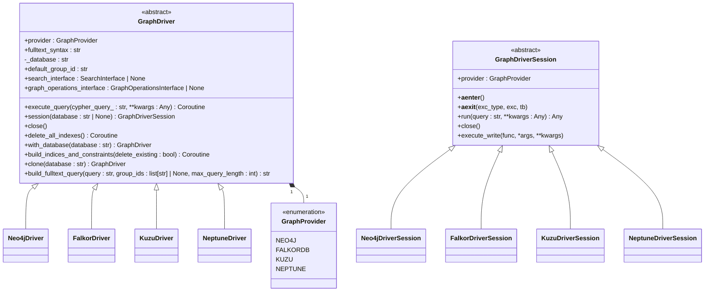
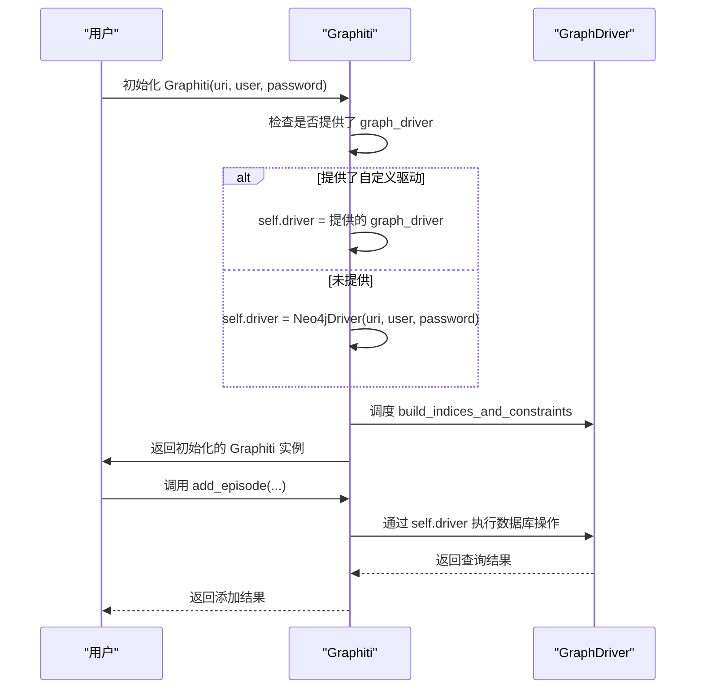
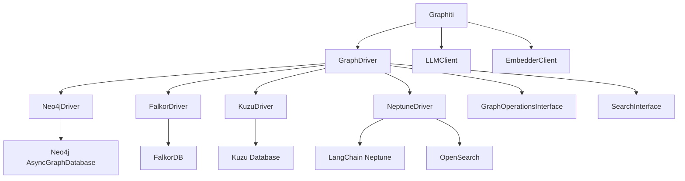

# 图数据库驱动基类

<cite>
**本文档引用的文件**
- [graphiti_core/driver/driver.py](file://graphiti_core/driver/driver.py)
- [graphiti_core/driver/falkordb_driver.py](file://graphiti_core/driver/falkordb_driver.py)
- [graphiti_core/driver/neo4j_driver.py](file://graphiti_core/driver/neo4j_driver.py)
- [graphiti_core/driver/neptune_driver.py](file://graphiti_core/driver/neptune_driver.py)
- [graphiti_core/driver/kuzu_driver.py](file://graphiti_core/driver/kuzu_driver.py)
- [graphiti_core/driver/graph_operations/graph_operations.py](file://graphiti_core/driver/graph_operations/graph_operations.py)
- [graphiti_core/driver/search_interface/search_interface.py](file://graphiti_core/driver/search_interface/search_interface.py)
- [graphiti_core/graphiti.py](file://graphiti_core/graphiti.py)
</cite>

## 目录
1. [简介](#简介)
2. [核心组件](#核心组件)
3. [架构概述](#架构概述)
4. [详细组件分析](#详细组件分析)
5. [依赖分析](#依赖分析)
6. [性能考虑](#性能考虑)
7. [故障排除指南](#故障排除指南)
8. [结论](#结论)

## 简介
GraphDriver抽象基类为Graphiti框架中的所有图数据库驱动程序提供了一个统一的接口。该设计旨在通过定义一组核心方法和契约，实现不同图数据库后端（如Neo4j、FalkorDB、Kuzu和Neptune）之间的互操作性和可插拔性。通过此抽象层，Graphiti核心逻辑可以独立于底层数据库技术，从而允许开发者根据性能、部署环境或成本等因素灵活选择最适合的数据库。该基类不仅规范了查询执行、事务管理和连接处理等基本操作，还通过`build_indices_and_constraints`等方法确保了数据访问的性能优化，并通过`execute_query`方法提供了异步查询执行能力，以支持高并发场景。

## 核心组件
GraphDriver抽象基类是图数据库驱动程序的核心，它定义了所有具体驱动程序必须实现的接口。其主要职责包括：建立和管理数据库连接、执行Cypher查询、管理事务会话、构建索引与约束以优化性能，以及处理驱动程序特定的配置。该基类通过`GraphProvider`枚举区分不同的数据库后端，并利用`GraphDriverSession`抽象类来管理数据库会话的生命周期。此外，它还集成了`SearchInterface`和`GraphOperationsInterface`，以支持高级搜索功能和图数据操作，从而为上层应用提供了一个功能完备且一致的数据库访问层。

**核心组件**
- [graphiti_core/driver/driver.py](file://graphiti_core/driver/driver.py#L73-L125)
- [graphiti_core/driver/graph_operations/graph_operations.py](file://graphiti_core/driver/graph_operations/graph_operations.py#L22-L192)
- [graphiti_core/driver/search_interface/search_interface.py](file://graphiti_core/driver/search_interface/search_interface.py#L22-L90)

## 架构概述

```mermaid
classDiagram
class GraphDriver {
<<abstract>>
+provider : GraphProvider
+fulltext_syntax : str
-_database : str
+default_group_id : str
+search_interface : SearchInterface | None
+graph_operations_interface : GraphOperationsInterface | None
+execute_query(cypher_query_ : str, **kwargs : Any) Coroutine
+session(database : str | None) GraphDriverSession
+close()
+delete_all_indexes() Coroutine
+with_database(database : str) GraphDriver
+build_indices_and_constraints(delete_existing : bool) Coroutine
+clone(database : str) GraphDriver
+build_fulltext_query(query : str, group_ids : list[str] | None, max_query_length : int) str
}
class GraphDriverSession {
<<abstract>>
+provider : GraphProvider
+__aenter__()
+__aexit__(exc_type, exc, tb)
+run(query : str, **kwargs : Any) Any
+close()
+execute_write(func, *args, **kwargs)
}
class GraphProvider {
<<enumeration>>
NEO4J
FALKORDB
KUZU
NEPTUNE
}
class SearchInterface {
<<interface>>
+edge_fulltext_search(driver : Any, query : str, search_filter : Any, group_ids : list[str] | None, limit : int) list[Any]
+edge_similarity_search(driver : Any, search_vector : list[float], source_node_uuid : str | None, target_node_uuid : str | None, search_filter : Any, group_ids : list[str] | None, limit : int, min_score : float) list[Any]
+node_fulltext_search(driver : Any, query : str, search_filter : Any, group_ids : list[str] | None, limit : int) list[Any]
+node_similarity_search(driver : Any, search_vector : list[float], search_filter : Any, group_ids : list[str] | None, limit : int, min_score : float) list[Any]
+episode_fulltext_search(driver : Any, query : str, search_filter : Any, group_ids : list[str] | None, limit : int) list[Any]
+build_node_search_filters(search_filters : Any) Any
+build_edge_search_filters(search_filters : Any) Any
}
class GraphOperationsInterface {
<<interface>>
+node_save(node : Any, driver : Any)
+node_delete(node : Any, driver : Any)
+node_save_bulk(_cls : Any, driver : Any, transaction : Any, nodes : list[Any], batch_size : int)
+node_delete_by_group_id(_cls : Any, driver : Any, group_id : str, batch_size : int)
+node_delete_by_uuids(_cls : Any, driver : Any, uuids : list[str], group_id : str | None, batch_size : int)
+node_load_embeddings(node : Any, driver : Any)
+node_load_embeddings_bulk(driver : Any, nodes : list[Any], batch_size : int) dict[str, list[float]]
+episodic_node_save(node : Any, driver : Any)
+episodic_node_delete(node : Any, driver : Any)
+episodic_node_save_bulk(_cls : Any, driver : Any, transaction : Any, nodes : list[Any], batch_size : int)
+episodic_edge_save_bulk(_cls : Any, driver : Any, transaction : Any, episodic_edges : list[Any], batch_size : int)
+episodic_node_delete_by_group_id(_cls : Any, driver : Any, group_id : str, batch_size : int)
+episodic_node_delete_by_uuids(_cls : Any, driver : Any, uuids : list[str], group_id : str | None, batch_size : int)
+edge_save(edge : Any, driver : Any)
+edge_delete(edge : Any, driver : Any)
+edge_save_bulk(_cls : Any, driver : Any, transaction : Any, edges : list[Any], batch_size : int)
+edge_delete_by_uuids(_cls : Any, driver : Any, uuids : list[str], group_id : str | None)
+edge_load_embeddings(edge : Any, driver : Any)
+edge_load_embeddings_bulk(driver : Any, edges : list[Any], batch_size : int) dict[str, list[float]]
}
GraphDriver <|-- Neo4jDriver
GraphDriver <|-- FalkorDriver
GraphDriver <|-- KuzuDriver
GraphDriver <|-- NeptuneDriver
GraphDriver *-- SearchInterface
GraphDriver *-- GraphOperationsInterface
GraphDriverSession <|-- Neo4jDriverSession
GraphDriverSession <|-- FalkorDriverSession
GraphDriverSession <|-- KuzuDriverSession
GraphDriverSession <|-- NeptuneDriverSession
GraphDriver "1" *-- "1" GraphProvider
```

**图表来源**
- [graphiti_core/driver/driver.py](file://graphiti_core/driver/driver.py#L73-L125)
- [graphiti_core/driver/graph_operations/graph_operations.py](file://graphiti_core/driver/graph_operations/graph_operations.py#L22-L192)
- [graphiti_core/driver/search_interface/search_interface.py](file://graphiti_core/driver/search_interface/search_interface.py#L22-L90)

## 详细组件分析
### GraphDriver 抽象基类分析
GraphDriver抽象基类为所有图数据库驱动程序定义了统一的接口和契约。它的设计目的是确保Graphiti框架可以无缝地与多种图数据库（如Neo4j、FalkorDB、Kuzu和Neptune）集成，而无需修改核心业务逻辑。该基类通过抽象方法强制所有子类实现关键功能，如查询执行、会话管理和连接关闭，从而保证了API的一致性。同时，它也提供了一些默认实现的方法（如`with_database`），以减少重复代码并促进代码复用。这种设计模式不仅提高了系统的可扩展性，还简化了新驱动程序的开发过程。

#### 对象导向组件

**图表来源**
- [graphiti_core/driver/driver.py](file://graphiti_core/driver/driver.py#L73-L125)

### 关键方法契约分析
#### execute_query 方法
`execute_query`方法是GraphDriver中最核心的方法之一，它负责执行Cypher查询语句。该方法被定义为一个抽象方法，返回一个协程（Coroutine），这表明所有数据库操作都是异步的，以提高I/O密集型应用的性能。该方法接收一个Cypher查询字符串和任意数量的关键字参数（kwargs），这些参数将作为查询的参数传递给底层数据库。具体的实现（如`Neo4jDriver`或`FalkorDriver`）需要处理参数的序列化（例如，将Python的`datetime`对象转换为ISO字符串）和错误处理，并将底层数据库返回的结果格式化为Graphiti框架期望的统一格式（通常是记录列表和表头）。

**核心组件**
- [graphiti_core/driver/driver.py](file://graphiti_core/driver/driver.py#L83-L85)
- [graphiti_core/driver/neo4j_driver.py](file://graphiti_core/driver/neo4j_driver.py#L63-L77)
- [graphiti_core/driver/falkordb_driver.py](file://graphiti_core/driver/falkordb_driver.py#L168-L199)

#### session 方法
`session`方法用于创建和管理数据库会话。它返回一个`GraphDriverSession`对象，该对象实现了异步上下文管理器协议（`__aenter__`和`__aexit__`）。这允许开发者使用`async with`语句来安全地管理会话的生命周期，确保即使在发生异常的情况下，会话也能被正确清理。会话对象通常用于执行一系列相关的数据库操作，这些操作可能需要在同一个事务中完成。`session`方法接受一个可选的`database`参数，允许在同一个驱动程序实例中针对不同的数据库或图进行操作。

**核心组件**
- [graphiti_core/driver/driver.py](file://graphiti_core/driver/driver.py#L87-L89)
- [graphiti_core/driver/neo4j_driver.py](file://graphiti_core/driver/neo4j_driver.py#L79-L81)
- [graphiti_core/driver/falkordb_driver.py](file://graphiti_core/driver/falkordb_driver.py#L201-L202)

#### build_indices_and_constraints 方法
`build_indices_and_constraints`方法负责在数据库中创建索引和约束，这对于保证查询性能和数据完整性至关重要。该方法通常在驱动程序初始化时被调用（例如，在`Neo4jDriver`和`FalkorDriver`的构造函数中通过事件循环调度）。它接受一个`delete_existing`布尔参数，当设置为`True`时，会先删除所有现有的索引，然后再创建新的索引。具体的索引和约束定义由`get_range_indices`和`get_fulltext_indices`等函数提供，这些函数根据`GraphProvider`的不同返回相应的Cypher查询语句。值得注意的是，`KuzuDriver`由于其静态模式的特性，此方法是一个空操作（no-op）。

**核心组件**
- [graphiti_core/driver/driver.py](file://graphiti_core/driver/driver.py#L109-L111)
- [graphiti_core/driver/neo4j_driver.py](file://graphiti_core/driver/neo4j_driver.py#L91-L108)
- [graphiti_core/driver/falkordb_driver.py](file://graphiti_core/driver/falkordb_driver.py#L245-L251)
- [graphiti_core/driver/kuzu_driver.py](file://graphiti_core/driver/kuzu_driver.py#L143-L147)

### 驱动初始化与配置
驱动程序的初始化过程通过其构造函数完成，该过程接收一系列配置参数，这些参数直接影响数据库的连接行为。例如，`Neo4jDriver`需要`uri`、`user`和`password`来连接到Neo4j服务器，而`FalkorDriver`则需要`host`和`port`来连接到FalkorDB实例。`database`参数用于指定默认的数据库或图名称。这些参数的灵活性使得驱动程序可以适应不同的部署环境，无论是本地开发、云服务还是企业内部部署。此外，构造函数通常会立即调度`build_indices_and_constraints`任务，以确保数据库在首次使用前就已正确配置。

**核心组件**
- [graphiti_core/driver/neo4j_driver.py](file://graphiti_core/driver/neo4j_driver.py#L35-L62)
- [graphiti_core/driver/falkordb_driver.py](file://graphiti_core/driver/falkordb_driver.py#L120-L161)
- [graphiti_core/driver/neptune_driver.py](file://graphiti_core/driver/neptune_driver.py#L112-L153)
- [graphiti_core/driver/kuzu_driver.py](file://graphiti_core/driver/kuzu_driver.py#L97-L108)

### 依赖注入与使用示例
在Graphiti核心中，`GraphDriver`接口通过依赖注入的方式被使用。`Graphiti`类的构造函数接受一个可选的`graph_driver`参数。如果用户没有提供自定义的驱动程序，`Graphiti`会默认创建一个`Neo4jDriver`实例。这种设计模式使得系统高度可配置和可测试。例如，在单元测试中，可以注入一个模拟的驱动程序来隔离数据库依赖。在生产环境中，可以根据需要注入`FalkorDriver`或`NeptuneDriver`。`Graphiti`类将驱动程序实例存储在`self.driver`中，并通过`self.clients`对象将其传递给其他需要数据库访问的组件。

**图表来源**
- [graphiti_core/graphiti.py](file://graphiti_core/graphiti.py#L198-L203)
- [graphiti_core/driver/driver.py](file://graphiti_core/driver/driver.py#L73-L125)

**核心组件**
- [graphiti_core/graphiti.py](file://graphiti_core/graphiti.py#L128-L236)

### 错误处理与异步操作
GraphDriver的设计充分考虑了错误处理和异步操作的支持。所有主要方法（如`execute_query`和`build_indices_and_constraints`）都返回协程，这使得它们可以在异步事件循环中被`await`，从而实现非阻塞的I/O操作。在错误处理方面，每个具体的驱动程序实现都包含了try-except块来捕获底层数据库抛出的异常。例如，`FalkorDriver`会检查异常信息中是否包含"already indexed"，如果是，则记录一条信息日志并继续执行，而不是中断程序。对于更严重的错误，异常会被重新抛出，以便上层应用可以进行处理。这种分层的错误处理机制确保了系统的健壮性。

**核心组件**
- [graphiti_core/driver/falkordb_driver.py](file://graphiti_core/driver/falkordb_driver.py#L174-L182)
- [graphiti_core/driver/neo4j_driver.py](file://graphiti_core/driver/neo4j_driver.py#L71-L75)
- [graphiti_core/driver/neptune_driver.py](file://graphiti_core/driver/neptune_driver.py#L204-L210)

## 依赖分析

**图表来源**
- [graphiti_core/graphiti.py](file://graphiti_core/graphiti.py#L28-L29)
- [graphiti_core/driver/driver.py](file://graphiti_core/driver/driver.py#L27-L28)
- [graphiti_core/driver/neo4j_driver.py](file://graphiti_core/driver/neo4j_driver.py#L21)
- [graphiti_core/driver/falkordb_driver.py](file://graphiti_core/driver/falkordb_driver.py#L27)
- [graphiti_core/driver/kuzu_driver.py](file://graphiti_core/driver/kuzu_driver.py#L20)
- [graphiti_core/driver/neptune_driver.py](file://graphiti_core/driver/neptune_driver.py#L24-L25)

**核心组件**
- [graphiti_core/graphiti.py](file://graphiti_core/graphiti.py#L128-L236)
- [graphiti_core/driver/driver.py](file://graphiti_core/driver/driver.py#L73-L125)

## 性能考虑
在实现GraphDriver时，性能是一个关键的考虑因素。`build_indices_and_constraints`方法通过预先创建索引显著提升了后续查询的性能。对于批量操作，如`node_save_bulk`，应利用数据库的批量插入功能来减少网络往返次数。异步操作（async/await）的使用确保了I/O操作不会阻塞事件循环，从而提高了应用的并发处理能力。此外，`semaphore_gather`等工具的使用可以限制并发操作的数量，防止对数据库造成过大的压力。对于全文搜索，`build_fulltext_query`方法的实现需要高效地处理查询字符串，包括去除停用词和特殊字符，以生成优化的搜索查询。

## 故障排除指南
当遇到与GraphDriver相关的问题时，首先应检查驱动程序的初始化参数（如URI、主机、端口）是否正确。其次，查看日志文件以获取`execute_query`方法抛出的异常信息，这些信息通常能直接指出问题所在（如语法错误或连接超时）。如果查询性能低下，应确认`build_indices_and_constraints`方法是否已成功执行，并检查相关的索引是否存在。对于异步操作中的死锁或资源耗尽问题，应检查`max_concurrent_queries`等配置参数是否设置得当。最后，确保所有必要的依赖包（如`falkordb`或`langchain_aws`）都已正确安装。

**故障排除指南**
- [graphiti_core/driver/driver.py](file://graphiti_core/driver/driver.py#L30)
- [graphiti_core/driver/falkordb_driver.py](file://graphiti_core/driver/falkordb_driver.py#L40)
- [graphiti_core/driver/neo4j_driver.py](file://graphiti_core/driver/neo4j_driver.py#L28)
- [graphiti_core/driver/neptune_driver.py](file://graphiti_core/driver/neptune_driver.py#L29)

## 结论
GraphDriver抽象基类是Graphiti框架中实现数据库抽象和可扩展性的核心。它通过定义清晰的接口和契约，成功地将上层应用逻辑与底层数据库技术解耦。通过对`execute_query`、`session`和`build_indices_and_constraints`等关键方法的分析，可以看出该设计不仅保证了API的一致性，还兼顾了性能和健壮性。依赖注入的使用使得系统配置灵活，易于测试。尽管不同驱动程序的实现细节各异（如Neo4j的连接管理和FalkorDB的多租户支持），但它们都遵循了同一套规范，这极大地简化了维护和新功能的开发。未来的工作可以集中在进一步优化异步操作的性能和增强错误处理的精细化程度上。