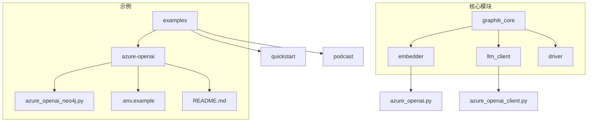
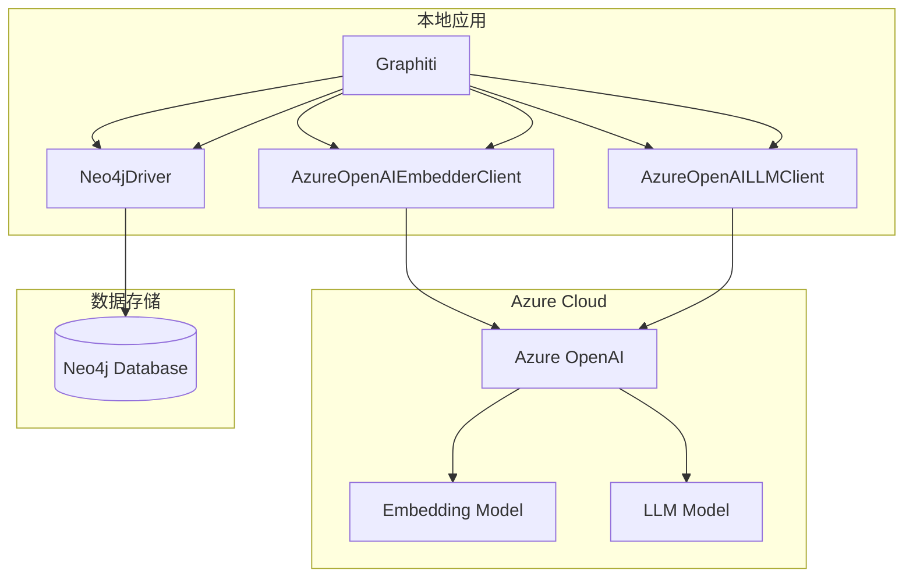
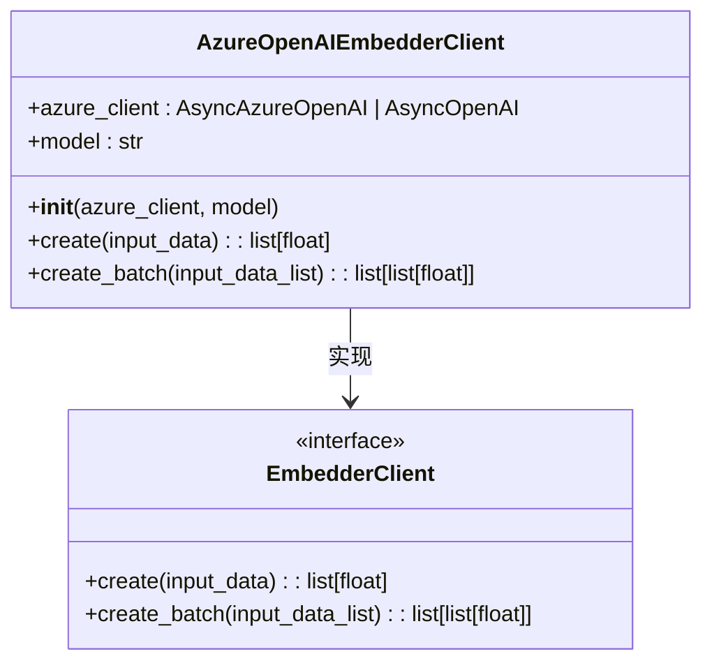
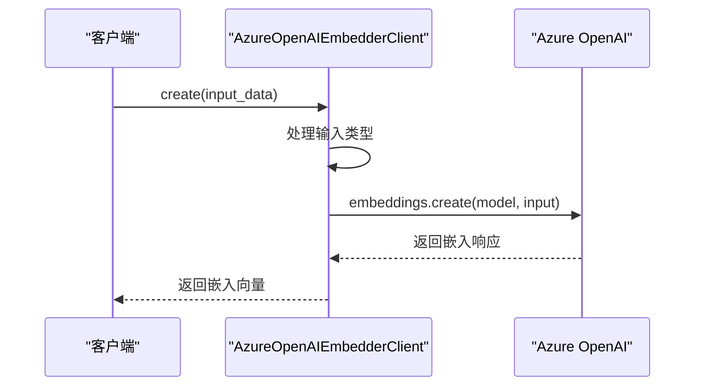
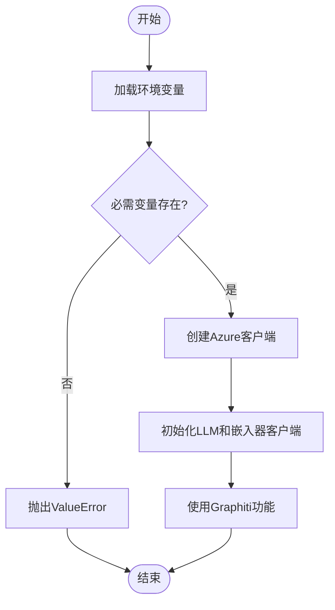
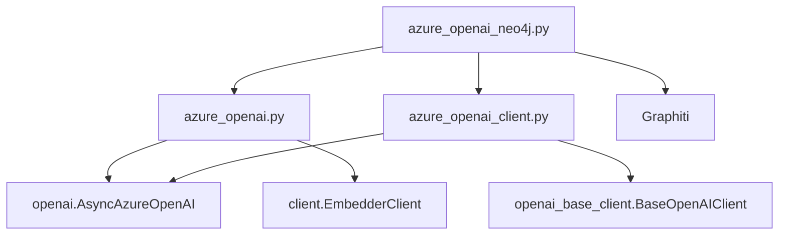

# Azure OpenAI嵌入器

<cite>
**本文档中引用的文件**   
- [azure_openai.py](file://graphiti_core/embedder/azure_openai.py)
- [openai.py](file://graphiti_core/embedder/openai.py)
- [client.py](file://graphiti_core/embedder/client.py)
- [azure_openai_client.py](file://graphiti_core/llm_client/azure_openai_client.py)
- [azure_openai_neo4j.py](file://examples/azure-openai/azure_openai_neo4j.py)
- [.env.example](file://examples/azure-openai/.env.example)
- [README.md](file://examples/azure-openai/README.md)
</cite>

## 目录
1. [简介](#简介)
2. [项目结构](#项目结构)
3. [核心组件](#核心组件)
4. [架构概述](#架构概述)
5. [详细组件分析](#详细组件分析)
6. [依赖分析](#依赖分析)
7. [性能考虑](#性能考虑)
8. [故障排除指南](#故障排除指南)
9. [结论](#结论)

## 简介
本文档详细介绍了如何在Graphiti框架中使用Azure OpenAI嵌入器。重点阐述了Azure OpenAI嵌入器与标准OpenAI嵌入器的异同，Azure特定配置参数（如azure_endpoint、api_version）的必要性，以及如何在Azure门户中配置嵌入模型部署。文档还涵盖了企业级应用中的安全最佳实践、错误处理、日志记录和监控集成。

## 项目结构
本项目结构清晰地组织了Azure OpenAI相关的代码和示例。核心嵌入器实现位于`graphiti_core/embedder/`目录下，而具体的Azure OpenAI集成示例则位于`examples/azure-openai/`目录中。配置文件和环境变量示例为快速启动提供了便利。

**Diagram sources**
- [azure_openai.py](file://graphiti_core/embedder/azure_openai.py)
- [azure_openai_client.py](file://graphiti_core/llm_client/azure_openai_client.py)
- [azure_openai_neo4j.py](file://examples/azure-openai/azure_openai_neo4j.py)

**Section sources**
- [azure_openai.py](file://graphiti_core/embedder/azure_openai.py)
- [azure_openai_client.py](file://graphiti_core/llm_client/azure_openai_client.py)
- [azure_openai_neo4j.py](file://examples/azure-openai/azure_openai_neo4j.py)

## 核心组件
Azure OpenAI嵌入器的核心组件包括`AzureOpenAIEmbedderClient`类，它实现了`EmbedderClient`接口，支持通过`AsyncAzureOpenAI`或`AsyncOpenAI`客户端进行异步调用。该组件能够创建单个或批量的嵌入向量，并处理不同类型的输入数据。

**Section sources**
- [azure_openai.py](file://graphiti_core/embedder/azure_openai.py#L27-L72)
- [client.py](file://graphiti_core/embedder/client.py#L30-L39)

## 架构概述
系统架构采用分层设计，将Azure OpenAI服务与本地知识图谱存储（如Neo4j）集成。通过`Graphiti`主类协调嵌入器、LLM客户端和图数据库驱动之间的交互，实现从原始文本到结构化知识图谱的转换。

**Diagram sources**
- [azure_openai.py](file://graphiti_core/embedder/azure_openai.py)
- [azure_openai_client.py](file://graphiti_core/llm_client/azure_openai_client.py)
- [neo4j_driver.py](file://graphiti_core/driver/neo4j_driver.py)

## 详细组件分析

### AzureOpenAIEmbedderClient分析
`AzureOpenAIEmbedderClient`类是Azure OpenAI嵌入功能的核心实现。它通过`AsyncAzureOpenAI`或`AsyncOpenAI`客户端与Azure服务通信，支持创建单个和批量嵌入。

#### 类图

**Diagram sources**
- [azure_openai.py](file://graphiti_core/embedder/azure_openai.py#L27-L72)

#### 创建嵌入序列图

**Diagram sources**
- [azure_openai.py](file://graphiti_core/embedder/azure_openai.py#L41-L59)

**Section sources**
- [azure_openai.py](file://graphiti_core/embedder/azure_openai.py#L27-L72)

### 配置与部署分析
Azure OpenAI的配置需要在Azure门户中创建资源并部署模型。环境变量用于存储连接信息，确保配置的灵活性和安全性。

#### 配置流程图

**Diagram sources**
- [azure_openai_neo4j.py](file://examples/azure-openai/azure_openai_neo4j.py#L48-L65)

**Section sources**
- [azure_openai_neo4j.py](file://examples/azure-openai/azure_openai_neo4j.py#L56-L65)
- [.env.example](file://examples/azure-openai/.env.example)

## 依赖分析
Azure OpenAI嵌入器依赖于`openai` Python包和`graphiti_core`框架的其他组件。通过`EmbedderClient`接口实现松耦合，允许在不同嵌入服务之间轻松切换。

**Diagram sources**
- [azure_openai.py](file://graphiti_core/embedder/azure_openai.py)
- [azure_openai_client.py](file://graphiti_core/llm_client/azure_openai_client.py)
- [azure_openai_neo4j.py](file://examples/azure-openai/azure_openai_neo4j.py)

**Section sources**
- [azure_openai.py](file://graphiti_core/embedder/azure_openai.py)
- [azure_openai_client.py](file://graphiti_core/llm_client/azure_openai_client.py)

## 性能考虑
在企业级应用中，应考虑使用批处理嵌入来提高效率，合理设置超时和重试策略，并监控API调用速率以避免配额限制。日志记录和错误处理机制对于生产环境的稳定性至关重要。

## 故障排除指南
常见问题包括Azure端点配置错误、API密钥无效、部署名称不匹配等。确保环境变量正确设置，并检查Azure门户中的模型部署状态。

**Section sources**
- [azure_openai_neo4j.py](file://examples/azure-openai/azure_openai_neo4j.py#L64-L65)
- [README.md](file://examples/azure-openai/README.md#L128-L134)

## 结论
Azure OpenAI嵌入器为Graphiti框架提供了强大的语义搜索能力。通过正确的配置和安全实践，可以在企业级应用中可靠地集成这一功能，构建智能的知识图谱系统。