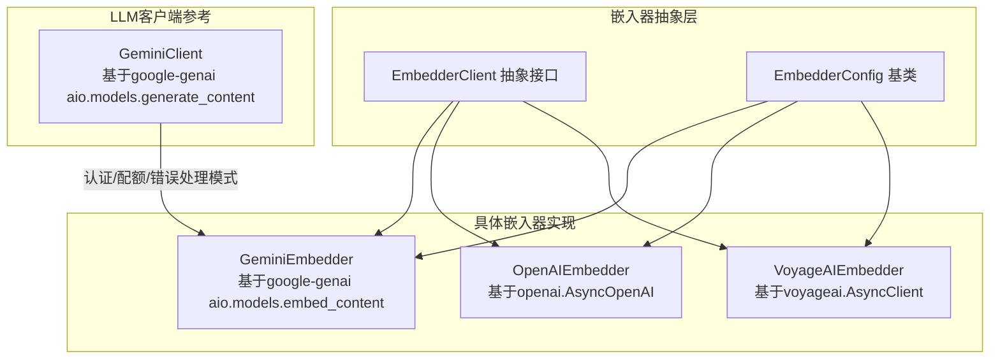
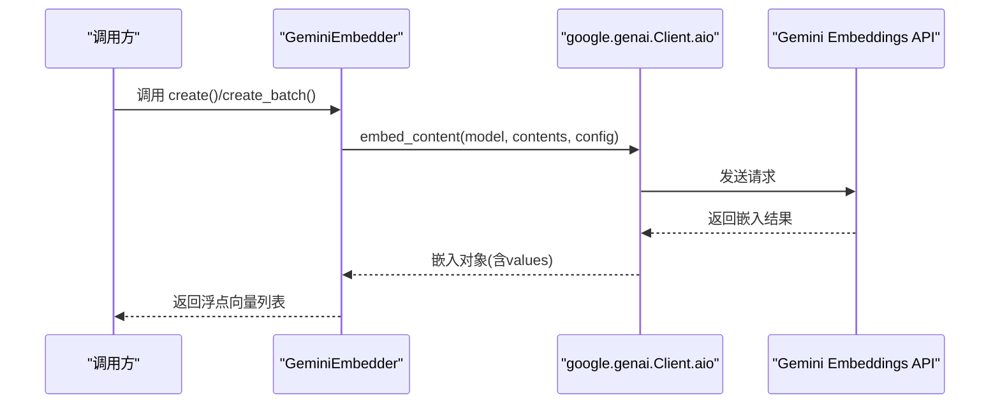
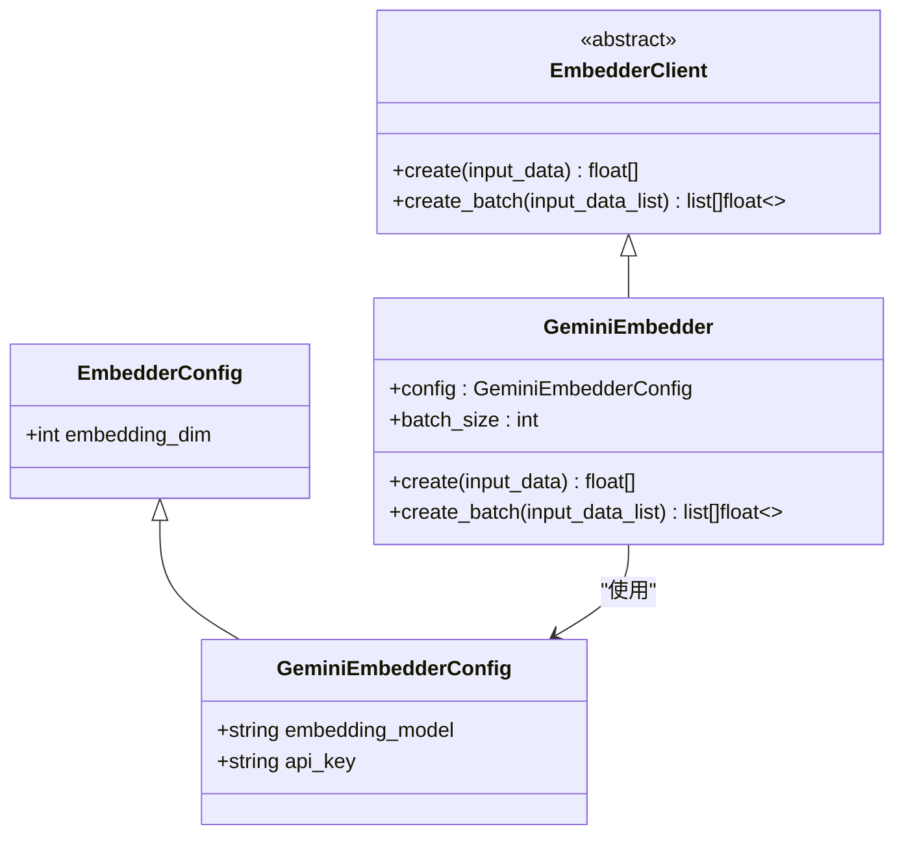
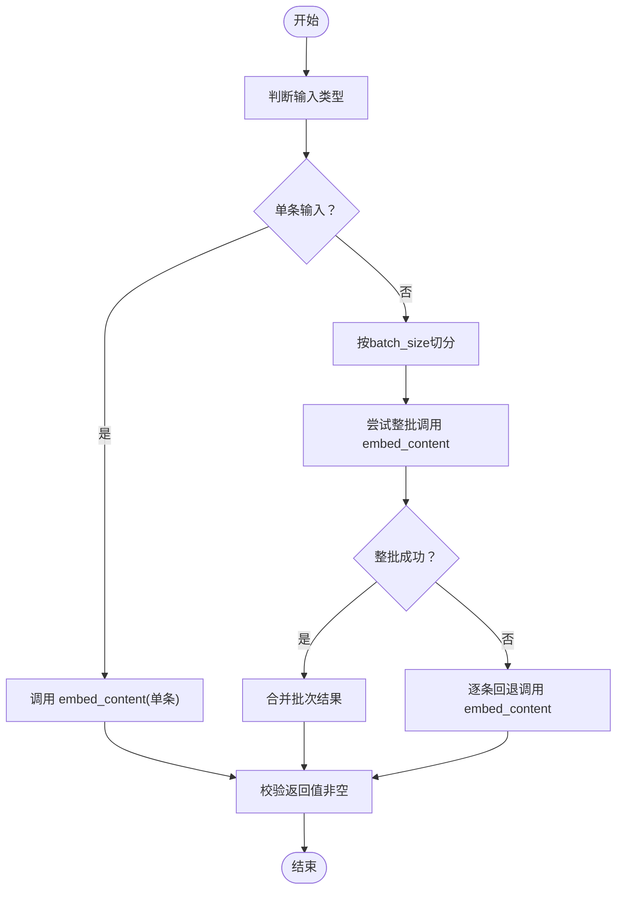
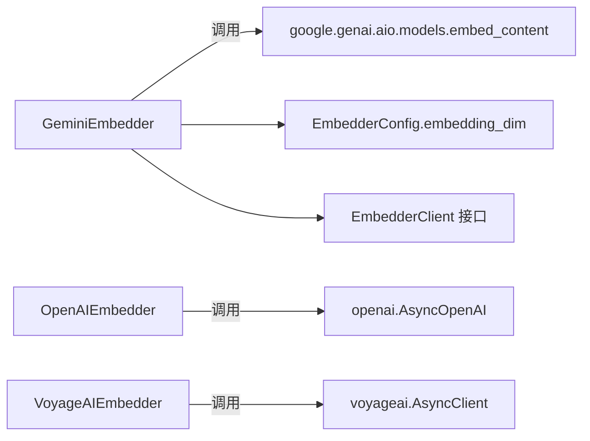

# Gemini嵌入器

<cite>
**本文引用的文件**
- [graphiti_core/embedder/gemini.py](file://graphiti_core/embedder/gemini.py)
- [graphiti_core/embedder/client.py](file://graphiti_core/embedder/client.py)
- [graphiti_core/llm_client/gemini_client.py](file://graphiti_core/llm_client/gemini_client.py)
- [tests/embedder/test_gemini.py](file://tests/embedder/test_gemini.py)
- [graphiti_core/embedder/openai.py](file://graphiti_core/embedder/openai.py)
- [graphiti_core/embedder/voyage.py](file://graphiti_core/embedder/voyage.py)
</cite>

## 目录
1. [简介](#简介)
2. [项目结构](#项目结构)
3. [核心组件](#核心组件)
4. [架构总览](#架构总览)
5. [详细组件分析](#详细组件分析)
6. [依赖关系分析](#依赖关系分析)
7. [性能与成本考量](#性能与成本考量)
8. [故障排查指南](#故障排查指南)
9. [结论](#结论)
10. [附录](#附录)

## 简介
本文件系统性地介绍Graphiti中基于Google GenAI SDK的Gemini嵌入器实现，涵盖以下内容：
- 如何通过gemini-embedding-001（或text-embedding-005）模型生成嵌入向量
- API认证方式与配额限制的处理策略
- 配置项api_key、embedding_model、embedding_dim等的使用方法
- 从文本输入到嵌入输出的完整异步调用流程
- 与OpenAI、Voyage等其他嵌入服务的对比（性能与成本）
- 在异步工作负载中使用Gemini嵌入器的最佳实践

## 项目结构
围绕嵌入器的相关模块组织如下：
- 嵌入器抽象层：定义统一的EmbedderClient接口与EmbedderConfig基类
- 具体嵌入器实现：GeminiEmbedder、OpenAIEmbedder、VoyageAIEmbedder
- LLM客户端（GeminiClient）：展示如何通过GenAI SDK进行认证与错误处理，为理解Gemini嵌入器的SDK使用提供参考
- 测试：覆盖初始化、单条/批量嵌入、异常处理等场景

图表来源
- [graphiti_core/embedder/client.py](file://graphiti_core/embedder/client.py#L1-L39)
- [graphiti_core/embedder/gemini.py](file://graphiti_core/embedder/gemini.py#L45-L184)
- [graphiti_core/embedder/openai.py](file://graphiti_core/embedder/openai.py#L1-L67)
- [graphiti_core/embedder/voyage.py](file://graphiti_core/embedder/voyage.py#L1-L77)
- [graphiti_core/llm_client/gemini_client.py](file://graphiti_core/llm_client/gemini_client.py#L1-L447)

章节来源
- [graphiti_core/embedder/client.py](file://graphiti_core/embedder/client.py#L1-L39)
- [graphiti_core/embedder/gemini.py](file://graphiti_core/embedder/gemini.py#L45-L184)
- [graphiti_core/embedder/openai.py](file://graphiti_core/embedder/openai.py#L1-L67)
- [graphiti_core/embedder/voyage.py](file://graphiti_core/embedder/voyage.py#L1-L77)
- [graphiti_core/llm_client/gemini_client.py](file://graphiti_core/llm_client/gemini_client.py#L1-L447)

## 核心组件
- EmbedderConfig：统一的嵌入器配置基类，包含embedding_dim默认值（来自环境变量EMBEDDING_DIM，默认1024）
- EmbedderClient：抽象接口，定义create与create_batch两个异步方法
- GeminiEmbedderConfig：继承自EmbedderConfig，新增embedding_model与api_key字段
- GeminiEmbedder：实现EmbedderClient，基于google.genai的aio.models.embed_content进行异步嵌入

关键点
- 默认嵌入模型：gemini-embedding-001 或 text-embedding-005（代码中注释给出两种名称）
- 默认批大小：当embedding_model为gemini-embedding-001时，batch_size为1；否则为100
- 输出维度：通过types.EmbedContentConfig.output_dimensionality传入embedding_dim

章节来源
- [graphiti_core/embedder/client.py](file://graphiti_core/embedder/client.py#L1-L39)
- [graphiti_core/embedder/gemini.py](file://graphiti_core/embedder/gemini.py#L45-L184)

## 架构总览
下图展示了Gemini嵌入器的调用链路与关键依赖：

图表来源
- [graphiti_core/embedder/gemini.py](file://graphiti_core/embedder/gemini.py#L88-L184)
- [graphiti_core/llm_client/gemini_client.py](file://graphiti_core/llm_client/gemini_client.py#L1-L447)

## 详细组件分析

### GeminiEmbedder 类分析
- 初始化逻辑
  - 支持传入GeminiEmbedderConfig或使用默认配置
  - 若未显式传入client，则根据config.api_key创建genai.Client
  - 根据embedding_model自动设置batch_size：gemini-embedding-001为1，其他默认100
- 单条嵌入 create
  - 使用aio.models.embed_content(model, contents=[input_data], config)
  - 校验返回的embeddings非空且values存在，否则抛出异常
- 批量嵌入 create_batch
  - 按batch_size分批调用embed_content
  - 若某一批次整体失败，回退到逐条处理（对每条再次调用embed_content）
  - 对每条结果同样校验values非空，否则抛出异常
- 配置项
  - embedding_model：指定使用的嵌入模型名称
  - api_key：用于初始化genai.Client
  - embedding_dim：通过EmbedContentConfig.output_dimensionality控制输出维度

图表来源
- [graphiti_core/embedder/client.py](file://graphiti_core/embedder/client.py#L1-L39)
- [graphiti_core/embedder/gemini.py](file://graphiti_core/embedder/gemini.py#L45-L184)

章节来源
- [graphiti_core/embedder/gemini.py](file://graphiti_core/embedder/gemini.py#L45-L184)

### API认证与配额限制处理
- 认证方式
  - 通过EmbedderConfig.embedding_dim读取环境变量EMBEDDING_DIM作为默认维度
  - 通过GeminiEmbedderConfig.api_key初始化genai.Client
- 配额与速率限制
  - GeminiClient展示了对“速率限制/配额耗尽”等错误的识别与RateLimitError转换，体现SDK侧的配额/限流处理思路
  - GeminiEmbedder本身未直接封装重试/退避逻辑，但其批量回退机制可视为一种容错策略（当整批失败时逐条重试）

章节来源
- [graphiti_core/embedder/client.py](file://graphiti_core/embedder/client.py#L1-L39)
- [graphiti_core/embedder/gemini.py](file://graphiti_core/embedder/gemini.py#L45-L184)
- [graphiti_core/llm_client/gemini_client.py](file://graphiti_core/llm_client/gemini_client.py#L1-L447)

### 从文本输入到嵌入输出的完整流程
- 输入类型支持：字符串、字符串列表、整数序列或整数序列的序列
- 单条流程：create -> aio.models.embed_content -> 校验 -> 返回向量
- 批量流程：按batch_size切分 -> 并发/顺序调用embed_content -> 合并结果 -> 校验 -> 返回向量列表
- 异常处理：无嵌入、嵌入为空值、整批失败等均会抛出异常

图表来源
- [graphiti_core/embedder/gemini.py](file://graphiti_core/embedder/gemini.py#L88-L184)

章节来源
- [graphiti_core/embedder/gemini.py](file://graphiti_core/embedder/gemini.py#L88-L184)

### 与OpenAI、Voyage嵌入器的对比
- 认证方式
  - Gemini：通过genai.Client(api_key=...)
  - OpenAI：通过AsyncOpenAI(api_key=..., base_url=...)
  - Voyage：通过AsyncClient(api_key=...)
- 模型选择
  - Gemini：embedding_model可为gemini-embedding-001或text-embedding-005
  - OpenAI：默认text-embedding-3-small
  - Voyage：默认voyage-3
- 批处理策略
  - Gemini：gemini-embedding-001默认batch_size=1；其他默认100；若整批失败则逐条回退
  - OpenAI/Voyage：直接批量调用后处理结果
- 输出维度
  - Gemini：通过EmbedContentConfig.output_dimensionality设置
  - OpenAI/Voyage：通过截断embedding_dim实现

章节来源
- [graphiti_core/embedder/gemini.py](file://graphiti_core/embedder/gemini.py#L45-L184)
- [graphiti_core/embedder/openai.py](file://graphiti_core/embedder/openai.py#L1-L67)
- [graphiti_core/embedder/voyage.py](file://graphiti_core/embedder/voyage.py#L1-L77)

## 依赖关系分析
- 组件耦合
  - GeminiEmbedder依赖google.genai（aio.models.embed_content）
  - 与EmbedderClient/EmbedderConfig形成清晰的接口与配置分离
- 外部依赖
  - google-genai：必须安装以启用GeminiEmbedder
  - 环境变量EMBEDDING_DIM：影响默认embedding_dim
- 可能的循环依赖
  - 当前文件间无循环导入迹象

图表来源
- [graphiti_core/embedder/gemini.py](file://graphiti_core/embedder/gemini.py#L45-L184)
- [graphiti_core/embedder/openai.py](file://graphiti_core/embedder/openai.py#L1-L67)
- [graphiti_core/embedder/voyage.py](file://graphiti_core/embedder/voyage.py#L1-L77)
- [graphiti_core/embedder/client.py](file://graphiti_core/embedder/client.py#L1-L39)

章节来源
- [graphiti_core/embedder/gemini.py](file://graphiti_core/embedder/gemini.py#L45-L184)
- [graphiti_core/embedder/client.py](file://graphiti_core/embedder/client.py#L1-L39)

## 性能与成本考量
- 批处理策略
  - gemini-embedding-001默认batch_size=1，避免单请求实例过多导致的配额/限流问题
  - 其他模型默认batch_size=100，适合高吞吐场景
- 输出维度控制
  - 通过EmbedContentConfig.output_dimensionality降低输出维度，减少存储与传输开销
- 错误回退
  - 整批失败时的逐条回退可提升整体成功率，但会增加调用次数与成本
- 与OpenAI/Voyage对比
  - OpenAI/Voyage的批量调用更简洁，Gemini的默认batch_size更保守
  - 具体成本需结合各服务商定价与配额政策评估

[本节为通用建议，不直接分析具体文件]

## 故障排查指南
常见问题与定位要点
- 未安装google-genai
  - 现象：ImportError提示需要安装google-genai
  - 处理：pip安装graphiti-core[google-genai]
- 无嵌入返回或嵌入为空
  - 现象：ValueError提示未返回嵌入或values为空
  - 处理：检查输入是否为空、网络/配额状态、模型名称是否正确
- 整批失败后的逐条回退
  - 现象：批量调用失败后逐条重试
  - 处理：关注个别输入是否异常，必要时单独处理该条数据

章节来源
- [graphiti_core/embedder/gemini.py](file://graphiti_core/embedder/gemini.py#L88-L184)
- [tests/embedder/test_gemini.py](file://tests/embedder/test_gemini.py#L1-L396)

## 结论
- GeminiEmbedder提供了对Google GenAI SDK的轻量封装，支持异步嵌入与灵活的批处理策略
- 通过embedding_dim与EmbedContentConfig.output_dimensionality可控制输出维度
- 在gemini-embedding-001模型上采用较小的batch_size以规避配额/限流风险，其他模型默认较大batch_size以提高吞吐
- 与OpenAI/Voyage相比，Gemini在批处理与配额容忍度方面有差异化设计，实际选型需结合业务需求与成本策略

[本节为总结，不直接分析具体文件]

## 附录

### 配置项说明
- embedding_dim
  - 来源：EmbedderConfig.embedding_dim（默认来自环境变量EMBEDDING_DIM，默认1024）
  - 作用：通过EmbedContentConfig.output_dimensionality传递给Gemini API
- embedding_model
  - 默认：gemini-embedding-001 或 text-embedding-005（代码注释）
  - 影响：batch_size默认策略与API行为
- api_key
  - 作用：初始化genai.Client进行认证
  - 获取：在GeminiEmbedderConfig中提供

章节来源
- [graphiti_core/embedder/client.py](file://graphiti_core/embedder/client.py#L1-L39)
- [graphiti_core/embedder/gemini.py](file://graphiti_core/embedder/gemini.py#L45-L184)

### 代码示例路径（不展示具体代码）
- 初始化与单条嵌入
  - [GeminiEmbedder.__init__](file://graphiti_core/embedder/gemini.py#L55-L87)
  - [GeminiEmbedder.create](file://graphiti_core/embedder/gemini.py#L88-L112)
- 批量嵌入与回退逻辑
  - [GeminiEmbedder.create_batch](file://graphiti_core/embedder/gemini.py#L113-L184)
- 测试用例（验证行为）
  - [测试：初始化与默认配置](file://tests/embedder/test_gemini.py#L80-L113)
  - [测试：单条嵌入调用与参数](file://tests/embedder/test_gemini.py#L114-L184)
  - [测试：批量嵌入与维度控制](file://tests/embedder/test_gemini.py#L242-L392)
  - [测试：异常处理（无嵌入/空值）](file://tests/embedder/test_gemini.py#L208-L240)