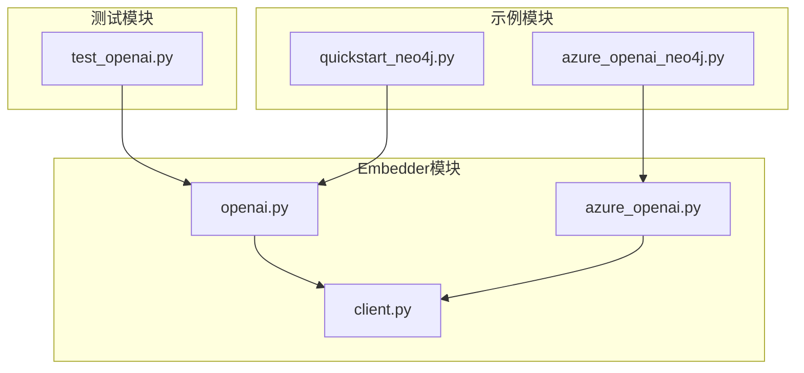
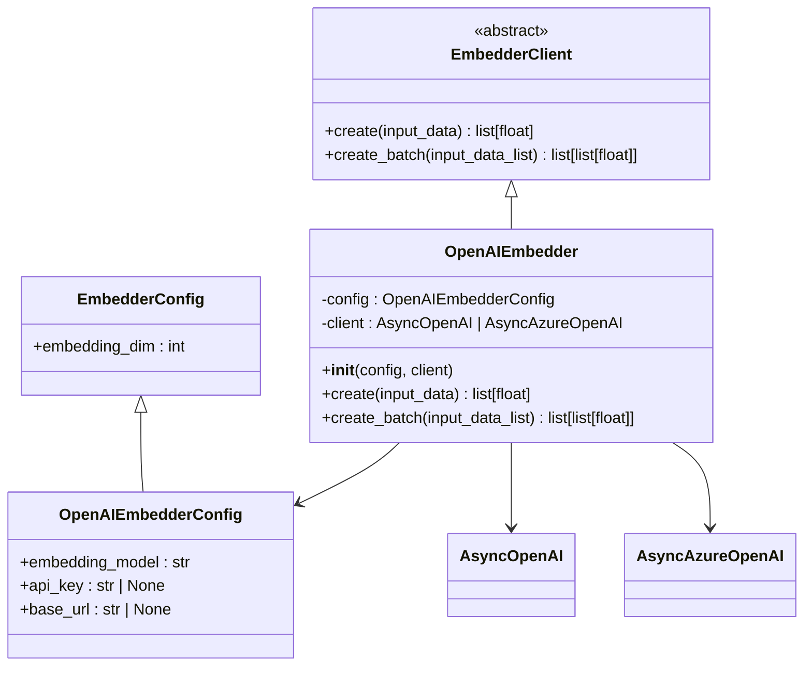
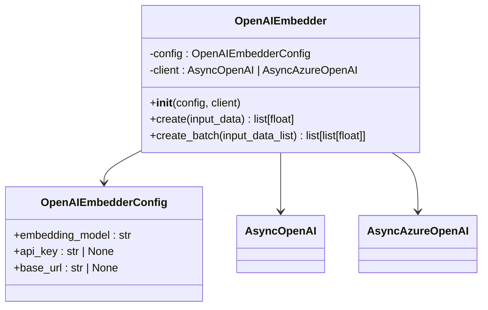
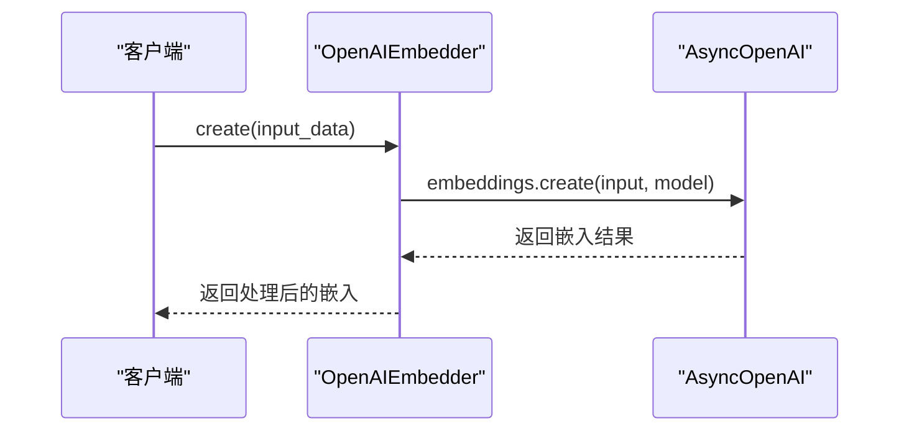
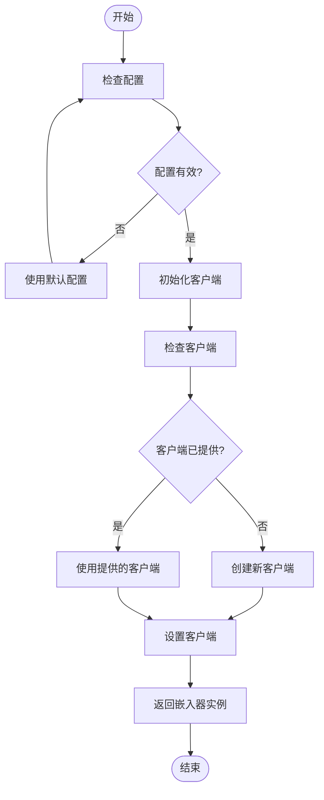
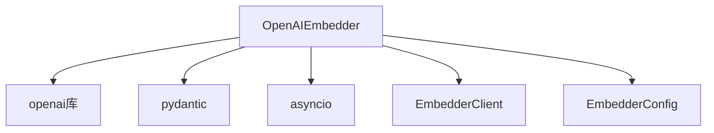

# OpenAI嵌入器

<cite>
**本文档中引用的文件**   
- [openai.py](file://graphiti_core/embedder/openai.py)
- [client.py](file://graphiti_core/embedder/client.py)
- [test_openai.py](file://tests/embedder/test_openai.py)
- [azure_openai.py](file://graphiti_core/embedder/azure_openai.py)
- [quickstart_neo4j.py](file://examples/quickstart/quickstart_neo4j.py)
- [azure_openai_neo4j.py](file://examples/azure-openai/azure_openai_neo4j.py)
</cite>

## 目录
1. [简介](#简介)
2. [项目结构](#项目结构)
3. [核心组件](#核心组件)
4. [架构概述](#架构概述)
5. [详细组件分析](#详细组件分析)
6. [依赖分析](#依赖分析)
7. [性能考量](#性能考量)
8. [故障排除指南](#故障排除指南)
9. [结论](#结论)

## 简介
OpenAI嵌入器是Graphiti框架中的关键组件，负责使用OpenAI API生成文本嵌入。该组件继承自EmbedderClient抽象类，实现了create和create_batch方法，支持单条和批量文本处理。通过配置参数如model、api_key和base_url，用户可以灵活地定制嵌入器的行为。该嵌入器不仅支持标准的OpenAI服务，还兼容Azure OpenAI服务，提供了广泛的适用性。错误处理机制包括对网络超时和速率限制的重试策略，确保了服务的稳定性和可靠性。本文档将深入解析OpenAI嵌入器的实现细节，提供实际调用示例，并分析其性能特征。

## 项目结构
Graphiti项目的结构清晰，主要分为几个核心模块：embedder、llm_client、driver等。其中，embedder模块专门负责文本嵌入的生成，包含了OpenAI、Gemini、Voyage等不同服务的嵌入器实现。client.py定义了嵌入器客户端的基类和配置，而openai.py则具体实现了OpenAI嵌入器的功能。测试文件位于tests目录下，确保了代码的质量和稳定性。

**Diagram sources**
- [openai.py](file://graphiti_core/embedder/openai.py)
- [client.py](file://graphiti_core/embedder/client.py)
- [test_openai.py](file://tests/embedder/test_openai.py)
- [quickstart_neo4j.py](file://examples/quickstart/quickstart_neo4j.py)
- [azure_openai_neo4j.py](file://examples/azure-openai/azure_openai_neo4j.py)

**Section sources**
- [openai.py](file://graphiti_core/embedder/openai.py)
- [client.py](file://graphiti_core/embedder/client.py)

## 核心组件

OpenAI嵌入器的核心在于其继承自EmbedderClient的实现，通过OpenAIEmbedderConfig配置类管理嵌入模型、API密钥和基础URL等参数。默认情况下，使用'text-embedding-3-small'模型，但用户可以根据需要进行更改。嵌入器支持异步操作，提高了处理效率。

**Section sources**
- [openai.py](file://graphiti_core/embedder/openai.py#L27-L67)
- [client.py](file://graphiti_core/embedder/client.py#L26-L39)

## 架构概述

OpenAI嵌入器的架构设计遵循了模块化和可扩展的原则，通过继承EmbedderClient抽象类，实现了统一的接口。配置参数通过Pydantic模型进行管理，确保了类型安全和配置的灵活性。异步客户端的使用使得嵌入生成过程更加高效，能够处理大量并发请求。

**Diagram sources**
- [openai.py](file://graphiti_core/embedder/openai.py)
- [client.py](file://graphiti_core/embedder/client.py)

## 详细组件分析

### OpenAI嵌入器分析

#### 对象导向组件

**Diagram sources**
- [openai.py](file://graphiti_core/embedder/openai.py#L33-L67)
- [client.py](file://graphiti_core/embedder/client.py#L26-L29)

#### API/服务组件

**Diagram sources**
- [openai.py](file://graphiti_core/embedder/openai.py#L54-L60)

#### 复杂逻辑组件

**Diagram sources**
- [openai.py](file://graphiti_core/embedder/openai.py#L40-L53)

**Section sources**
- [openai.py](file://graphiti_core/embedder/openai.py)
- [test_openai.py](file://tests/embedder/test_openai.py)

## 依赖分析

OpenAI嵌入器依赖于多个外部库和内部模块，包括openai库用于与OpenAI API交互，pydantic用于配置管理，以及asyncio用于异步操作。此外，它还依赖于Graphiti框架的其他部分，如llm_client和driver模块，以实现完整的功能。

**Diagram sources**
- [openai.py](file://graphiti_core/embedder/openai.py)
- [client.py](file://graphiti_core/embedder/client.py)

**Section sources**
- [openai.py](file://graphiti_core/embedder/openai.py)
- [client.py](file://graphiti_core/embedder/client.py)

## 性能考量

OpenAI嵌入器的性能受到多种因素的影响，包括网络延迟、API响应时间和嵌入模型的选择。为了优化性能，建议使用高效的网络连接，选择合适的嵌入模型，并合理配置批量处理的大小。此外，通过异步操作和并发请求，可以显著提高处理速度。

## 故障排除指南

在使用OpenAI嵌入器时，可能会遇到网络超时、速率限制等问题。对于网络超时，可以通过增加超时时间或重试机制来解决；对于速率限制，建议实现指数退避算法，逐步增加重试间隔。此外，确保API密钥的有效性和正确配置也是避免错误的关键。

**Section sources**
- [openai.py](file://graphiti_core/embedder/openai.py)
- [azure_openai.py](file://graphiti_core/embedder/azure_openai.py)

## 结论

OpenAI嵌入器是Graphiti框架中不可或缺的一部分，提供了强大的文本嵌入生成功能。通过灵活的配置选项和稳健的错误处理机制，它能够满足各种应用场景的需求。未来的工作可以进一步优化性能，增强对更多嵌入模型的支持，并提供更丰富的调试工具。