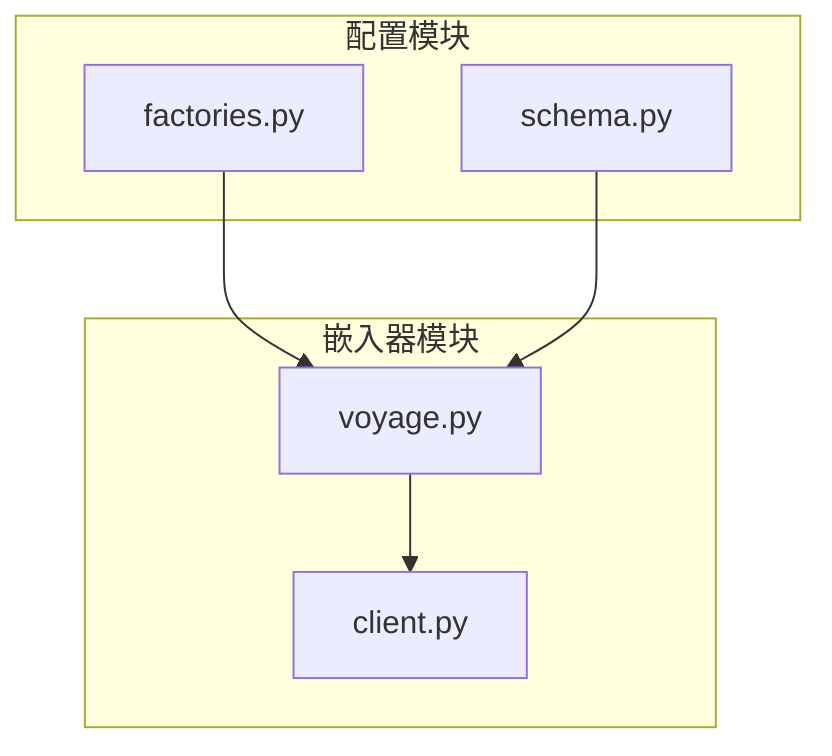
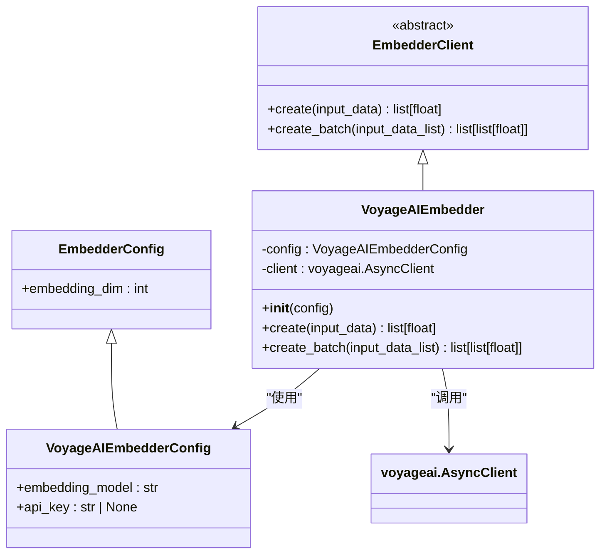
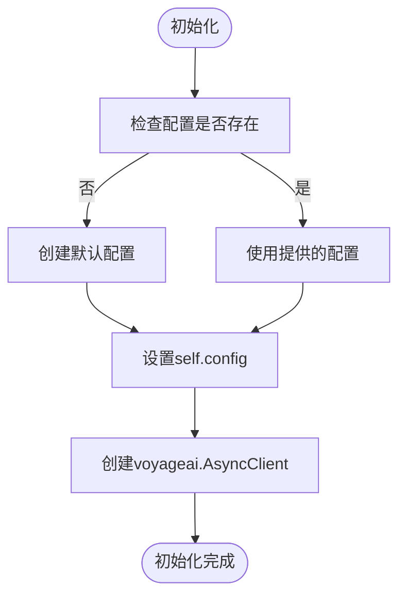
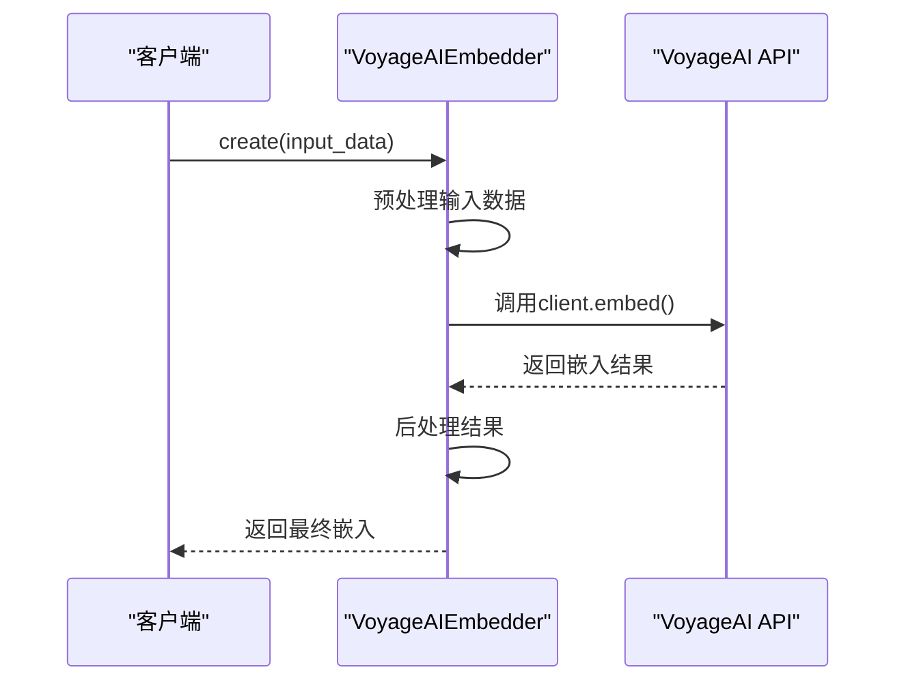
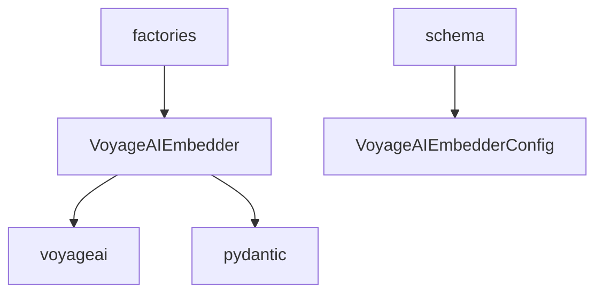

# VoyageAI嵌入器

<cite>
**本文档中引用的文件**  
- [voyage.py](file://graphiti_core/embedder/voyage.py)
- [client.py](file://graphiti_core/embedder/client.py)
- [test_voyage.py](file://tests/embedder/test_voyage.py)
- [factories.py](file://mcp_server/src/services/factories.py)
- [schema.py](file://mcp_server/src/config/schema.py)
</cite>

## 目录
1. [简介](#简介)
2. [项目结构](#项目结构)
3. [核心组件](#核心组件)
4. [架构概述](#架构概述)
5. [详细组件分析](#详细组件分析)
6. [依赖分析](#依赖分析)
7. [性能考量](#性能考量)
8. [故障排除指南](#故障排除指南)
9. [结论](#结论)

## 简介
VoyageAI嵌入器是Graphiti项目中的一个关键组件，专为处理长文本而优化。它利用VoyageAI的先进模型（如voyage-large-2和voyage-code-2）生成高质量的文本嵌入，适用于文档摘要、代码检索等场景。本技术文档将详细介绍其配置方式、连接参数、长上下文处理能力、身份验证机制以及性能调优建议。

## 项目结构
VoyageAI嵌入器的实现位于`graphiti_core/embedder/`目录下，主要由`voyage.py`文件构成。该模块依赖于`voyageai` Python SDK，并通过`EmbedderClient`抽象类与其他嵌入器保持接口一致性。配置信息通过`mcp_server/src/config/schema.py`中的`VoyageProviderConfig`类进行管理。

**Diagram sources**  
- [voyage.py](file://graphiti_core/embedder/voyage.py#L1-L77)
- [client.py](file://graphiti_core/embedder/client.py#L1-L39)
- [schema.py](file://mcp_server/src/config/schema.py#L128-L134)
- [factories.py](file://mcp_server/src/services/factories.py#L340-L357)

**Section sources**
- [voyage.py](file://graphiti_core/embedder/voyage.py#L1-L77)
- [client.py](file://graphiti_core/embedder/client.py#L1-L39)
- [schema.py](file://mcp_server/src/config/schema.py#L128-L134)

## 核心组件
VoyageAI嵌入器的核心是`VoyageAIEmbedder`类，它继承自`EmbedderClient`抽象基类。该类通过`voyageai.AsyncClient`与VoyageAI API进行异步通信，支持单个和批量嵌入生成。默认使用的模型为`voyage-3`，可通过配置进行更改。

**Section sources**
- [voyage.py](file://graphiti_core/embedder/voyage.py#L43-L76)

## 架构概述
VoyageAI嵌入器的架构设计遵循模块化原则，将配置、客户端实现和API调用分离。`VoyageAIEmbedderConfig`类负责管理嵌入器的配置参数，如API密钥、模型名称和嵌入维度。`VoyageAIEmbedder`类则负责实际的API调用和结果处理。

**Diagram sources**  
- [voyage.py](file://graphiti_core/embedder/voyage.py#L38-L76)
- [client.py](file://graphiti_core/embedder/client.py#L30-L38)

## 详细组件分析

### VoyageAIEmbedder分析
`VoyageAIEmbedder`类是VoyageAI嵌入功能的核心实现。它提供了两个主要方法：`create`用于生成单个输入的嵌入，`create_batch`用于批量生成嵌入。在初始化时，它会创建一个`voyageai.AsyncClient`实例，并将配置中的API密钥传递给它。

#### 初始化流程

**Diagram sources**  
- [voyage.py](file://graphiti_core/embedder/voyage.py#L48-L52)

#### 嵌入生成流程

**Diagram sources**  
- [voyage.py](file://graphiti_core/embedder/voyage.py#L54-L69)

**Section sources**
- [voyage.py](file://graphiti_core/embedder/voyage.py#L43-L76)
- [test_voyage.py](file://tests/embedder/test_voyage.py#L69-L94)

## 依赖分析
VoyageAI嵌入器的主要依赖是`voyageai` Python包，它必须通过`pip install graphiti-core[voyageai]`单独安装。该嵌入器还依赖于Pydantic进行配置验证，并通过`mcp_server`的工厂模式进行实例化。

**Diagram sources**  
- [voyage.py](file://graphiti_core/embedder/voyage.py#L23-L29)
- [factories.py](file://mcp_server/src/services/factories.py#L340-L357)
- [schema.py](file://mcp_server/src/config/schema.py#L128-L134)

**Section sources**
- [voyage.py](file://graphiti_core/embedder/voyage.py#L23-L29)
- [factories.py](file://mcp_server/src/services/factories.py#L340-L357)
- [schema.py](file://mcp_server/src/config/schema.py#L128-L134)

## 性能考量
VoyageAI嵌入器通过异步API调用实现高性能。对于批量嵌入生成，建议使用`create_batch`方法以减少网络开销。`voyage-3`模型默认生成1024维的嵌入向量，这在大多数应用场景下提供了良好的精度和性能平衡。对于超长文本，VoyageAI模型具有优秀的上下文处理能力，但用户仍需注意API的速率限制和成本。

## 故障排除指南
当使用VoyageAI嵌入器时，可能遇到以下常见问题：
- **ImportError**: 确保已安装`graphiti-core[voyageai]`依赖
- **API密钥错误**: 检查`VoyageProviderConfig`中的`api_key`是否正确配置
- **模型不可用**: 确认指定的模型名称（如`voyage-large-2`）在VoyageAI服务中可用
- **网络超时**: 考虑增加超时设置或重试机制

**Section sources**
- [voyage.py](file://graphiti_core/embedder/voyage.py#L26-L29)
- [schema.py](file://mcp_server/src/config/schema.py#L131-L134)
- [factories.py](file://mcp_server/src/services/factories.py#L340-L357)

## 结论
VoyageAI嵌入器为Graphiti项目提供了强大的文本嵌入能力，特别适合处理长文本场景。通过合理的配置和使用，它可以有效支持文档摘要、代码检索等复杂应用。未来可以进一步优化批量处理性能，并增加对更多VoyageAI模型的支持。