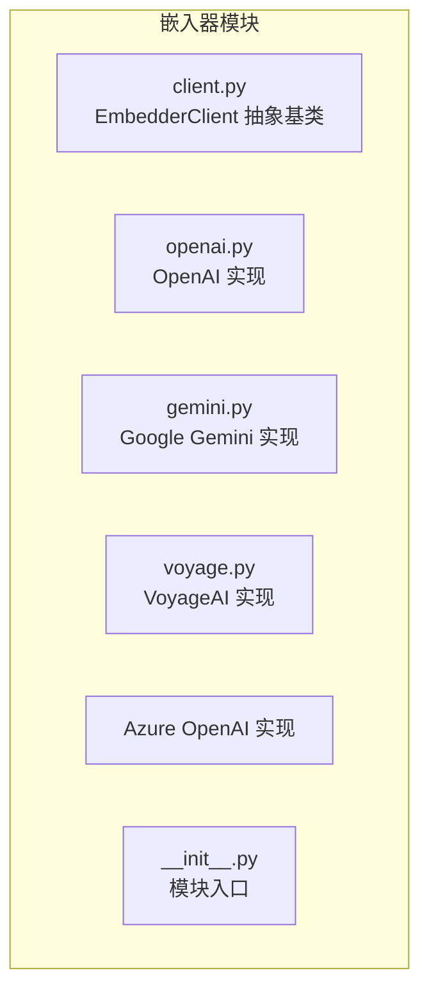
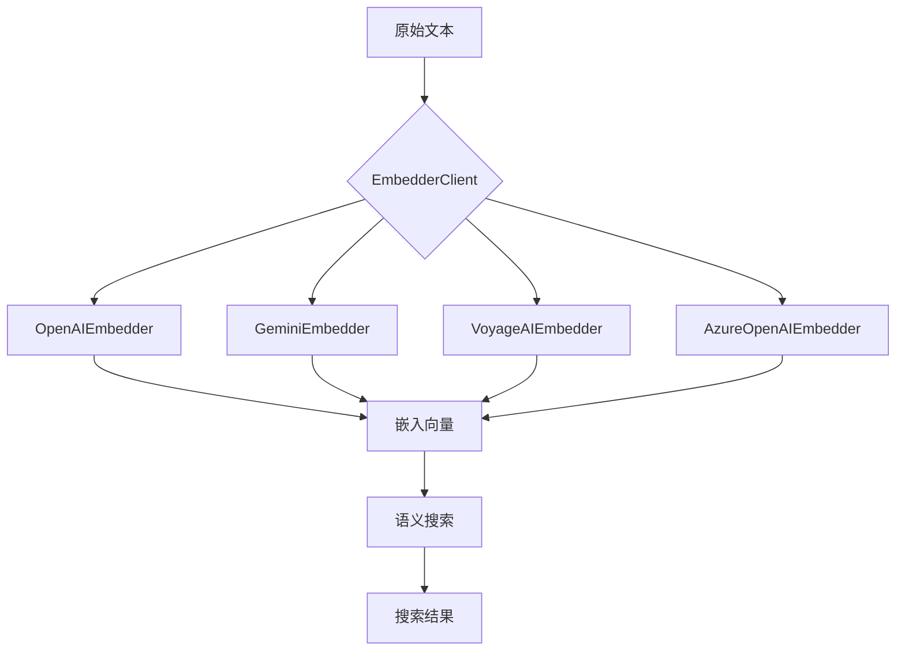
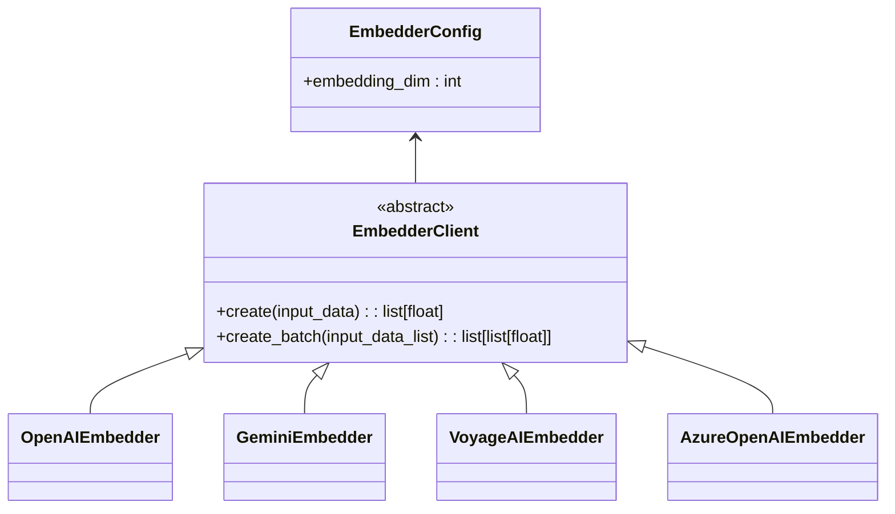
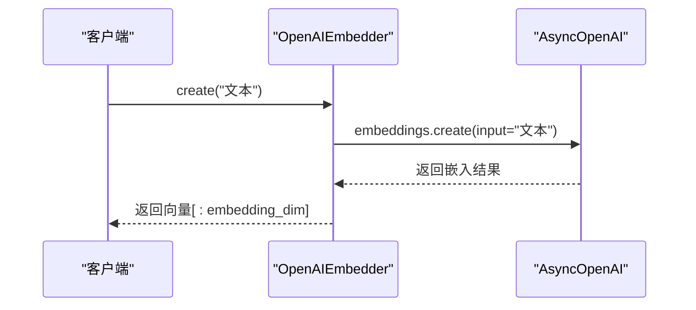
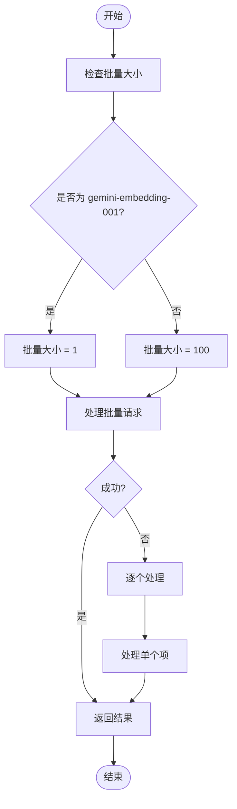
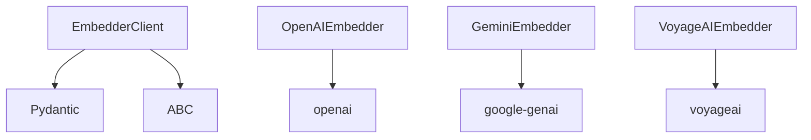

# 嵌入器

<cite>
**本文档引用的文件**  
- [client.py](file://graphiti_core/embedder/client.py)
- [openai.py](file://graphiti_core/embedder/openai.py)
- [gemini.py](file://graphiti_core/embedder/gemini.py)
- [voyage.py](file://graphiti_core/embedder/voyage.py)
- [azure_openai.py](file://graphiti_core/embedder/azure_openai.py)
- [search.py](file://graphiti_core/search/search.py)
- [search_utils.py](file://graphiti_core/search/search_utils.py)
</cite>

## 目录
1. [简介](#简介)
2. [项目结构](#项目结构)
3. [核心组件](#核心组件)
4. [架构概述](#架构概述)
5. [详细组件分析](#详细组件分析)
6. [依赖分析](#依赖分析)
7. [性能考虑](#性能考虑)
8. [故障排除指南](#故障排除指南)
9. [结论](#结论)

## 简介
本文档深入解析Graphiti嵌入器的设计与实现，重点介绍`EmbedderClient`抽象基类及其在不同嵌入服务提供商（如OpenAI、Gemini、VoyageAI、Azure OpenAI）中的具体实现。文档说明了嵌入器如何通过`create`和`create_batch`方法生成文本嵌入向量，并将这些向量用于语义搜索。同时，文档涵盖了`EMBEDDING_DIM`配置在向量维度管理中的作用、性能优化策略（如批量处理、异步操作），以及为高级用户提供的配置选项和扩展点。

## 项目结构
Graphiti嵌入器模块位于`graphiti_core/embedder/`目录下，包含核心客户端抽象类和多个服务提供商的具体实现。该模块通过统一的接口支持多种嵌入服务，确保了系统的灵活性和可扩展性。

**图示来源**  
- [client.py](file://graphiti_core/embedder/client.py#L1-L39)
- [openai.py](file://graphiti_core/embedder/openai.py#L1-L67)
- [gemini.py](file://graphiti_core/embedder/gemini.py#L1-L184)
- [voyage.py](file://graphiti_core/embedder/voyage.py#L1-L77)
- [azure_openai.py](file://graphiti_core/embedder/azure_openai.py#L1-L72)

**本节来源**  
- [graphiti_core/embedder/client.py](file://graphiti_core/embedder/client.py#L1-L39)
- [graphiti_core/embedder/openai.py](file://graphiti_core/embedder/openai.py#L1-L67)
- [graphiti_core/embedder/gemini.py](file://graphiti_core/embedder/gemini.py#L1-L184)
- [graphiti_core/embedder/voyage.py](file://graphiti_core/embedder/voyage.py#L1-L77)
- [graphiti_core/embedder/azure_openai.py](file://graphiti_core/embedder/azure_openai.py#L1-L72)

## 核心组件
嵌入器的核心是`EmbedderClient`抽象基类，它定义了所有嵌入服务必须实现的接口。该类通过`create`和`create_batch`方法提供异步嵌入生成能力，并通过`EmbedderConfig`管理配置，特别是`EMBEDDING_DIM`这一关键参数，用于控制生成的嵌入向量的维度。

**本节来源**  
- [client.py](file://graphiti_core/embedder/client.py#L1-L39)
- [search.py](file://graphiti_core/search/search.py#L24)

## 架构概述
Graphiti嵌入器采用抽象工厂模式，通过`EmbedderClient`抽象类定义统一接口，各服务提供商（如OpenAI、Gemini）提供具体实现。这些嵌入向量被`search`模块用于执行语义搜索，通过计算查询向量与存储向量的余弦相似度来检索相关信息。

**图示来源**  
- [client.py](file://graphiti_core/embedder/client.py#L30-L38)
- [openai.py](file://graphiti_core/embedder/openai.py#L33-L67)
- [gemini.py](file://graphiti_core/embedder/gemini.py#L50-L184)
- [voyage.py](file://graphiti_core/embedder/voyage.py#L43-L77)
- [azure_openai.py](file://graphiti_core/embedder/azure_openai.py#L27-L72)
- [search.py](file://graphiti_core/search/search.py#L68-L183)

## 详细组件分析

### EmbedderClient 抽象基类分析
`EmbedderClient`是所有嵌入服务实现的抽象基类，强制要求实现`create`方法，并提供了`create_batch`的默认实现。它通过`EmbedderConfig`配置类管理嵌入维度，该维度由环境变量`EMBEDDING_DIM`决定，默认为1024。

**图示来源**  
- [client.py](file://graphiti_core/embedder/client.py#L30-L38)

**本节来源**  
- [client.py](file://graphiti_core/embedder/client.py#L1-L39)

### OpenAIEmbedder 实现分析
`OpenAIEmbedder`实现了`EmbedderClient`接口，支持标准OpenAI和Azure OpenAI客户端。它使用`AsyncOpenAI`或`AsyncAzureOpenAI`库调用API，并通过配置类`OpenAIEmbedderConfig`指定模型、API密钥等参数。

**图示来源**  
- [openai.py](file://graphiti_core/embedder/openai.py#L33-L67)

**本节来源**  
- [openai.py](file://graphiti_core/embedder/openai.py#L1-L67)

### GeminiEmbedder 实现分析
`GeminiEmbedder`针对Google的Gemini API进行了优化，特别处理了API的批量限制。对于`gemini-embedding-001`模型，它将批量大小限制为1，而对于其他模型则使用默认的100。它还实现了优雅的降级机制，当批量处理失败时，会自动回退到逐个处理。

**图示来源**  
- [gemini.py](file://graphiti_core/embedder/gemini.py#L50-L184)

**本节来源**  
- [gemini.py](file://graphiti_core/embedder/gemini.py#L1-L184)

### 性能优化策略
嵌入器通过异步操作和批量处理来优化性能。`create_batch`方法允许一次性处理多个文本，显著减少网络往返次数。同时，系统通过`semaphore_gather`等工具管理并发，防止对API造成过大压力。

**图示来源**  
- [gemini.py](file://graphiti_core/embedder/gemini.py#L132-L154)
- [search_utils.py](file://graphiti_core/search/search_utils.py#L39)

**本节来源**  
- [gemini.py](file://graphiti_core/embedder/gemini.py#L1-L184)
- [search_utils.py](file://graphiti_core/search/search_utils.py#L1-L200)

## 依赖分析
嵌入器模块依赖于多个外部库，如`openai`、`google-genai`和`voyageai`，这些依赖通过条件导入处理，确保只有在安装了相应包时才会加载。核心依赖关系如下图所示。

**图示来源**  
- [client.py](file://graphiti_core/embedder/client.py#L17-L21)
- [openai.py](file://graphiti_core/embedder/openai.py#L19-L20)
- [gemini.py](file://graphiti_core/embedder/gemini.py#L26-L27)
- [voyage.py](file://graphiti_core/embedder/voyage.py#L24)

**本节来源**  
- [client.py](file://graphiti_core/embedder/client.py#L1-L39)
- [openai.py](file://graphiti_core/embedder/openai.py#L1-L67)
- [gemini.py](file://graphiti_core/embedder/gemini.py#L1-L184)
- [voyage.py](file://graphiti_core/embedder/voyage.py#L1-L77)

## 性能考虑
嵌入器的性能主要受API调用延迟和批量处理效率的影响。建议使用`create_batch`方法处理大量文本，并合理设置`batch_size`以避免API限制。对于高并发场景，应使用信号量等机制控制并发数。

[无具体文件来源，为通用性能建议]

## 故障排除指南
常见问题包括API密钥错误、网络超时和嵌入维度不匹配。应检查环境变量`EMBEDDING_DIM`是否与所用模型的输出维度一致，并确保API密钥正确配置。日志记录可用于诊断具体错误。

**本节来源**  
- [gemini.py](file://graphiti_core/embedder/gemini.py#L157-L181)
- [azure_openai.py](file://graphiti_core/embedder/azure_openai.py#L57-L59)

## 结论
Graphiti嵌入器通过清晰的抽象和灵活的实现，为多种嵌入服务提供了统一的接口。其设计注重性能和可靠性，支持异步操作、批量处理和优雅降级，是构建高效语义搜索系统的关键组件。

[无具体文件来源，为总结性内容]