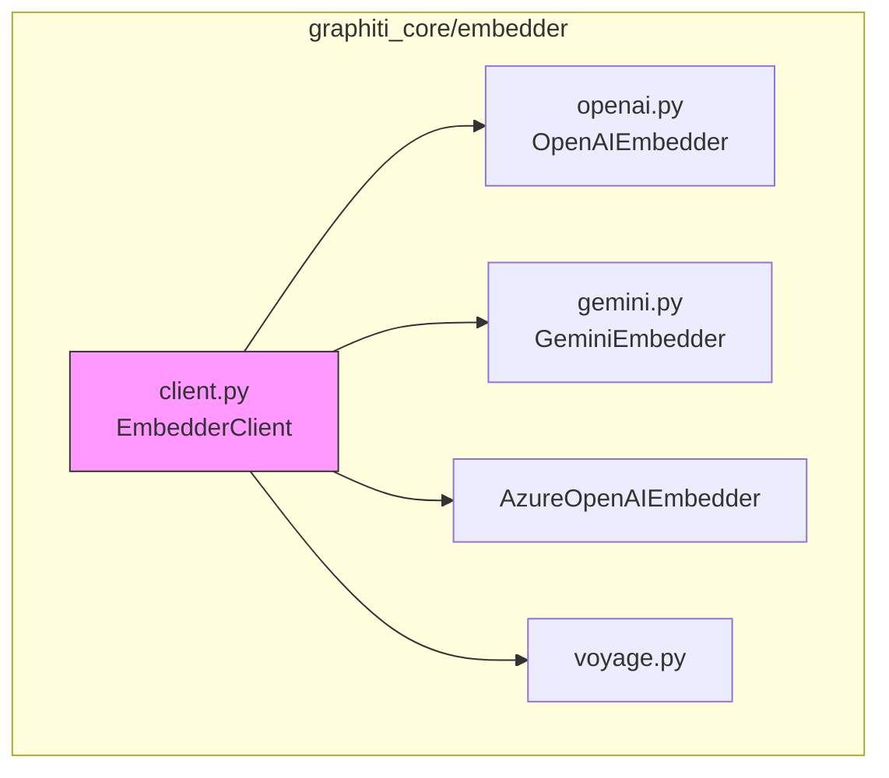
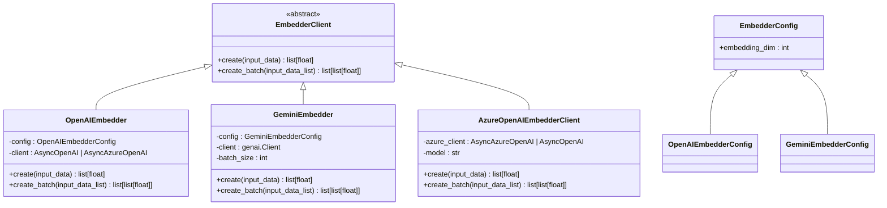
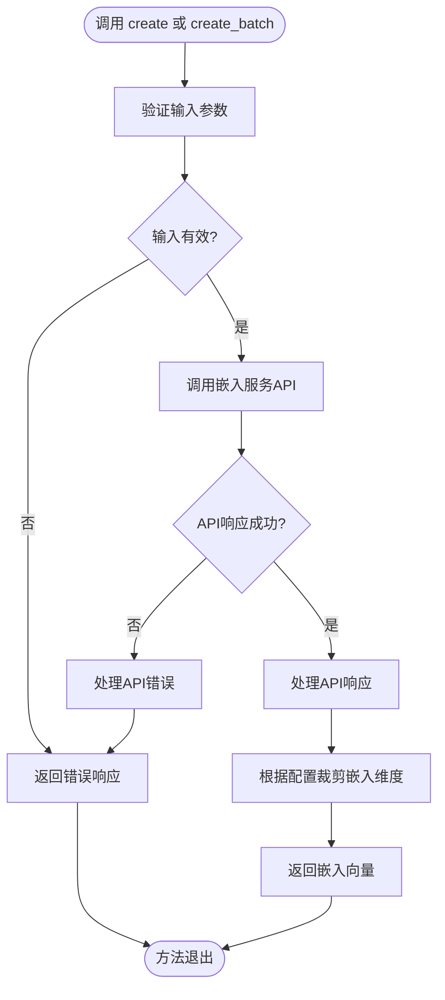
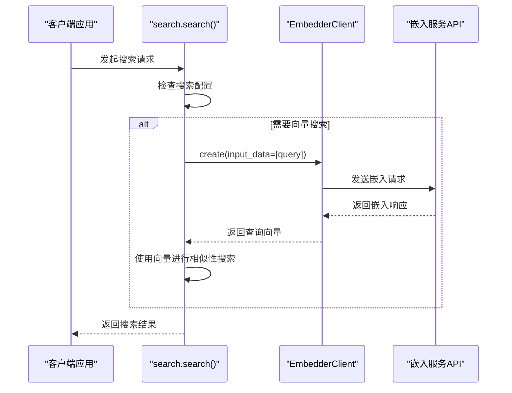
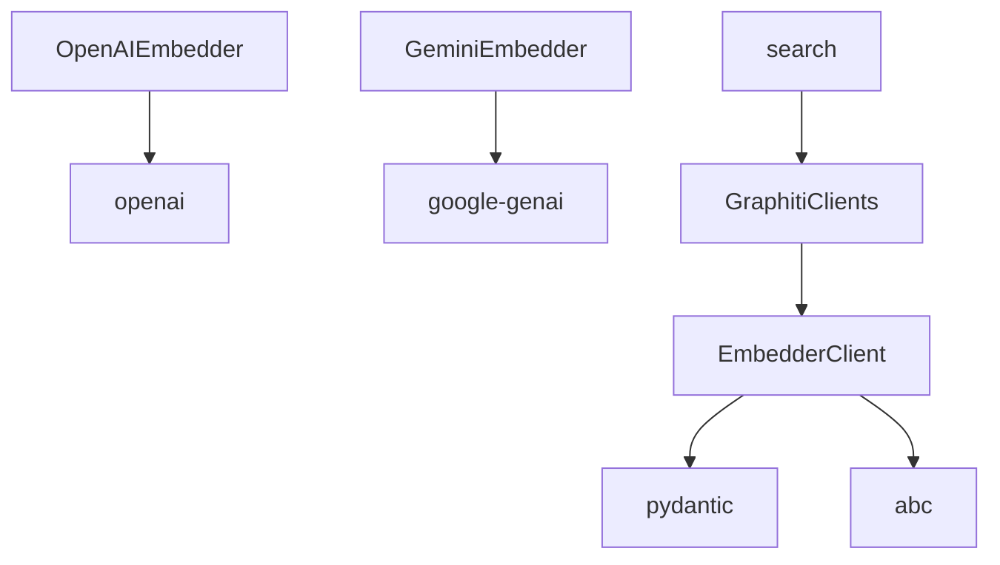

# 嵌入器客户端基类

<cite>
**本文档中引用的文件**  
- [client.py](file://graphiti_core/embedder/client.py)
- [openai.py](file://graphiti_core/embedder/openai.py)
- [gemini.py](file://graphiti_core/embedder/gemini.py)
- [azure_openai.py](file://graphiti_core/embedder/azure_openai.py)
- [search.py](file://graphiti_core/search/search.py)
- [graphiti_types.py](file://graphiti_core/graphiti_types.py)
- [utils.py](file://graphiti_core/llm_client/utils.py)
- [quickstart_neo4j.py](file://examples/quickstart/quickstart_neo4j.py)
</cite>

## 目录
1. [简介](#简介)
2. [项目结构](#项目结构)
3. [核心组件](#核心组件)
4. [架构概述](#架构概述)
5. [详细组件分析](#详细组件分析)
6. [依赖分析](#依赖分析)
7. [性能考虑](#性能考虑)
8. [故障排除指南](#故障排除指南)
9. [结论](#结论)

## 简介
`EmbedderClient` 是 Graphiti 系统中的一个抽象基类，旨在为所有嵌入服务提供商提供统一的接口。该基类定义了创建嵌入的核心契约，使系统能够无缝集成多种嵌入模型（如 OpenAI、Gemini、Azure OpenAI 等），同时保持一致的调用模式。它在语义搜索和知识图谱构建流程中扮演着关键角色，负责将文本内容转换为向量表示，以便进行相似性匹配和检索。

## 项目结构
`EmbedderClient` 类位于 `graphiti_core/embedder` 模块中，是整个嵌入服务的中心接口。该模块的结构设计清晰，遵循了依赖倒置原则，将抽象定义与具体实现分离。



**图源**
- [client.py](file://graphiti_core/embedder/client.py)
- [openai.py](file://graphiti_core/embedder/openai.py)
- [gemini.py](file://graphiti_core/embedder/gemini.py)
- [azure_openai.py](file://graphiti_core/embedder/azure_openai.py)
- [voyage.py](file://graphiti_core/embedder/voyage.py)

**节源**
- [client.py](file://graphiti_core/embedder/client.py)

## 核心组件
`EmbedderClient` 的核心在于其两个抽象方法：`create` 和 `create_batch`。`create` 方法用于生成单个输入的嵌入向量，而 `create_batch` 方法则用于高效地批量处理多个输入。此外，`EmbedderConfig` 类用于配置嵌入器的通用参数，如向量维度。

**节源**
- [client.py](file://graphiti_core/embedder/client.py#L26-L39)

## 架构概述
`EmbedderClient` 作为抽象基类，通过继承机制与具体的嵌入服务实现（如 `OpenAIEmbedder`、`GeminiEmbedder`）建立联系。这些具体实现类负责与各自的 API 进行通信，并处理特定于提供商的逻辑（如认证、错误处理）。`EmbedderClient` 实例通过 `GraphitiClients` 对象注入到系统的各个组件中，如搜索服务，从而在需要时被调用。



**图源**
- [client.py](file://graphiti_core/embedder/client.py#L30-L39)
- [openai.py](file://graphiti_core/embedder/openai.py#L33-L67)
- [gemini.py](file://graphiti_core/embedder/gemini.py#L50-L184)
- [azure_openai.py](file://graphiti_core/embedder/azure_openai.py#L27-L72)

## 详细组件分析

### EmbedderClient 抽象基类分析
`EmbedderClient` 类定义了所有嵌入服务必须遵循的接口契约。它是一个抽象基类（ABC），强制所有子类实现 `create` 方法。`create_batch` 方法虽然提供了默认的未实现抛出，但鼓励子类提供高效的批量处理实现。

#### 抽象方法契约
`create` 和 `create_batch` 方法的契约定义了它们在同步和批量场景下的预期行为。`create` 方法接受一个灵活的输入类型（字符串、字符串列表、整数可迭代对象等），并返回一个浮点数列表，即嵌入向量。`create_batch` 方法则专门用于处理字符串列表，返回一个嵌入向量的列表，从而优化了批量请求的性能。



**图源**
- [client.py](file://graphiti_core/embedder/client.py#L32-L38)
- [openai.py](file://graphiti_core/embedder/openai.py#L54-L67)
- [gemini.py](file://graphiti_core/embedder/gemini.py#L88-L184)

**节源**
- [client.py](file://graphiti_core/embedder/client.py#L30-L39)

### 与 Graphiti 核心系统的集成
`EmbedderClient` 在 Graphiti 核心系统中被深度集成，特别是在语义搜索流程中。当执行搜索时，如果搜索配置需要基于向量的相似性匹配（如余弦相似度），系统会使用 `EmbedderClient` 将查询文本转换为向量。

#### 调用时机
在 `search.py` 模块的 `search` 函数中，可以清晰地看到 `EmbedderClient` 的调用时机。当搜索配置中包含 `cosine_similarity` 方法或 `mmr` 重排序器时，系统会检查是否已提供查询向量。如果没有，则会调用 `embedder.create` 方法来生成查询的嵌入向量。



**图源**
- [search.py](file://graphiti_core/search/search.py#L103-L107)
- [client.py](file://graphiti_core/embedder/client.py#L32-L35)
- [utils.py](file://graphiti_core/llm_client/utils.py#L25-L34)

**节源**
- [search.py](file://graphiti_core/search/search.py#L68-L520)

### 实现新的嵌入服务提供商
要实现一个新的嵌入服务提供商，开发者需要创建一个继承自 `EmbedderClient` 的新类。该类必须实现 `create` 方法，并可以选择性地重写 `create_batch` 方法以提供更高效的批量处理。

#### 实现步骤
1.  **创建配置类**：从 `EmbedderConfig` 继承，定义特定于新提供商的配置参数（如 API 端点、模型名称）。
2.  **创建嵌入器类**：继承 `EmbedderClient`，在 `__init__` 方法中初始化配置和 API 客户端。
3.  **实现 create 方法**：编写与新提供商 API 交互的逻辑，处理请求和响应，并返回符合要求的嵌入向量。
4.  **实现 create_batch 方法**（可选）：提供批量处理逻辑，以提高性能。
5.  **处理异常和日志记录**：在方法中捕获 API 调用可能抛出的异常，并使用标准日志记录器记录错误信息。

#### 最佳实践
- **异常处理**：应捕获所有与网络请求和 API 调用相关的异常，并将其重新抛出，以便上层调用者处理。
- **日志记录**：使用 `logging.getLogger(__name__)` 获取日志记录器，并在关键操作（如 API 调用失败）时记录错误或警告信息。
- **输入处理**：确保 `create` 方法能够处理其契约中定义的各种输入类型。

**节源**
- [openai.py](file://graphiti_core/embedder/openai.py)
- [gemini.py](file://graphiti_core/embedder/gemini.py)
- [azure_openai.py](file://graphiti_core/embedder/azure_openai.py)

### 驱动层调用示例
以下示例展示了客户端代码如何通过 `Graphiti` 驱动层间接调用 `EmbedderClient`。在 `quickstart_neo4j.py` 示例中，当调用 `graphiti.search()` 方法时，底层会根据需要使用嵌入器。

```python
# 示例：在 quickstart_neo4j.py 中的调用流程
# 1. 用户发起搜索
results = await graphiti.search('Who was the California Attorney General?')

# 2. Graphiti 内部流程
#   - 检查搜索配置是否需要向量
#   - 如果需要，则通过 GraphitiClients 获取 embedder 实例
#   - 调用 embedder.create() 生成查询向量
#   - 使用向量执行向量搜索
```

**节源**
- [quickstart_neo4j.py](file://examples/quickstart/quickstart_neo4j.py#L140-L141)

## 依赖分析
`EmbedderClient` 与多个核心模块存在依赖关系。它依赖于 `pydantic` 进行配置模型的定义，依赖于 `abc` 模块实现抽象基类。具体的实现类则依赖于各自提供商的 SDK（如 `openai`、`google-genai`）。在系统层面，`GraphitiClients` 类依赖于 `EmbedderClient`，而 `search` 模块则依赖于 `GraphitiClients` 来获取嵌入器实例。



**图源**
- [client.py](file://graphiti_core/embedder/client.py)
- [openai.py](file://graphiti_core/embedder/openai.py)
- [gemini.py](file://graphiti_core/embedder/gemini.py)
- [graphiti_types.py](file://graphiti_core/graphiti_types.py#L26-L34)

**节源**
- [client.py](file://graphiti_core/embedder/client.py)
- [graphiti_types.py](file://graphiti_core/graphiti_types.py)

## 性能考虑
`create_batch` 方法的存在是性能优化的关键。相比于对每个输入单独调用 `create`，批量处理可以显著减少网络往返次数，从而提高整体吞吐量。例如，`GeminiEmbedder` 的 `create_batch` 实现会自动将大批次拆分为符合 API 限制的小批次，并在失败时优雅地降级到逐个处理。

## 故障排除指南
- **ImportError**：如果使用 `GeminiEmbedder` 时遇到 `ImportError`，请确保已安装 `google-genai` 包。
- **API 调用失败**：检查 API 密钥、模型名称和网络连接。查看日志以获取详细的错误信息。
- **空嵌入向量**：某些 API 可能在特定输入下返回空的嵌入向量，应在实现中进行检查并抛出适当的异常。

**节源**
- [gemini.py](file://graphiti_core/embedder/gemini.py#L25-L32)
- [azure_openai.py](file://graphiti_core/embedder/azure_openai.py#L57-L59)

## 结论
`EmbedderClient` 抽象基类是 Graphiti 系统中一个设计精良的核心组件。它通过定义清晰的接口契约，实现了对多种嵌入服务提供商的统一访问，极大地增强了系统的灵活性和可扩展性。其与搜索流程的深度集成确保了语义搜索功能的高效执行。通过遵循文档中概述的实现步骤和最佳实践，开发者可以轻松地将新的嵌入服务集成到 Graphiti 生态系统中。