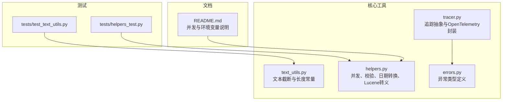
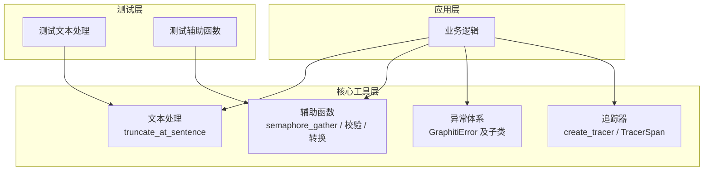
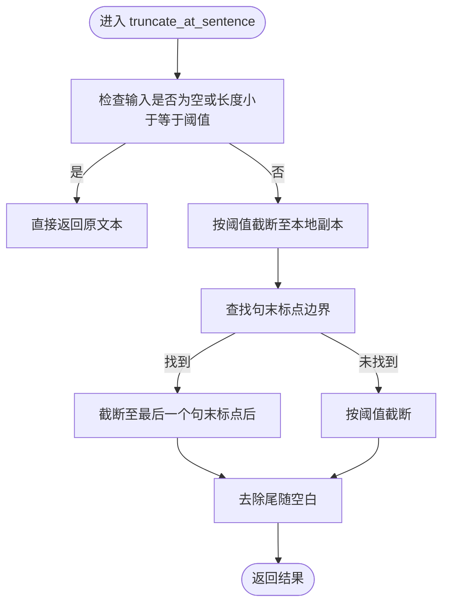
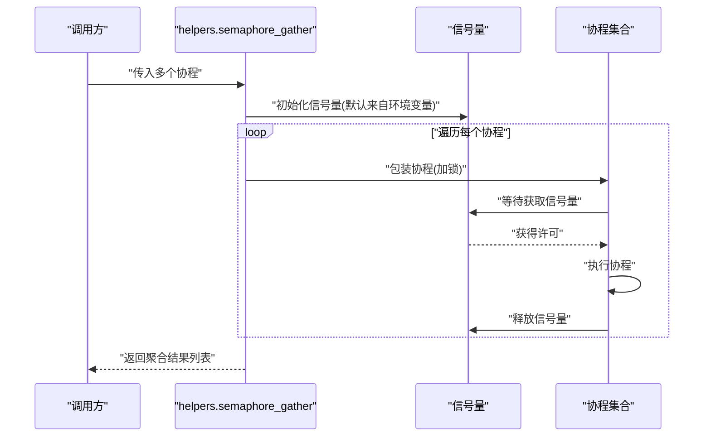
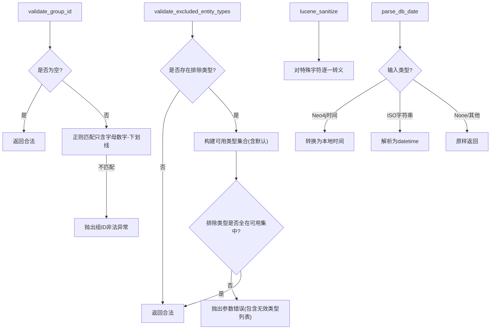
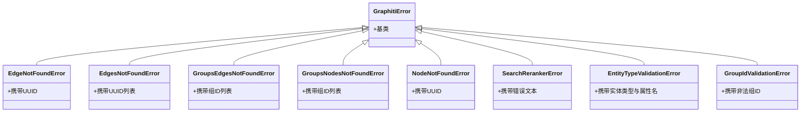
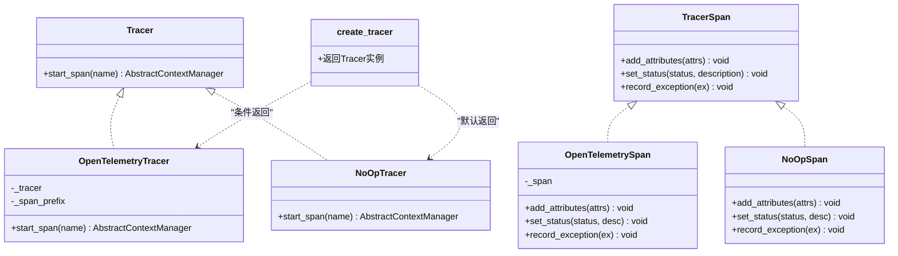
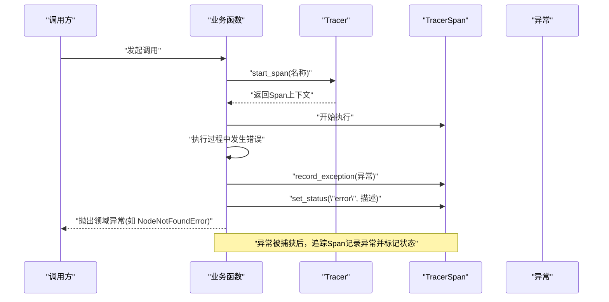
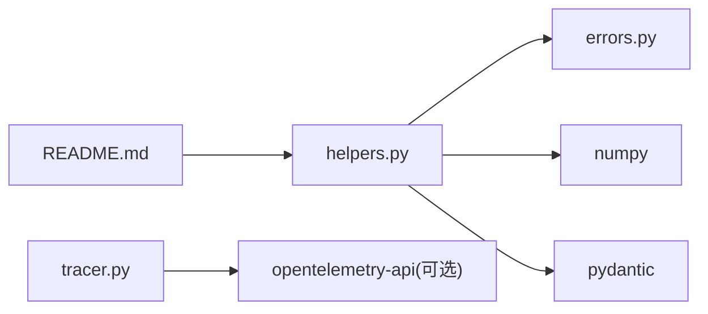

# 核心工具

<cite>
**本文引用的文件**
- [graphiti_core/utils/text_utils.py](file://graphiti_core/utils/text_utils.py)
- [graphiti_core/helpers.py](file://graphiti_core/helpers.py)
- [graphiti_core/errors.py](file://graphiti_core/errors.py)
- [graphiti_core/tracer.py](file://graphiti_core/tracer.py)
- [tests/test_text_utils.py](file://tests/test_text_utils.py)
- [tests/helpers_test.py](file://tests/helpers_test.py)
- [README.md](file://README.md)
</cite>

## 目录
1. [引言](#引言)
2. [项目结构](#项目结构)
3. [核心组件](#核心组件)
4. [架构总览](#架构总览)
5. [详细组件分析](#详细组件分析)
6. [依赖关系分析](#依赖关系分析)
7. [性能考量](#性能考量)
8. [故障排查指南](#故障排查指南)
9. [结论](#结论)
10. [附录：扩展与最佳实践](#附录扩展与最佳实践)

## 引言
本文件聚焦于Graphiti核心工具模块，系统化梳理以下关键能力：
- 文本处理与数据质量保障：通过文本截断与句子边界保留，确保摘要与日志等文本的可读性与完整性。
- 辅助函数与并发控制：提供基于信号量的并发收集器，限制协程并发度，避免资源争用与外部服务限流。
- 错误处理与可诊断性：定义分层异常体系，明确错误语义，便于定位问题与统一处理。
- 分布式追踪与可观测性：抽象出Tracer/TracerSpan接口，支持OpenTelemetry与无操作实现，保证在不同环境下均可平滑运行。

这些工具共同提升了系统的稳定性、可维护性与可观测性，并为高级用户提供了清晰的扩展点。

## 项目结构
围绕“核心工具”主题，相关文件分布如下：
- 文本处理：graphiti_core/utils/text_utils.py
- 辅助函数与并发：graphiti_core/helpers.py
- 自定义异常：graphiti_core/errors.py
- 分布式追踪：graphiti_core/tracer.py
- 测试覆盖：tests/test_text_utils.py、tests/helpers_test.py
- 环境变量与并发说明：README.md

图表来源
- [graphiti_core/utils/text_utils.py](file://graphiti_core/utils/text_utils.py#L1-L54)
- [graphiti_core/helpers.py](file://graphiti_core/helpers.py#L1-L177)
- [graphiti_core/errors.py](file://graphiti_core/errors.py#L1-L84)
- [graphiti_core/tracer.py](file://graphiti_core/tracer.py#L1-L194)
- [tests/test_text_utils.py](file://tests/test_text_utils.py#L1-L107)
- [tests/helpers_test.py](file://tests/helpers_test.py#L1-L314)
- [README.md](file://README.md#L226-L238)

章节来源
- [graphiti_core/utils/text_utils.py](file://graphiti_core/utils/text_utils.py#L1-L54)
- [graphiti_core/helpers.py](file://graphiti_core/helpers.py#L1-L177)
- [graphiti_core/errors.py](file://graphiti_core/errors.py#L1-L84)
- [graphiti_core/tracer.py](file://graphiti_core/tracer.py#L1-L194)
- [tests/test_text_utils.py](file://tests/test_text_utils.py#L1-L107)
- [tests/helpers_test.py](file://tests/helpers_test.py#L1-L314)
- [README.md](file://README.md#L226-L238)

## 核心组件
- 文本处理工具（text_utils.py）
  - 截断函数：按句子边界安全截断文本，避免在句中截断，确保输出可读性。
  - 常量：摘要最大字符数，用于统一摘要长度约束。
- 辅助函数（helpers.py）
  - 并发控制：基于信号量的gather封装，限制同时执行的协程数量，缓解外部限流与资源压力。
  - 校验与转换：组ID合法性校验、排除实体类型的合法性校验、数据库日期解析、默认组ID选择、Lucene查询转义。
  - 环境变量：并发上限、反射迭代次数、默认分页大小等。
- 自定义异常（errors.py）
  - 统一基类与领域异常：节点/边不存在、组内无节点/边、实体类型属性冲突、组ID非法等，提供清晰的错误消息。
- 分布式追踪（tracer.py）
  - 抽象接口：Tracer/TracerSpan，屏蔽底层实现差异。
  - 实现策略：OpenTelemetry封装与无操作实现，自动降级，不影响业务主流程。
  - 工厂函数：根据是否传入OTel实例返回相应Tracer，支持span名称前缀。

章节来源
- [graphiti_core/utils/text_utils.py](file://graphiti_core/utils/text_utils.py#L1-L54)
- [graphiti_core/helpers.py](file://graphiti_core/helpers.py#L1-L177)
- [graphiti_core/errors.py](file://graphiti_core/errors.py#L1-L84)
- [graphiti_core/tracer.py](file://graphiti_core/tracer.py#L1-L194)

## 架构总览
下图展示了核心工具在系统中的角色与交互关系，以及与测试的关联。

图表来源
- [graphiti_core/utils/text_utils.py](file://graphiti_core/utils/text_utils.py#L1-L54)
- [graphiti_core/helpers.py](file://graphiti_core/helpers.py#L1-L177)
- [graphiti_core/errors.py](file://graphiti_core/errors.py#L1-L84)
- [graphiti_core/tracer.py](file://graphiti_core/tracer.py#L1-L194)
- [tests/test_text_utils.py](file://tests/test_text_utils.py#L1-L107)
- [tests/helpers_test.py](file://tests/helpers_test.py#L1-L314)

## 详细组件分析

### 文本处理：truncate_at_sentence 与摘要长度常量
- 功能要点
  - 在不超过最大字符数的前提下，尽可能保留完整的句子边界，避免在句中截断。
  - 若超过范围但找不到句号/感叹号/问号边界，则退化到按字符数截断，并去除尾部空白。
  - 提供统一的最大摘要长度常量，便于跨模块一致地控制摘要长度。
- 复杂度与性能
  - 时间复杂度近似线性于输入长度；空间复杂度与结果长度相关。
  - 对于长文本，建议结合预切分或分段处理以降低单次处理成本。
- 使用场景
  - 摘要生成、日志截断、提示词长度控制等。

图表来源
- [graphiti_core/utils/text_utils.py](file://graphiti_core/utils/text_utils.py#L23-L54)

章节来源
- [graphiti_core/utils/text_utils.py](file://graphiti_core/utils/text_utils.py#L1-L54)
- [tests/test_text_utils.py](file://tests/test_text_utils.py#L1-L107)

### 辅助函数：semaphore_gather 与并发控制
- 功能要点
  - 基于信号量包装协程集合，限制同时执行的协程数量，默认从环境变量读取上限。
  - 适用于对外部服务（如LLM、嵌入服务）的批量请求，避免429/超载。
- 关键行为
  - 通过上下文管理器确保每个协程在进入时获取信号量，在退出时释放。
  - 与全局环境变量协同工作，便于在部署环境中灵活调整并发度。
- 性能与稳定性
  - 合理设置上限可显著降低外部限流风险，提高吞吐与稳定性。
  - 过高并发可能导致外部服务拒绝或内部资源耗尽，需结合实际压测调参。

图表来源
- [graphiti_core/helpers.py](file://graphiti_core/helpers.py#L105-L117)

章节来源
- [graphiti_core/helpers.py](file://graphiti_core/helpers.py#L1-L177)
- [README.md](file://README.md#L226-L238)
- [tests/helpers_test.py](file://tests/helpers_test.py#L177-L190)

### 校验与转换：组ID、排除实体类型、Lucene转义与日期解析
- 组ID校验
  - 仅允许ASCII字母数字、短横线与下划线，空字符串视为合法（默认组）。
  - 非法时抛出自定义异常，便于上层统一捕获与提示。
- 排除实体类型校验
  - 基于可用类型集合进行差集校验，若存在无效类型则抛出通用异常。
- Lucene转义
  - 对Lucene查询中的特殊字符进行转义，避免语法错误与意外匹配。
- 日期解析
  - 支持Neo4j时间类型与ISO字符串，统一为Python datetime对象，便于后续序列化与存储。

图表来源
- [graphiti_core/helpers.py](file://graphiti_core/helpers.py#L119-L177)
- [graphiti_core/errors.py](file://graphiti_core/errors.py#L1-L84)

章节来源
- [graphiti_core/helpers.py](file://graphiti_core/helpers.py#L1-L177)
- [graphiti_core/errors.py](file://graphiti_core/errors.py#L1-L84)
- [tests/helpers_test.py](file://tests/helpers_test.py#L177-L190)

### 错误处理：异常层次与语义
- 层次结构
  - 基类：GraphitiError
  - 领域异常：节点/边不存在、组内无节点/边、实体类型属性冲突、组ID非法、重排重器错误等
- 设计原则
  - 明确错误语义，便于上层分支处理与用户提示。
  - 保持异常消息可读且包含关键上下文（如UUID、组ID、无效类型列表）。
- 与追踪的配合
  - 在追踪Span中记录异常，有助于定位问题根因与传播路径。

图表来源
- [graphiti_core/errors.py](file://graphiti_core/errors.py#L1-L84)

章节来源
- [graphiti_core/errors.py](file://graphiti_core/errors.py#L1-L84)

### 分布式追踪：Tracer/TracerSpan 抽象与实现
- 抽象接口
  - Tracer：启动span的工厂方法
  - TracerSpan：添加属性、设置状态、记录异常
- 实现策略
  - OpenTelemetryTracer/OpenTelemetrySpan：桥接OTel，过滤None值与非原生类型，自动降级为OK/ERROR状态码。
  - NoOpTracer/NoOpSpan：在无OTel或失败时提供无侵扰实现，保证业务不中断。
- 工厂函数
  - create_tracer：根据是否提供OTel实例决定返回具体实现或NoOp实现；支持span名称前缀，便于聚合与检索。

图表来源
- [graphiti_core/tracer.py](file://graphiti_core/tracer.py#L33-L194)

章节来源
- [graphiti_core/tracer.py](file://graphiti_core/tracer.py#L1-L194)

### 错误处理与追踪流程（序列图）
该序列图展示典型错误发生与追踪记录的端到端流程，包括异常抛出、追踪Span记录与状态设置。

图表来源
- [graphiti_core/tracer.py](file://graphiti_core/tracer.py#L83-L124)
- [graphiti_core/errors.py](file://graphiti_core/errors.py#L1-L84)

## 依赖关系分析
- 内部耦合
  - helpers.py 依赖 errors.py 中的 GroupIdValidationError，用于组ID校验失败时抛出异常。
  - tracer.py 依赖 OpenTelemetry（可选），在不可用时回退至 NoOp 实现，避免强耦合。
- 外部依赖
  - numpy：向量归一化等数值计算。
  - pydantic：模型验证（在helpers中用于类型约束）。
  - opentelemetry-api：可选，用于分布式追踪。
- 环境变量
  - 并发上限、反射迭代次数、默认分页大小等，通过环境变量控制，便于在不同部署环境间切换。

图表来源
- [graphiti_core/helpers.py](file://graphiti_core/helpers.py#L1-L177)
- [graphiti_core/tracer.py](file://graphiti_core/tracer.py#L1-L194)
- [README.md](file://README.md#L226-L238)

章节来源
- [graphiti_core/helpers.py](file://graphiti_core/helpers.py#L1-L177)
- [graphiti_core/tracer.py](file://graphiti_core/tracer.py#L1-L194)
- [README.md](file://README.md#L226-L238)

## 性能考量
- 并发控制
  - 通过信号量限制协程数量，避免外部服务限流与资源争用；默认值可通过环境变量调整。
- 文本截断
  - 句子边界优先策略减少无效截断，提升可读性；对超长文本建议分段处理。
- 追踪开销
  - OpenTelemetrySpan对属性进行类型过滤与异常静默处理，避免追踪成为性能瓶颈。
- 稳定性
  - NoOp实现确保在追踪不可用时业务不受影响；异常消息包含关键上下文，便于快速定位。

[本节为通用性能讨论，无需特定文件来源]

## 故障排查指南
- 组ID非法
  - 症状：抛出组ID非法异常。
  - 排查：确认组ID仅包含字母数字、短横线与下划线；空字符串为默认组。
  - 参考
    - [graphiti_core/helpers.py](file://graphiti_core/helpers.py#L119-L143)
    - [graphiti_core/errors.py](file://graphiti_core/errors.py#L78-L84)
- 排除实体类型无效
  - 症状：抛出参数错误，包含无效类型列表。
  - 排查：核对可用实体类型集合（含默认Entity）；修正后重试。
  - 参考
    - [graphiti_core/helpers.py](file://graphiti_core/helpers.py#L145-L177)
- Lucene查询异常
  - 症状：查询结果不符合预期或报错。
  - 排查：使用Lucene转义函数处理特殊字符；确认查询字符串已正确转义。
  - 参考
    - [graphiti_core/helpers.py](file://graphiti_core/helpers.py#L62-L96)
    - [tests/helpers_test.py](file://tests/helpers_test.py#L177-L190)
- 并发过高导致限流
  - 症状：外部服务返回429或延迟飙升。
  - 排查：降低SEMAPHORE_LIMIT；结合压测逐步调优。
  - 参考
    - [README.md](file://README.md#L226-L238)
    - [graphiti_core/helpers.py](file://graphiti_core/helpers.py#L105-L117)
- 追踪失效或异常
  - 症状：追踪无输出或报导入错误。
  - 排查：安装OpenTelemetry；或使用NoOpTracer；检查span前缀与名称。
  - 参考
    - [graphiti_core/tracer.py](file://graphiti_core/tracer.py#L126-L194)

章节来源
- [graphiti_core/helpers.py](file://graphiti_core/helpers.py#L62-L177)
- [graphiti_core/errors.py](file://graphiti_core/errors.py#L1-L84)
- [tests/helpers_test.py](file://tests/helpers_test.py#L177-L190)
- [README.md](file://README.md#L226-L238)
- [graphiti_core/tracer.py](file://graphiti_core/tracer.py#L126-L194)

## 结论
- 文本处理工具确保摘要与日志的可读性与一致性。
- 辅助函数提供稳健的并发控制与数据校验，有效降低外部限流与数据错误风险。
- 自定义异常体系清晰表达错误语义，便于统一处理与用户反馈。
- 分布式追踪抽象支持在不同环境下无缝启用或降级，兼顾可观测性与稳定性。
这些能力共同提升了Graphiti核心工具的可靠性与可维护性，为上层业务提供坚实基础。

[本节为总结性内容，无需特定文件来源]

## 附录：扩展与最佳实践
- 扩展文本处理
  - 新增更复杂的截断策略（如按段落、按关键词边界）时，建议保持与现有接口兼容，并补充单元测试。
  - 参考
    - [graphiti_core/utils/text_utils.py](file://graphiti_core/utils/text_utils.py#L23-L54)
    - [tests/test_text_utils.py](file://tests/test_text_utils.py#L1-L107)
- 扩展并发控制
  - 在需要更细粒度的并发策略时，可在semaphore_gather基础上增加重试、熔断或队列化机制。
  - 参考
    - [graphiti_core/helpers.py](file://graphiti_core/helpers.py#L105-L117)
    - [README.md](file://README.md#L226-L238)
- 扩展异常体系
  - 新增领域异常时，遵循现有命名与消息格式，确保与追踪记录一致。
  - 参考
    - [graphiti_core/errors.py](file://graphiti_core/errors.py#L1-L84)
- 扩展追踪
  - 在已有Tracer/TracerSpan抽象下新增实现（如自定义后端），只需实现相同接口即可无缝替换。
  - 参考
    - [graphiti_core/tracer.py](file://graphiti_core/tracer.py#L33-L124)

[本节为扩展性建议，无需特定文件来源]