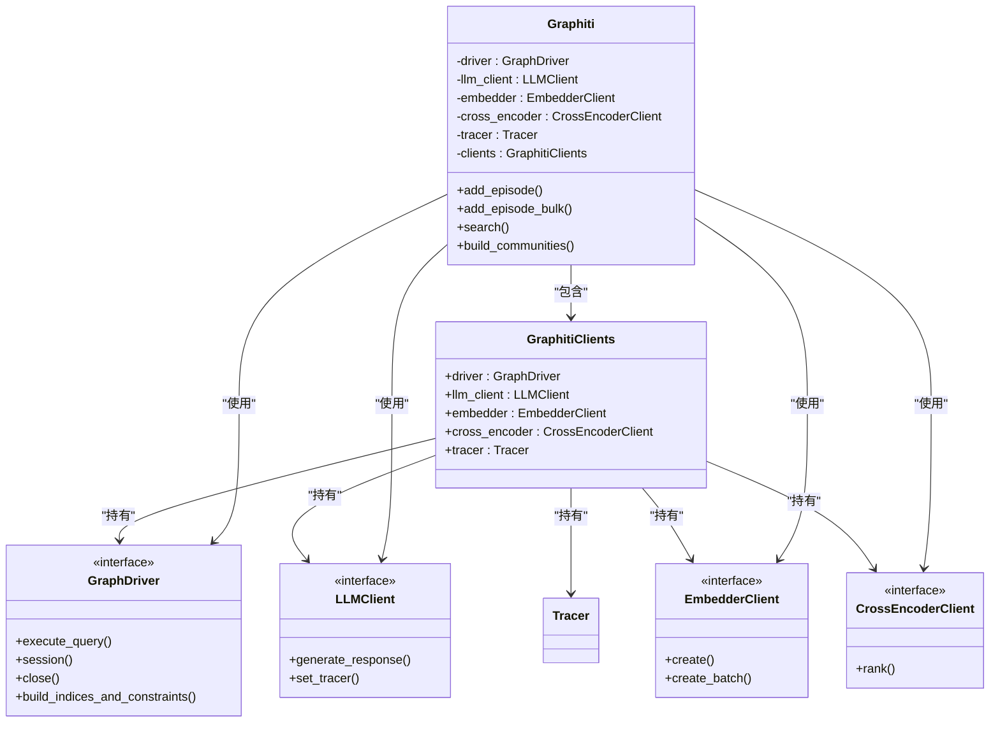
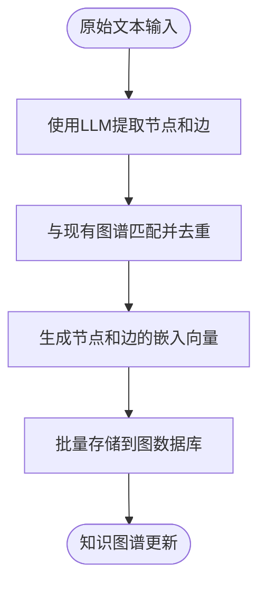
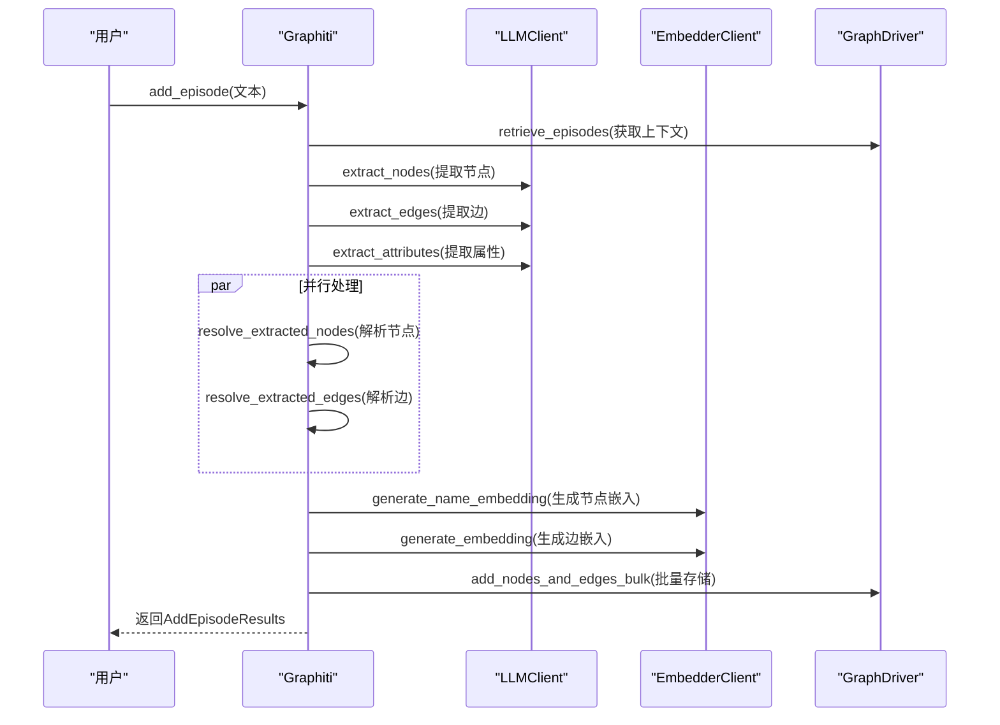

# 核心架构

<cite>
**本文档引用的文件**   
- [graphiti.py](file://graphiti_core/graphiti.py)
- [errors.py](file://graphiti_core/errors.py)
- [graphiti_types.py](file://graphiti_core/graphiti_types.py)
- [nodes.py](file://graphiti_core/nodes.py)
- [edges.py](file://graphiti_core/edges.py)
- [driver.py](file://graphiti_core/driver/driver.py)
- [client.py](file://graphiti_core/embedder/client.py)
- [client.py](file://graphiti_core/llm_client/client.py)
- [client.py](file://graphiti_core/cross_encoder/client.py)
- [helpers.py](file://graphiti_core/helpers.py)
- [text_utils.py](file://graphiti_core/utils/text_utils.py)
</cite>

## 目录
1. [简介](#简介)
2. [核心组件](#核心组件)
3. [依赖注入与协调中心](#依赖注入与协调中心)
4. [数据处理流水线](#数据处理流水线)
5. [核心组件调用关系](#核心组件调用关系)
6. [错误处理机制](#错误处理机制)
7. [性能优化策略](#性能优化策略)
8. [配置选项与扩展点](#配置选项与扩展点)

## 简介
Graphiti是一个基于知识图谱的框架，其核心设计围绕`Graphiti`类展开，该类作为系统的协调中心，通过依赖注入整合了图数据库驱动、LLM客户端、嵌入器和交叉编码器等关键组件。本文档深入解析Graphiti的核心架构，详细说明其如何协调各组件完成从原始文本输入到知识图谱构建的完整流程。

## 核心组件

Graphiti框架由多个核心组件构成，这些组件协同工作以实现知识图谱的构建与查询功能。`Graphiti`类作为主要协调者，负责管理`GraphDriver`（图数据库驱动）、`LLMClient`（大语言模型客户端）、`EmbedderClient`（嵌入器）和`CrossEncoderClient`（交叉编码器）等依赖。数据模型包括`EpisodicNode`（情景节点）、`EntityNode`（实体节点）、`CommunityNode`（社区节点）以及`EntityEdge`（实体边）、`EpisodicEdge`（情景边）和`CommunityEdge`（社区边）等关系类型。系统通过`add_episode`方法处理原始文本输入，提取节点和边，生成嵌入，并存储到图数据库中。

**Section sources**
- [graphiti.py](file://graphiti_core/graphiti.py#L128-L1264)
- [nodes.py](file://graphiti_core/nodes.py#L87-L807)
- [edges.py](file://graphiti_core/edges.py#L45-L632)

## 依赖注入与协调中心

`Graphiti`类的设计核心是依赖注入模式，它在初始化时接收或创建各个客户端组件，从而实现松耦合和高可测试性。`GraphitiClients`数据结构作为容器，封装了所有外部服务的客户端实例，包括驱动、LLM、嵌入器、交叉编码器和追踪器。这种设计使得`Graphiti`能够灵活地替换不同提供商的实现，例如使用`OpenAIClient`或`AnthropicClient`作为LLM客户端，或使用`Neo4jDriver`或`FalkorDBDriver`作为图数据库驱动。

**Diagram sources **
- [graphiti.py](file://graphiti_core/graphiti.py#L128-L232)
- [graphiti_types.py](file://graphiti_core/graphiti_types.py#L26-L34)
- [driver.py](file://graphiti_core/driver/driver.py#L73-L116)
- [client.py](file://graphiti_core/llm_client/client.py#L66-L243)
- [client.py](file://graphiti_core/embedder/client.py#L30-L39)
- [client.py](file://graphiti_core/cross_encoder/client.py#L20-L41)

## 数据处理流水线

Graphiti的数据处理流水线始于`add_episode`方法，该方法接收原始文本输入并将其转化为知识图谱中的结构化数据。流程首先通过`extract_nodes`和`extract_edges`函数利用LLM从文本中提取实体和关系。接着，`resolve_extracted_nodes`和`resolve_extracted_edges`函数将提取出的节点和边与图数据库中已存在的数据进行匹配和去重。然后，`EmbedderClient`为节点名称和边事实生成嵌入向量。最后，`add_nodes_and_edges_bulk`函数将处理后的节点、边及其嵌入批量存储到图数据库中。

**Diagram sources **
- [graphiti.py](file://graphiti_core/graphiti.py#L615-L819)
- [utils/maintenance/node_operations.py](file://graphiti_core/utils/maintenance/node_operations.py)
- [utils/maintenance/edge_operations.py](file://graphiti_core/utils/maintenance/edge_operations.py)
- [utils/bulk_utils.py](file://graphiti_core/utils/bulk_utils.py)

## 核心组件调用关系

`add_episode`方法的内部执行流清晰地展示了核心组件间的调用关系。该方法首先检索上下文中的先前情景，然后并行执行节点提取与解析、边提取与解析以及节点属性提取等任务。整个流程被包裹在OpenTelemetry追踪范围内，以监控性能。`Graphiti`类通过`clients`对象将`LLMClient`、`EmbedderClient`等传递给底层的工具函数，确保了依赖的一致性。

**Diagram sources **
- [graphiti.py](file://graphiti_core/graphiti.py#L615-L819)
- [utils/maintenance/node_operations.py](file://graphiti_core/utils/maintenance/node_operations.py)
- [utils/maintenance/edge_operations.py](file://graphiti_core/utils/maintenance/edge_operations.py)
- [nodes.py](file://graphiti_core/nodes.py#L442-L449)
- [edges.py](file://graphiti_core/edges.py#L242-L251)

## 错误处理机制

Graphiti框架定义了一套清晰的错误处理机制，位于`errors.py`文件中。所有自定义异常均继承自基类`GraphitiError`。具体异常包括`NodeNotFoundError`（节点未找到）、`EdgeNotFoundError`（边未找到）、`GroupsNodesNotFoundError`（指定组内无节点）等，这些异常在数据检索失败时被抛出。此外，`EntityTypeValidationError`和`GroupIdValidationError`用于验证用户输入的实体类型和组ID的有效性。在`add_episode`等核心方法中，使用了try-catch块捕获异常，并通过OpenTelemetry记录错误信息，确保了系统的健壮性和可观测性。

**Section sources**
- [errors.py](file://graphiti_core/errors.py#L18-L84)
- [graphiti.py](file://graphiti_core/graphiti.py#L821-L824)

## 性能优化策略

Graphiti采用了多种性能优化策略。首先，通过`semaphore_gather`函数限制并发协程的数量，防止资源耗尽。其次，大量使用异步操作（async/await）以提高I/O密集型任务的效率，如数据库查询和API调用。在批量操作中，如`add_episode_bulk`，系统会一次性处理多个情景，减少数据库连接开销。此外，LLM客户端支持响应缓存，避免对相同提示的重复调用。最后，`build_indices_and_constraints`方法用于在数据库上创建索引和约束，以加速后续的查询操作。

**Section sources**
- [helpers.py](file://graphiti_core/helpers.py#L106-L117)
- [graphiti.py](file://graphiti_core/graphiti.py#L826-L1012)
- [llm_client/client.py](file://graphiti_core/llm_client/client.py#L77-L82)
- [driver/driver.py](file://graphiti_core/driver/driver.py#L110-L111)

## 配置选项与扩展点

高级用户可以通过多种方式配置和扩展Graphiti。在初始化`Graphiti`实例时，可以传入自定义的`LLMClient`、`EmbedderClient`等，以使用不同的服务提供商。`add_episode`方法支持通过`entity_types`和`edge_types`参数定义自定义的Pydantic模型，从而扩展图谱的本体结构。`search_`方法提供了高级搜索功能，支持通过`SearchConfig`定制搜索策略。此外，系统通过环境变量（如`SEMAPHORE_LIMIT`、`EMBEDDING_DIM`）暴露了多个配置选项，允许用户根据部署环境调整性能参数。

**Section sources**
- [graphiti.py](file://graphiti_core/graphiti.py#L129-L236)
- [graphiti.py](file://graphiti_core/graphiti.py#L615-L630)
- [search/search_config.py](file://graphiti_core/search/search_config.py)
- [helpers.py](file://graphiti_core/helpers.py#L35-L39)
- [embedder/client.py](file://graphiti_core/embedder/client.py#L23)