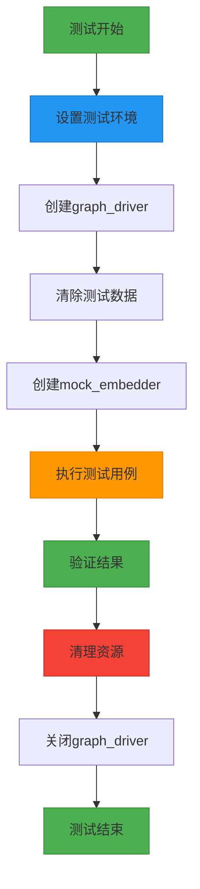
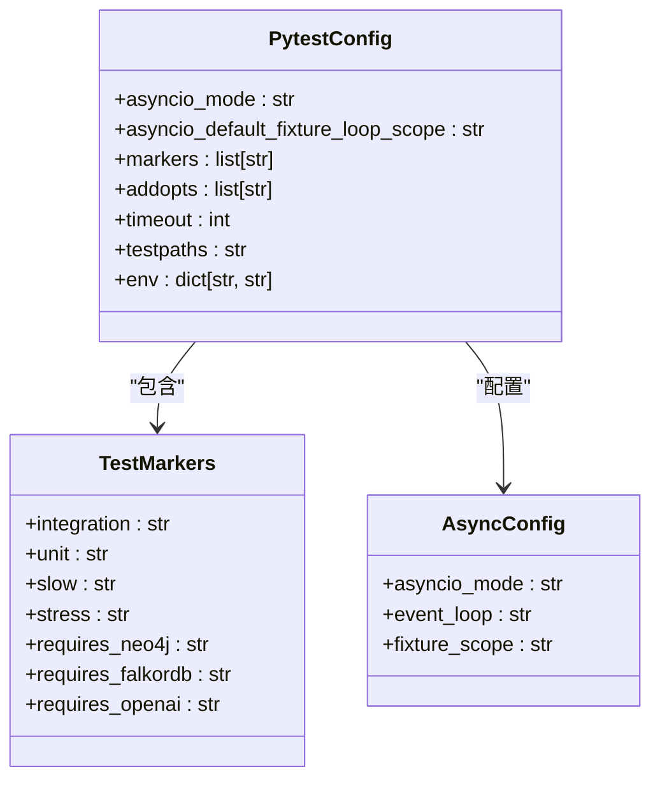
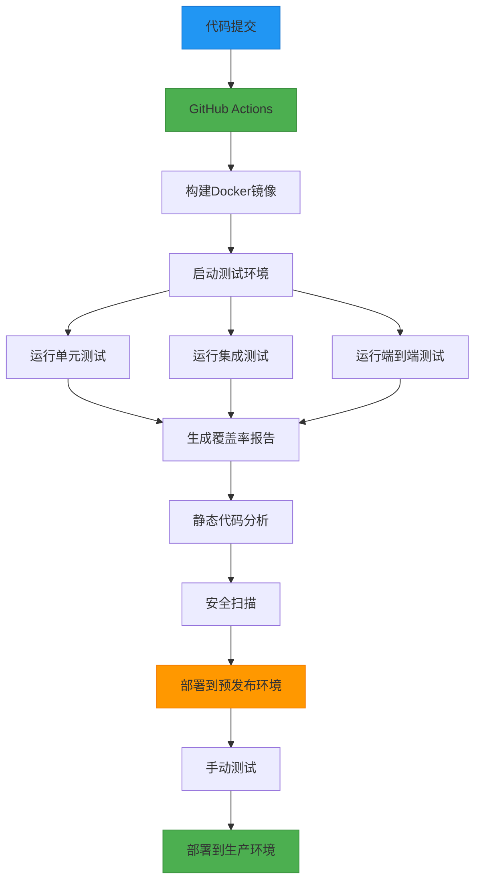

# 测试策略

<cite>
**本文档中引用的文件**  
- [conftest.py](file://conftest.py)
- [pytest.ini](file://pytest.ini)
- [helpers_test.py](file://tests/helpers_test.py)
- [test_graphiti_mock.py](file://tests/test_graphiti_mock.py)
- [test_graphiti_int.py](file://tests/test_graphiti_int.py)
- [test_node_int.py](file://tests/test_node_int.py)
- [test_edge_int.py](file://tests/test_edge_int.py)
- [mcp_server/tests/conftest.py](file://mcp_server/tests/conftest.py)
- [mcp_server/tests/pytest.ini](file://mcp_server/tests/pytest.ini)
- [mcp_server/tests/test_integration.py](file://mcp_server/tests/test_integration.py)
</cite>

## 目录
1. [测试方法论](#测试方法论)
2. [测试夹具](#测试夹具)
3. [Pytest配置](#pytest配置)
4. [测试运行命令](#测试运行命令)
5. [测试覆盖率与CI/CD](#测试覆盖率与cicd)

## 测试方法论

Graphiti项目采用分层测试策略，包含单元测试、集成测试和端到端测试三个层次，确保代码质量和系统稳定性。

**单元测试**：在`tests/`目录下，针对核心功能模块进行隔离测试。例如，`test_node_int.py`和`test_edge_int.py`文件中的测试用例验证了节点和边的创建、检索和删除功能。这些测试使用模拟的嵌入模型和驱动程序，确保每个组件在隔离环境中按预期工作。

**集成测试**：使用`integration`标记来标识集成测试，这些测试在`pytest.ini`文件中定义。例如，`test_graphiti_int.py`文件中的测试用例验证了Graphiti核心功能与图数据库的集成。这些测试确保不同组件之间的交互按预期工作。

**端到端测试**：在`mcp_server/tests/`目录下，`test_integration.py`文件实现了HTTP/SSE集成测试，模拟客户端与服务器的完整交互流程。这些测试验证了从内存添加到搜索功能的完整端到端流程，确保系统在真实使用场景下的正确性。

**Section sources**
- [pytest.ini](file://pytest.ini#L1-L6)
- [test_graphiti_int.py](file://tests/test_graphiti_int.py#L1-L81)
- [mcp_server/tests/test_integration.py](file://mcp_server/tests/test_integration.py#L1-L365)

## 测试夹具

测试环境通过`conftest.py`文件中的夹具进行设置，这些夹具为测试提供了必要的依赖和配置。

`graph_driver`夹具是核心测试夹具，它根据环境变量动态创建不同类型的图数据库驱动程序（Neo4j、FalkorDB、Kuzu等）。该夹具使用参数化测试，允许在不同数据库提供者之间运行相同的测试用例。在测试开始前，它会清除测试数据，在测试结束后关闭驱动程序连接。

`mock_embedder`夹具创建了一个模拟的嵌入模型，用于替代真实的AI模型服务。该夹具使用`unittest.mock.Mock`对象，预定义了嵌入向量的返回值，确保测试的可重复性和速度。当调用`create`方法时，它会根据输入文本返回预设的嵌入向量，避免了对实际AI服务的依赖。

在MCP服务器测试中，`config`夹具提供了默认的`GraphitiConfig`配置对象，用于测试服务器的配置加载和处理逻辑。



**Diagram sources**
- [conftest.py](file://conftest.py#L1-L11)
- [helpers_test.py](file://tests/helpers_test.py#L116-L127)
- [helpers_test.py](file://tests/helpers_test.py#L160-L174)

**Section sources**
- [conftest.py](file://conftest.py#L1-L11)
- [helpers_test.py](file://tests/helpers_test.py#L116-L174)
- [mcp_server/tests/conftest.py](file://mcp_server/tests/conftest.py#L1-L22)

## Pytest配置

Pytest配置在`pytest.ini`文件中定义，包含异步支持和标记系统等关键设置。

异步测试通过`asyncio_mode = auto`配置启用，这使得测试可以使用`@pytest.mark.asyncio`装饰器来运行异步测试函数。`asyncio_default_fixture_loop_scope = function`设置确保每个测试函数都有独立的事件循环作用域，防止测试之间的状态污染。

标记系统在`markers`部分定义，其中`integration`标记用于标识集成测试。这允许通过命令行参数选择性地运行特定类型的测试。例如，可以使用`-m integration`运行所有集成测试，或使用`-m "not integration"`排除集成测试。

在MCP服务器的`pytest.ini`文件中，还定义了其他标记如`slow`、`unit`、`stress`等，提供了更细粒度的测试分类。此外，还配置了测试超时、覆盖率路径和环境变量等选项。



**Diagram sources**
- [pytest.ini](file://pytest.ini#L1-L6)
- [mcp_server/tests/pytest.ini](file://mcp_server/tests/pytest.ini#L1-L39)

**Section sources**
- [pytest.ini](file://pytest.ini#L1-L6)
- [mcp_server/tests/pytest.ini](file://mcp_server/tests/pytest.ini#L1-L39)

## 测试运行命令

可以通过不同的命令运行特定的测试套件，利用Pytest的标记系统和文件过滤功能。

要运行所有集成测试，使用以下命令：
```bash
pytest -m integration
```

要运行特定模块的测试，如节点相关的集成测试：
```bash
pytest tests/test_node_int.py
```

要运行MCP服务器的所有测试：
```bash
cd mcp_server && pytest tests/
```

要运行特定类型的测试，如仅运行单元测试：
```bash
pytest -m unit
```

在开发过程中，可以使用`-v`（详细输出）和`-s`（显示打印输出）选项来获取更多调试信息：
```bash
pytest -v -s tests/test_graphiti_mock.py
```

对于端到端测试，需要先启动服务器，然后运行集成测试：
```bash
# 在一个终端启动服务器
python mcp_server/main.py --transport sse

# 在另一个终端运行测试
pytest mcp_server/tests/test_integration.py
```

**Section sources**
- [pytest.ini](file://pytest.ini#L1-L6)
- [mcp_server/tests/pytest.ini](file://mcp_server/tests/pytest.ini#L1-L39)
- [mcp_server/tests/test_integration.py](file://mcp_server/tests/test_integration.py#L1-L365)

## 测试覆盖率与CI/CD

测试策略包括明确的覆盖率目标和CI/CD集成最佳实践，确保代码质量和持续交付。

在CI/CD流程中，使用`docker-compose.test.yml`文件定义测试环境，包含Graphiti服务和Neo4j数据库。GitHub Actions工作流会构建Docker镜像，启动测试环境，并运行测试套件。健康检查确保服务在测试前已正确启动。

测试覆盖率目标应达到80%以上，重点关注核心功能模块如图操作、节点和边的管理、搜索功能等。通过`pytest-cov`插件生成覆盖率报告，并在CI流程中进行检查。

最佳实践包括：
1. 在提交代码前运行本地测试，确保不破坏现有功能
2. 使用参数化测试覆盖不同数据库提供者
3. 为新功能编写相应的测试用例
4. 定期审查和更新测试用例，确保与代码同步
5. 在CI流程中运行静态代码分析和安全扫描



**Diagram sources**
- [docker-compose.test.yml](file://docker-compose.test.yml#L1-L40)

**Section sources**
- [docker-compose.test.yml](file://docker-compose.test.yml#L1-L40)