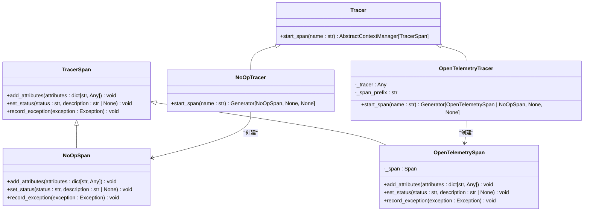
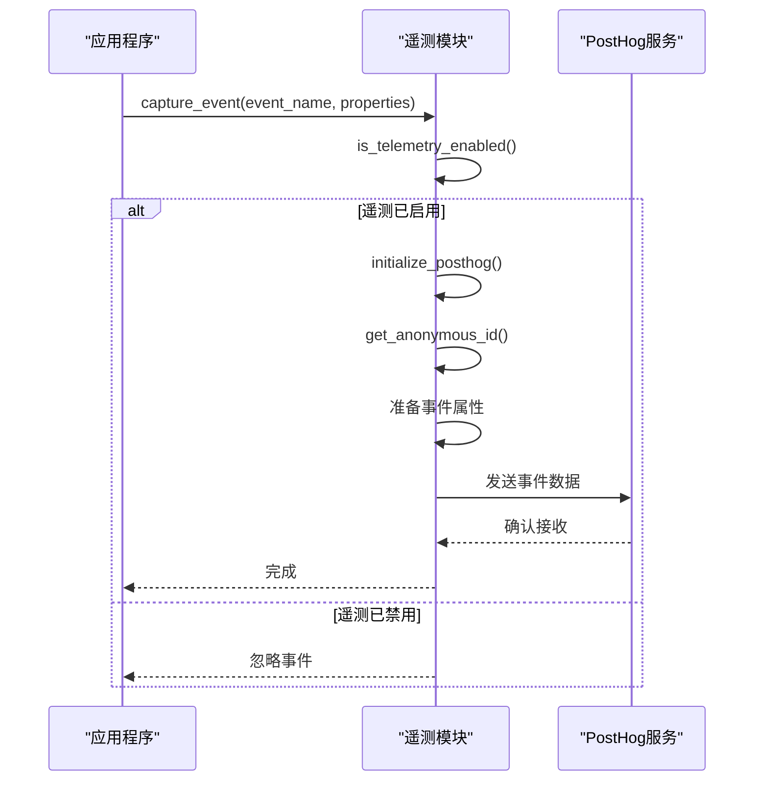
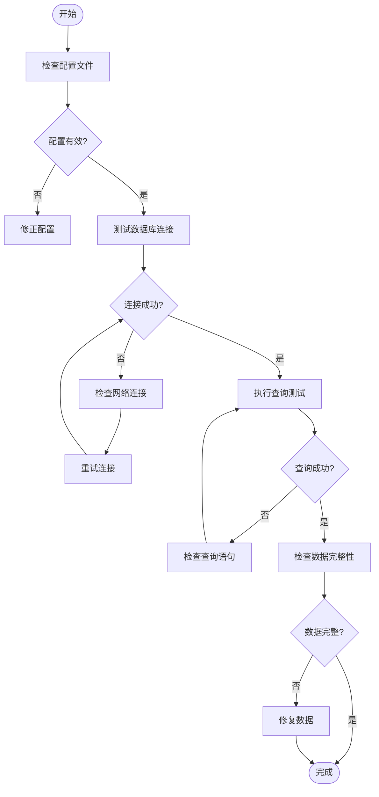
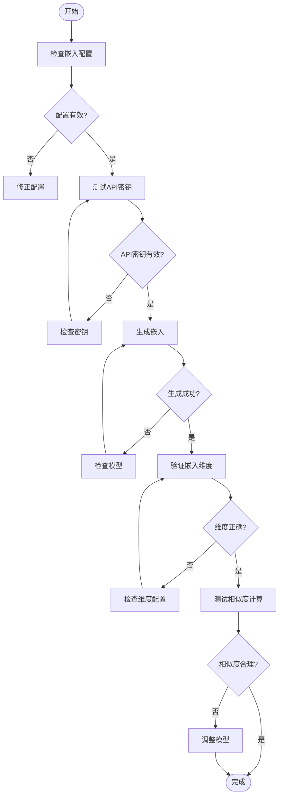
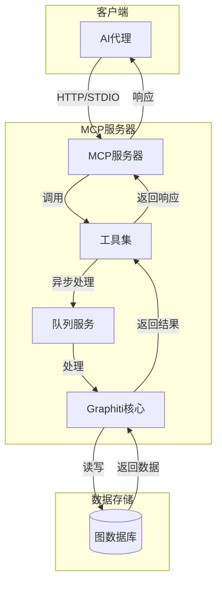
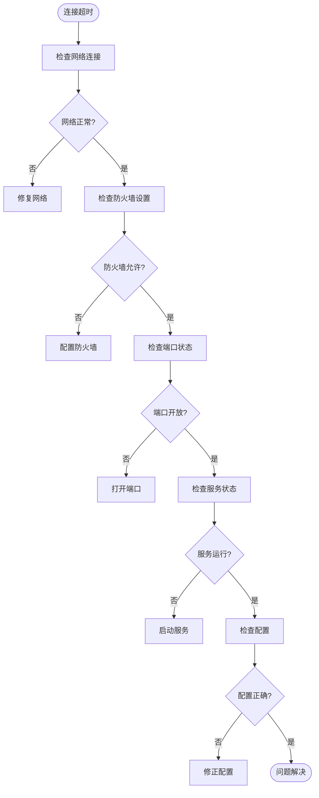
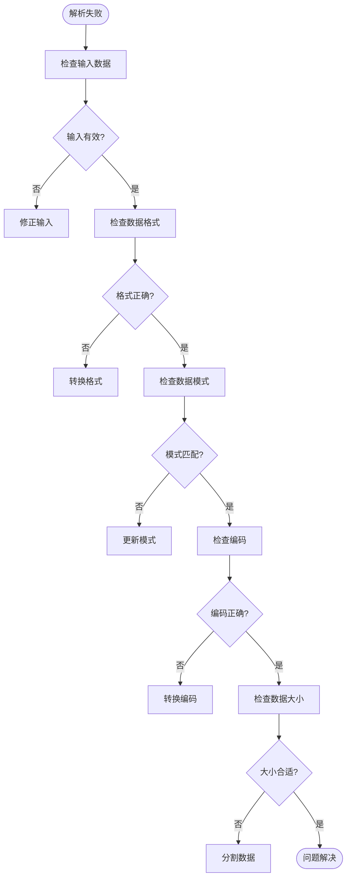
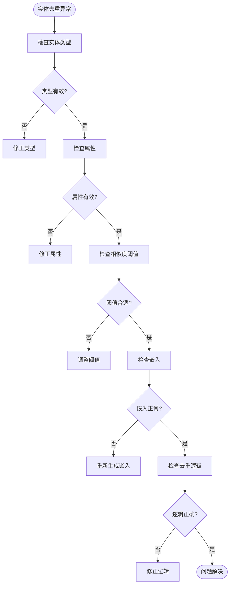
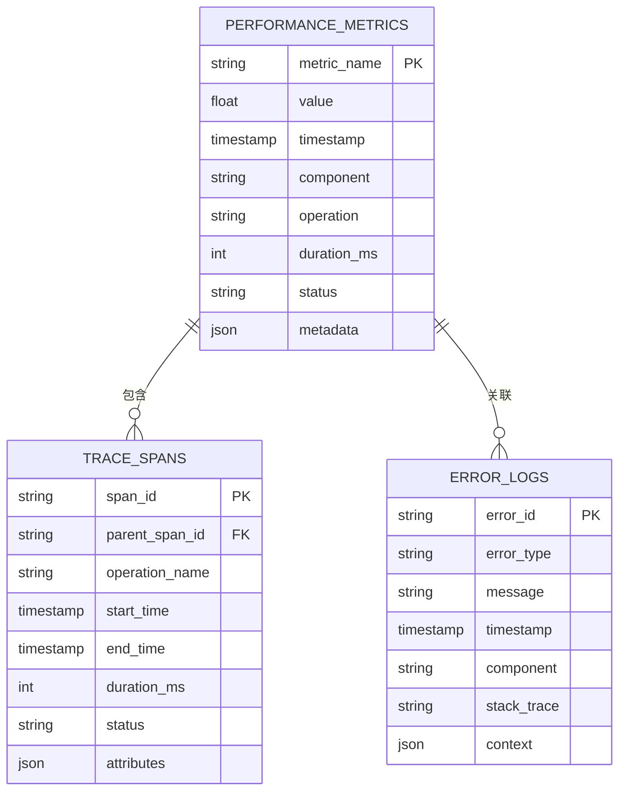

# 调试指南

<cite>
**本文档中引用的文件**   
- [tracer.py](file://graphiti_core/tracer.py)
- [telemetry.py](file://graphiti_core/telemetry/telemetry.py)
- [graphiti.py](file://graphiti_core/graphiti.py)
- [graphiti_mcp_server.py](file://mcp_server/src/graphiti_mcp_server.py)
- [errors.py](file://graphiti_core/errors.py)
- [config.yaml](file://mcp_server/config/config.yaml)
</cite>

## 目录
1. [简介](#简介)
2. [启用跟踪功能](#启用跟踪功能)
3. [使用遥测模块](#使用遥测模块)
4. [检查图数据库状态](#检查图数据库状态)
5. [验证嵌入生成](#验证嵌入生成)
6. [分析MCP服务器通信](#分析mcp服务器通信)
7. [常见错误排查](#常见错误排查)
8. [日志级别控制](#日志级别控制)
9. [性能剖析工具](#性能剖析工具)
10. [附录](#附录)

## 简介
本调试指南旨在帮助开发者诊断和解决Graphiti系统中的问题。我们将详细介绍如何使用系统提供的各种调试工具和技术，包括跟踪功能、遥测收集、数据库状态检查等。通过本指南，开发者可以更好地理解系统内部工作原理，快速定位和解决各种问题。

**Section sources**
- [graphiti_mcp_server.py](file://mcp_server/src/graphiti_mcp_server.py#L1-L100)
- [graphiti.py](file://graphiti_core/graphiti.py#L1-L50)

## 启用跟踪功能
Graphiti系统提供了强大的跟踪功能，通过`tracer.py`模块实现，用于监控LLM调用和图操作。跟踪功能基于OpenTelemetry标准，可以将跟踪数据输出到各种后端。

### 配置OpenTelemetry跟踪
要启用跟踪功能，需要在初始化Graphiti实例时传入OpenTelemetry tracer。以下是配置步骤：

1. 首先安装OpenTelemetry相关依赖：
```bash
pip install opentelemetry-api opentelemetry-sdk
```

2. 在代码中配置OpenTelemetry并传递给Graphiti：
```python
from opentelemetry import trace
from opentelemetry.sdk.trace import TracerProvider
from opentelemetry.sdk.trace.export import ConsoleSpanExporter, SimpleSpanProcessor

# 设置OpenTelemetry导出器到标准输出
provider = TracerProvider()
provider.add_span_processor(SimpleSpanProcessor(ConsoleSpanExporter()))
trace.set_tracer_provider(provider)

# 获取tracer并传递给Graphiti
tracer = trace.get_tracer(__name__)
graphiti = Graphiti(
    graph_driver=kuzu_driver,
    tracer=tracer,
    trace_span_prefix='graphiti.example'
)
```

### 跟踪功能架构


**Diagram sources **
- [tracer.py](file://graphiti_core/tracer.py#L33-L194)

**Section sources**
- [tracer.py](file://graphiti_core/tracer.py#L1-L194)
- [graphiti.py](file://graphiti_core/graphiti.py#L220-L225)

## 使用遥测模块
Graphiti系统内置了遥测功能，通过`telemetry.py`模块收集系统指标，帮助开发者了解系统运行状况和性能特征。

### 遥测配置
遥测功能默认启用，可以通过环境变量控制。以下是相关配置：

```python
# 环境变量控制遥测
TELEMETRY_ENV_VAR = 'GRAPHITI_TELEMETRY_ENABLED'

# PostHog配置（用于收集匿名使用统计）
POSTHOG_API_KEY = 'phc_UG6EcfDbuXz92neb3rMlQFDY0csxgMqRcIPWESqnSmo'
POSTHOG_HOST = 'https://us.i.posthog.com'
```

### 启用和禁用遥测
可以通过以下方式控制遥测功能：

1. 通过环境变量禁用遥测：
```bash
export GRAPHITI_TELEMETRY_ENABLED=false
```

2. 在代码中检查遥测状态：
```python
from graphiti_core.telemetry import is_telemetry_enabled

if is_telemetry_enabled():
    print("遥测功能已启用")
else:
    print("遥测功能已禁用")
```

### 遥测数据收集


**Diagram sources **
- [telemetry.py](file://graphiti_core/telemetry/telemetry.py#L92-L117)

**Section sources**
- [telemetry.py](file://graphiti_core/telemetry/telemetry.py#L1-L118)
- [graphiti.py](file://graphiti_core/graphiti.py#L235-L257)

## 检查图数据库状态
检查图数据库状态是调试过程中的重要环节，可以帮助开发者了解数据存储的完整性和一致性。

### 数据库连接检查
通过MCP服务器的`get_status`工具可以检查数据库连接状态：

```python
@mcp.tool()
async def get_status() -> StatusResponse:
    """获取Graphiti MCP服务器和数据库连接的状态。"""
    global graphiti_service
    
    if graphiti_service is None:
        return StatusResponse(status='error', message='Graphiti服务未初始化')
    
    try:
        client = await graphiti_service.get_client()
        
        # 测试数据库连接
        async with client.driver.session() as session:
            result = await session.run('MATCH (n) RETURN count(n) as count')
            if result:
                _ = [record async for record in result]
        
        provider_name = graphiti_service.config.database.provider
        return StatusResponse(
            status='ok',
            message=f'Graphiti MCP服务器正在运行并连接到{provider_name}数据库',
        )
    except Exception as e:
        error_msg = str(e)
        logger.error(f'检查数据库连接时出错: {error_msg}')
        return StatusResponse(
            status='error',
            message=f'Graphiti MCP服务器正在运行但数据库连接失败: {error_msg}',
        )
```

### 数据库配置检查
检查`config.yaml`文件中的数据库配置是否正确：

```yaml
database:
  provider: "falkordb"  # 或 "neo4j"
  providers:
    falkordb:
      uri: ${FALKORDB_URI:redis://localhost:6379}
      password: ${FALKORDB_PASSWORD:}
      database: ${FALKORDB_DATABASE:default_db}
    neo4j:
      uri: ${NEO4J_URI:bolt://localhost:7687}
      username: ${NEO4J_USER:neo4j}
      password: ${NEO4J_PASSWORD}
      database: ${NEO4J_DATABASE:neo4j}
```

### 数据库状态检查流程


**Diagram sources **
- [graphiti_mcp_server.py](file://mcp_server/src/graphiti_mcp_server.py#L724-L753)

**Section sources**
- [graphiti_mcp_server.py](file://mcp_server/src/graphiti_mcp_server.py#L724-L753)
- [config.yaml](file://mcp_server/config/config.yaml#L73-L88)

## 验证嵌入生成
嵌入生成是Graphiti系统的核心功能之一，用于将文本转换为向量表示，以便进行语义搜索和相似度计算。

### 嵌入生成配置
检查嵌入生成器的配置是否正确：

```yaml
embedder:
  provider: "openai"  # 或 "azure_openai", "gemini", "voyage"
  model: "text-embedding-3-small"
  dimensions: 1536
  
  providers:
    openai:
      api_key: ${OPENAI_API_KEY}
      api_url: ${OPENAI_API_URL:https://api.openai.com/v1}
      organization_id: ${OPENAI_ORGANIZATION_ID:}
    azure_openai:
      api_key: ${AZURE_OPENAI_API_KEY}
      api_url: ${AZURE_OPENAI_EMBEDDINGS_ENDPOINT}
      api_version: ${AZURE_OPENAI_API_VERSION:2024-10-21}
      deployment_name: ${AZURE_OPENAI_EMBEDDINGS_DEPLOYMENT}
      use_azure_ad: ${USE_AZURE_AD:false}
    gemini:
      api_key: ${GOOGLE_API_KEY}
      project_id: ${GOOGLE_PROJECT_ID:}
      location: ${GOOGLE_LOCATION:us-central1}
    voyage:
      api_key: ${VOYAGE_API_KEY}
      api_url: ${VOYAGE_API_URL:https://api.voyageai.com/v1}
      model: "voyage-3"
```

### 嵌入生成验证流程


**Section sources**
- [config.yaml](file://mcp_server/config/config.yaml#L45-L72)
- [graphiti.py](file://graphiti_core/graphiti.py#L210-L218)

## 分析MCP服务器通信
MCP（Model Context Protocol）服务器是Graphiti系统与外部AI代理通信的桥梁，分析其通信对于调试系统集成问题至关重要。

### MCP服务器架构


**Diagram sources **
- [graphiti_mcp_server.py](file://mcp_server/src/graphiti_mcp_server.py#L147-L757)

### MCP通信调试
1. **检查MCP服务器启动**：
```bash
uv run graphiti_mcp_server.py --transport http
```

2. **验证MCP端点**：
- HTTP端点：`http://localhost:8000/mcp/`
- 健康检查：`http://localhost:8000/health`

3. **检查可用工具**：
```python
async def test_server_initialization(self) -> bool:
    """测试服务器是否正确初始化。"""
    try:
        tools_result = await self.session.list_tools()
        tools = [tool.name for tool in tools_result.tools]
        
        expected_tools = [
            'add_memory',
            'search_memory_nodes',
            'search_memory_facts',
            'get_episodes',
            'delete_episode',
            'delete_entity_edge',
            'get_entity_edge',
            'clear_graph',
        ]
        
        available_tools = len([tool for tool in expected_tools if tool in tools])
        return available_tools >= len(expected_tools) * 0.8
    except Exception as e:
        print(f'服务器初始化失败: {e}')
        return False
```

**Section sources**
- [graphiti_mcp_server.py](file://mcp_server/src/graphiti_mcp_server.py#L147-L757)
- [test_mcp_integration.py](file://mcp_server/tests/test_mcp_integration.py#L63-L93)

## 常见错误排查
本节提供常见错误模式的排查流程图和解决方案。

### 连接超时错误


**Section sources**
- [graphiti_mcp_server.py](file://mcp_server/src/graphiti_mcp_server.py#L242-L279)

### 解析失败错误


**Section sources**
- [graphiti_mcp_server.py](file://mcp_server/src/graphiti_mcp_server.py#L322-L405)

### 实体去重异常


**Section sources**
- [graphiti.py](file://graphiti_core/graphiti.py#L741-L751)
- [utils/maintenance/dedup_helpers.py](file://graphiti_core/utils/maintenance/dedup_helpers.py)

## 日志级别控制
适当的日志级别控制对于调试不同类型的错误至关重要。

### 日志配置
```python
# 配置结构化日志
LOG_FORMAT = '%(asctime)s - %(name)s - %(levelname)s - %(message)s'
DATE_FORMAT = '%Y-%m-%d %H:%M:%S'

logging.basicConfig(
    level=logging.INFO,
    format=LOG_FORMAT,
    datefmt=DATE_FORMAT,
    stream=sys.stderr,
)

# 配置特定日志记录器
logging.getLogger('uvicorn').setLevel(logging.INFO)
logging.getLogger('uvicorn.access').setLevel(logging.WARNING)  # 减少访问日志噪音
logging.getLogger('mcp.server.streamable_http_manager').setLevel(logging.WARNING)  # 减少MCP噪音
```

### 日志级别说明
| 日志级别 | 用途 | 适用场景 |
|---------|------|---------|
| DEBUG | 详细调试信息 | 开发和深度调试 |
| INFO | 常规信息 | 正常操作和状态 |
| WARNING | 警告信息 | 潜在问题 |
| ERROR | 错误信息 | 可恢复错误 |
| CRITICAL | 严重错误 | 不可恢复错误 |

**Section sources**
- [graphiti_mcp_server.py](file://mcp_server/src/graphiti_mcp_server.py#L78-L107)

## 性能剖析工具
使用性能剖析工具可以帮助识别系统瓶颈和优化性能。

### 性能监控指标


### 性能优化建议
1. **调整并发限制**：
```yaml
# SEMAPHORE_LIMIT控制并发处理的剧集数量
SEMAPHORE_LIMIT=10  # 根据LLM提供商调整
```

2. **监控LLM调用速率**：
- OpenAI Tier 1 (免费): 3 RPM → SEMAPHORE_LIMIT=1-2
- OpenAI Tier 2: 60 RPM → SEMAPHORE_LIMIT=5-8  
- OpenAI Tier 3: 500 RPM → SEMAPHORE_LIMIT=10-15
- OpenAI Tier 4: 5,000 RPM → SEMAPHORE_LIMIT=20-50

3. **使用性能剖析工具**：
```python
import cProfile
import pstats

# 性能剖析
profiler = cProfile.Profile()
profiler.enable()

# 执行要剖析的代码
await graphiti.add_episode(...)

profiler.disable()
stats = pstats.Stats(profiler)
stats.sort_stats('cumulative')
stats.print_stats()
```

**Section sources**
- [graphiti_mcp_server.py](file://mcp_server/src/graphiti_mcp_server.py#L48-L75)
- [config.yaml](file://mcp_server/config/config.yaml)

## 附录
### 错误代码参考
| 错误类型 | 描述 | 解决方案 |
|---------|------|---------|
| EdgeNotFoundError | 边缘未找到 | 检查UUID是否正确 |
| EdgesNotFoundError | 多个边缘未找到 | 验证边缘UUID列表 |
| GroupsEdgesNotFoundError | 组内边缘未找到 | 检查组ID和查询条件 |
| GroupsNodesNotFoundError | 组内节点未找到 | 验证组ID和节点类型 |
| NodeNotFoundError | 节点未找到 | 检查节点UUID |
| SearchRerankerError | 搜索重排序错误 | 检查查询和重排序器配置 |
| EntityTypeValidationError | 实体类型验证错误 | 修正实体类型定义 |
| GroupIdValidationError | 组ID验证错误 | 使用有效的组ID字符 |

**Section sources**
- [errors.py](file://graphiti_core/errors.py#L18-L84)