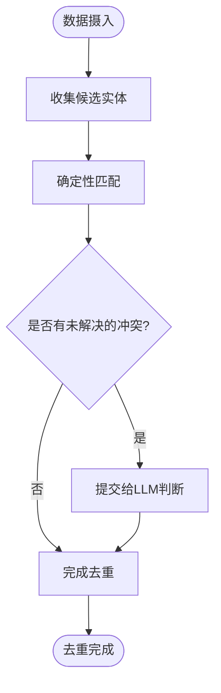
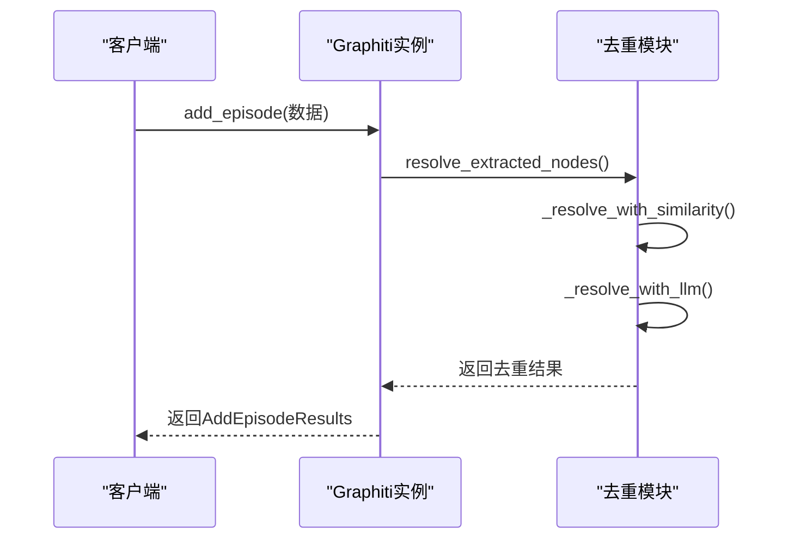

# 实体去重

<cite>
**本文档引用的文件**   
- [dedup_helpers.py](file://graphiti_core/utils/maintenance/dedup_helpers.py)
- [dedupe_nodes.py](file://graphiti_core/prompts/dedupe_nodes.py)
- [dedupe_edges.py](file://graphiti_core/prompts/dedupe_edges.py)
- [node_operations.py](file://graphiti_core/utils/maintenance/node_operations.py)
- [edge_operations.py](file://graphiti_core/utils/maintenance/edge_operations.py)
- [bulk_utils.py](file://graphiti_core/utils/bulk_utils.py)
</cite>

## 目录
1. [引言](#引言)
2. [去重算法实现](#去重算法实现)
3. [节点去重提示模板](#节点去重提示模板)
4. [边去重提示模板](#边去重提示模板)
5. [去重流程与执行模式](#去重流程与执行模式)
6. [配置选项](#配置选项)
7. [性能考量](#性能考量)
8. [常见问题解决方案](#常见问题解决方案)
9. [代码调用示例](#代码调用示例)
10. [结论](#结论)

## 引言
实体去重机制是图数据库系统中的关键功能，用于识别和合并重复的节点和边。该机制通过结合语义相似度计算和大语言模型（LLM）判断，确保图谱数据的一致性和准确性。去重过程在数据摄入后自动触发，支持批量和实时两种执行模式。本文档详细解释了基于语义相似度的节点和边去重流程，包括嵌入向量计算、相似度比较和合并策略。

## 去重算法实现

实体去重算法在`dedup_helpers.py`文件中实现，主要通过MinHash和局部敏感哈希（LSH）技术进行高效相似度计算。算法首先对实体名称进行归一化处理，然后生成3-gram shingles用于MinHash签名计算。通过预定义的排列数（_MINHASH_PERMUTATIONS）和带大小（_MINHASH_BAND_SIZE），算法将签名分割成多个带，以便在LSH桶中快速查找候选匹配项。Jaccard相似度阈值（_FUZZY_JACCARD_THRESHOLD）用于判断两个实体是否足够相似以被视为重复。此外，算法还考虑了名称的熵值（_name_entropy）来过滤低信息量的短名称，避免误判。

**Section sources**
- [dedup_helpers.py](file://graphiti_core/utils/maintenance/dedup_helpers.py#L1-L263)

## 节点去重提示模板

节点去重提示模板定义在`dedupe_nodes.py`文件中，指导LLM判断节点是否重复并生成合并后的属性。模板包含三个主要函数：`node`、`nodes`和`node_list`。`node`函数用于判断单个新节点是否与现有节点重复，`nodes`函数处理多个节点的批量去重，而`node_list`函数则用于对节点列表进行去重和摘要合成。提示模板要求LLM仅在实体指代同一现实世界对象或概念时才将其标记为重复，并提供了详细的任务说明和输出格式要求。

**Section sources**
- [dedupe_nodes.py](file://graphiti_core/prompts/dedupe_nodes.py#L1-L226)

## 边去重提示模板

边去重提示模板在`dedupe_edges.py`文件中定义，用于指导LLM判断边（关系）是否重复。模板包含`edge`、`edge_list`和`resolve_edge`三个函数。`resolve_edge`函数特别重要，它不仅检测重复事实，还识别被新事实矛盾的现有事实。提示模板要求LLM区分完全相同的事实和仅有关键差异的相似事实，确保只有真正重复的关系被合并。此外，模板还支持对新边进行类型分类，确定其是否属于预定义的事实类型之一。

**Section sources**
- [dedupe_edges.py](file://graphiti_core/prompts/dedupe_edges.py#L1-L175)

## 去重流程与执行模式

去重流程在数据摄入后自动触发，由`node_operations.py`和`edge_operations.py`文件中的函数协调执行。对于节点去重，`resolve_extracted_nodes`函数首先收集候选节点，然后通过`_resolve_with_similarity`进行确定性匹配，最后将未解决的冲突提交给LLM进行判断。边去重流程类似，`resolve_extracted_edges`函数先快速去重完全匹配的边，然后并行处理每个边的去重和矛盾检测。系统支持批量和实时两种执行模式：批量模式通过`bulk_utils.py`中的函数处理大量数据，而实时模式在每次数据摄入时立即执行去重。

**Diagram sources **
- [node_operations.py](file://graphiti_core/utils/maintenance/node_operations.py#L395-L450)
- [edge_operations.py](file://graphiti_core/utils/maintenance/edge_operations.py#L241-L404)

**Section sources**
- [node_operations.py](file://graphiti_core/utils/maintenance/node_operations.py#L211-L450)
- [edge_operations.py](file://graphiti_core/utils/maintenance/edge_operations.py#L89-L404)

## 配置选项

去重机制提供多种配置选项以适应不同场景的需求。相似度阈值（_FUZZY_JACCARD_THRESHOLD）可调整以平衡精确率和召回率。属性合并规则通过LLM提示模板定义，允许用户指定如何合成重复实体的属性。保留策略由`DedupResolutionState`类管理，决定在合并时保留哪个实体的UUID。此外，系统还支持自定义实体类型和边类型，通过`entity_types`和`edge_types`参数进行配置，确保去重过程符合特定领域的语义要求。

**Section sources**
- [dedup_helpers.py](file://graphiti_core/utils/maintenance/dedup_helpers.py#L31-L37)
- [node_operations.py](file://graphiti_core/utils/maintenance/node_operations.py#L396-L450)
- [edge_operations.py](file://graphiti_core/utils/maintenance/edge_operations.py#L242-L404)

## 性能考量

去重机制在性能方面进行了多项优化。向量索引优化通过预计算和缓存shingles（_cached_shingles）减少重复计算。批处理大小（CHUNK_SIZE）设置为10，平衡了内存使用和处理效率。并行处理通过`semaphore_gather`函数实现，允许多个去重任务同时执行。对于大规模数据，系统采用批量处理模式，将数据分块处理以避免内存溢出。此外，LSH技术显著减少了相似度比较的计算复杂度，使系统能够高效处理大量实体。

**Section sources**
- [dedup_helpers.py](file://graphiti_core/utils/maintenance/dedup_helpers.py#L143-L147)
- [bulk_utils.py](file://graphiti_core/utils/bulk_utils.py#L66)
- [node_operations.py](file://graphiti_core/utils/maintenance/node_operations.py#L217-L228)

## 常见问题解决方案

去重过程中可能出现误合并或漏合并的问题。为解决误合并，系统通过熵值过滤（_has_high_entropy）排除低信息量的短名称，并在LLM提示中明确要求仅在实体指代同一现实世界对象时才标记为重复。对于漏合并，系统采用多阶段策略：先进行确定性匹配，再通过LSH快速查找候选，最后由LLM处理复杂情况。日志记录（logger）帮助调试和监控去重过程，记录LLM返回的无效ID和缺失ID，便于后续分析和改进。

**Section sources**
- [dedup_helpers.py](file://graphiti_core/utils/maintenance/dedup_helpers.py#L79-L85)
- [node_operations.py](file://graphiti_core/utils/maintenance/node_operations.py#L344-L353)

## 代码调用示例

以下示例展示如何调用去重功能。首先创建`Graphiti`实例，然后使用`add_episode`方法摄入数据，该方法会自动触发去重流程。对于批量处理，可以使用`add_nodes_and_edges_bulk`函数。处理结果包含去重后的节点、边及其关系，可通过返回的`AddEpisodeResults`对象访问。

**Diagram sources **
- [graphiti.py](file://graphiti_core/graphiti.py#L128-L200)
- [node_operations.py](file://graphiti_core/utils/maintenance/node_operations.py#L395-L450)

**Section sources**
- [graphiti.py](file://graphiti_core/graphiti.py#L128-L200)
- [node_operations.py](file://graphiti_core/utils/maintenance/node_operations.py#L395-L450)

## 结论
实体去重机制通过结合高效的相似度算法和强大的LLM判断，有效解决了图数据库中的数据冗余问题。该机制不仅提高了数据质量，还增强了图谱的查询性能和分析能力。通过灵活的配置选项和优化的执行模式，系统能够适应各种应用场景的需求。未来的工作可以进一步优化算法参数，提高去重的准确性和效率。