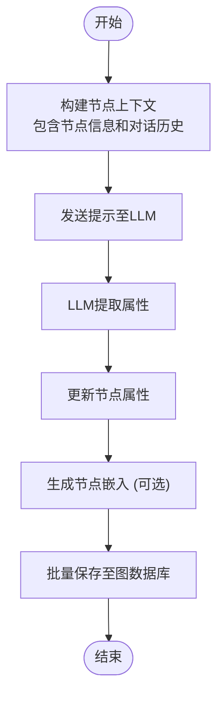
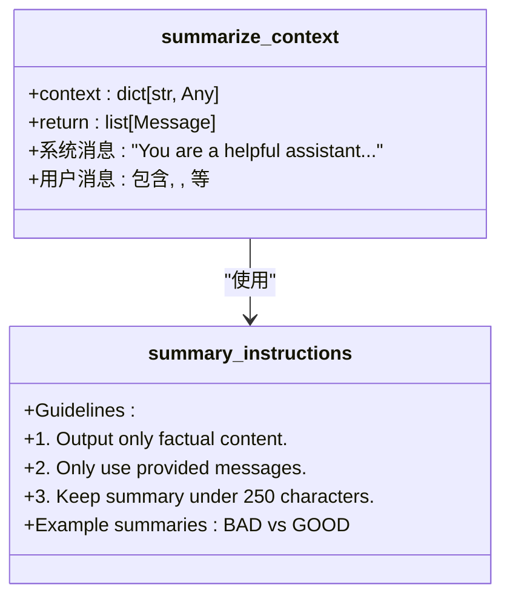
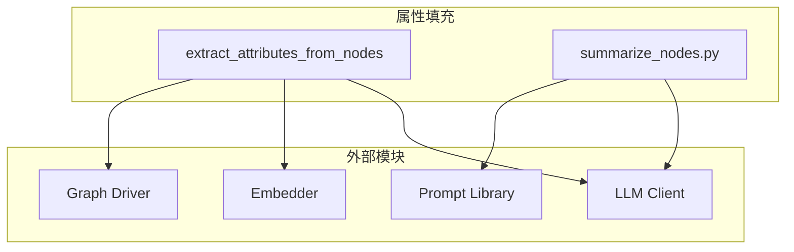

# 属性填充

<cite>
**本文档引用的文件**   
- [summarize_nodes.py](file://graphiti_core/prompts/summarize_nodes.py)
- [node_operations.py](file://graphiti_core/utils/maintenance/node_operations.py)
- [nodes.py](file://graphiti_core/nodes.py)
- [graphiti.py](file://graphiti_core/graphiti.py)
- [node_db_queries.py](file://graphiti_core/models/nodes/node_db_queries.py)
- [snippets.py](file://graphiti_core/prompts/snippets.py)
- [lib.py](file://graphiti_core/prompts/lib.py)
- [client.py](file://graphiti_core/embedder/client.py)
</cite>

## 目录
1. [简介](#简介)
2. [属性填充流程](#属性填充流程)
3. [提示模板设计](#提示模板设计)
4. [调用流程与输入输出](#调用流程与输入输出)
5. [配置选项](#配置选项)
6. [与其他模块的集成](#与其他模块的集成)
7. [示例](#示例)
8. [总结](#总结)

## 简介
属性填充功能是知识图谱构建过程中的关键后处理步骤，用于为已提取的节点和边补充丰富的属性信息。该功能通过大语言模型（LLM）从上下文文本中提取关键属性，并更新节点信息，从而增强图谱的语义丰富度和查询能力。与初始的节点/边提取不同，属性填充作为独立的后处理阶段，专注于深化已有实体的信息，而非发现新实体。

**Section sources**
- [summarize_nodes.py](file://graphiti_core/prompts/summarize_nodes.py#L1-L132)
- [node_operations.py](file://graphiti_core/utils/maintenance/node_operations.py#L453-L588)

## 属性填充流程
属性填充流程始于`extract_attributes_from_nodes`函数的调用，该函数接收一组已提取的实体节点、当前及历史对话片段作为上下文。其核心逻辑是并行处理每个节点，通过`extract_attributes_from_node`函数为每个节点单独执行属性提取。

对于每个节点，系统会构建一个包含节点当前信息（名称、标签、现有属性、摘要）和上下文（当前对话内容、历史对话）的提示。此提示被发送给LLM客户端，LLM根据预定义的指令和实体类型模型，从上下文中提取新的属性值。提取完成后，新属性会合并到节点的`attributes`字典中，并可选择性地生成节点名称的嵌入向量以支持语义搜索。

最终，所有更新后的节点会被批量保存回图数据库，完成属性的同步。此流程确保了图谱数据的实时性和一致性。

**Diagram sources **
- [node_operations.py](file://graphiti_core/utils/maintenance/node_operations.py#L453-L588)
- [nodes.py](file://graphiti_core/nodes.py#L436-L449)

## 提示模板设计
属性填充的核心在于`summarize_nodes.py`文件中定义的提示模板。该模板的设计旨在指导LLM从给定的上下文中精确提取信息，避免幻觉和无关输出。

模板的关键组成部分包括：
1.  **系统角色设定**：明确告知LLM其角色是“一个从提供文本中生成摘要和属性的助手”。
2.  **指令清晰化**：使用`summary_instructions`片段，强调输出必须是事实性的、简洁的（摘要少于250字符），并且只能使用提供的信息。
3.  **结构化输入**：将输入信息清晰地划分为`<MESSAGES>`（对话历史）、`<ENTITY>`（实体名称）、`<ENTITY CONTEXT>`（现有摘要）和`<ATTRIBUTES>`（待提取的属性描述）。
4.  **属性提取指令**：明确要求LLM根据属性描述从上下文中提取值，若无法找到则返回`None`。

这种设计确保了LLM的输出是结构化的、可预测的，并且严格基于上下文，从而保证了属性填充的准确性和可靠性。

**Diagram sources **
- [summarize_nodes.py](file://graphiti_core/prompts/summarize_nodes.py#L69-L103)
- [snippets.py](file://graphiti_core/prompts/snippets.py#L17-L29)

## 调用流程与输入输出
属性填充功能主要通过`graphiti_core.utils.maintenance.node_operations`模块中的`extract_attributes_from_nodes`函数调用。

**调用流程**：
1.  主流程（如`Graphiti.add_episode`）在完成节点和边的初始提取与去重后，会调用`extract_attributes_from_nodes`。
2.  该函数接收`GraphitiClients`、节点列表、当前对话、历史对话和实体类型定义作为参数。
3.  它使用`semaphore_gather`并行处理所有节点，对每个节点调用`extract_attributes_from_node`。
4.  `extract_attributes_from_node`构建提示并调用LLM，获取属性响应后更新节点。
5.  所有节点更新完毕后，生成嵌入并批量保存。

**输入格式**：
- `nodes`: `list[EntityNode]`，待填充属性的节点列表。
- `episode`: `EpisodicNode`，当前对话片段。
- `previous_episodes`: `list[EpisodicNode]`，历史对话片段列表。
- `entity_types`: `dict[str, type[BaseModel]]`，可选，定义了实体类型及其属性的Pydantic模型。

**输出格式**：
- 返回一个`list[EntityNode]`，其中每个节点的`attributes`字典已被新提取的属性更新。

**Section sources**
- [node_operations.py](file://graphiti_core/utils/maintenance/node_operations.py#L453-L588)
- [graphiti.py](file://graphiti_core/graphiti.py#L766-L768)

## 配置选项
属性填充功能支持多种配置选项，以适应不同的应用场景和需求。

- **属性白名单**：通过`entity_types`参数，可以精确控制为哪些实体类型提取哪些属性。只有在对应Pydantic模型中定义的属性才会被提取，这相当于一个隐式的属性白名单。
- **更新策略**：当前实现采用**合并（merge）**策略。新提取的属性会与节点现有的`attributes`字典进行合并。如果新属性与现有属性同名，新值将覆盖旧值。系统目前没有提供“仅添加不覆盖”的选项。
- **置信度过滤**：系统本身不直接提供基于置信度的过滤。但通过LLM的结构化输出（使用Pydantic模型），可以确保输出格式的正确性。如果LLM无法找到某个属性的值，它会返回`None`，调用者可以根据此值决定是否保留或忽略该属性。

这些配置选项使得属性填充过程既灵活又可控。

**Section sources**
- [node_operations.py](file://graphiti_core/utils/maintenance/node_operations.py#L486-L542)
- [extract_nodes.py](file://graphiti_core/prompts/extract_nodes.py#L509-L542)

## 与其他模块的集成
属性填充功能深度集成于整个知识图谱构建系统中，与多个核心模块协同工作。

- **与LLM客户端集成**：通过`GraphitiClients`中的`llm_client`，属性填充功能调用大语言模型来执行信息提取任务。提示模板的设计与LLM的响应解析紧密耦合。
- **与嵌入器模块集成**：在属性提取完成后，系统会调用`embedder`模块（如`OpenAIEmbedder`）为节点名称生成嵌入向量。这些向量存储在节点的`name_embedding`字段中，用于后续的向量搜索和语义相似性计算。
- **与图数据库驱动集成**：所有更新后的节点最终通过`GraphDriver`（如`Neo4jDriver`）保存回图数据库。数据库查询语句（如`get_entity_node_save_query`）负责将节点的属性正确地映射到数据库的字段或属性中。
- **与提示库集成**：提示模板通过`prompt_library`单例进行管理，确保了提示的一致性和可维护性。

这种集成确保了属性填充是整个数据处理流水线中无缝的一环。

**Diagram sources **
- [node_operations.py](file://graphiti_core/utils/maintenance/node_operations.py#L453-L588)
- [client.py](file://graphiti_core/embedder/client.py#L30-L38)
- [node_db_queries.py](file://graphiti_core/models/nodes/node_db_queries.py#L129-L180)

## 示例
以下是一个为“用户”实体节点添加属性的具体示例。

假设我们有一个名为“Alice”的`EntityNode`，系统处理了以下对话：
> **用户**: 我是Alice，今年28岁，住在纽约。
> **助手**: 很高兴认识你，Alice！你有什么爱好吗？
> **用户**: 我喜欢阅读科幻小说和听古典音乐。

**属性填充过程**：
1.  系统调用`extract_attributes_from_nodes`，传入Alice节点和上述对话。
2.  构建提示，其中`<ENTITY>`为"Alice"，`<MESSAGES>`包含对话内容，`<ATTRIBUTES>`可能包含`{"age": "用户的年龄", "location": "用户的居住地", "hobbies": "用户的爱好"}`。
3.  LLM分析上下文，识别出“Alice”、“28岁”、“纽约”、“阅读科幻小说”、“听古典音乐”等信息。
4.  LLM根据指令，返回结构化的JSON响应，如`{"age": 28, "location": "纽约", "hobbies": ["阅读科幻小说", "听古典音乐"]}`。
5.  系统将这些属性合并到Alice节点的`attributes`字典中。
6.  最终，Alice节点的`attributes`字段被更新，使其信息更加丰富。

**Section sources**
- [node_operations.py](file://graphiti_core/utils/maintenance/node_operations.py#L486-L542)
- [summarize_nodes.py](file://graphiti_core/prompts/summarize_nodes.py#L69-L103)

## 总结
属性填充功能是提升知识图谱质量的关键步骤。它通过精心设计的提示模板，利用LLM从上下文对话中提取关键属性，作为后处理阶段深化了节点信息。该功能通过`extract_attributes_from_nodes`函数被调用，输入为节点和上下文，输出为属性更新后的节点。它支持通过`entity_types`进行属性白名单控制，并采用合并更新策略。此外，该功能与LLM客户端、嵌入器和图数据库驱动等模块紧密集成，共同构成了一个完整的智能图谱构建系统。