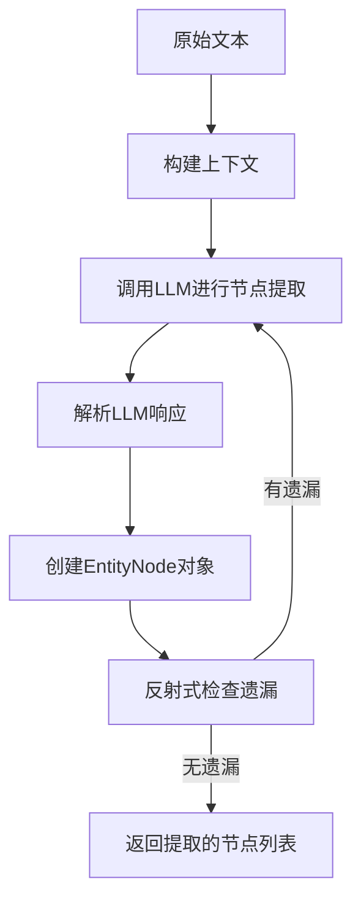
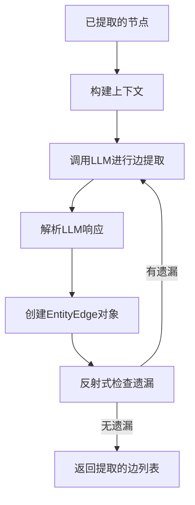
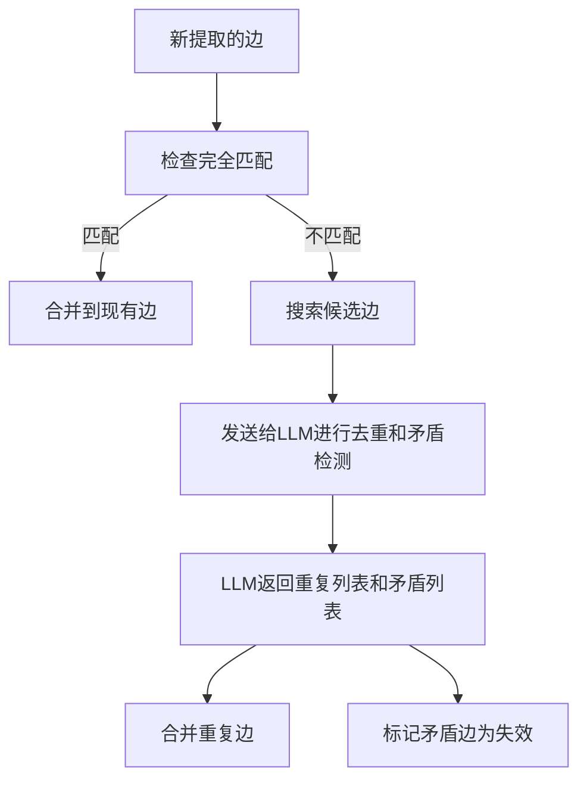

# 知识图谱构建

<cite>
**本文档引用的文件**   
- [extract_nodes.py](file://graphiti_core/prompts/extract_nodes.py)
- [extract_edges.py](file://graphiti_core/prompts/extract_edges.py)
- [dedupe_nodes.py](file://graphiti_core/prompts/dedupe_nodes.py)
- [dedupe_edges.py](file://graphiti_core/prompts/dedupe_edges.py)
- [extract_edge_dates.py](file://graphiti_core/prompts/extract_edge_dates.py)
- [entity_types_utils.py](file://graphiti_core/utils/ontology_utils/entity_types_utils.py)
- [nodes.py](file://graphiti_core/nodes.py)
- [edges.py](file://graphiti_core/edges.py)
- [graphiti.py](file://graphiti_core/graphiti.py)
- [node_operations.py](file://graphiti_core/utils/maintenance/node_operations.py)
- [edge_operations.py](file://graphiti_core/utils/maintenance/edge_operations.py)
- [bulk_utils.py](file://graphiti_core/utils/bulk_utils.py)
- [dedup_helpers.py](file://graphiti_core/utils/maintenance/dedup_helpers.py)
</cite>

## 目录
1. [引言](#引言)
2. [实体与关系提取](#实体与关系提取)
3. [去重机制](#去重机制)
4. [时间信息提取与双时间模型](#时间信息提取与双时间模型)
5. [自定义实体类型扩展](#自定义实体类型扩展)
6. [性能考量与质量控制](#性能考量与质量控制)

## 引言
本项目旨在构建一个全面的知识图谱系统，能够从非结构化文本中自动提取实体（节点）和关系（边），并进行去重、属性填充和时间信息提取。系统利用大型语言模型（LLM）进行智能提取和分类，结合语义相似度进行去重，并支持自定义实体类型和关系类型。该文档将详细说明系统的各个核心功能，包括节点和边的提取、去重机制、时间信息处理以及性能优化策略。

## 实体与关系提取

### 节点提取 (extract_nodes)
节点提取是知识图谱构建的第一步，其目标是从非结构化文本中识别出重要的实体。系统通过`extract_nodes`模块实现这一功能，该模块利用LLM从不同类型的输入（如消息、JSON、纯文本）中提取实体节点。

**核心流程**：
1.  **上下文构建**：系统将当前消息、先前的消息以及实体类型定义作为上下文提供给LLM。
2.  **提示工程**：使用精心设计的提示（Prompt）指导LLM执行任务。例如，对于消息类型，提示会要求LLM提取说话者和消息中明确或隐含的其他重要实体，并对它们进行分类。
3.  **实体分类**：LLM根据预定义的`entity_types`对提取出的实体进行分类。每个实体类型都有一个ID，LLM在输出时必须使用正确的ID。
4.  **反射式提取**：为了提高提取的完整性，系统采用“反射”（reflexion）机制。在初次提取后，系统会询问LLM是否遗漏了任何实体，并根据反馈进行补充提取，最多进行`MAX_REFLEXION_ITERATIONS`次迭代。



**Section sources**
- [extract_nodes.py](file://graphiti_core/prompts/extract_nodes.py#L86-L132)
- [node_operations.py](file://graphiti_core/utils/maintenance/node_operations.py#L88-L208)

### 边提取 (extract_edges)
边提取的目标是识别实体之间的关系，形成知识图谱中的“边”。系统通过`extract_edges`模块实现此功能，它利用LLM从文本中提取事实三元组（主体-关系-客体）。

**核心流程**：
1.  **输入准备**：除了当前和先前的消息外，系统还会将已提取的节点列表（包含ID和名称）作为输入提供给LLM。
2.  **关系提取**：LLM根据`edge_types`定义，提取实体之间的关系。每个关系必须涉及两个不同的实体，并且需要提供一个自然语言描述的事实（fact）。
3.  **时间信息提取**：LLM会尝试从文本中提取关系的`valid_at`（关系成立时间）和`invalid_at`（关系结束时间），并使用ISO 8601格式输出。
4.  **反射式提取**：与节点提取类似，系统也使用反射机制来确保没有遗漏重要的关系。



**Section sources**
- [extract_edges.py](file://graphiti_core/prompts/extract_edges.py#L67-L136)
- [edge_operations.py](file://graphiti_core/utils/maintenance/edge_operations.py#L89-L238)

## 去重机制

### 节点去重 (dedupe_nodes)
节点去重旨在识别并合并指代同一现实世界对象的重复节点。系统采用了一种混合的两阶段策略，结合了确定性启发式算法和LLM的语义理解能力。

**核心流程**：
1.  **候选节点收集**：系统首先通过向量搜索（基于节点名称的嵌入）和精确字符串匹配，从现有图谱中收集与新提取节点相似的候选节点。
2.  **确定性去重**：
    *   **精确匹配**：如果新节点的名称经过标准化后与现有节点完全相同，则直接视为重复。
    *   **模糊匹配**：对于名称不完全相同的节点，系统使用MinHash和局部敏感哈希（LSH）技术计算Jaccard相似度。如果相似度超过`_FUZZY_JACCARD_THRESHOLD`（默认0.9），则视为重复。
3.  **LLM去重**：对于无法通过确定性方法解决的模糊情况，系统将新节点和候选节点列表发送给LLM进行最终裁决。LLM会判断新节点是否与某个候选节点指代同一事物。

```mermaid
flowchart TD
A[新提取的节点] --> B[收集候选节点]
B --> C[精确匹配]
C --> |匹配| D[标记为重复]
C --> |不匹配| E[模糊匹配 (MinHash/LSH)]
E --> |相似度>阈值| D
E --> |相似度<阈值| F[发送给LLM决策]
F --> G[LLM判断是否重复]
G --> H[合并节点]
```

**Section sources**
- [dedupe_nodes.py](file://graphiti_core/prompts/dedupe_nodes.py#L57-L185)
- [dedup_helpers.py](file://graphiti_core/utils/maintenance/dedup_helpers.py#L198-L247)
- [node_operations.py](file://graphiti_core/utils/maintenance/node_operations.py#L420-L394)

### 边去重 (dedupe_edges)
边去重的目标是识别并合并表达相同事实的重复关系。系统同样采用混合策略来处理边的去重。

**核心流程**：
1.  **快速路径**：首先检查新边是否与现有边在源节点、目标节点和事实描述上完全相同（经过标准化），如果是，则直接合并。
2.  **候选边搜索**：对于更复杂的情况，系统会搜索与新边具有相同源和目标节点的现有边作为候选。
3.  **LLM决策**：系统将新边和候选边列表发送给LLM，由LLM判断新边是否与某个候选边是重复的。此外，LLM还会判断新边是否与某些候选边相矛盾，从而导致后者被“失效”（invalidated）。



**Section sources**
- [dedupe_edges.py](file://graphiti_core/prompts/dedupe_edges.py#L58-L172)
- [edge_operations.py](file://graphiti_core/utils/maintenance/edge_operations.py#L241-L647)

## 时间信息提取与双时间模型

### 时间信息提取 (extract_edge_dates)
时间信息是知识图谱动态性的关键。`extract_edge_dates`模块专门负责从文本中提取关系的时间属性。

**核心流程**：
1.  **上下文**：系统提供当前消息、先前消息、参考时间戳（reference timestamp）以及待分析的关系事实。
2.  **LLM提取**：LLM被要求分析事实，确定关系的`valid_at`和`invalid_at`时间。
3.  **时间解析**：LLM会处理相对时间表达（如“10年前”、“2分钟前”），并根据参考时间戳计算出具体的ISO 8601格式的绝对时间。
4.  **双时间模型**：
    *   **有效时间 (Valid Time)**：表示关系在现实世界中为真的时间段。`valid_at`是关系成立的开始时间。
    *   **事务时间 (Transaction Time)**：表示关系在知识图谱数据库中被记录的时间。`created_at`字段记录了边被创建的时间，`expired_at`字段记录了边被标记为失效的时间。

**Section sources**
- [extract_edge_dates.py](file://graphiti_core/prompts/extract_edge_dates.py#L43-L86)
- [edges.py](file://graphiti_core/edges.py#L229-L237)

## 自定义实体类型扩展

### 通过ontology_utils扩展
系统允许用户通过`ontology_utils`模块定义和验证自定义的实体类型和关系类型，从而扩展知识图谱的本体。

**核心流程**：
1.  **定义类型**：用户可以定义一个字典，将自定义的类型名称（如"Person", "Company"）映射到其Pydantic模型。该模型可以包含特定的属性。
2.  **类型验证**：在使用自定义类型之前，系统会调用`validate_entity_types`函数进行验证，确保自定义类型的字段名不会与`EntityNode`的基础字段（如`uuid`, `name`）冲突。
3.  **在提取中使用**：当调用`add_episode`等方法时，可以将自定义的`entity_types`和`edge_types`作为参数传入。LLM在提取和分类时会参考这些定义。

**Section sources**
- [entity_types_utils.py](file://graphiti_core/utils/ontology_utils/entity_types_utils.py#L23-L37)
- [graphiti.py](file://graphiti_core/graphiti.py#L625-L629)

## 性能考量与质量控制

### 批量处理与速率限制
为了处理大量数据，系统提供了批量处理功能（如`add_episode_bulk`），可以一次性处理多个事件。这通过`semaphore_gather`等并发工具实现，允许在`max_coroutines`限制下并行执行多个操作，从而提高吞吐量。同时，LLM客户端会处理API的速率限制，确保请求不会被拒绝。

### 质量控制建议
1.  **迭代式提取**：利用反射机制（reflexion）可以显著提高实体和关系的召回率。
2.  **阈值调优**：`_FUZZY_JACCARD_THRESHOLD`等去重阈值可以根据具体应用场景进行调整，以平衡精确率和召回率。
3.  **提示工程**：精心设计的提示（Prompt）是保证提取质量的关键。应确保实体和关系类型的描述清晰、无歧义。
4.  **监控与日志**：系统内置了详细的日志记录，可以监控提取、去重等关键步骤的执行情况，便于调试和优化。

**Section sources**
- [bulk_utils.py](file://graphiti_core/utils/bulk_utils.py#L110-L125)
- [graphiti.py](file://graphiti_core/graphiti.py#L139)
- [node_operations.py](file://graphiti_core/utils/maintenance/node_operations.py#L63-L85)